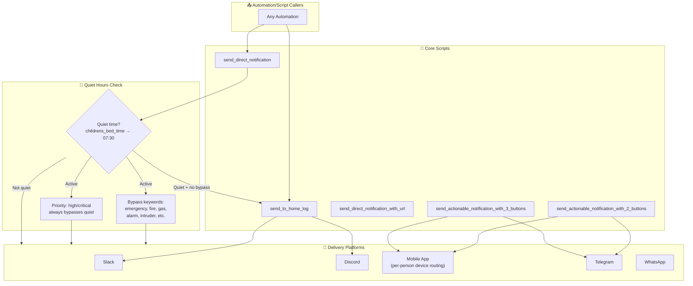
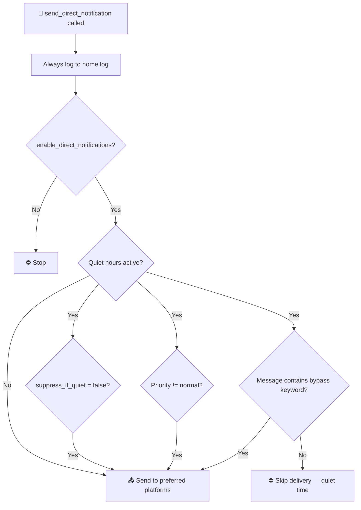

[<- Back to Integrations README](../README.md) · [Packages README](../../README.md) · [Main README](../../../README.md)

# Messaging Platforms

Centralised notification delivery across Slack, Discord, Telegram, WhatsApp, and the Home Assistant mobile app.

---

## Table of Contents

- [Overview](#overview)
- [Architecture](#architecture)
- [Core Notification Scripts](#core-notification-scripts)
  - [Home Log Scripts](#home-log-scripts)
  - [Direct Notification Scripts](#direct-notification-scripts)
  - [Actionable Notification Scripts](#actionable-notification-scripts)
  - [Desktop Notifications](#desktop-notifications)
  - [Delayed Announcements](#delayed-announcements)
- [Platform-Specific Scripts](#platform-specific-scripts)
  - [Mobile (Home Assistant App)](#mobile-home-assistant-app)
  - [Slack](#slack)
  - [Discord](#discord)
  - [Telegram](#telegram)
  - [WhatsApp (CallMeBot)](#whatsapp-callmebot)
- [Mobile Notification Callback Router](#mobile-notification-callback-router)
- [Quiet Hours](#quiet-hours)
- [Configuration](#configuration)

---

## Overview



---

## Architecture

### File Structure

```
packages/integrations/messaging/
├── notifications.yaml       # Core notification scripts
├── home_assistant_mobile.yaml  # Mobile app per-person device routing
├── slack.yaml               # Slack notify services and scripts
├── discord.yaml             # Discord notify services and scripts
├── telegram.yaml            # Telegram bot automations and scripts
├── callmebot.yaml           # WhatsApp via CallMeBot REST API
├── message_callback.yaml    # Mobile notification action callback router
└── README.md                # This documentation
```

### Person → Device Mapping

| Person | Mobile App Device(s) |
|--------|---------------------|
| `person.danny` | `notify.mobile_app_top_dog` |
| `person.terina` | `notify.mobile_app_top_dog` + `notify.mobile_app_oneplus_10` |
| `person.leo` | `notify.mobile_app_ipad_air_4th_generation_6730` |
| `person.ashlee` | `notify.mobile_app_ipad_4` |

Platform preference per person is resolved dynamically at notification time using the `get_preferred_direct_message_platform.jinja` macro, reading from `input_text.direct_message_list`.

---

## Core Notification Scripts

### Home Log Scripts

#### send_to_home_log

Posts a message to the home log channel. Respects the `input_select.home_log_level` setting — only sends if the message's `log_level` matches or exceeds the current level.

**Fields:**

| Field | Required | Description |
|-------|----------|-------------|
| `message` | Yes | Message text (multiline) |
| `title` | No | Optional title |
| `log_level` | No | `Normal` or `Debug` (default: `Debug`) |

**Delivery:** Slack home log channel and/or Discord home log channel (based on `input_text.home_log_platforms`).

---

#### send_home_log_with_local_attachments

Posts a message with a local file attachment (e.g. a camera image) to the home log, and optionally sends it as a direct notification to specific people.

**Fields:** `message`, `title`, `filePath`, `people`, `priority`, `suppress_if_quiet`

**Delivery:** Slack + Discord to home log channel. If `people` is set and `enable_direct_notifications` is on, also routes to Slack direct, Discord direct, Telegram, Mobile (with image attached).

---

#### send_home_log_with_url

Posts a message with a URL attachment to the home log channel.

**Fields:** `message`, `title`, `url`

**Delivery:** Slack + Discord home log channels, parallel.

---

### Direct Notification Scripts

#### send_direct_notification

Primary script for sending a priority notification to one or more people. Checks quiet hours before delivering to messaging platforms.



**Fields:**

| Field | Description |
|-------|-------------|
| `message` | Message body |
| `title` | Notification title |
| `people` | People entities (optional, defaults to all) |
| `priority` | `normal`, `high`, `critical` |
| `suppress_if_quiet` | If `true`, respect quiet hours (default: `true`) |

**Quiet hours:** `input_datetime.childrens_bed_time` → `07:30`

**Emergency bypass keywords:** `emergency`, `fire`, `gas`, `water`, `leak`, `intruder`, `alarm`, `breach`, `danger`, `alert`, `critical`, `urgent`

**Delivery:** Slack direct DM, Discord direct, Mobile (per-person), Telegram, WhatsApp — whichever platforms each recipient has configured.

---

#### send_direct_notification_with_url

Same as `send_direct_notification` but includes a URL (image, video, audio, or web link) attached to the message.

**Additional field:** `url`, `url_type` (audio/image/video/web)

---

### Actionable Notification Scripts

These scripts send notifications with tappable action buttons. Responses are handled by the [Mobile Notification Callback Router](#mobile-notification-callback-router).

#### send_actionable_notification_with_2_buttons

Sends a notification with 2 action buttons to mobile and/or Telegram.

**Fields:** `message`, `title`, `people`, `action1_title`, `action1_name`, `action2_title`, `action2_name`

---

#### send_actionable_notification_with_3_buttons

Sends a notification with 3 action buttons to mobile and/or Telegram.

**Fields:** `message`, `title`, `people`, `action1_title`, `action1_name`, `action2_title`, `action2_name`, `action3_title`, `action3_name`

---

### Desktop Notifications

#### post_to_hass_agent

Sends a notification to a HASS Agent desktop client with optional file attachment and configurable display duration.

**Fields:** `message`, `title`, `filePath`, `device` (notify service), `duration` (seconds, default 10)

---

### Delayed Announcements

#### announce_delayed_notifications

Reads pending items from `todo.danny_s_notifications` and `todo.shared_notifications`, sends them as a batch direct notification, then marks them as complete.

Useful for notifications that were suppressed during quiet hours — callers can add items to the todo lists and this script delivers them when the person is available.

**Fields:** `people`, `test` (boolean, if true skips marking items complete)

---

#### notification_persistent_indicator_manager

Manages persistent notification states. Currently handles `FRONT_DOOR_OPEN` — adds or removes a visual indicator based on the door state by calling `script.front_door_open_notification`.

---

## Platform-Specific Scripts

### Mobile (Home Assistant App)

**Script:** `post_home_assistant_direct_notification`

Routes a message to the correct mobile app notify service based on the `people` field. Handles all four household members with their specific device services. Supports `priority` field (high/medium/low).

| Person | Notify Service |
|--------|---------------|
| `person.danny` | `notify.mobile_app_top_dog` |
| `person.terina` | `notify.mobile_app_top_dog` + `notify.mobile_app_oneplus_10` |
| `person.leo` | `notify.mobile_app_ipad_air_4th_generation_6730` |
| `person.ashlee` | `notify.mobile_app_ipad_4` |

---

### Slack

**Automation:** Slack Command Received (ID `1689193654844`)

Listens for incoming Slack slash commands and routes them to the conversation agent (LLM). The agent response is posted back to Slack.

**Scripts:**
- `post_slack_notification` — post text message to a channel
- `post_to_slack_with_url_attachment` — post message with URL attachment
- `post_to_slack_with_local_attachments` — post message with local file

**Configuration:** `input_text.slack_home_log_channel_id`, `input_text.slack_direct_notification_channel_id`, Slack IDs per person.

---

### Discord

**Scripts:**
- `post_discord_notification` — post text message to a channel
- `post_to_discord_with_url_attachment` — post with URL attachment
- `post_to_discord_with_local_attachments` — post with local file

**Configuration:** `input_text.discord_home_log_channel_id`, `input_text.discord_direct_notification_channel_id`, Discord IDs per person.

---

### Telegram

**Automations:**

| Automation | Trigger | Action |
|------------|---------|--------|
| Telegram Command Received | `/` command message | Route to LLM conversation agent |
| Telegram Text Message Received | Plain text | Route to LLM (llama3_2_vision) |
| Telegram Callback Received | Callback query | Process button action |

**Scripts:**
- `post_telegram_direct_notification` — send message to a person's Telegram
- `post_to_telegram_home_log_with_local_attachments` — send with local file attachment

---

### WhatsApp (CallMeBot)

**Script:** `post_whatsapp_direct_notification`

Sends a WhatsApp message via the CallMeBot REST API. Uses two configured `notify` REST services for different recipients.

**Fields:** `message`, `title`, `people`

---

## Mobile Notification Callback Router

**Automation:** Mobile Notification Action Router (ID `1625924056779`)

Listens for `mobile_app_notification_action` events and routes tapped notification actions to the appropriate script or service call.

| Action Name | Effect |
|-------------|--------|
| `set_bedroom_blinds_30` | Close bedroom blinds to 30% (if currently above 30%) |
| `server_fan_off` | Turn off `switch.server_fan` |
| `switch_on_office_fan` | Turn on `switch.office_fan` |
| `switch_on_fridge_freezer` | Turn on `switch.ecoflow_kitchen_plug` |
| `switch_on_freezer` | Turn on `switch.freezer` |
| `guest_mode_arm_alarm_and_turn_off_devices` | Arm alarm (away), lock front door, run everybody_leave_home |
| `guest_mode_arm_alarm_away` | Arm alarm (away mode), lock front door (Guest mode only) |
| `guest_mode_turn_off_devices` | Run everybody_leave_home only |
| `switch_off_alarm` | Disarm house alarm |
| `switch_off_attic_lights` | Turn off `light.attic` |
| `update_home_assistant` | Install HA Core update (with backup) |
| `zappi_stop` | Set Zappi charger to `Stopped` mode |

---

## Quiet Hours

Quiet hours run from `input_datetime.childrens_bed_time` until `07:30`. During quiet hours:

- `send_direct_notification` logs to the home log but skips push delivery
- Delivery proceeds if **any** of the following:
  - `suppress_if_quiet` is `false`
  - `priority` is not `normal` (`high` or `critical`)
  - Message contains a bypass keyword (`emergency`, `fire`, `gas`, `water`, `leak`, `intruder`, `alarm`, `breach`, `danger`, `alert`, `critical`, `urgent`)

Messages that cannot be delivered during quiet hours can be stored in `todo.danny_s_notifications` or `todo.shared_notifications` and batch-delivered by `announce_delayed_notifications` when the person is available.

---

## Configuration

### Control Flags

| Entity | Purpose |
|--------|---------|
| `input_boolean.enable_direct_notifications` | Master switch for all direct push notifications |
| `input_select.home_log_level` | Log verbosity: `Off`, `Normal`, `Debug` |
| `input_text.home_log_platforms` | Platforms for home log (`Slack`, `Discord`) |
| `input_text.direct_message_list` | Per-person preferred platform list |
| `schedule.notification_quiet_time` | Quiet hours schedule (bedtime → 07:30) |

### Channel/ID Configuration

| Entity | Purpose |
|--------|---------|
| `input_text.slack_home_log_channel_id` | Slack channel for home log |
| `input_text.slack_direct_notification_channel_id` | Slack DM channel |
| `input_text.discord_home_log_channel_id` | Discord channel for home log |
| `input_text.discord_direct_notification_channel_id` | Discord DM channel |
| `input_text.dannys_slack_id` | Danny's Slack user ID |
| `input_text.terinas_slack_id` | Terina's Slack user ID |
| `input_text.dannys_discord_chat_id` | Danny's Discord user ID |
| `input_text.terinas_discord_chat_id` | Terina's Discord user ID |

---

## Related Integrations

| Integration | Connection |
|-------------|------------|
| [Energy](../energy/README.md) | Solar forecast and battery notifications |
| [Transport](../transport/README.md) | Tesla charging rate notifications |
| [HVAC](../hvac/README.md) | Heating and hot water alerts |

---

## Maintenance Notes

### Troubleshooting

| Issue | Check |
|-------|-------|
| Notifications not being delivered | `input_boolean.enable_direct_notifications` state |
| Messages going to home log only | Quiet hours — check `input_datetime.childrens_bed_time` and current time |
| Actionable buttons not working | Check `message_callback.yaml` action names match the button `action` values |
| WhatsApp not sending | CallMeBot API key and phone number configuration |
| Delayed announcements not clearing | Run `announce_delayed_notifications` with `test: false` |

---

*Last updated: 2026-04-05*
