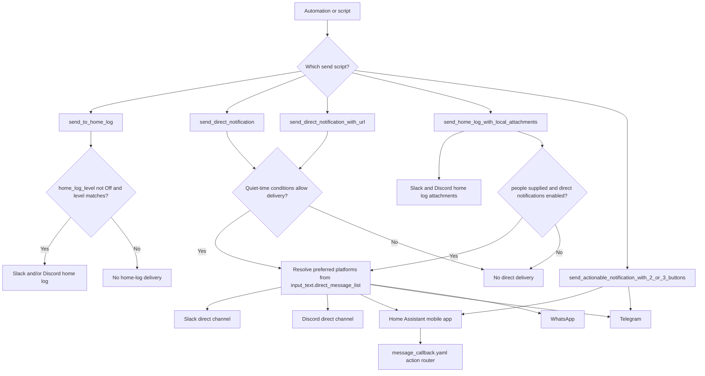
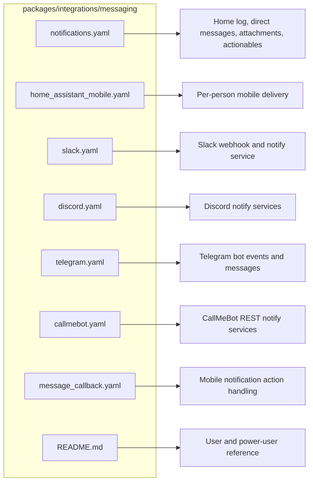
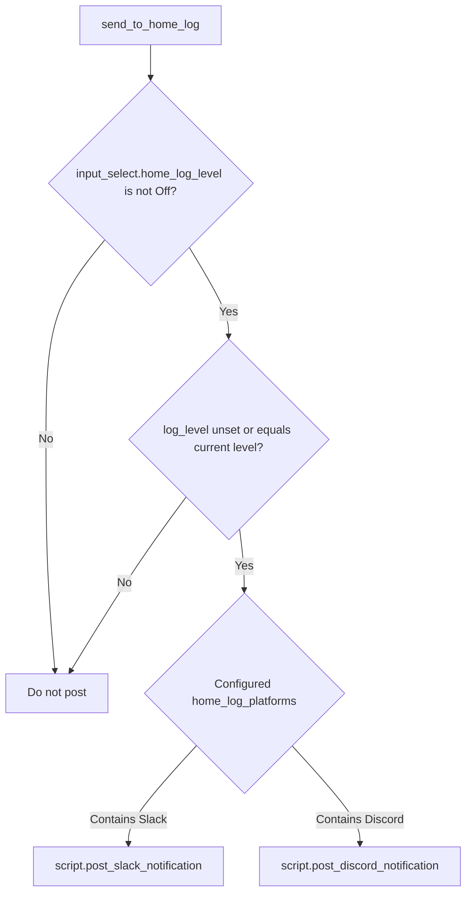
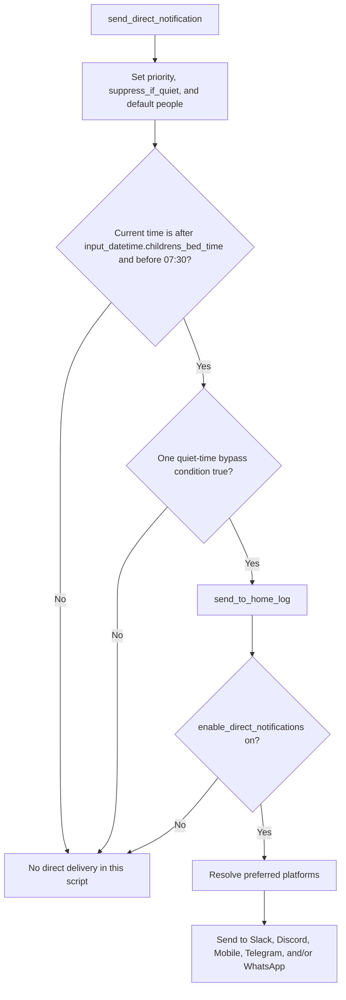
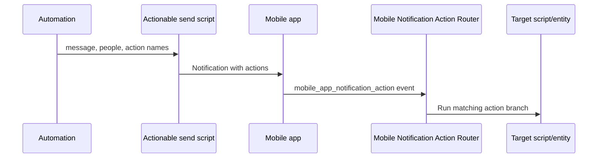

[<- Back to Integrations README](../README.md) · [Packages README](../../README.md) · [Main README](../../../README.md)

# Messaging Package Documentation

The messaging package is the home's notification hub. Automations call a small set of send scripts, and those scripts decide whether to write to the home log, send a direct message, attach an image or URL, or show action buttons on a phone. The package supports Slack, Discord, Telegram, WhatsApp through CallMeBot, Home Assistant mobile app notifications, and HASS Agent desktop notifications.

This documentation covers every YAML file in this folder:

| File | Purpose | Contents |
|------|---------|----------|
| `notifications.yaml` | Main notification orchestration | 10 scripts |
| `home_assistant_mobile.yaml` | Home Assistant mobile app delivery | 4 scripts |
| `slack.yaml` | Slack command handling and Slack delivery | 1 automation, 3 scripts |
| `discord.yaml` | Discord delivery | 3 scripts |
| `telegram.yaml` | Telegram inbound events and Telegram delivery | 3 automations, 2 scripts |
| `callmebot.yaml` | WhatsApp delivery through CallMeBot | 2 REST notify services, 1 script |
| `message_callback.yaml` | Mobile action-button callback routing | 1 automation |

## Quick Summary

For non-technical users, the important behavior is:

| Area | What Happens |
|------|--------------|
| Home log | `script.send_to_home_log` writes household status messages to the configured Slack and/or Discord home-log channels when the log level allows it. |
| Direct messages | `script.send_direct_notification` sends person-targeted alerts through each person's configured preferred platforms. |
| Quiet-time filtering | Direct text notifications only send during the configured bedtime window when the YAML's quiet-time conditions allow it. Important messages can bypass the filter. |
| Attachments | Dedicated scripts send local files or URL/image attachments to home-log channels or direct recipients. |
| Action buttons | Two-button and three-button notification scripts send tappable actions to mobile and Telegram recipients. Mobile app responses are handled by one callback router. |
| Chat commands | Slack slash commands and Telegram messages can be passed to Home Assistant conversation agents, with responses sent back to the chat platform. |
| WhatsApp | CallMeBot REST notify services send WhatsApp messages for Danny and Terina. |

## How Messaging Decides What To Do

## Main Files

### `notifications.yaml`

This is the primary API used by other packages.

| Script | Summary |
|--------|---------|
| `script.send_to_home_log` | Sends text to configured home-log platforms if `input_select.home_log_level` allows it. |
| `script.send_direct_notification` | Sends a text direct notification to selected people or, by default, Danny, Terina, Leo, and Ashlee. |
| `script.send_direct_notification_with_url` | Sends a direct notification with a URL, routed by preferred platform where supported. |
| `script.send_home_log_with_local_attachments` | Sends a local file attachment to Slack and Discord home-log channels, and optionally to direct recipients. |
| `script.send_home_log_with_url` | Sends a URL attachment to Slack and Discord home-log channels. |
| `script.send_actionable_notification_with_2_buttons` | Sends a two-button notification to preferred mobile and Telegram recipients. |
| `script.send_actionable_notification_with_3_buttons` | Sends a three-button notification to preferred mobile and Telegram recipients. |
| `script.post_to_hass_agent` | Sends a desktop notification to a supplied HASS Agent notify service. |
| `script.announce_delayed_notifications` | Reads pending todo notifications, sends Danny a delayed announcement, and optionally completes the todo items. |
| `script.notification_persistent_indicator_manager` | Handles persistent notification indicators. Currently only adds `FRONT_DOOR_OPEN` by calling `script.front_door_open_notification`. |

Power-user note: `send_direct_notification` logs to the home log only when its quiet-time gate passes. `send_direct_notification_with_url` logs before its quiet-time/direct-notification gate.

### `home_assistant_mobile.yaml`

This file contains platform-specific scripts for Home Assistant mobile app notification services.

| Script | Summary |
|--------|---------|
| `script.post_home_assistant_direct_notification` | Sends plain mobile app notifications by person. |
| `script.post_to_home_assistant_with_url_attachment` | Sends audio, image, video, or web URL notifications by person. |
| `script.post_actionable_notification_to_home_assistant_with_2_buttons` | Sends two-action mobile notifications directly. |
| `script.post_actionable_notification_to_home_assistant_with_3_buttons` | Sends three-action mobile notifications directly. |

Mobile delivery targets used by the YAML:

| Person | Mobile Delivery In YAML |
|--------|-------------------------|
| `person.danny` | `notify.mobile_app_top_dog` |
| `person.terina` | `notify.mobile_app_top_dog` and `notify.mobile_app_oneplus_10` for plain direct notifications; `notify.mobile_app_oneplus_10` in attachment/action scripts |
| `person.leo` | `notify.mobile_app_ipad_air_4th_generation_6730` |
| `person.ashlee` | `notify.send_message` with target `notify.ashlee_s_ipad` in mobile platform scripts; `notify.mobile_app_ipad_2` in the wrapper actionable scripts in `notifications.yaml` |
| No person match | Defaults usually send to Danny, Terina, and Leo mobile devices. |

### `slack.yaml`

Slack has one inbound automation and three delivery scripts.

| Type | Name | What It Does |
|------|------|--------------|
| Automation | `Slack: Command Received` | Receives a webhook slash command, logs command details, and for Danny outside `privategroup` channels sends the text to the configured conversation agent. |
| Script | `script.post_slack_notification` | Sends a text message to `notify.danny_tsang` with optional Slack block formatting and people mentions. |
| Script | `script.post_to_slack_with_url_attachment` | Sends a Slack message with an image URL accessory. |
| Script | `script.post_to_slack_with_local_attachments` | Sends a Slack message with a local file attachment. |

Slack command handling uses `input_text.dannys_slack_id`, `input_text.dannys_selected_conversation_agent`, and `input_text.dannys_secondary_selected_conversation_agent`.

### `discord.yaml`

Discord has three delivery scripts and no inbound automations in this folder.

| Script | Summary |
|--------|---------|
| `script.post_discord_notification` | Sends text to `notify.home_assistant`, with optional title and user mention text. |
| `script.post_to_discord_with_url_attachment` | Sends a Discord embed with a URL image through `notify.danny_tsang`. |
| `script.post_to_discord_with_local_attachments` | Sends one local image attachment through `notify.home_assistant`. |

### `telegram.yaml`

Telegram handles inbound bot events as well as direct outbound messages.

| Type | Name | What It Does |
|------|------|--------------|
| Automation | `Telegram: Event Received` | Logs `telegram_command` events. The `get_camera` command currently logs the requested camera argument. |
| Automation | `Telegram: Message Received` | Logs `telegram_text` events and sends text to a conversation agent, with a fallback agent on errors. |
| Automation | `Telegram: Callback Received` | Logs `telegram_callback` event data. |
| Script | `script.post_telegram_direct_notification` | Sends a Telegram message to Danny's configured chat ID. |
| Script | `script.post_to_telegram_home_log_with_local_attachments` | Sends a photo/file path to Danny's configured Telegram chat. |

Telegram delivery uses `input_text.telegram_config_id` and `input_text.dannys_telegram_chat_id` for script-based sends. The inbound text automation has a hard-coded `config_entry_id` in its response actions.

### `callmebot.yaml`

This file defines two REST notify services and one wrapper script.

| Object | Name | What It Does |
|--------|------|--------------|
| Notify service | `Danny's WhatsApp` | Sends WhatsApp messages through CallMeBot using Danny's secret phone number and API key. |
| Notify service | `Terina's WhatsApp` | Sends WhatsApp messages through CallMeBot using Terina's secret phone number and API key. |
| Script | `script.post_whatsapp_direct_notification` | Sends to Danny, Terina, or Danny by default based on the `people` field. |

### `message_callback.yaml`

This file contains one automation, `Mobile Notification Action Router`, that listens for `mobile_app_notification_action` events.

| Action Name | Result |
|-------------|--------|
| `set_bedroom_blinds_30` | Logs the event and sets `cover.bedroom_blinds` to position 30 if currently above 30. |
| `server_fan_off` | Logs the event and turns off `switch.server_fan`. |
| `switch_on_office_fan` | Logs the event and turns on `fan.office_ceiling_fan` using `switch.turn_on`. |
| `switch_on_fridge_freezer` | Logs the event and turns on `switch.ecoflow_kitchen_plug`. |
| `switch_on_freezer` | Logs the event and turns on `switch.freezer`. |
| `guest_mode_arm_alarm_and_turn_off_devices` | Logs the event, arms away mode, locks the front door, and runs `script.everybody_leave_home`. |
| `guest_mode_arm_alarm_away` | In Guest mode only, logs the event, arms away mode, and locks the front door. |
| `guest_mode_turn_off_devices` | Logs the event and runs `script.everybody_leave_home`. |
| `switch_off_alarm` | Logs the event and runs `script.set_alarm_to_disarmed_mode`. |
| `switch_off_attic_lights` | Logs the event and turns off `light.attic`. |
| `update_home_assistant` | Logs the event and installs `update.home_assistant_core_update` with backup. |
| `zappi_stop` | Logs the event and sets `select.myenergi_zappi_charge_mode` to `Stopped`. |

## Everyday Behavior

### Home Log

`script.send_to_home_log` is the standard way to record household events.

| Input | Used For |
|-------|----------|
| `message` | Message body. Required. |
| `title` | Optional heading. |
| `log_level` | Optional `Normal` or `Debug`; defaults to `Debug`. |

The YAML compares the requested `log_level` with `input_select.home_log_level` by equality rather than by severity ordering.

### Direct Notifications

`script.send_direct_notification` is the main person-targeted text alert script.

Quiet-time bypass conditions implemented by the YAML:

| Condition | Details |
|-----------|---------|
| `suppress_if_quiet` is false | Allows delivery during the bedtime window. |
| Message contains a bypass keyword | Requires `schedule.notification_quiet_time` to be `on` in this branch. Keywords are `emergency`, `fire`, `gas`, `water`, `leak`, `intruder`, `alarm`, `breach`, `danger`, `alert`, `critical`, and `urgent`. |
| `priority` is not `normal` | Allows high or critical priority values during the bedtime window. |

Power-user note: as currently written, `send_direct_notification` is gated by the bedtime time window itself. It does not have a separate "quiet time is off" branch. URL-based direct notifications use `schedule.notification_quiet_time == off`, bypass keywords, or non-normal priority instead.

### Attachments And URLs

| Script | Home Log | Direct Delivery | Notes |
|--------|----------|-----------------|-------|
| `script.send_home_log_with_local_attachments` | Slack and Discord when home log is not off | Slack, Discord, and Telegram when `people` is supplied and direct notifications are enabled | The script computes mobile and WhatsApp platform lists but does not send local attachments to them. |
| `script.send_home_log_with_url` | Slack and Discord when home log is not off | No direct delivery | Sends URL attachments to home-log channels only. |
| `script.send_direct_notification_with_url` | Always calls `send_to_home_log` first | Slack, Discord, Mobile, Telegram, and WhatsApp when quiet/direct gates pass | Discord, Telegram, and WhatsApp include the URL in or alongside the text rather than using every platform's attachment API. |

### Actionable Notifications

The top-level actionable scripts in `notifications.yaml` resolve mobile and Telegram recipients from preferred-platform configuration, then send buttons to those platforms when `input_boolean.enable_direct_notifications` is on.

The callback router only handles Home Assistant mobile app action events. Telegram callback events are logged in `telegram.yaml`; this folder does not route Telegram callbacks to the same action table.

### Delayed Notifications

`script.announce_delayed_notifications` reads `todo.danny_s_notifications` and `todo.shared_notifications` for items with `needs_action` status.

| Behavior | Details |
|----------|---------|
| Recipient branch | The YAML has a Danny branch that runs when `people.entity_id` matches `person.danny`. |
| Message contents | Danny-specific items and shared items are combined into one direct notification titled `Delayed Announcements`. |
| Completion | When `test` is false, Danny-specific items from Danny's list and all shared items are marked complete. |
| Test mode | When `test` is true, matching items are sent but not completed. |

## Technical Reference

### Automations

| ID | Alias | File |
|----|-------|------|
| `1689193654844` | Slack: Command Received | `slack.yaml` |
| `1653739708849` | Telegram: Event Received | `telegram.yaml` |
| `1653739708850` | Telegram: Message Received | `telegram.yaml` |
| `1653739708851` | Telegram: Callback Received | `telegram.yaml` |
| `1625924056779` | Mobile Notification Action Router | `message_callback.yaml` |

### Scripts

| Script | File |
|--------|------|
| `script.send_to_home_log` | `notifications.yaml` |
| `script.send_direct_notification` | `notifications.yaml` |
| `script.send_direct_notification_with_url` | `notifications.yaml` |
| `script.send_home_log_with_local_attachments` | `notifications.yaml` |
| `script.send_home_log_with_url` | `notifications.yaml` |
| `script.send_actionable_notification_with_2_buttons` | `notifications.yaml` |
| `script.send_actionable_notification_with_3_buttons` | `notifications.yaml` |
| `script.post_to_hass_agent` | `notifications.yaml` |
| `script.announce_delayed_notifications` | `notifications.yaml` |
| `script.notification_persistent_indicator_manager` | `notifications.yaml` |
| `script.post_home_assistant_direct_notification` | `home_assistant_mobile.yaml` |
| `script.post_to_home_assistant_with_url_attachment` | `home_assistant_mobile.yaml` |
| `script.post_actionable_notification_to_home_assistant_with_2_buttons` | `home_assistant_mobile.yaml` |
| `script.post_actionable_notification_to_home_assistant_with_3_buttons` | `home_assistant_mobile.yaml` |
| `script.post_slack_notification` | `slack.yaml` |
| `script.post_to_slack_with_url_attachment` | `slack.yaml` |
| `script.post_to_slack_with_local_attachments` | `slack.yaml` |
| `script.post_discord_notification` | `discord.yaml` |
| `script.post_to_discord_with_url_attachment` | `discord.yaml` |
| `script.post_to_discord_with_local_attachments` | `discord.yaml` |
| `script.post_telegram_direct_notification` | `telegram.yaml` |
| `script.post_to_telegram_home_log_with_local_attachments` | `telegram.yaml` |
| `script.post_whatsapp_direct_notification` | `callmebot.yaml` |

### Notify Services And Delivery Services

| Service Or Object | File | Used For |
|-------------------|------|----------|
| `notify.danny_s_whatsapp` | `callmebot.yaml` | Danny WhatsApp via CallMeBot REST notify. |
| `notify.terina_s_whatsapp` | `callmebot.yaml` | Terina WhatsApp via CallMeBot REST notify. |
| `notify.danny_tsang` | `slack.yaml`, `discord.yaml` | Slack messages and one Discord URL-embed script. |
| `notify.home_assistant` | `discord.yaml` | Discord text and local attachment messages. |
| `telegram_bot.send_message` | `telegram.yaml` | Telegram bot text replies and direct notifications. |
| `telegram_bot.send_photo` | `telegram.yaml` | Telegram local attachment/photo delivery. |
| `notify.mobile_app_top_dog` | `home_assistant_mobile.yaml`, `notifications.yaml` | Danny mobile app and some Terina/default sends. |
| `notify.mobile_app_oneplus_10` | `home_assistant_mobile.yaml`, `notifications.yaml` | Terina mobile app. |
| `notify.mobile_app_ipad_air_4th_generation_6730` | `home_assistant_mobile.yaml`, `notifications.yaml` | Leo mobile app. |
| `notify.ashlee_s_ipad` | `home_assistant_mobile.yaml` | Ashlee mobile app via `notify.send_message`. |
| `notify.mobile_app_ipad_2` | `notifications.yaml` | Ashlee actionable notifications in wrapper scripts. |

## Important Entities

| Type | Entities |
|------|----------|
| People | `person.danny`, `person.terina`, `person.leo`, `person.ashlee` |
| Master switches | `input_boolean.enable_direct_notifications` |
| Logging controls | `input_select.home_log_level`, `input_text.home_log_platforms` |
| Direct routing | `input_text.direct_message_list` |
| Quiet-time controls | `input_datetime.childrens_bed_time`, `schedule.notification_quiet_time` |
| Slack configuration | `input_text.slack_home_log_channel_id`, `input_text.slack_direct_notification_channel_id`, `input_text.dannys_slack_id`, `input_text.terinas_slack_id`, `input_text.leos_slack_id`, `input_text.dannys_selected_conversation_agent`, `input_text.dannys_secondary_selected_conversation_agent` |
| Discord configuration | `input_text.discord_home_log_channel_id`, `input_text.discord_direct_notification_channel_id`, `input_text.dannys_discord_chat_id`, `input_text.terinas_discord_chat_id`, `input_text.leos_discord_chat_id`, `input_text.ashlees_discord_chat_id` |
| Telegram configuration | `input_text.telegram_config_id`, `input_text.dannys_telegram_chat_id` |
| Delayed notification todos | `todo.danny_s_notifications`, `todo.shared_notifications` |
| Callback targets | `cover.bedroom_blinds`, `switch.server_fan`, `fan.office_ceiling_fan`, `switch.ecoflow_kitchen_plug`, `switch.freezer`, `input_select.home_mode`, `light.attic`, `update.home_assistant_core_update`, `select.myenergi_zappi_charge_mode` |

## Configuration Inputs

| Entity | Used For |
|--------|----------|
| `input_select.home_log_level` | Turns home-log posts off or allows messages whose `log_level` equals the selected level. |
| `input_text.home_log_platforms` | Enables Slack and/or Discord home-log delivery by containing those platform names. |
| `input_boolean.enable_direct_notifications` | Master switch for direct, attachment-direct, and actionable sends. |
| `input_text.direct_message_list` | Default preferred-platform source used by `get_preferred_direct_message_platform.jinja` when no people list is supplied. |
| `input_datetime.childrens_bed_time` | Start of the bedtime window used by `send_direct_notification`. |
| `schedule.notification_quiet_time` | Quiet-time schedule used by URL direct notifications and one keyword-bypass branch. |
| Platform channel and ID input texts | Route Slack, Discord, and Telegram messages to the right channels, users, and chat IDs. |

## Maintenance Notes

| Symptom | First Things To Check |
|---------|-----------------------|
| Home-log messages missing | `input_select.home_log_level`, requested `log_level`, and whether `input_text.home_log_platforms` contains `Slack` or `Discord`. |
| Direct messages missing | `input_boolean.enable_direct_notifications`, the selected people, and the preferred-platform output from `input_text.direct_message_list`. |
| Direct text messages only send at unexpected times | Review the implemented bedtime gate in `script.send_direct_notification`: it requires the current time to be after `input_datetime.childrens_bed_time` and before `07:30`. |
| URL direct messages missing | Check `schedule.notification_quiet_time`, `priority`, bypass keywords, and `input_boolean.enable_direct_notifications`. |
| Slack commands do not answer | Confirm the webhook is receiving data, `input_text.dannys_slack_id` matches the Slack user ID, and the selected conversation agent entities are valid. |
| Telegram replies missing | Check Telegram bot integration, `input_text.telegram_config_id`, `input_text.dannys_telegram_chat_id`, and conversation agent availability. |
| Mobile action button does nothing | Check the action string exactly matches one of the callback-router action names. |
| WhatsApp missing | Confirm the CallMeBot phone and API-key secrets and whether `people` contains `person.danny` or `person.terina`. |
| Delayed notifications do not clear | Run `script.announce_delayed_notifications` with `test: false` and check the two todo lists for `needs_action` items. |

## Related Documentation

| Document | Purpose |
|----------|---------|
| [Integrations Overview](../README.md) | Other integration packages. |
| [Energy](../energy/README.md) | Energy automations that commonly send notifications. |
| [Transport](../transport/README.md) | Zappi and transport notifications, including the `zappi_stop` callback target. |
| [Office](../../rooms/office/README.md) | Example room package using notification scripts for fan and status alerts. |

*Last updated: 2026-06-27*
