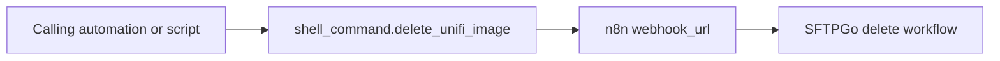

[<- Back to Integrations README](README.md) · [Packages README](../README.md) · [Main README](../../README.md)

# n8n Workflow Helper

This package exposes one Home Assistant shell command for calling an n8n webhook. The command is intended to ask n8n to delete a UniFi image from SFTPGo, but the only YAML consumer currently found in this repository is commented out in `unifi_protect.yaml`.

## Quick Summary

| Area | What Happens |
|------|--------------|
| Shell command | Defines `shell_command.delete_unifi_image`. |
| Target | Sends an authenticated HTTP `POST` request to a caller-supplied webhook URL. |
| Payload | Passes the requested file path in the command body. |
| Current use | Available for use, with the referenced UniFi Protect delete call commented out. |

## Package Contents

| File | Purpose | Contents |
|------|---------|----------|
| `n8n.yaml` | n8n webhook shell command | 1 shell command |

## Flow

## Shell Command

| Command | Result |
|---------|--------|
| `shell_command.delete_unifi_image` | Runs `curl` with `POST`, basic auth from `username` and `password`, `Content-Type: application/json`, a `file_path` payload, and the caller-provided `webhook_url`. |

## Parameters

| Parameter | Purpose |
|-----------|---------|
| `username` | Username for the HTTP basic auth call to the webhook endpoint. |
| `password` | Password for the HTTP basic auth call to the webhook endpoint. |
| `file_path` | File path passed to the n8n workflow. |
| `webhook_url` | n8n webhook endpoint to call. |

## Power-User Notes

The command is a raw `shell_command`, so quoting and templating are handled by Home Assistant before `curl` runs. If the delete workflow is enabled later, validate the rendered command with safe test values before relying on it for cleanup.

## Troubleshooting

| Symptom | Check |
|---------|-------|
| Command is not running | Confirm a caller actually invokes `shell_command.delete_unifi_image`; the UniFi Protect reference is currently commented out. |
| n8n receives no request | Check `webhook_url`, network access from Home Assistant, and HTTP basic auth credentials. |
| File is not deleted | Check the n8n workflow and SFTPGo permissions for the supplied `file_path`. |
