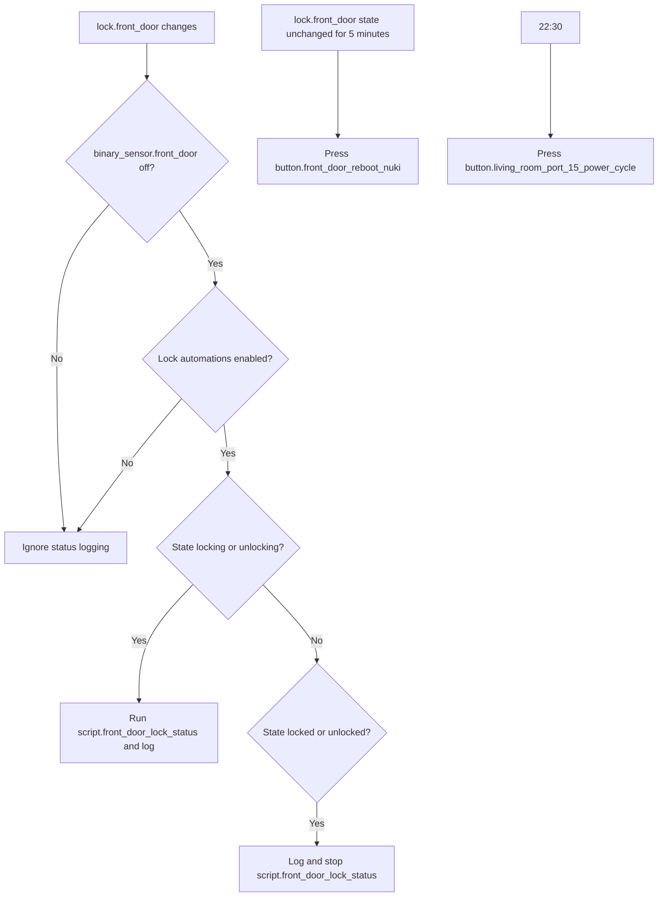

[<- Back to Integrations README](README.md) · [Packages README](../README.md) · [Main README](../../README.md)

# Nuki Smart Lock Package Documentation

The Nuki package manages the front-door smart lock and its hub recovery routines. For everyday use, it gives other automations a safe way to lock or unlock the front door, logs lock-state changes, reboots the Nuki hub if the lock stops responding, and power-cycles the network port that supplies the Nuki hub each evening.

| File | Purpose | Contents |
|------|---------|----------|
| `nuki.yaml` | Front-door lock and hub support | 3 automations, 2 scripts |

## Quick Summary

| Area | What Happens |
|------|--------------|
| Lock status | Qualifying lock state changes are logged when the door is closed and lock automations are enabled. Transitions from `unlocked` are intentionally excluded by the trigger. |
| Lock-in-progress handling | While the lock is moving, `script.front_door_lock_status` is started. When the lock reaches `locked` or `unlocked`, that status script is stopped. |
| Manual scripts | `script.lock_front_door` and `script.unlock_front_door` provide reusable lock actions with logging. |
| Hub recovery | If `lock.front_door` remains in one state for 5 minutes, the package presses the Nuki hub reboot button and logs the event. |
| Scheduled reset | At 22:30, the package power-cycles the network switch port used by the Nuki hub. |

## How The Lock Package Decides What To Do

## User Controls

| Entity | Plain-English Purpose |
|--------|-----------------------|
| `input_boolean.enable_front_door_lock_automations` | Master switch for front-door lock automation and `script.lock_front_door`. It does not block `script.unlock_front_door` or hub recovery. |

## Entities Used

| Entity | Purpose |
|--------|---------|
| `lock.front_door` | Nuki lock entity controlled by the scripts and monitored by automations. |
| `binary_sensor.front_door` | Door contact sensor; status logging only runs when this is `off`. |
| `button.front_door_reboot_nuki` | Reboots the Nuki hub. |
| `button.living_room_port_15_power_cycle` | Power-cycles the network switch port used by the Nuki hub. |

## Automations

| Automation | Trigger | Conditions | Result |
|------------|---------|------------|--------|
| `Porch: Front Door Lock Status Change` | `lock.front_door` changes, excluding transitions from `unlocked` | Door closed; lock automations enabled | Logs lock state. Starts `script.front_door_lock_status` for `locking` or `unlocking`; stops it once `locked` or `unlocked`. |
| `Nuki: Unavailable` | `lock.front_door` remains in any state for 5 minutes | None | Presses `button.front_door_reboot_nuki` and logs that the hub is being restarted. |
| `Porch: Powercycle Nukihub` | 22:30 daily | None | Presses `button.living_room_port_15_power_cycle`. |

## Scripts

| Script | Mode | Result |
|--------|------|--------|
| `script.lock_front_door` | `queued`, max 10 | If `input_boolean.enable_front_door_lock_automations` is `on`, logs and calls `lock.lock` on `lock.front_door`. |
| `script.unlock_front_door` | `single` | Logs and calls `lock.unlock` on `lock.front_door` without checking the automation enable helper. |

## Troubleshooting

| Symptom | Check |
|---------|-------|
| Lock script does nothing | Confirm `input_boolean.enable_front_door_lock_automations` is `on`; only `script.lock_front_door` is gated by this helper. |
| Lock status changes are not logged | Confirm `binary_sensor.front_door` is `off`; the status automation does not run while the door contact reports open. |
| Hub keeps rebooting | Review the trace for `Nuki: Unavailable`; the current YAML triggers after `lock.front_door` remains unchanged for 5 minutes, not only when it is literally `unavailable`. |
| Scheduled power-cycle did not run | Check the trace for `Porch: Powercycle Nukihub` and verify `button.living_room_port_15_power_cycle` exists. |
