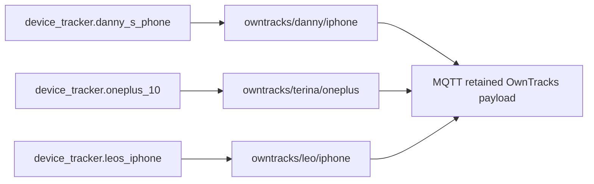

[<- Back to Integrations README](README.md) · [Packages README](../README.md) · [Main README](../../README.md)

# OwnTracks Location Publishing

This package republishes selected Home Assistant device tracker locations to MQTT using the OwnTracks location payload format. It covers Danny, Terina, and Leo so OwnTracks-compatible tools can consume Home Assistant's current location data.

Background reference: <https://devblog.yvn.no/posts/replacing-maps-timeline-with-owntracks/>

## Quick Summary

| Area | What Happens |
|------|--------------|
| People covered | Danny, Terina, and Leo. |
| Trigger | Each automation runs whenever its device tracker state changes. |
| Output | A retained MQTT OwnTracks-style location message. |
| MQTT topics | One topic per person/device. |

## Package Contents

| File | Purpose | Contents |
|------|---------|----------|
| `owntracks.yaml` | Device tracker to MQTT publishing | 3 automations |

## Flow

## Automations

| Automation | ID | Source Tracker | MQTT Topic | Mode |
|------------|----|----------------|------------|------|
| `People: Update Danny's Owntracks` | `1744064001680` | `device_tracker.danny_s_phone` | `owntracks/danny/iphone` | `single` |
| `People: Update Terina's Owntracks` | `1744064001681` | `device_tracker.oneplus_10` | `owntracks/terina/oneplus` | `single` |
| `People: Update Leo's Owntracks` | `1744064001682` | `device_tracker.leos_iphone` | `owntracks/leo/iphone` | `single` |

Each automation publishes with `retain: true`.

## Published Payload

| Field | Value |
|-------|-------|
| `_type` | `location` |
| `t` | `p` |
| `tid` | `ha` |
| `lat` | Source tracker `latitude` attribute. |
| `lon` | Source tracker `longitude` attribute. |
| `alt` | Source tracker `altitude` attribute, default `0`. |
| `vac` | Source tracker `vertical_accuracy` attribute, default `0`. |
| `acc` | Source tracker `gps_accuracy` attribute, default `0`. |
| `vel` | Source tracker `speed` attribute, default `0`. |
| `cog` | Source tracker `course` attribute, default `0`. |
| `tst` | Current Home Assistant timestamp as an integer. |

## Troubleshooting

| Symptom | Check |
|---------|-------|
| MQTT topic is missing | Confirm the source device tracker has changed state and the MQTT integration is connected. |
| Location is stale | Check whether the source tracker attributes are updating in Home Assistant. |
| Consumer cannot parse the payload | Inspect the retained MQTT message and confirm `lat` and `lon` are present on the source tracker. |
