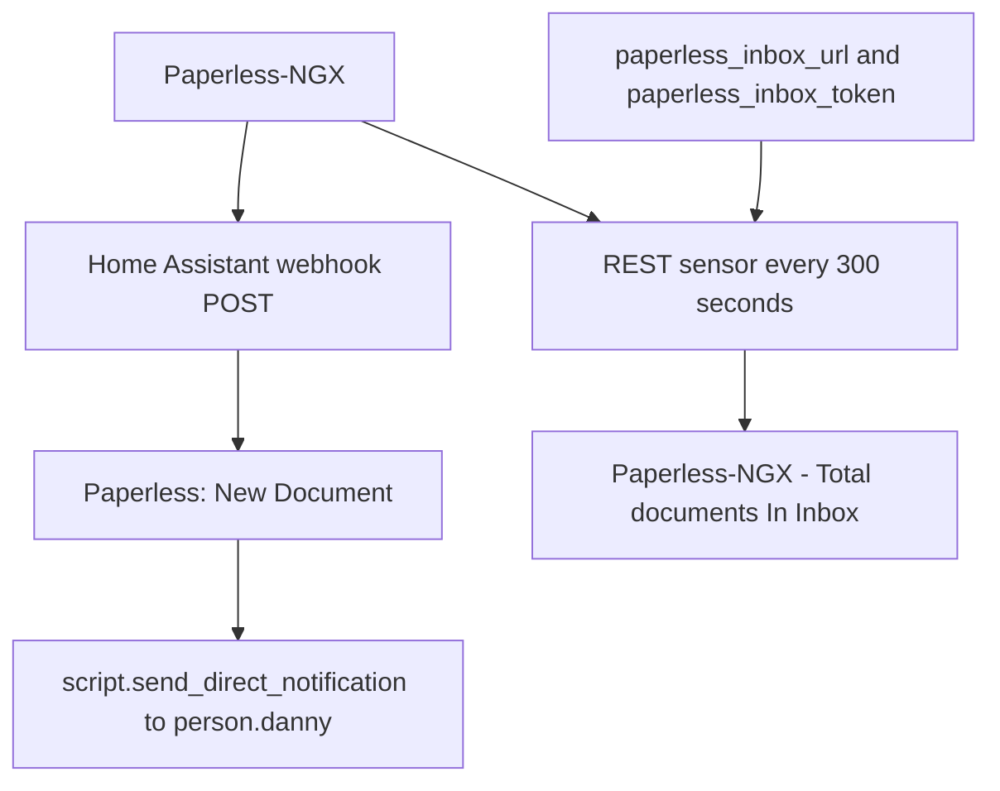

[<- Back to Integrations README](README.md) · [Packages README](../README.md) · [Main README](../../README.md)

# Paperless-NGX Package Documentation

The Paperless-NGX package lets Home Assistant notify Danny when Paperless reports a new document, and it polls the Paperless inbox count so the dashboard can show how many documents still need attention.

This documentation covers `paperless.yaml`.

| File | Purpose | Contents |
|------|---------|----------|
| `paperless.yaml` | Paperless webhook notification and inbox monitoring | 1 automation, 1 REST sensor |

## Quick Summary

For non-technical users, the important behavior is:

| Area | What Happens |
|------|--------------|
| New document | Paperless calls a Home Assistant webhook and Danny receives a direct notification. |
| Notification details | The notification includes document ID, name, correspondent, download URL, and tags from the webhook JSON. |
| Inbox count | Home Assistant polls Paperless every 5 minutes for the current inbox document count. |

## How It Works

## Technical Reference

### Automation

| ID | Alias | Trigger | Action | Mode |
|----|-------|---------|--------|------|
| `1687019771710` | `Paperless: New Document` | Webhook `POST` to `5dc5fc04-365e-4834-97e9-c6967bda3909`; `local_only: false` | Sends direct notification to `person.danny` using fields from `trigger.json`. | `queued`, max 10 |

### Webhook Payload Fields Used

| JSON Field | Used For |
|------------|----------|
| `id` | Document ID in the notification. |
| `name` | Document name in the notification. |
| `correspondent` | Correspondent line in the notification. |
| `download_url` | Download link in the notification. |
| `tags` | Tags line in the notification. |

### REST Sensor

| Name | Entity | Resource | Value Template | Scan Interval |
|------|--------|----------|----------------|---------------|
| `Paperless-NGX - Total documents In Inbox` | `sensor.paperless_ngx_total_documents_in_inbox` | `!secret paperless_inbox_url` | `value_json.document_count` | 300 seconds |

Power-user note: the entity ID is the expected Home Assistant slug for the configured sensor name. If Home Assistant has customized or de-duplicated the entity, check the entity registry.

## Important Entities And Secrets

| Entity Or Secret | Used For |
|------------------|----------|
| `sensor.paperless_ngx_total_documents_in_inbox` | Inbox document count REST sensor. |
| `person.danny` | Notification recipient. |
| `!secret paperless_inbox_url` | REST endpoint for inbox count. |
| `!secret paperless_inbox_token` | Authorization header for the inbox count request. |

## Troubleshooting

| Symptom | First Things To Check |
|---------|-----------------------|
| No new-document notification | Check Paperless webhook delivery, the webhook ID, and the `Paperless: New Document` automation trace. |
| Notification has missing fields | Check the Paperless webhook JSON contains `id`, `name`, `correspondent`, `download_url`, and `tags`. |
| Inbox count is unavailable | Check `paperless_inbox_url`, `paperless_inbox_token`, and Paperless API availability. |
| Webhook works locally but not remotely | The YAML sets `local_only: false`; check external access, reverse proxy, and Home Assistant webhook URL. |

## Reference

| Link | Purpose |
|------|---------|
| <https://flemmingss.com/monitoring-paperless-ngx-in-home-assistant/> | Reference pattern noted in the YAML for monitoring Paperless-NGX in Home Assistant. |

*Last updated: 2026-06-27*
