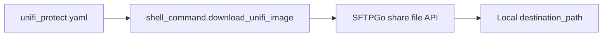

[<- Back to Integrations README](README.md) · [Packages README](../README.md) · [Main README](../../README.md)

# SFTPGo File Download Helper

This package exposes one shell command for downloading a file from an SFTPGo share. In this configuration it is used by the UniFi Protect package to fetch camera images before notifications are sent.

Home Assistant reference: <https://www.home-assistant.io/integrations/shell_command/>

## Quick Summary

| Area | What Happens |
|------|--------------|
| Shell command | Defines `shell_command.download_unifi_image`. |
| Protocol | Uses `curl` against the SFTPGo REST API. |
| Authentication | Uses HTTP basic auth with an empty username and caller-supplied password. |
| Consumer | Called by `unifi_protect.yaml`. |

## Package Contents

| File | Purpose | Contents |
|------|---------|----------|
| `sftpgo.yaml` | SFTPGo download shell command | 1 shell command |

## Flow

## Shell Command

| Command | Result |
|---------|--------|
| `shell_command.download_unifi_image` | Downloads a file from `base_url` share `share_id` to `destination_path` using a URL-encoded `source_path`. |

## Parameters

| Parameter | Purpose |
|-----------|---------|
| `password` | SFTPGo share/API password supplied by the caller. |
| `base_url` | Base URL of the SFTPGo instance. |
| `share_id` | SFTPGo share identifier. |
| `source_path` | File path inside the share. The command applies `urlencode` and then encodes `/` as `%2F`. |
| `destination_path` | Local path where `curl --output` writes the downloaded file. |

## Power-User Notes

The command uses `-u ':{{ password }}'`, so the basic auth username is intentionally empty. The request URL is built as `/api/v2/shares/{{ share_id }}/files?path=...` and sends `accept: */*`.

## Troubleshooting

| Symptom | Check |
|---------|-------|
| Download fails | Check `base_url`, `share_id`, password, and that Home Assistant can reach SFTPGo. |
| Wrong file is downloaded | Check the rendered `source_path` and SFTPGo share contents. |
| Notification image is missing | Check the UniFi Protect automation trace and confirm `destination_path` is writable. |
