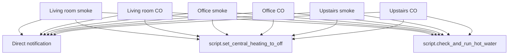

[<- Back to Integrations README](README.md) · [Packages README](../README.md) · [Main README](../../README.md)

# Smoke Alarm Package Documentation

The smoke alarm package listens to Nest Protect smoke and carbon monoxide sensors in the living room, office, and upstairs/stairs area. When any monitored sensor reports a hazard, it immediately sends a direct notification and runs heating and hot-water safety scripts.

Custom integration: [ha-nest-protect](https://github.com/iMicknl/ha-nest-protect)

| File | Purpose | Contents |
|------|---------|----------|
| `smoke_alarm.yaml` | Nest Protect hazard response | 6 automations |

## Quick Summary

| Area | What Happens |
|------|--------------|
| Smoke detection | Living room, office, and upstairs smoke sensors trigger direct notifications. |
| Carbon monoxide detection | Living room, office, and upstairs CO sensors trigger direct notifications. |
| Heating response | Every hazard automation calls `script.set_central_heating_to_off`. |
| Hot-water response | Every hazard automation calls `script.check_and_run_hot_water`. |
| Execution | Notification, heating, and hot-water actions run in parallel. |

## Detection Flow

## Sensor Entities

| Entity | Location | Hazard |
|--------|----------|--------|
| `binary_sensor.nest_protect_living_room_co_status` | Living room | Carbon monoxide |
| `binary_sensor.nest_protect_living_room_smoke_status` | Living room | Smoke |
| `binary_sensor.nest_protect_office_co_status` | Office | Carbon monoxide |
| `binary_sensor.nest_protect_office_smoke_status` | Office | Smoke |
| `binary_sensor.nest_protect_upstairs_co_status` | Stairs/upstairs | Carbon monoxide |
| `binary_sensor.nest_protect_upstairs_smoke_status` | Stairs/upstairs | Smoke |

## Automations

| Automation | Trigger | Actions |
|------------|---------|---------|
| `Living Room: Carbon Monoxide Detected` | Living room CO sensor turns `on` | Direct notification, central heating off, hot-water script. |
| `Living Room: Smoked Detected` | Living room smoke sensor turns `on` | Direct notification, central heating off, hot-water script. |
| `Office: Carbon Monoxide Detected` | Office CO sensor turns `on` | Direct notification, central heating off, hot-water script. |
| `Office: Smoked Detected` | Office smoke sensor turns `on` | Direct notification, central heating off, hot-water script. |
| `Stairs: Carbon Monoxide Detected` | Upstairs CO sensor turns `on` | Direct notification, central heating off, hot-water script. |
| `Stairs: Smoked Detected` | Upstairs smoke sensor turns `on` | Direct notification, central heating off, hot-water script. |

## Power-User Notes

| Detail | Current YAML Behavior |
|--------|-----------------------|
| Conditions | None; every sensor-to-`on` transition runs immediately. |
| Mode | All six automations use `mode: single`. |
| Notification script | The YAML calls `script.send_direct_notification` without explicit priority/channel data in this package. |
| Location wording | Automation aliases use `Stairs`; sensor entity IDs use `upstairs`. |

## Troubleshooting

| Symptom | Check |
|---------|-------|
| No alert when a detector activates | Confirm the matching `binary_sensor.nest_protect_*_status` entity changed to `on` and review that automation trace. |
| Heating did not turn off | Check `script.set_central_heating_to_off`; this package only calls the script. |
| Hot-water behavior is unexpected | Check `script.check_and_run_hot_water`; this package does not define that script's internal behavior. |
| Duplicate hazard ignored | Automations run in `single` mode, so a second trigger can be ignored while the first run is still active. |
