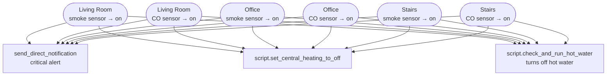

[<- Back to Integrations README](README.md) · [Packages README](../README.md) · [Main README](../../README.md)

# Smoke Alarm (Nest Protect)

*Last updated: 2026-04-05*

Monitors Nest Protect smoke and carbon monoxide detectors in three locations. On detection, a critical notification is sent and heating systems are shut off as a safety measure.

Custom integration: [ha-nest-protect](https://github.com/iMicknl/ha-nest-protect)

## Sensor Entities

| Entity | Location | Hazard |
|--------|----------|--------|
| `binary_sensor.nest_protect_living_room_smoke_status` | Living Room | Smoke |
| `binary_sensor.nest_protect_living_room_co_status` | Living Room | Carbon Monoxide |
| `binary_sensor.nest_protect_office_smoke_status` | Office | Smoke |
| `binary_sensor.nest_protect_office_co_status` | Office | Carbon Monoxide |
| `binary_sensor.nest_protect_upstairs_smoke_status` | Stairs | Smoke |
| `binary_sensor.nest_protect_upstairs_co_status` | Stairs | Carbon Monoxide |

## Automations

| Automation | Trigger entity | Hazard | Actions |
|------------|---------------|--------|---------|
| Living Room: Smoked Detected | `…living_room_smoke_status` → `on` | Smoke | Critical notification · turn off central heating · turn off hot water |
| Living Room: Carbon Monoxide Detected | `…living_room_co_status` → `on` | CO | Critical notification · turn off central heating · turn off hot water |
| Office: Smoked Detected | `…office_smoke_status` → `on` | Smoke | Critical notification · turn off central heating · turn off hot water |
| Office: Carbon Monoxide Detected | `…office_co_status` → `on` | CO | Critical notification · turn off central heating · turn off hot water |
| Stairs: Smoked Detected | `…upstairs_smoke_status` → `on` | Smoke | Critical notification · turn off central heating · turn off hot water |
| Stairs: Carbon Monoxide Detected | `…upstairs_co_status` → `on` | CO | Critical notification · turn off central heating · turn off hot water |

## Detection → Safety Actions Flow

## Notes

- All three actions (notification, heating off, hot water off) run in **parallel** to minimise response time.
- Each automation runs in `single` mode; a second trigger while the action is already running is ignored.
- The `script.check_and_run_hot_water` name is used here to turn off the hot water — the script name reflects its dual-purpose use elsewhere in the configuration.
