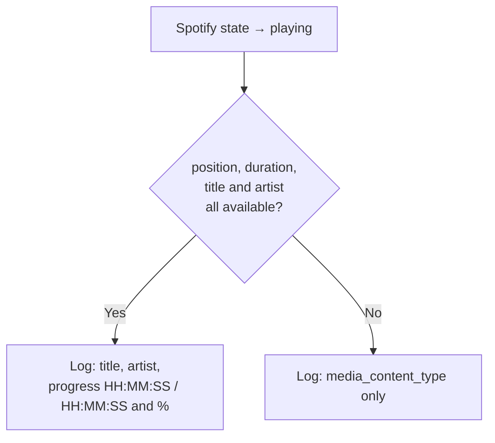

[<- Back to Integrations README](README.md) · [Packages README](../README.md) · [Main README](../../README.md)

# Spotify

Playback logging for Danny's Spotify account using the native [Spotify](https://www.home-assistant.io/integrations/spotify/) integration.

---

## Overview

A single automation logs Spotify playback events to the home log whenever Danny's Spotify player transitions to the `playing` state. The log entry includes track title, artist, album progress position and percentage when metadata is available.

---

## Automations

| ID | Alias | Trigger | Mode |
|----|-------|---------|------|
| `1612998168529` | Spotify: Playing | `media_player.spotify_danny` → `playing` | queued (max 10) |

### Logging logic

When full metadata is present the log message includes:
- Track title (bold) and artist (italic)
- Playback position and total duration formatted as `HH:MM:SS`
- Percentage progress through the track

---

## Entities

| Entity | Description |
|--------|-------------|
| `media_player.spotify_danny` | Danny's Spotify media player |

---

## Dependencies

- **Integration:** [Home Assistant Spotify](https://www.home-assistant.io/integrations/spotify/)
- **Scripts:** `script.send_to_home_log`

---

*Last updated: 2026-04-05*
