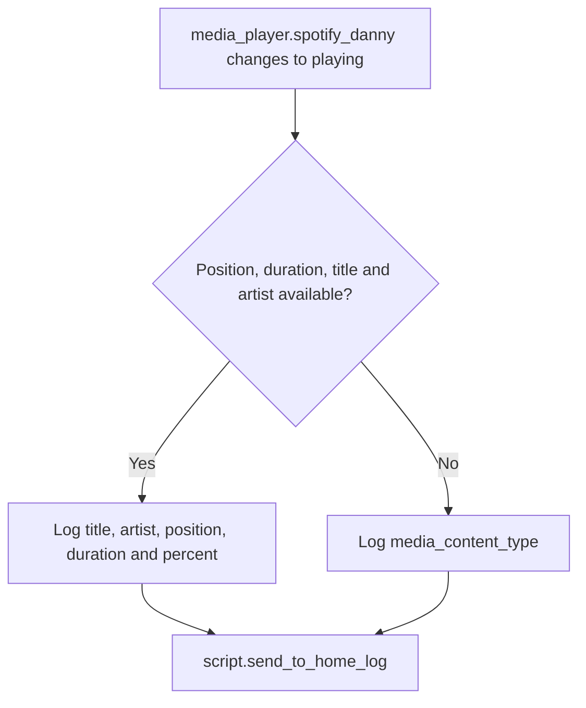

[<- Back to Integrations README](README.md) · [Packages README](../README.md) · [Main README](../../README.md)

# Spotify Package Documentation

The Spotify package records when Danny's Spotify player starts playing. It does not control playback; it only writes useful playback details to the home log.

This documentation covers one YAML file:

| File | Purpose | Contents |
|------|---------|----------|
| `spotify.yaml` | Spotify playback logging | 1 automation |

## Quick Summary

For non-technical users, the important behavior is:

| Area | What Happens |
|------|--------------|
| Playback logging | When `media_player.spotify_danny` changes to `playing`, the event is logged. |
| Full metadata | If title, artist, position, and duration are available, the log includes track details and progress. |
| Fallback logging | If metadata is incomplete, the log records the current Spotify content type instead. |
| No control actions | This package does not start, stop, pause, or move Spotify playback. |

## How Spotify Logging Works

## Automation

| ID | Alias | Trigger | Mode | Action |
|----|-------|---------|------|--------|
| `1612998168529` | Spotify: Playing | `media_player.spotify_danny` changes to `playing`. | `queued`, max `10`. | Logs playback details through `script.send_to_home_log`. |

## Log Message Details

| Metadata Available | Log Contents |
|--------------------|--------------|
| `media_position`, `media_duration`, `media_title`, and `media_artist` are all present | Track title, artist, current position, total duration, and percentage through the track. |
| Any required metadata is missing | `media_content_type` only. |

The full metadata branch formats the position and duration as `HH:MM:SS` and logs at debug level with title `:musical_note: Spotify`.

## Entities And Services

| Entity or Service | Purpose |
|-------------------|---------|
| `media_player.spotify_danny` | Danny's Spotify media player. |
| `script.send_to_home_log` | Structured logging helper used by the automation. |

Integration reference: <https://www.home-assistant.io/integrations/spotify/>

## Troubleshooting

| Symptom | Check |
|---------|-------|
| No Spotify log appears | Confirm `media_player.spotify_danny` actually changed state to `playing`; metadata-only changes do not trigger this automation. |
| Log only says a content type is playing | Spotify did not expose all required metadata at trigger time. The automation needs position, duration, title, and artist for the full message. |
| Multiple logs appear close together | The automation is queued with max 10, so rapid state changes to `playing` can be logged separately. |
