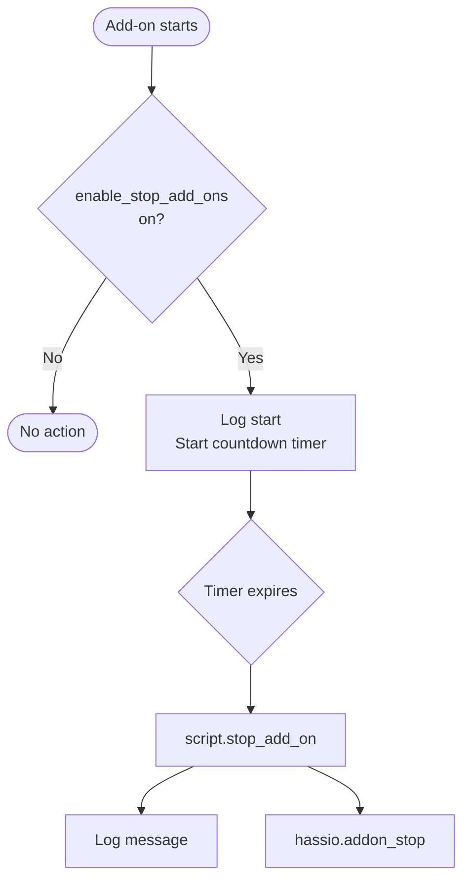

[<- Back to Integrations README](README.md) · [Packages README](../README.md) · [Main README](../../README.md)

# Supervisor — Add-On Lifecycle Management

*Last updated: 2026-04-05*

Manages Home Assistant add-on security and updates. Security-sensitive add-ons (File Editor, Terminal & SSH, Zigbee2MQTT Proxy) are automatically stopped after a configurable idle period. All monitored add-ons log and install updates automatically.

Integration reference: <https://www.home-assistant.io/integrations/hassio/>

---

## Auto-Disable Timer Flow

---

## Automations

| Name | ID | Trigger | Timer Duration | Action |
|---|---|---|---|---|
| Add-Ons: File Editor Started | `1674411819883` | `binary_sensor.file_editor_running` → on | — | Start `timer.stop_add_on_file_editor` (1 h), log |
| Add-ons: Automatically Disable File Editor | `1638101465298` | `timer.stop_add_on_file_editor` finished | 1 hour | `script.stop_add_on` → `core_configurator` |
| Add-Ons: Advanced SSH & Web Terminal | `1674411819884` | `binary_sensor.advanced_ssh_web_terminal_running` → on | — | Start `timer.stop_add_on_terminal_ssh` (1 h), log |
| Add-ons: Automatically Disable Advanced SSH & Web Terminal | `1638101748990` | `timer.stop_add_on_terminal_ssh` finished | 1 hour | `script.stop_add_on` → `a0d7b954_ssh` |
| Add-ons: Zigbee 2 MQTT Proxy Started | `1638101748992` | `binary_sensor.zigbee2mqtt_proxy_running` → on | — | Start `timer.stop_add_on_zigbee_2_mqtt_proxy` (30 min), log |
| Add-ons: Automatically Disable Zigbee 2 MQTT Proxy | `1638101748993` | `timer.stop_add_on_zigbee_2_mqtt_proxy` finished | 30 minutes | `script.stop_add_on` → `45df7312_zigbee2mqtt_proxy` |
| Add-On: Update For File Editor | `1700062541454` | `sensor.file_editor_newest_version` changes | — | Log update, `update.install` → `update.file_editor_update` |
| Add-On: Update For Terminal & Web | `1700062541455` | `sensor.advanced_ssh_web_terminal_newest_version` changes | — | Log update, `update.install` → `update.advanced_ssh_web_terminal_update` |
| Add-On: Update For ESPHome | `1700062541456` | `sensor.esphome_newest_version` changes | — | Log update, `update.install` → `update.esphome_update` |
| Add-On: Update For Zigbee2MQTT Proxy | `1700062541457` | `sensor.zigbee2mqtt_proxy_newest_version` changes | — | Log update, `update.install` → `update.zigbee2mqtt_proxy_update` |
| Add-On: Update For Log Viewer | `1700062541458` | `sensor.log_viewer_newest_version` changes | — | Log update, `update.install` → `update.log_viewer_update` |
| Add-On: Update For Visual Studio Code | `1700062541459` | `sensor.visual_studio_code_newest_version` changes | — | Log update, `update.install` → `update.studio_code_server_update` |
| Add-On: Predbat Core Update | `1767778408951` | `update.predbat_version` → on | — | Log, `update.install` → `update.predbat_version` |

All auto-disable automations are guarded by `input_boolean.enable_stop_add_ons`.

---

## Scripts

| Script | Alias | Fields | Action |
|---|---|---|---|
| `stop_add_on` | Stop Add-on | `addonEntityId` (required), `message` (required) | Logs the message and calls `hassio.addon_stop` with the given add-on ID |

---

## Add-On Summary

| Add-On | Auto-Disable | Auto-Update |
|---|---|---|
| File Editor (`core_configurator`) | After 1 hour | Yes |
| Advanced SSH & Web Terminal (`a0d7b954_ssh`) | After 1 hour | Yes |
| Zigbee2MQTT Proxy (`45df7312_zigbee2mqtt_proxy`) | After 30 minutes | Yes |
| ESPHome | No | Yes |
| Log Viewer | No | Yes |
| Visual Studio Code (Studio Code Server) | No | Yes |
| Predbat Core | No | Yes (auto-installs) |

---

## Dependencies

- `input_boolean.enable_stop_add_ons` — master guard for all auto-disable behaviour
- `script.send_to_home_log` — structured logging
- Timers: `timer.stop_add_on_file_editor`, `timer.stop_add_on_terminal_ssh`, `timer.stop_add_on_zigbee_2_mqtt_proxy`
