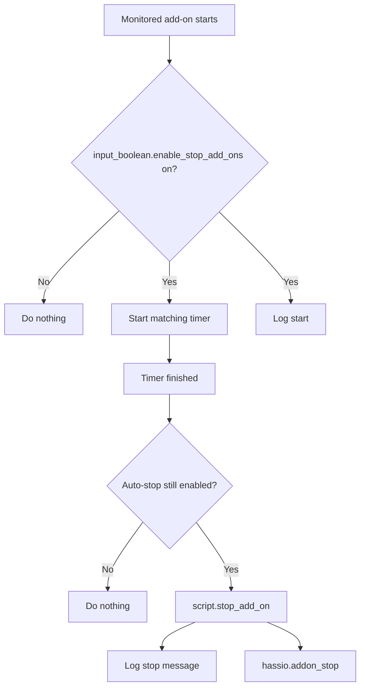

[<- Back to Integrations README](README.md) · [Packages README](../README.md) · [Main README](../../README.md)

# Supervisor Add-On Management

This package manages Home Assistant add-ons that should not be left running and installs updates for selected add-ons. It starts stop timers when sensitive add-ons are opened, stops them when the timers finish, logs add-on activity, and installs monitored updates.

Home Assistant reference: <https://www.home-assistant.io/integrations/hassio/>

## Quick Summary

| Area | What Happens |
|------|--------------|
| Auto-stop | File Editor, Advanced SSH & Web Terminal, and Zigbee2MQTT Proxy get stop timers when they start. |
| Update installs | Seven monitored add-on/update entities are installed automatically when their configured update trigger and condition pass. |
| Logging | Starts, stops, and updates are logged through `script.send_to_home_log`. |
| Master control | Auto-stop behavior is guarded by `input_boolean.enable_stop_add_ons`. |

## Package Contents

| File | Purpose | Contents |
|------|---------|----------|
| `supervisor.yaml` | Add-on stop timers and updates | 13 automations, 1 script |

## Auto-Stop Flow

## Automations

### Auto-Stop Automations

| Automation | ID | Trigger | Timer or Action | Mode |
|------------|----|---------|-----------------|------|
| `Add-Ons: File Editor Started` | `1674411819883` | `binary_sensor.file_editor_running` turns `on` | Starts `timer.stop_add_on_file_editor` for 1 hour and logs. | `single` |
| `Add-ons: Automatically Disable File Editor` | `1638101465298` | `timer.stop_add_on_file_editor` finishes | Calls `script.stop_add_on` for `core_configurator`. | `single` |
| `Add-Ons: Advanced SSH & Web Terminal` | `1674411819884` | `binary_sensor.advanced_ssh_web_terminal_running` turns `on` | Starts `timer.stop_add_on_terminal_ssh` for 1 hour and logs. | `single` |
| `Add-ons: Automatically Disable Advanced SSH & Web Terminal` | `1638101748990` | `timer.stop_add_on_terminal_ssh` finishes | Calls `script.stop_add_on` for `a0d7b954_ssh`. | `single` |
| `Add-ons: Zigbee 2 MQTT Proxy Started` | `1638101748992` | `binary_sensor.zigbee2mqtt_proxy_running` turns `on` | Starts `timer.stop_add_on_zigbee_2_mqtt_proxy` for 30 minutes and logs. | Default |
| `Add-ons: Automatically Disable Zigbee 2 MQTT Proxy` | `1638101748993` | `timer.stop_add_on_zigbee_2_mqtt_proxy` finishes | Calls `script.stop_add_on` for `45df7312_zigbee2mqtt_proxy`. | `single` |

### Update Automations

| Automation | ID | Trigger | Install Target | Mode |
|------------|----|---------|----------------|------|
| `Add-On: Update For File Editor` | `1700062541454` | `sensor.file_editor_newest_version` changes | `update.file_editor_update` | `single` |
| `Add-On: Update For Terminal & Web` | `1700062541455` | `sensor.advanced_ssh_web_terminal_newest_version` changes | `update.advanced_ssh_web_terminal_update` | `single` |
| `Add-On: Update For ESPHome` | `1700062541456` | `sensor.esphome_newest_version` changes | `update.esphome_update` | `single` |
| `Add-On: Update For Zigbee2MQTT Proxy` | `1700062541457` | `sensor.zigbee2mqtt_proxy_newest_version` changes | `update.zigbee2mqtt_proxy_update` | `single` |
| `Add-On: Update For Log Viewer` | `1700062541458` | `sensor.log_viewer_newest_version` changes | `update.log_viewer_update` | `single` |
| `Add-On: Update For Visual Studio Code` | `1700062541459` | `sensor.visual_studio_code_newest_version` changes | `update.studio_code_server_update` | `single` |
| `Add-On: Predbat Core Update` | `1767778408951` | `update.predbat_version` turns `on` | `update.predbat_version` | `single` |

The six version-sensor update automations include a `not state` condition intended to compare newest and current version sensors. In the YAML, the comparison value is written as a literal sensor entity ID string rather than a template.

## Script

| Script | Alias | Fields | Result |
|--------|-------|--------|--------|
| `script.stop_add_on` | `Stop Add-on` | `addonEntityId`, `message` | Logs the supplied message and calls `hassio.addon_stop` for the supplied add-on ID. |

## Troubleshooting

| Symptom | Check |
|---------|-------|
| Add-on does not auto-stop | Confirm `input_boolean.enable_stop_add_ons` is on and the matching timer finished. |
| Zigbee2MQTT Proxy stops earlier than expected | The YAML timer is `00:30:00` even though the stop message says more than an hour. |
| Add-on update did not install | Check the matching newest-version sensor, update entity, and automation trace. |
| Stop script fails | Confirm the `addonEntityId` value matches the Supervisor add-on slug. |
