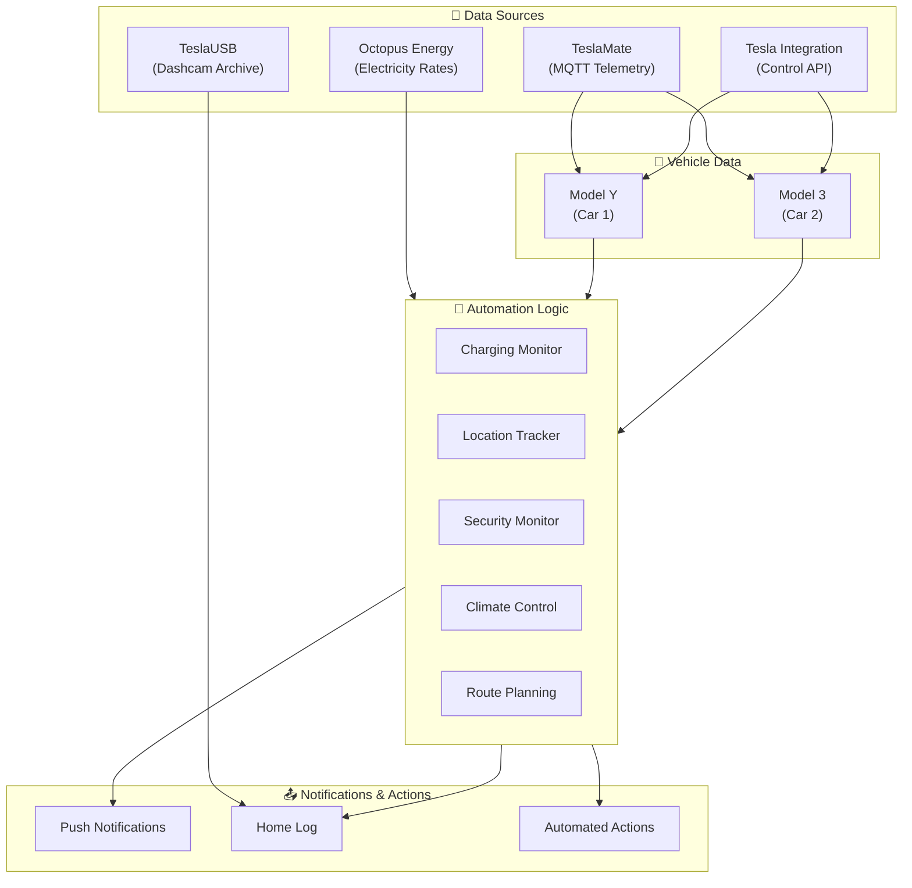
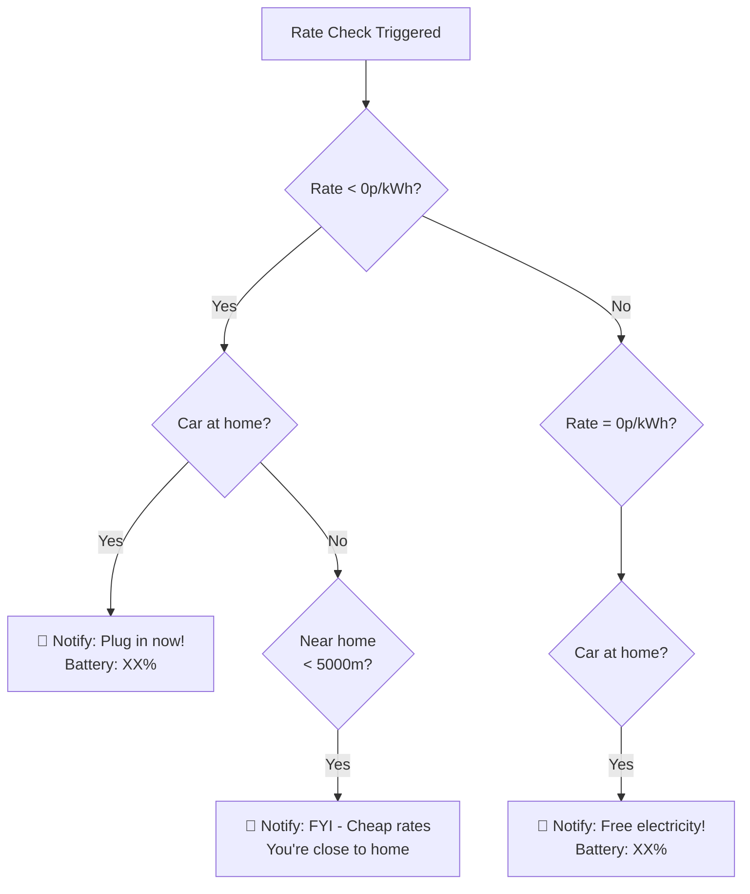
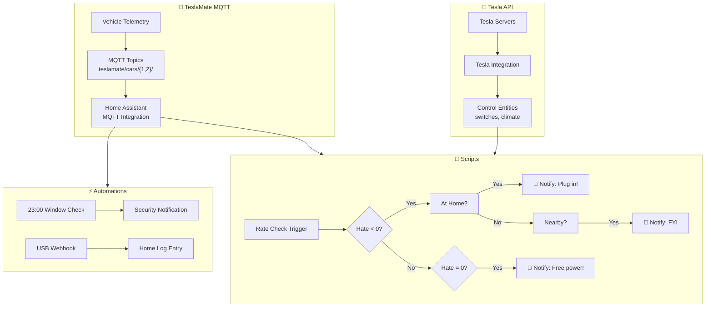

[<- Back to Integrations README](../README.md) · [Packages README](../../README.md) · [Main README](../../../README.md)

# Tesla Integration Package Documentation

This package provides comprehensive Tesla vehicle integration for two vehicles (Model Y and Model 3), including real-time status monitoring, charging automation, location tracking, climate control, and utility rate-based notifications.

---

## Table of Contents

- [Overview](#overview)
- [Architecture](#architecture)
- [Integrations](#integrations)
- [Automations](#automations)
- [Scripts](#scripts)
- [Sensors](#sensors)
- [Configuration](#configuration)
- [Entity Reference](#entity-reference)

---

## Overview

The Tesla integration package connects to Tesla vehicles through two primary integrations:
- **TeslaMate**: MQTT-based data collection for comprehensive vehicle telemetry
- **Tesla Custom Integration**: Official Home Assistant integration for control

The package supports two vehicles with complete sensor coverage, charging automation based on electricity rates, and proactive notifications for vehicle security and charging opportunities.



---

## Architecture

### File Structure

```
packages/integrations/transport/
├── tesla.yaml              # Main package file (1,295 lines)
└── README.md               # This documentation
```

### Key Components

| Component | Source | Purpose |
|-----------|--------|---------|
| `sensor.tesla_*` | TeslaMate MQTT | Vehicle telemetry data |
| `binary_sensor.tesla_*` | TeslaMate MQTT | Vehicle state indicators |
| `device_tracker.tesla_*` | TeslaMate MQTT | Location tracking |
| `switch.model_*_charger` | Tesla Integration | Charging control |
| `sensor.octopus_energy_electricity_current_rate` | Octopus Energy | Dynamic pricing |

### Device Grouping

Two distinct devices are configured:
- **Tesla Model Y** (`teslamate_car_1`) - Primary vehicle
- **Tesla Model 3** (`teslamate_car_2`) - Secondary vehicle

---

## Integrations

### TeslaMate (MQTT)

TeslaMate provides rich telemetry data via MQTT topics under `teslamate/cars/{1,2}/`:

| Category | Topics |
|----------|--------|
| **Status** | `state`, `display_name`, `version`, `healthy` |
| **Location** | `location`, `geofence`, `speed`, `heading`, `elevation` |
| **Battery** | `battery_level`, `usable_battery_level`, `rated_battery_range_km` |
| **Charging** | `charger_power`, `charger_voltage`, `charger_actual_current`, `charge_energy_added` |
| **Climate** | `inside_temp`, `outside_temp`, `is_climate_on`, `is_preconditioning` |
| **Security** | `locked`, `sentry_mode`, `windows_open`, `doors_open`, `trunk_open`, `frunk_open` |
| **Tires** | `tpms_pressure_*` (FL, FR, RL, RR) |
| **Navigation** | `active_route` (destination, ETA, traffic delay) |

### Tesla Custom Integration

Provides control entities:
- `switch.model_y_charger` / `switch.model_3_charger` - Charging enable/disable
- Climate control services
- Door/trunk/frunk controls
- Flash lights/honk horn

### TeslaUSB Webhook

Receives dashcam archive notifications via webhook (`webhook_id: teslausb`).

---

## Automations

### Tesla: USB Archive
**ID:** `1726077652711`

Logs TeslaUSB dashcam archive events to the home log.

**Triggers:**
- Webhook POST to `teslausb`

**Actions:**
- Calls `script.send_to_home_log` with message from webhook payload

**Mode:** Queued (max 10)

---

### Tesla: Windows Open At Night
**ID:** `1750161174574`

Security check that notifies if vehicle windows are left open at bedtime.

**Triggers:**
- Time: 23:00:00

**Conditions:**
- `binary_sensor.model_3_windows` is `on` (windows open)

**Actions:**
- Sends direct notification: "Model 3 windows 🪟 are open."

**Mode:** Single

---

## Scripts

### Tesla Notify Low Electricity Rates
**Alias:** `tesla_notify_low_electricity_rates`

Intelligent notification script that alerts when electricity rates are favorable for charging.

**Fields:**
| Field | Type | Description | Default |
|-------|------|-------------|---------|
| `current_electricity_import_rate` | Number | Import rate in £/kWh | `sensor.octopus_energy_electricity_current_rate` |

**Logic Flow:**


**Notification Scenarios:**

| Scenario | Condition | Message |
|----------|-----------|---------|
| **Negative Rates** | Rate < 0 AND car at home | "Car is not plugged in and electricity rates are below 0p/kWh" |
| **Free Electricity** | Rate = 0 AND car at home | "Car is not plugged in and electricity rates is 0.0p/kWh" |
| **Nearby Alert** | Rate ≤ 0 AND car not_home AND distance < 5000m | "You're close to home... this is a FYI" |

**Recipient:** `person.terina`

---

## Sensors

### MQTT Sensors (Per Vehicle)

All sensors are duplicated for both vehicles (Car 1 = Model Y, Car 2 = Model 3).

#### Vehicle Information

| Sensor | Topic | Device Class | Unit | Icon |
|--------|-------|--------------|------|------|
| `tesla_display_name` | `display_name` | - | - | mdi:car |
| `tesla_state` | `state` | - | - | mdi:car-connected |
| `tesla_since` | `since` | timestamp | - | mdi:clock-outline |
| `tesla_version` | `version` | - | - | mdi:alphabetical |
| `tesla_update_version` | `update_version` | - | - | mdi:alphabetical |
| `tesla_model` | `model` | - | - | - |
| `tesla_trim_badging` | `trim_badging` | - | - | mdi:shield-star-outline |
| `tesla_exterior_color` | `exterior_color` | - | - | mdi:palette |
| `tesla_wheel_type` | `wheel_type` | - | - | - |
| `tesla_spoiler_type` | `spoiler_type` | - | - | mdi:car-sports |

#### Location & Movement

| Sensor | Topic | Device Class | Unit | Icon |
|--------|-------|--------------|------|------|
| `tesla_geofence` | `geofence` | - | - | mdi:earth |
| `tesla_shift_state` | `shift_state` | - | - | mdi:car-shift-pattern |
| `tesla_power` | `power` | power | kW | mdi:flash |
| `tesla_speed` | `speed` | speed | km/h | mdi:speedometer |
| `tesla_heading` | `heading` | - | ° | mdi:compass |
| `tesla_elevation` | `elevation` | distance | m | mdi:image-filter-hdr |

#### Climate

| Sensor | Topic | Device Class | Unit | Icon |
|--------|-------|--------------|------|------|
| `tesla_inside_temp` | `inside_temp` | temperature | °C | mdi:thermometer-lines |
| `tesla_outside_temp` | `outside_temp` | temperature | °C | mdi:thermometer-lines |

#### Battery & Range

| Sensor | Topic | Device Class | Unit | Icon |
|--------|-------|--------------|------|------|
| `tesla_odometer` | `odometer` | distance | km | mdi:counter |
| `tesla_est_battery_range` | `est_battery_range_km` | distance | km | mdi:gauge |
| `tesla_rated_battery_range` | `rated_battery_range_km` | distance | km | mdi:gauge |
| `tesla_ideal_battery_range` | `ideal_battery_range_km` | distance | km | mdi:gauge |
| `tesla_battery_level` | `battery_level` | battery | % | mdi:battery-80 |
| `tesla_usable_battery_level` | `usable_battery_level` | battery | % | mdi:battery-80 |

#### Charging

| Sensor | Topic | Device Class | Unit | Icon |
|--------|-------|--------------|------|------|
| `tesla_charge_energy_added` | `charge_energy_added` | energy | kWh | mdi:battery-charging |
| `tesla_charge_limit_soc` | `charge_limit_soc` | battery | % | mdi:battery-charging-100 |
| `tesla_charger_actual_current` | `charger_actual_current` | current | A | mdi:lightning-bolt |
| `tesla_charger_phases` | `charger_phases` | - | - | mdi:sine-wave |
| `tesla_charger_power` | `charger_power` | power | kW | mdi:lightning-bolt |
| `tesla_charger_voltage` | `charger_voltage` | voltage | V | mdi:lightning-bolt |
| `tesla_scheduled_charging_start_time` | `scheduled_charging_start_time` | timestamp | - | mdi:clock-outline |
| `tesla_time_to_full_charge` | `time_to_full_charge` | duration | h | mdi:clock-outline |

#### Tire Pressure Monitoring (TPMS)

| Sensor | Topic | Unit | Icon | Notes |
|--------|-------|------|------|-------|
| `tesla_tpms_fl` | `tpms_pressure_fl` | bar | mdi:car-tire-alert | Front Left |
| `tesla_tpms_pressure_fl_psi` | `tpms_pressure_fl` | psi | mdi:car-tire-alert | Template: ×14.50377 |
| `tesla_tpms_fr` | `tpms_pressure_fr` | bar | mdi:car-tire-alert | Front Right |
| `tesla_tpms_pressure_fr_psi` | `tpms_pressure_fr` | psi | mdi:car-tire-alert | Template: ×14.50377 |
| `tesla_tpms_rl` | `tpms_pressure_rl` | bar | mdi:car-tire-alert | Rear Left |
| `tesla_tpms_pressure_rl_psi` | `tpms_pressure_rl` | psi | mdi:car-tire-alert | Template: ×14.50377 |
| `tesla_tpms_rr` | `tpms_pressure_rr` | bar | mdi:car-tire-alert | Rear Right |
| `tesla_tpms_pressure_rr_psi` | `tpms_pressure_rr` | psi | mdi:car-tire-alert | Template: ×14.50377 |

#### Active Route (Navigation)

| Sensor | Topic | Device Class | Unit | Icon |
|--------|-------|--------------|------|------|
| `tesla_active_route_destination` | `active_route` | - | - | mdi:map-marker |
| `tesla_active_route_energy_at_arrival` | `active_route` | battery | % | mdi:battery-80 |
| `tesla_active_route_distance_to_arrival` | `active_route` | distance | mi | mdi:map-marker-distance |
| `tesla_active_route_minutes_to_arrival` | `active_route` | duration | min | mdi:clock-outline |
| `tesla_active_route_traffic_minutes_delay` | `active_route` | duration | min | mdi:clock-alert-outline |

**Note:** Active route sensors have availability templates checking for `value_json.error`.

### MQTT Binary Sensors (Per Vehicle)

| Sensor | Topic | Device Class | Icon | Payload Mapping |
|--------|-------|--------------|------|-----------------|
| `tesla_healthy` | `healthy` | - | mdi:heart-pulse | true=ON, false=OFF |
| `tesla_update_available` | `update_available` | - | mdi:alarm | true=ON, false=OFF |
| `tesla_locked` | `locked` | lock | - | **Inverted:** false=ON, true=OFF |
| `tesla_sentry_mode` | `sentry_mode` | - | mdi:cctv | true=ON, false=OFF |
| `tesla_windows_open` | `windows_open` | window | mdi:car-door | true=ON, false=OFF |
| `tesla_doors_open` | `doors_open` | door | mdi:car-door | true=ON, false=OFF |
| `tesla_trunk_open` | `trunk_open` | opening | mdi:car-side | true=ON, false=OFF |
| `tesla_frunk_open` | `frunk_open` | opening | mdi:car-side | true=ON, false=OFF |
| `tesla_is_user_present` | `is_user_present` | presence | mdi:human-greeting | true=ON, false=OFF |
| `tesla_is_climate_on` | `is_climate_on` | - | mdi:fan | true=ON, false=OFF |
| `tesla_is_preconditioning` | `is_preconditioning` | - | mdi:fan | true=ON, false=OFF |
| `tesla_plugged_in` | `plugged_in` | plug | mdi:ev-station | true=ON, false=OFF |
| `tesla_charge_port_door_open` | `charge_port_door_open` | opening | mdi:ev-plug-tesla | true=ON, false=OFF |
| `tesla_park_brake` | `shift_state` | - | mdi:car-brake-parking | Template: 'P'=ON |

### Device Trackers (Per Vehicle)

| Tracker | Topic | Attributes | Icon |
|---------|-------|------------|------|
| `tesla_location` | `location` | Full location JSON | mdi:crosshairs-gps |
| `tesla_active_route_location` | `active_route` | Route location JSON | mdi:crosshairs-gps |

### Template Binary Sensors

#### Tesla Charging (Car 1 - Model Y)
**Unique ID:** `38c00574-6feb-4712-8089-24f84291ad69`

| Attribute | Value |
|-----------|-------|
| **Trigger** | `sensor.tesla_charger_power` or `switch.model_y_charger` state change |
| **State** | `{{ states('sensor.tesla_charger_power')|float(0) > 0 or states('switch.model_y_charger') == 'off' }}` |
| **Availability** | `{{ states('sensor.tesla_charger_power')|is_number and states('switch.model_y_charger') != 'unavailable' }}` |

**Logic:** ON when either:
- Charger power > 0 kW (actively charging), OR
- Charger switch is off (not disabled)

#### Tesla Charging (Car 2 - Model 3)
**Unique ID:** `6389f66e-f7ce-4b3e-9b41-e006c4f713ea`

| Attribute | Value |
|-----------|-------|
| **Trigger** | `sensor.tesla_charger_power_2` or `switch.model_3_charger` state change |
| **State** | `{{ states('sensor.tesla_charger_power_2')|float(0) > 0 or states('switch.model_3_charger') == 'off' }}` |
| **Availability** | `{{ states('sensor.tesla_charger_power_2')|is_number and states('switch.model_3_charger') != 'unavailable' }}` |

---

## Configuration

### Secrets Required

| Secret | Purpose |
|--------|---------|
| `teslamate_url` | TeslaMate web interface URL for device configuration links |

### External Dependencies

| Integration/Entity | Required For |
|-------------------|--------------|
| `sensor.octopus_energy_electricity_current_rate` | Rate-based charging notifications |
| `script.send_to_home_log` | USB archive logging |
| `script.send_direct_notification` | Window alerts, rate notifications |
| `device_tracker.tesla_2` | Location-based rate notifications |
| `sensor.tesla_model_y_home_location_distance` | Proximity detection |
| `person.terina` | Notification recipient |

---

## Entity Reference

### Car 1 (Model Y) Entities

#### Sensors
| Entity | Description |
|--------|-------------|
| `sensor.tesla_display_name` | Vehicle display name |
| `sensor.tesla_state` | Current vehicle state |
| `sensor.tesla_since` | State change timestamp |
| `sensor.tesla_version` | Current firmware version |
| `sensor.tesla_update_version` | Available update version |
| `sensor.tesla_model` | Vehicle model |
| `sensor.tesla_trim_badging` | Trim level |
| `sensor.tesla_exterior_color` | Paint color |
| `sensor.tesla_wheel_type` | Wheel configuration |
| `sensor.tesla_spoiler_type` | Spoiler configuration |
| `sensor.tesla_geofence` | Current geofence location |
| `sensor.tesla_shift_state` | Gear position (P/R/N/D) |
| `sensor.tesla_power` | Current power draw/delivery |
| `sensor.tesla_speed` | Current speed |
| `sensor.tesla_heading` | Compass heading |
| `sensor.tesla_elevation` | Altitude |
| `sensor.tesla_inside_temp` | Interior temperature |
| `sensor.tesla_outside_temp` | Exterior temperature |
| `sensor.tesla_odometer` | Total mileage |
| `sensor.tesla_est_battery_range` | Estimated range (driving style) |
| `sensor.tesla_rated_battery_range` | Rated range (EPA) |
| `sensor.tesla_ideal_battery_range` | Ideal range |
| `sensor.tesla_battery_level` | Battery percentage |
| `sensor.tesla_usable_battery_level` | Usable battery percentage |
| `sensor.tesla_charge_energy_added` | Energy added this session |
| `sensor.tesla_charge_limit_soc` | Charge limit setting |
| `sensor.tesla_charger_actual_current` | Charging current |
| `sensor.tesla_charger_phases` | Charging phases (1/3) |
| `sensor.tesla_charger_power` | Charging power |
| `sensor.tesla_charger_voltage` | Charging voltage |
| `sensor.tesla_scheduled_charging_start_time` | Scheduled charge start |
| `sensor.tesla_time_to_full_charge` | Time remaining to full |
| `sensor.tesla_tpms_fl` | Front left tire pressure (bar) |
| `sensor.tesla_tpms_pressure_fl_psi` | Front left tire pressure (psi) |
| `sensor.tesla_tpms_fr` | Front right tire pressure (bar) |
| `sensor.tesla_tpms_pressure_fr_psi` | Front right tire pressure (psi) |
| `sensor.tesla_tpms_rl` | Rear left tire pressure (bar) |
| `sensor.tesla_tpms_pressure_rl_psi` | Rear left tire pressure (psi) |
| `sensor.tesla_tpms_rr` | Rear right tire pressure (bar) |
| `sensor.tesla_tpms_pressure_rr_psi` | Rear right tire pressure (psi) |
| `sensor.tesla_active_route_destination` | Navigation destination |
| `sensor.tesla_active_route_energy_at_arrival` | Predicted battery at arrival |
| `sensor.tesla_active_route_distance_to_arrival` | Miles to destination |
| `sensor.tesla_active_route_minutes_to_arrival` | ETA in minutes |
| `sensor.tesla_active_route_traffic_minutes_delay` | Traffic delay |

#### Binary Sensors
| Entity | Description |
|--------|-------------|
| `binary_sensor.tesla_healthy` | Vehicle API health |
| `binary_sensor.tesla_update_available` | Firmware update waiting |
| `binary_sensor.tesla_locked` | Doors locked |
| `binary_sensor.tesla_sentry_mode` | Sentry mode active |
| `binary_sensor.tesla_windows_open` | Any window open |
| `binary_sensor.tesla_doors_open` | Any door open |
| `binary_sensor.tesla_trunk_open` | Trunk open |
| `binary_sensor.tesla_frunk_open` | Front trunk open |
| `binary_sensor.tesla_is_user_present` | Driver present |
| `binary_sensor.tesla_is_climate_on` | HVAC active |
| `binary_sensor.tesla_is_preconditioning` | Preconditioning active |
| `binary_sensor.tesla_plugged_in` | Charging cable connected |
| `binary_sensor.tesla_charge_port_door_open` | Charge port open |
| `binary_sensor.tesla_park_brake` | Parking brake engaged |
| `binary_sensor.tesla_charging` | **Template:** Charging status |

#### Device Trackers
| Entity | Description |
|--------|-------------|
| `device_tracker.tesla_location` | GPS location |
| `device_tracker.tesla_active_route_location` | Route position |

### Car 2 (Model 3) Entities

Car 2 entities follow the same naming pattern with `_2` suffix for sensors, and use the same binary_sensor names (shared MQTT topics). The Tesla integration entities are:

| Entity | Description |
|--------|-------------|
| `sensor.tesla_charger_power_2` | Charging power (Model 3) |
| `switch.model_3_charger` | Charger control (Model 3) |
| `device_tracker.tesla_2` | Location (Model 3) |
| `binary_sensor.model_3_windows` | Windows state (from Tesla integration) |

### Scripts

| Entity | Description |
|--------|-------------|
| `script.tesla_notify_low_electricity_rates` | Rate-based charging notifications |

---

## Data Flow Summary



---

## Related Documentation

| Document | Purpose |
|----------|---------|
| [Integrations Overview](../README.md) | Overview of all integration packages |
| [Main Packages README](../../README.md) | Architecture and organization guidelines |

### Related Integrations

| Integration | Connection |
|-------------|------------|
| [Energy](../energy/README.md) | Octopus Agile rate-based charging notifications |
| [Messaging](../messaging/README.md) | Notification delivery via multiple platforms |

### External Documentation

- [TeslaMate Documentation](https://docs.teslamate.org/)
- [Tesla Custom Integration](https://github.com/alandtse/tesla)
- [TeslaUSB Project](https://github.com/marcone/teslausb)

---

## Maintenance Notes

### Troubleshooting

| Issue | Check |
|-------|-------|
| No vehicle data | TeslaMate container status, MQTT broker connectivity |
| Missing sensors | MQTT topic subscription, unique_id conflicts |
| Rate notifications not working | `sensor.octopus_energy_electricity_current_rate` state |
| Location tracking issues | TeslaMate geofence configuration |
| TPMS sensors unavailable | Vehicle must be driven to refresh tire data |

### TeslaMate Configuration

- Configuration URL: Set via `teslamate_url` secret
- MQTT broker must be accessible to both TeslaMate and Home Assistant
- Vehicle data updates depend on Tesla API polling (can be rate-limited)

---

*Last updated: March 2026*
