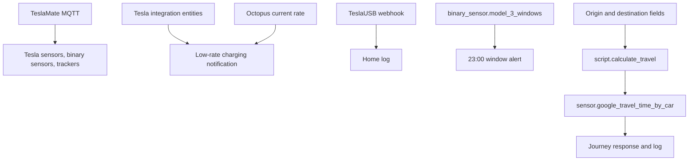
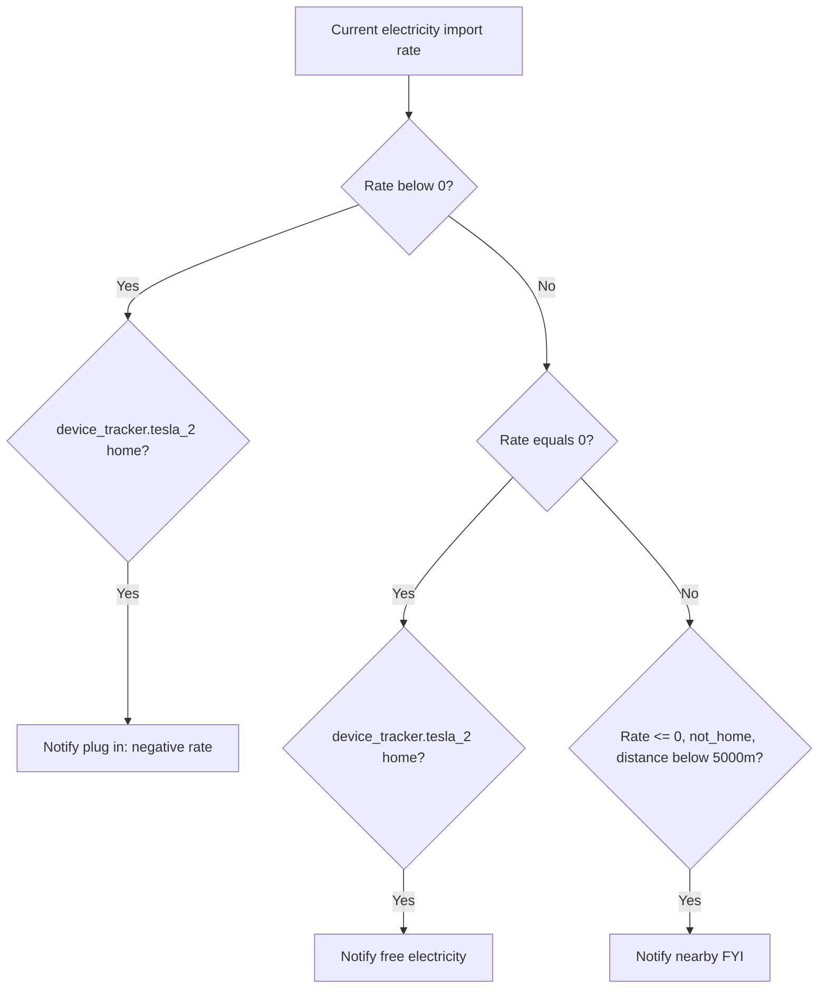
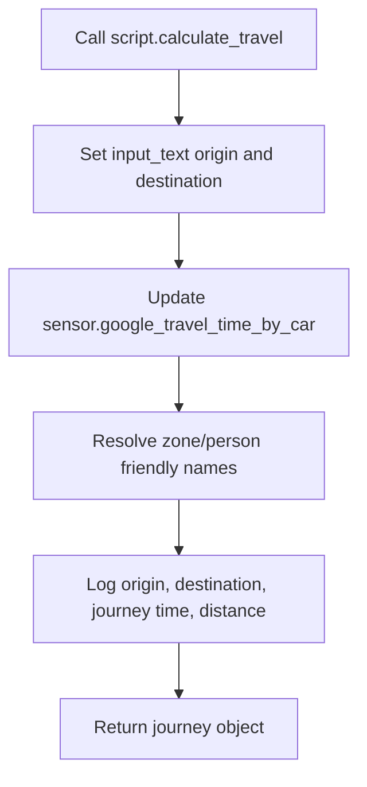

[<- Back to Integrations README](../README.md) · [Packages README](../../README.md) · [Main README](../../../README.md)

# Transport Package Documentation

The transport packages cover Tesla vehicle telemetry/control and reusable Google Maps travel-time calculation. For everyday use, this means the house can log TeslaUSB archive events, warn if Model 3 windows are open at night, notify Terina about free or negative-rate charging opportunities, and calculate traffic-aware journey times for automations or scripts.

This documentation covers both YAML files in this folder:

| File | Purpose | Contents |
|------|---------|----------|
| `tesla.yaml` | TeslaMate MQTT entities, Tesla alerts, and charging-rate notification script | 2 automations, 1 script, 2 template binary sensors, MQTT entities for 2 cars |
| `google_travel.yaml` | Dynamic Google Travel Time helper | 1 script, 2 template sensors |

## Quick Summary

| Area | What Happens |
|------|--------------|
| TeslaUSB | A local-only `teslausb` webhook logs archive messages to the home log. |
| Security | At 23:00, Danny is notified if `binary_sensor.model_3_windows` is open. |
| Charging rates | `script.tesla_notify_low_electricity_rates` notifies Terina when the Model Y should be plugged in during free or negative rates. |
| TeslaMate telemetry | MQTT entities expose state, location, battery, charging, climate, security, TPMS, and active-route data for two TeslaMate cars. |
| Google Travel | `script.calculate_travel` updates `sensor.google_travel_time_by_car`, logs the route, and returns a journey object. |

## How It Fits Together

## Main Files

### `tesla.yaml`

| Section | YAML Objects | Summary |
|---------|--------------|---------|
| Automations | 2 | TeslaUSB home-log webhook and nightly Model 3 window alert. |
| Script | 1 | Low/free electricity-rate notification logic for Terina. |
| MQTT entities | Repeated for car 1 and car 2 | TeslaMate telemetry for Model Y and Model 3. |
| Template binary sensors | 2 | Charging-state helpers for Model Y and Model 3 charger switches. |

### `google_travel.yaml`

| Section | YAML Objects | Summary |
|---------|--------------|---------|
| Script | 1 | Sets origin/destination helpers, updates Google Travel Time sensor, logs journey, returns response data. |
| Template sensors | 2 | Mirrors origin and destination input text helpers as sensors. |

## Everyday Behavior

### Tesla

| Automation or Script | Trigger/Input | Result |
|----------------------|---------------|--------|
| `Tesla: USB Archive` | Local webhook POST to `teslausb` | Logs `trigger.json.value2` to the home log with title `Tesla`. |
| `Tesla: Windows Open At Night` | 23:00 daily and `binary_sensor.model_3_windows` is `on` | Sends Danny `Model 3 windows are open.` |
| `script.tesla_notify_low_electricity_rates` | Called with optional `current_electricity_import_rate` | Notifies Terina if rates are below/equal to 0 and the Tesla tracker conditions match. |

### Google Travel

`script.calculate_travel` accepts an optional `origin` and required `destination`. It defaults origin to `zone.home`, updates `input_text.origin_address` and `input_text.destination_address`, refreshes `sensor.google_travel_time_by_car`, logs the journey, and stops with response variable `journey`.

## Entity Notes

### TeslaMate MQTT

The YAML defines two TeslaMate devices: `teslamate_car_1` as Tesla Model Y and `teslamate_car_2` as Tesla Model 3. Each car has MQTT entities for vehicle information, location, battery/range, charging, TPMS, security/opening state, climate flags, parking brake, GPS location, and active route details.

Power-user note: many car 2 MQTT entities use the same `default_entity_id` as car 1 while having different `unique_id` values. Home Assistant may suffix entity IDs in the entity registry. Treat YAML `unique_id` and device grouping as the reliable source, not every displayed entity ID in this README.

### Template Binary Sensors

| Entity Name | Source Inputs | State Logic |
|-------------|---------------|-------------|
| `Tesla Charging` for Model Y | `sensor.tesla_charger_power`, `switch.model_y_charger` | On when charger power is above 0 or the charger switch is `off`. |
| `Tesla Charging` for Model 3 | `sensor.tesla_charger_power_2`, `switch.model_3_charger` | On when charger power is above 0 or the charger switch is `off`. |

### Google Travel

| Entity | Purpose |
|--------|---------|
| `input_text.origin_address` | Origin sent to Google Travel Time. Defined outside this package. |
| `input_text.destination_address` | Destination sent to Google Travel Time. Defined outside this package. |
| `sensor.origin_address` | Template mirror of origin input text. |
| `sensor.destination_address` | Template mirror of destination input text. |
| `sensor.google_travel_time_by_car` | Google Travel Time sensor configured outside this package. |

## Troubleshooting

| Issue | Check |
|-------|-------|
| TeslaUSB logs missing | Webhook ID `teslausb`, local-only access, and TeslaUSB payload field `value2`. |
| Night window alert missing | `binary_sensor.model_3_windows` state at 23:00 and mobile notification delivery. |
| Charging-rate notification missing | Rate passed to script, `device_tracker.tesla_2`, `sensor.tesla_model_y_home_location_distance`, and `person.terina`. |
| TeslaMate entities unavailable | TeslaMate, MQTT broker, and topics under `teslamate/cars/1/` and `teslamate/cars/2/`. |
| Travel time is unknown | Google Travel Time integration, API key/billing, and `input_text` origin/destination values. |

## Related Documentation

| Document | Purpose |
|----------|---------|
| [Tesla details](tesla_README.md) | Tesla-specific automations, script, and entities. |
| [Google Travel details](google_travel_README.md) | Detailed travel-time script documentation. |
| [Google Travel folder README](google_travel/README.md) | Short package-local Google Travel reference. |
| [Energy](../energy/README.md) | Octopus rate context used by Tesla charging notifications. |

*Last updated: 2026-06-27*
