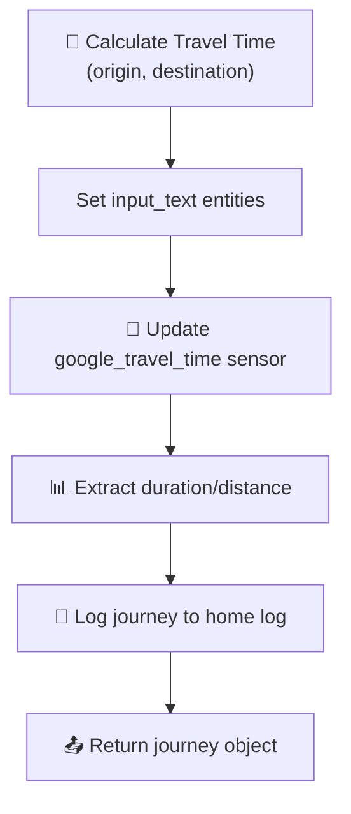

# Google Travel

[<- Back to Transport README](../README.md) · [Packages README](../../README.md) · [Main README](../../../README.md)

# Google Travel Time Integration

This package provides travel time calculation using Google Maps API with 0 automations and 1 script.

---

## Table of Contents

- [Overview](#overview)
- [How It Works](#how-it-works)
- [Script](#script)
- [Template Sensors](#template-sensors)
- [Entity Reference](#entity-reference)
- [Cross-References](#cross-references)

---

## Overview

The Google Travel integration calculates travel times between locations using `sensor.google_travel_time_by_car` and exposes template sensors for origin/destination display. A script provides reusable travel time calculations.

---

## How It Works



The `calculate_travel` script accepts origin/destination and:
1. Sets the `input_text.origin_address` and `input_text.destination_address` entities
2. Triggers a refresh of `sensor.google_travel_time_by_car`
3. Extracts travel time, duration in traffic, and distance
4. Logs the journey to the home log
5. Returns a structured journey object

---

## Script

### calculate_travel

Calculates travel time between two locations.

**Fields:**
| Field | Required | Default | Description |
|-------|----------|---------|-------------|
| `origin` | No | `zone.home` | Start location |
| `destination` | Yes | — | End location |

**Returns:**
```json
{
  "origin_address": "Home",
  "destination_address": "Work",
  "display_distance": "12.5 miles",
  "travel_time": 25.5,
  "travel_time_unit_of_measurement": "min",
  "display_travel_time": "25 mins (12.5 miles)"
}
```

**Logic:**
1. Resolves `zone.*` and `person.*` entities to friendly names
2. Updates the Google Travel Time sensor
3. Extracts distance, travel time, and duration in traffic
4. Logs to home log with formatted message
5. Returns journey data

---

## Template Sensors

### Destination Address
**Entity:** `sensor.destination_address`

Stores the destination address input for display.

**State:** Current value of `input_text.destination_address`

---

### Origin Address
**Entity:** `sensor.origin_address`

Stores the origin address input for display.

**State:** Current value of `input_text.origin_address`

---

## Entity Reference

### Template Sensors

| Entity | Icon | Purpose |
|--------|------|---------|
| `sensor.destination_address` | mdi:map-marker | Destination display |
| `sensor.origin_address` | mdi:map-marker-outline | Origin display |

### Input Text Helpers

| Entity | Purpose |
|--------|---------|
| `input_text.origin_address` | Origin location for travel calculation |
| `input_text.destination_address` | Destination location for travel calculation |

### Integration Sensor

| Entity | Purpose |
|--------|---------|
| `sensor.google_travel_time_by_car` | Google Maps travel time (from Google Travel Time integration) |

---

## Cross-References

| Document | Purpose |
|----------|---------|
| [Transport README](../README.md) | Parent transport package |
| [Tesla README](./tesla/README.md) | Tesla range/travel planning |

---

*Last updated: 2026-04-26*