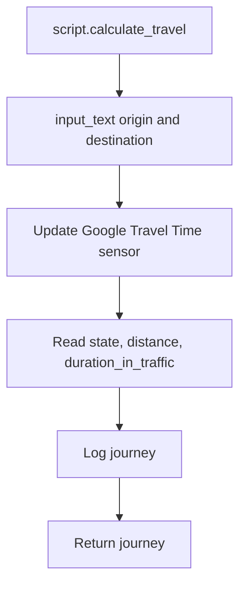

[<- Back to Transport README](../README.md) · [Packages README](../../../README.md) · [Main README](../../../../README.md)

# Google Travel Time Integration

This package calculates traffic-aware travel times with Google Travel Time. It has 0 automations, 1 script, and 2 template sensors.

## Quick Summary

| Area | What Happens |
|------|--------------|
| Script | `script.calculate_travel` sets origin/destination helpers and refreshes `sensor.google_travel_time_by_car`. |
| Defaults | Origin defaults to `zone.home`; destination is required. |
| Output | A `journey` response object contains origin, destination, distance, numeric travel time, unit, and traffic-aware display time. |
| Logging | Each calculation is logged to the home log. |

## Flow

## Entities

| Entity | Purpose |
|--------|---------|
| `script.calculate_travel` | Reusable route calculation script. |
| `sensor.origin_address` | Mirrors `input_text.origin_address`. |
| `sensor.destination_address` | Mirrors `input_text.destination_address`. |
| `sensor.google_travel_time_by_car` | Google Travel Time sensor configured outside this package. |

## Script Fields

| Field | Required | Default | Purpose |
|-------|----------|---------|---------|
| `origin` | No | `zone.home` | Start point. |
| `destination` | Yes | Empty if omitted | End point. |

## Troubleshooting

| Issue | Check |
|-------|-------|
| Unknown route | Google API key/billing and the `input_text` values. |
| Friendly name missing | The supplied `zone.*` or `person.*` entity exists and has a friendly name. |
| Response has 0 time | `sensor.google_travel_time_by_car` state after update. |

## Cross-References

| Document | Purpose |
|----------|---------|
| [Transport README](../README.md) | Parent transport package. |
| [Detailed Google Travel README](../google_travel_README.md) | Full script and response details. |
| [Tesla README](../tesla_README.md) | Tesla transport package. |

*Last updated: 2026-06-27*
