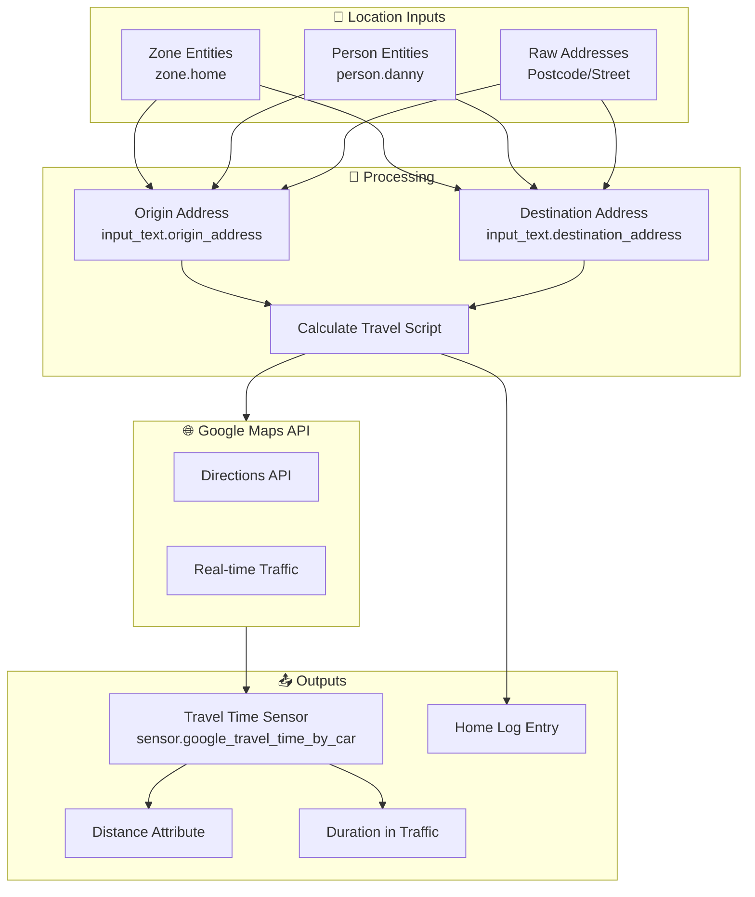
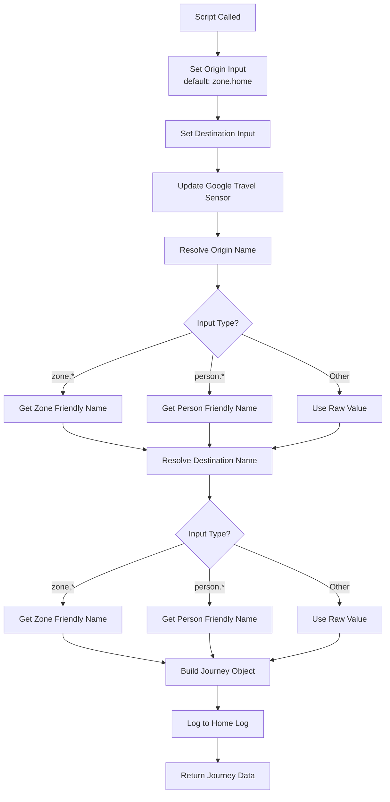
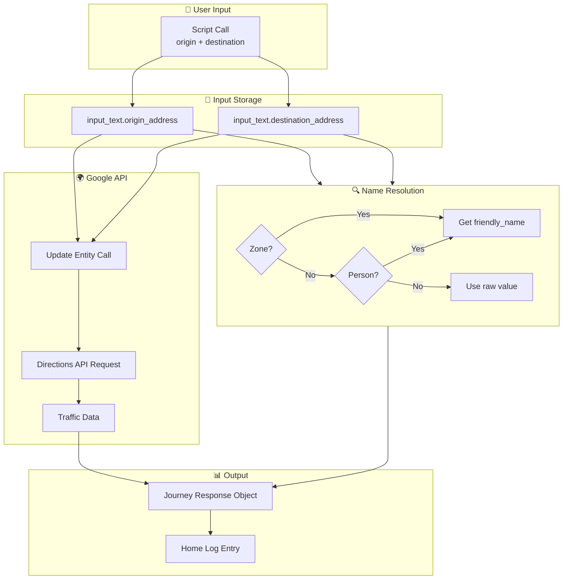

# Google Travel Time Integration Package Documentation

This package provides Google Travel Time integration for calculating travel duration between locations using real-time traffic data from Google Maps.

---

## Table of Contents

- [Overview](#overview)
- [Architecture](#architecture)
- [Integrations](#integrations)
- [Scripts](#scripts)
- [Sensors](#sensors)
- [Configuration](#configuration)
- [Entity Reference](#entity-reference)

---

## Overview

The Google Travel Time integration package enables dynamic travel time calculations using Google's Directions API. It supports flexible origin/destination inputs including zones, person entities, and raw addresses, with automatic traffic-aware duration estimates.



---

## Architecture

### File Structure

```
packages/integrations/transport/
├── google_travel.yaml        # Main package file
└── README.md                 # This documentation
```

### Key Components

| Component | Type | Purpose |
|-----------|------|---------|
| `input_text.origin_address` | Input Text | Dynamic origin location storage |
| `input_text.destination_address` | Input Text | Dynamic destination location storage |
| `sensor.origin_address` | Template Sensor | Resolved origin display name |
| `sensor.destination_address` | Template Sensor | Resolved destination display name |
| `sensor.google_travel_time_by_car` | Google Travel Time | Core travel time sensor |
| `script.calculate_travel` | Script | Orchestrates travel calculation workflow |

---

## Integrations

### Google Travel Time

Home Assistant's native [Google Travel Time](https://www.home-assistant.io/integrations/google_travel_time/) integration provides the core travel time sensor.

**Configuration Requirements:**
- Google Maps API key with Directions API enabled
- Origin and destination configured to use input_text entities for dynamic updates
- Travel mode: driving (configurable)

**Sensor Attributes:**
| Attribute | Description |
|-----------|-------------|
| `distance` | Distance between locations (e.g., "12.3 km") |
| `duration` | Base duration without traffic |
| `duration_in_traffic` | Traffic-aware duration estimate |
| `origin` | Resolved origin address |
| `destination` | Resolved destination address |

### Input Text Helpers

Two input_text entities store dynamic location values:
- `input_text.origin_address` - Defaults to `zone.home` if not specified
- `input_text.destination_address` - Must be set before calculation

---

## Scripts

### Calculate Travel Time
**Alias:** `calculate_travel`

Main script for calculating travel time between two locations with intelligent address resolution.

**Fields:**
| Field | Type | Required | Default | Description |
|-------|------|----------|---------|-------------|
| `origin` | Text | No | `zone.home` | Starting location (zone, person, or address) |
| `destination` | Text | Yes | - | Destination location (zone, person, or address) |

**Logic Flow:**


**Address Resolution Logic:**

The script intelligently resolves location inputs:

| Input Pattern | Resolution |
|--------------|------------|
| `zone.home` | Friendly name of the zone |
| `zone.work` | Friendly name of the zone |
| `person.danny` | Friendly name of the person |
| `SW1A 1AA` | Used as-is (postcode) |
| `123 Main Street` | Used as-is (address) |

**Response Variable:** `journey`

```json
{
  "origin_address": "Home",
  "destination_address": "London Bridge",
  "display_distance": "12.3 km",
  "travel_time": 25,
  "travel_time_unit_of_measurement": "min",
  "display_travel_time": "25 mins"
}
```

**Home Log Entry:**
- Title: `:car: Travel`
- Message includes origin, destination, journey time, and distance
- Log Level: Normal

---

## Sensors

### Template Sensors

#### Origin Address
**Entity:** `sensor.origin_address`
**Unique ID:** `71c7a6cb-f480-4835-aed7-6e05a8c53dfe`

| Attribute | Value |
|-----------|-------|
| **Icon** | mdi:map-marker-outline |
| **State** | `{{ states('input_text.origin_address') }}` |

Mirrors the origin input_text value for easy access in automations and dashboards.

#### Destination Address
**Entity:** `sensor.destination_address`
**Unique ID:** `f01b1d6b-9bbd-4261-945b-581d864eb4a4`

| Attribute | Value |
|-----------|-------|
| **Icon** | mdi:map-marker |
| **State** | `{{ states('input_text.destination_address') }}` |

Mirrors the destination input_text value for easy access in automations and dashboards.

### Google Travel Time Sensor

**Entity:** `sensor.google_travel_time_by_car`

Provided by the Google Travel Time integration (configured separately in `configuration.yaml`).

| Attribute | Description | Example |
|-----------|-------------|---------|
| `distance` | Distance between points | "12.3 km" |
| `duration` | Base travel time | "20 mins" |
| `duration_in_traffic` | Traffic-adjusted time | "25 mins" |
| `origin` | Resolved origin | "Home" |
| `destination` | Resolved destination | "London Bridge" |

---

## Configuration

### Prerequisites

1. **Google Cloud Platform Account**
   - Enable the [Directions API](https://developers.google.com/maps/documentation/directions/overview)
   - Create an API key
   - (Optional) Set up billing alerts

2. **Home Assistant Configuration**
   
   Add to `configuration.yaml`:
   ```yaml
   sensor:
     - platform: google_travel_time
       name: Google Travel Time By Car
       api_key: !secret google_maps_api_key
       origin: input_text.origin_address
       destination: input_text.destination_address
   ```

3. **Input Text Helpers**
   
   The package creates these automatically:
   ```yaml
   input_text:
     origin_address:
       name: Origin Address
       initial: zone.home
     destination_address:
       name: Destination Address
   ```

### Secrets Required

| Secret | Purpose |
|--------|---------|
| `google_maps_api_key` | Google Maps Directions API access |

### External Dependencies

| Integration/Entity | Required For |
|-------------------|--------------|
| `script.send_to_home_log` | Travel result logging |
| Google Travel Time sensor | Core travel time data |

---

## Entity Reference

### Input Text

| Entity | Purpose | Default |
|--------|---------|---------|
| `input_text.origin_address` | Origin location storage | `zone.home` |
| `input_text.destination_address` | Destination location storage | Empty |

### Sensors

| Entity | Description | Source |
|--------|-------------|--------|
| `sensor.origin_address` | Display name of origin | Template |
| `sensor.destination_address` | Display name of destination | Template |
| `sensor.google_travel_time_by_car` | Travel time with traffic | Google Travel Time |

### Scripts

| Entity | Description |
|--------|-------------|
| `script.calculate_travel` | Calculate travel time between locations |

---

## Data Flow Summary



---

## Usage Examples

### Basic Travel Calculation

```yaml
action: script.calculate_travel
data:
  destination: "London Bridge Station"
```

### From Specific Origin

```yaml
action: script.calculate_travel
data:
  origin: "zone.work"
  destination: "Heathrow Airport Terminal 5"
```

### Using Person Location

```yaml
action: script.calculate_travel
data:
  origin: "person.danny"
  destination: "zone.home"
```

### In Automations

```yaml
automation:
  - alias: "Morning Commute Check"
    trigger:
      - platform: time
        at: "07:30:00"
    action:
      - action: script.calculate_travel
        data:
          origin: "zone.home"
          destination: "zone.work"
      - action: notify.mobile_app_phone
        data:
          message: "Commute time: {{ states('sensor.google_travel_time_by_car') }} mins"
```

---

## Related Documentation

| Document | Purpose |
|----------|---------|
| [Integrations Overview](../README.md) | Overview of all integration packages |
| [Main Packages README](../../README.md) | Architecture and organization guidelines |

### Related Integrations

| Integration | Connection |
|-------------|------------|
| [Tesla](./tesla.yaml) | Vehicle location for travel calculations |
| [Home Assistant Location](../../shared_helpers.yaml) | Person/zone location helpers |

### External Documentation

- [Home Assistant Google Travel Time](https://www.home-assistant.io/integrations/google_travel_time/)
- [Google Maps Directions API](https://developers.google.com/maps/documentation/directions/overview)

---

## Maintenance Notes

### Troubleshooting

| Issue | Check |
|-------|-------|
| "Unknown" travel time | API key validity, billing status |
| Wrong origin/destination | input_text entity states |
| No traffic data | API key has Directions API enabled |
| Script fails | Destination field is required |

### API Limits

- Free tier: $200 credit/month (approximately 40,000 requests)
- Monitor usage in Google Cloud Console
- Consider caching for frequent routes

---

*Last updated: 2026-04-05*
