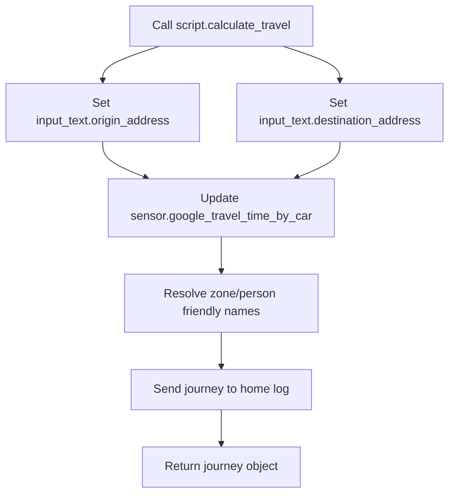

# Google Travel Package Documentation

The Google Travel package provides one reusable script for traffic-aware route calculations. It updates the Google Travel Time sensor using dynamic origin and destination helpers, logs the journey, and returns a structured response that other automations can use.

Source YAML: `google_travel.yaml`

| Contents | Count |
|----------|-------|
| Automations | 0 |
| Scripts | 1 |
| Template sensors | 2 |

## Quick Summary

| Area | What Happens |
|------|--------------|
| Origin | If not supplied, the script uses `zone.home`. |
| Destination | Required script field. |
| Travel data | `sensor.google_travel_time_by_car` is refreshed after origin/destination are set. |
| Logging | The script logs origin, destination, traffic-aware journey time, and distance. |
| Response | The script stops with response variable `journey`. |

## How It Works



## Script

### `script.calculate_travel`

| Field | Required | Default | Description |
|-------|----------|---------|-------------|
| `origin` | No | `zone.home` | Start location. Can be a zone entity, person entity, postcode, or address. |
| `destination` | Yes | Empty string if omitted by caller | End location. Can be a zone entity, person entity, postcode, or address. |

The script performs these steps:

1. Sets `input_text.origin_address` and `input_text.destination_address` in parallel.
2. Calls `homeassistant.update_entity` for `sensor.google_travel_time_by_car`.
3. Resolves `zone.*` and `person.*` values to friendly names for logging.
4. Builds a `journey` response object from Google Travel Time state and attributes.
5. Logs the journey to `script.send_to_home_log` with title `:car: Travel`.
6. Stops with `response_variable: journey`.

Response shape:

```json
{
  "origin_address": "Home",
  "destination_address": "Work",
  "display_distance": "12.5 mi",
  "travel_time": 25.0,
  "travel_time_unit_of_measurement": "min",
  "display_travel_time": "25 mins"
}
```

Power-user note: `display_travel_time` is populated from the sensor's `duration_in_traffic` attribute. The plain `duration` attribute is read into an internal variable but is not returned.

## Sensors

| Entity | Source | Purpose |
|--------|--------|---------|
| `sensor.origin_address` | `input_text.origin_address` | Template mirror for the current origin. |
| `sensor.destination_address` | `input_text.destination_address` | Template mirror for the current destination. |
| `sensor.google_travel_time_by_car` | Google Travel Time integration, configured elsewhere | Travel time, distance, and duration-in-traffic source. |

## Dependencies

| Dependency | Purpose |
|------------|---------|
| `input_text.origin_address` | Stores dynamic origin. |
| `input_text.destination_address` | Stores dynamic destination. |
| `sensor.google_travel_time_by_car` | Provides travel time and distance. |
| `script.send_to_home_log` | Logs journey details. |

## Example

```yaml
action: script.calculate_travel
data:
  origin: zone.home
  destination: person.danny
response_variable: journey
```

## Troubleshooting

| Issue | Check |
|-------|-------|
| Script returns 0 minutes | `sensor.google_travel_time_by_car` state and API response. |
| Friendly names are blank | The supplied `zone.*` or `person.*` entity must exist. |
| Travel sensor does not update | Google Travel Time integration, API key/billing, and input text states. |
| Destination missing | The script field is marked required, but direct service calls can still pass an empty destination. |

## Related Documentation

| Document | Purpose |
|----------|---------|
| [Transport README](README.md) | Parent transport package overview. |
| [Google Travel folder README](google_travel/README.md) | Short package-local reference. |
| [Tesla](tesla_README.md) | Vehicle telemetry that may use travel/routing context. |

*Last updated: 2026-06-27*
