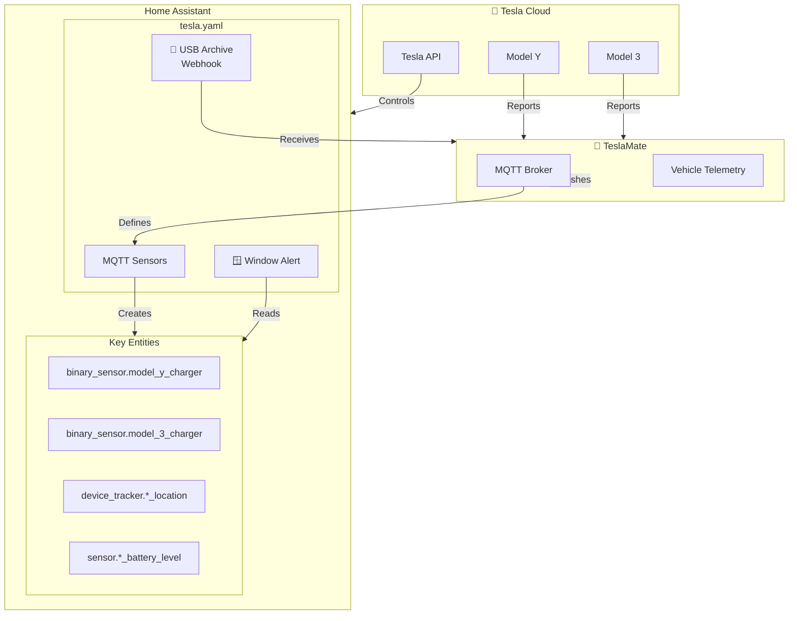
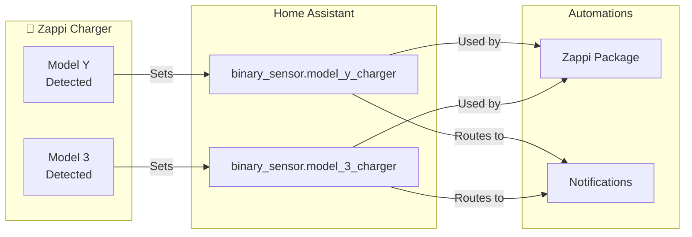
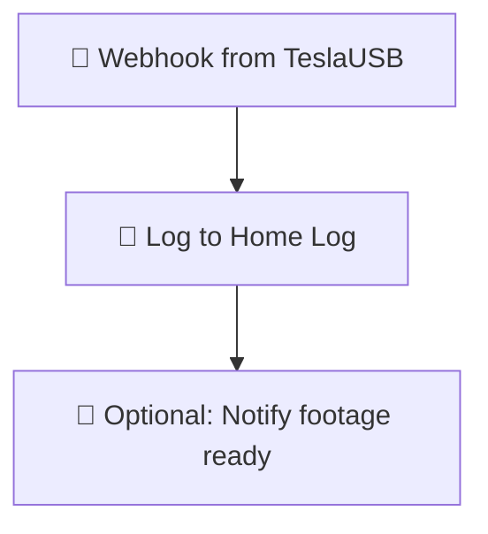
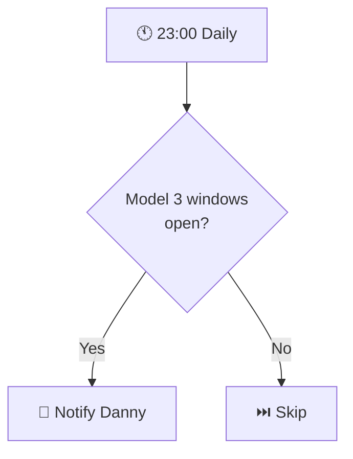
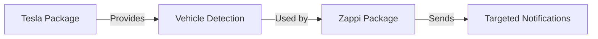

# Tesla

Integration with Tesla vehicles via TeslaMate MQTT and the Tesla custom integration.

**Integrations:**
- https://github.com/alandtse/tesla (Tesla API)
- https://github.com/teslamate-org/teslamate (TeslaMate MQTT)

---

## Overview

This package provides comprehensive Tesla vehicle monitoring and automation:
- **Multi-car support** — Model Y and Model 3 with automatic detection
- **TeslaMate MQTT** — Real-time data via MQTT (location, charge, climate, etc.)
- **Tesla API** — Control commands (charge start/stop, climate, etc.)
- **USB archive** — Sentry/dashcam footage backup via webhook
- **Smart notifications** — Alerts for windows open, charging status, etc.

### Key Capabilities

- Automatic vehicle detection at home charger
- Charge monitoring and notifications
- Climate pre-conditioning triggers
- Security alerts (windows, doors, sentry events)
- USB footage archival automation

---

## Architecture

---

## Vehicle Detection

The system distinguishes between vehicles using the Zappi charger's vehicle detection:

| Binary Sensor | Vehicle | Purpose |
|---------------|---------|---------|
| `binary_sensor.model_y_charger` | Model Y | Detection at home charger |
| `binary_sensor.model_3_charger` | Model 3 | Detection at home charger |

---

## Automations

### Tesla: USB Archive
**ID:** `1726077652711`

Receives Sentry/Dashcam footage from TeslaUSB via webhook.

**Trigger:** Webhook `teslausb` (POST)

**Logic:**

**TeslaUSB Setup:**
- TeslaUSB pushes footage to Home Assistant when car connects to home WiFi
- Webhook ID: `teslausb`
- Queued mode (max 10) to handle multiple events

---

### Tesla: Windows Open At Night
**ID:** `1750161174574`

Alerts if vehicle windows are left open after 23:00.

**Notification:**
- Title: "Car 🚗"
- Message: "Model 3 windows 🪟 are open."
- Recipient: `person.danny`

---

## MQTT Sensors (TeslaMate)

TeslaMate publishes detailed vehicle data via MQTT. This package defines sensors for:

### Car 1 (Model Y)

| Entity | MQTT Topic | Description |
|--------|------------|-------------|
| `sensor.tesla_display_name` | `teslamate/cars/1/display_name` | Vehicle name |
| `sensor.tesla_state` | `teslamate/cars/1/state` | Online/Asleep/etc |
| `sensor.tesla_since` | `teslamate/cars/1/since` | State timestamp |
| `sensor.tesla_version` | `teslamate/cars/1/version` | Firmware version |

### Common TeslaMate Sensors

| Category | Examples |
|----------|----------|
| **Location** | Latitude, longitude, geofence (home/work) |
| **Charge** | Battery level, charge limit, charging state, time to full |
| **Climate** | Inside temp, outside temp, climate state, seat heaters |
| **Drive** | Speed, odometer, shift state, power |
| **Security** | Locked, sentry mode, windows, doors, trunk |

---

## Tesla API Entities

From the Tesla custom integration:

| Entity | Type | Description |
|--------|------|-------------|
| `climate.model_y` | Climate | HVAC control |
| `lock.model_y` | Lock | Door locks |
| `switch.model_y_charger` | Switch | Charge port |
| `sensor.model_y_battery` | Sensor | Battery level |
| `device_tracker.model_y_location` | Tracker | GPS location |

---

## Key Automations Using Tesla Data

### Zappi Integration
The Zappi package uses Tesla detection for:
- Vehicle-specific notifications (Danny vs Terina)
- Target charge time setting (Model Y weekdays)
- Unknown vehicle detection

---

## Troubleshooting

| Issue | Check |
|-------|-------|
| MQTT sensors unavailable | TeslaMate container status, MQTT broker |
| Vehicle detection not working | Zappi vehicle detection sensors |
| USB webhook not firing | TeslaUSB configuration, webhook ID |
| API commands failing | Tesla integration token validity |
| Location stuck | TeslaMate GPS polling, car connectivity |

---

## Related Documentation

| Document | Purpose |
|----------|---------|
| [Zappi](../energy/zappi_README.md) | EV charging coordination |
| [Google Travel](google_travel_README.md) | Departure time estimation |
| [Octopus Energy](../energy/octopus_energy_README.md) | Rate-based charging decisions |

---

*Last updated: 2026-04-05*

*Source: [packages/integrations/transport/tesla.yaml](../../../../packages/integrations/transport/tesla.yaml)*
