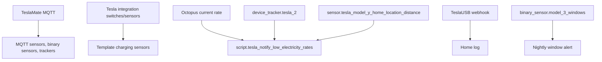
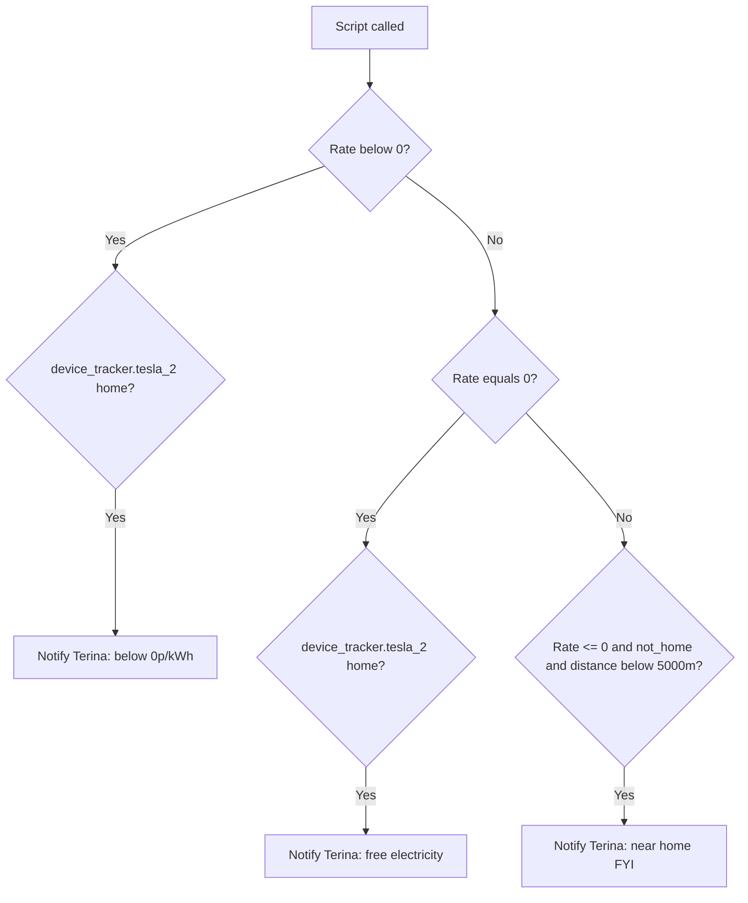

# Tesla Package Documentation

The Tesla package brings TeslaMate MQTT telemetry into Home Assistant and adds a few practical automations around vehicle security, TeslaUSB archive logging, and cheap-rate charging notifications.

Source YAML: `tesla.yaml`

| Contents | Count |
|----------|-------|
| Automations | 2 |
| Scripts | 1 |
| Template binary sensors | 2 |
| TeslaMate devices | 2 cars |

## Quick Summary

| Area | What Happens |
|------|--------------|
| TeslaUSB archive | A local webhook logs TeslaUSB archive messages to the home log. |
| Window alert | At 23:00, Danny is notified if Model 3 windows are open. |
| Cheap-rate charging | Terina is notified when free/negative electricity rates make it useful to plug in. |
| Telemetry | TeslaMate MQTT defines state, battery, charging, climate, security, TPMS, location, and active-route entities for Model Y and Model 3. |
| Charging helpers | Two template binary sensors infer charging/charger-allowed state from charger power and Tesla charger switches. |

## Architecture

## Automations

| Automation | ID | Trigger | Result |
|------------|----|---------|--------|
| `Tesla: USB Archive` | `1726077652711` | Local-only POST webhook `teslausb` | Logs `trigger.json.value2` to the home log with title `Tesla`. Queued mode, max 10. |
| `Tesla: Windows Open At Night` | `1750161174574` | 23:00 daily and `binary_sensor.model_3_windows` is `on` | Sends Danny a direct notification that Model 3 windows are open. |

## Script

### `script.tesla_notify_low_electricity_rates`

This script checks the current import rate and Terina's Tesla location state.

| Field | Required | Default | Purpose |
|-------|----------|---------|---------|
| `current_electricity_import_rate` | No | `sensor.octopus_energy_electricity_current_rate` | Import rate used for branch decisions. |

Power-user note: the notification text reports `sensor.model_y_battery`, while the location condition uses `device_tracker.tesla_2` and `sensor.tesla_model_y_home_location_distance`. If ownership or entity mapping changes, check these three entities together.

## TeslaMate MQTT Entities

The YAML defines two TeslaMate devices:

| Device Identifier | Model | MQTT Topic Prefix |
|-------------------|-------|-------------------|
| `teslamate_car_1` | Model Y | `teslamate/cars/1/` |
| `teslamate_car_2` | Model 3 | `teslamate/cars/2/` |

Each car has MQTT entities in these groups:

| Group | Examples |
|-------|----------|
| Vehicle info | Display name, state, since, version, update version, model, trim, colour, wheels, spoiler. |
| Location and movement | Geofence, shift state, power, speed, heading, elevation, GPS device tracker. |
| Temperature | Inside and outside temperature. |
| Battery and range | Odometer, estimated/rated/ideal range, battery level, usable battery level. |
| Charging | Energy added, charge limit, current, phases, power, voltage, scheduled start, time to full. |
| TPMS | Four tyre pressures in bar and psi. |
| Security/openings | Healthy, update available, locked, sentry mode, windows, doors, trunk, frunk, user present, plugged in, charge port, parking brake. |
| Active route | Route location, destination, energy at arrival, miles to arrival, minutes to arrival, traffic delay. |

Power-user note: car 2 entries intentionally have distinct `unique_id` values but many repeated `default_entity_id` values. Home Assistant may assign suffixed entity IDs after entity-registry conflict resolution.

## Template Binary Sensors

| Sensor | Trigger Inputs | State Template Summary |
|--------|----------------|------------------------|
| `Tesla Charging` for Model Y | `sensor.tesla_charger_power`, `switch.model_y_charger` | On if charger power is greater than 0 or the charger switch is `off`. |
| `Tesla Charging` for Model 3 | `sensor.tesla_charger_power_2`, `switch.model_3_charger` | On if charger power is greater than 0 or the charger switch is `off`. |

## Troubleshooting

| Issue | Check |
|-------|-------|
| TeslaMate entities unavailable | TeslaMate service, MQTT broker, and topics under `teslamate/cars/1/` and `teslamate/cars/2/`. |
| TeslaUSB archive not logged | Webhook ID `teslausb`, local-only networking, and payload field `value2`. |
| Night window alert missing | `binary_sensor.model_3_windows` state at exactly 23:00. |
| Low-rate notification missing | Script field/default rate, `device_tracker.tesla_2`, `sensor.tesla_model_y_home_location_distance`, and notification delivery to `person.terina`. |
| Active route sensors unavailable | TeslaMate active-route topic and whether `value_json.error` is present. |
| TPMS values stale | Tesla vehicles often update tyre pressures only after driving. |

## Related Documentation

| Document | Purpose |
|----------|---------|
| [Transport README](README.md) | Parent transport package overview. |
| [Google Travel](google_travel_README.md) | Traffic-aware travel calculations. |
| [Energy](../energy/README.md) | Octopus rate context. |

*Last updated: 2026-06-27*
