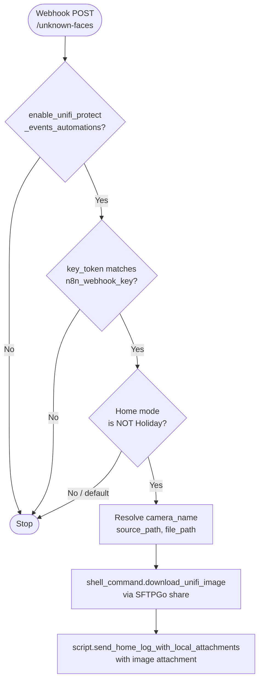

[<- Back to Integrations README](README.md) · [Packages README](../README.md) · [Main README](../../README.md)

# UniFi Protect — Camera Event Processing

*Last updated: 2026-04-05*

Processes camera detection events from UniFi Protect via local webhooks. Handles three detection categories: personal vehicles (logged), known faces (notified in Holiday mode), and unknown faces (image downloaded via SFTPGo then notified with attachment).

Integration reference: <https://www.home-assistant.io/integrations/unifiprotect/>

---

## Unknown Faces Detection Flow

---

## Automations

| Name | ID | Webhook ID | Conditions | Action |
|---|---|---|---|---|
| Unifi Protect: Personal Vehicles | `1757534420170` | `personal-vehicles` | `enable_unifi_protect_events_automations` on | Log trigger value and event ID |
| Unifi Protect: Known Faces | `1757533154370` | `known-faces` | `enable_unifi_protect_events_automations` on | Notify (Holiday mode only) with event ID, path, and local link |
| Unifi Protect: Unknown Faces | `1757533154371` | `unknown-faces` | `enable_unifi_protect_events_automations` on; `key_token` matches `input_text.n8n_webhook_key` | Download snapshot via SFTPGo shell command; send notification with local image attachment (non-Holiday mode) |

All webhooks are `local_only: true` and accept `POST` only. The unknown faces webhook additionally validates a shared key token against `input_text.n8n_webhook_key`.

---

## Unknown Faces — Variable Resolution

| Variable | Source |
|---|---|
| `camera_name` | `trigger.json.camera_name` |
| `source_path` | `trigger.json.file_path` + `/` + `trigger.json.file_name` |
| `file_path` | `input_text.camera_external_folder_path` + `/` + `camera_name` + `/` + `trigger.json.file_name` |

---

## Shell Commands

| Command | Description |
|---|---|
| `shell_command.download_unifi_image` | Downloads a camera snapshot from a SFTPGo share using `base_url`, `share_id`, `password`, `source_path`, and `destination_path` |

---

## Dependencies

- `input_boolean.enable_unifi_protect_events_automations` — master guard
- `input_text.n8n_webhook_key` — shared webhook secret for unknown faces
- `input_text.sftpgo_base_url`, `input_text.sftpgo_unifi_share_id`, `input_text.sftpgo_unifi_share_password` — SFTPGo connection details
- `input_text.camera_external_folder_path` — local destination root for downloaded images
- `input_select.home_mode` — used to gate known-face notifications to Holiday mode
- `script.send_direct_notification` — push notification for known faces
- `script.send_home_log_with_local_attachments` — notification with local image file attachment
- SFTPGo — file transfer service (see `sftpgo.yaml`)
