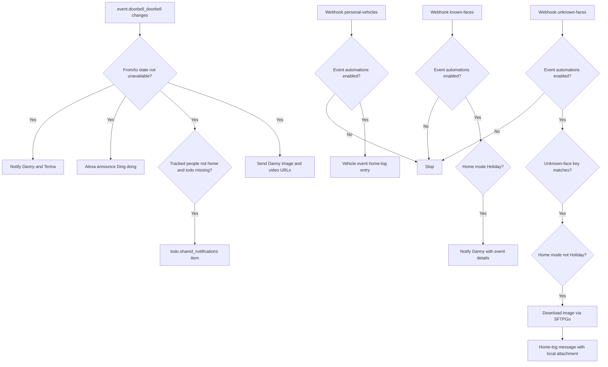
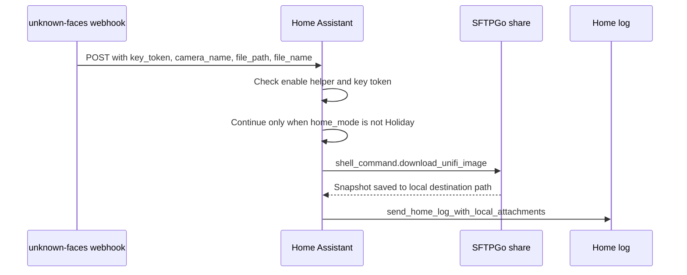

[<- Back to Integrations README](README.md) · [Packages README](../README.md) · [Main README](../../README.md)

# UniFi Protect Package Documentation

The UniFi Protect package handles front-door doorbell events and selected camera event webhooks. Doorbell presses notify the household, announce through Alexa, optionally create a shared reminder when nobody is home, and send Danny image/video links. Camera event webhooks log personal vehicles, handle known-face events in Holiday mode, and process unknown-face snapshots when the shared key matches.

Integration reference: <https://www.home-assistant.io/integrations/unifiprotect/>

| File | Purpose | Contents |
|------|---------|----------|
| `unifi_protect.yaml` | Doorbell and camera event processing | 4 automations |

## Quick Summary

| Area | What Happens |
|------|--------------|
| Doorbell | A doorbell event sends direct notifications to Danny and Terina, announces "Ding dong" on Alexa, and sends Danny image/video URLs from the doorbell camera. |
| Away reminder | If all tracked people are away and the reminder does not already exist, a todo item is added to `todo.shared_notifications`. |
| Personal vehicles | Local webhook events are logged to the home log when UniFi Protect event automations are enabled. |
| Known faces | Local webhook events are accepted when enabled; in Holiday mode they send Danny a direct notification containing event details. |
| Unknown faces | Local webhook events require the enable helper and a matching key token; when not in Holiday mode, an image is downloaded and sent to the home log with a local attachment. |

## Event Flow

## User Controls

| Entity | Plain-English Purpose |
|--------|-----------------------|
| `input_boolean.enable_unifi_protect_events_automations` | Master switch for the webhook-based camera event automations. It does not gate the doorbell automation. |
| `input_select.home_mode` | Gates known-face notifications to `Holiday` mode and unknown-face attachment handling to non-`Holiday` mode. |

## Entities And Helpers Used

| Entity | Purpose |
|--------|---------|
| `event.doorbell_doorbell` | Doorbell event source. |
| `camera.doorbell_high_resolution_channel` | Provides `entity_picture` and `video_url` attributes for doorbell media links. |
| `group.tracked_people` | Used to decide whether to create a delayed doorbell reminder. |
| `todo.shared_notifications` | Stores a doorbell reminder if nobody is home. |
| `input_text.external_url` | Prefix for doorbell image and video URLs. |
| `input_text.n8n_webhook_key` | Shared key used by the unknown-faces webhook. |
| `input_text.camera_external_folder_path` | Root destination path for downloaded unknown-face images. |
| `input_text.sftpgo_base_url` | SFTPGo base URL for snapshot download. |
| `input_text.sftpgo_unifi_share_id` | SFTPGo share ID. |
| `input_text.sftpgo_unifi_share_password` | SFTPGo share password. |

## Automations

| Automation | Trigger | Conditions | Result |
|------------|---------|------------|--------|
| `Unifi Protect: Doorbell Pressed` | `event.doorbell_doorbell` state changes | Previous and new states are not `unavailable` | Sends direct notifications, Alexa announcement, optional todo reminder, and image/video links to Danny. |
| `Unifi Protect: Personal Vehicles` | Local-only `POST` webhook `personal-vehicles` | Event automations enabled | Logs trigger value and event ID. |
| `Unifi Protect: Known Faces` | Local-only `POST` webhook `known-faces` | Event automations enabled | If home mode is `Holiday`, sends Danny event details. Otherwise does nothing. |
| `Unifi Protect: Unknown Faces` | Local-only `POST` webhook `unknown-faces` | Event automations enabled; `trigger.json.key_token` equals `input_text.n8n_webhook_key` | If home mode is not `Holiday`, downloads the image and sends a home-log message with the attachment. Otherwise does nothing. |

## Unknown Faces Details

| Variable | Source |
|----------|--------|
| `camera_name` | `trigger.json.camera_name`, defaulting to `unknown`. |
| `source_path` | `trigger.json.file_path + '/' + trigger.json.file_name`. |
| `file_path` | `input_text.camera_external_folder_path + '/' + camera_name + '/' + trigger.json.file_name`. |

## Power-User Notes

| Detail | Current YAML Behavior |
|--------|-----------------------|
| Webhook access | Webhook automations are `local_only: true` and accept `POST` only. |
| Unknown-face authentication | Only `unknown-faces` checks `trigger.json.key_token` against `input_text.n8n_webhook_key`. |
| Known-face message text | The current message text starts with "Unknown person" even though it is in the known-faces automation. |
| Unknown-face holiday handling | Unknown-face attachment handling runs when home mode is not `Holiday`; `Holiday` falls through to the default no-op branch. |
| Cleanup | The YAML has a TODO for deleting the image from SFTPGo after download; no delete action is currently active. |

## Troubleshooting

| Symptom | Check |
|---------|-------|
| Doorbell event ignored | Confirm the event did not transition from or to `unavailable`; those transitions are filtered out. |
| Camera webhooks do nothing | Confirm `input_boolean.enable_unifi_protect_events_automations` is `on`. |
| Unknown-face webhook ignored | Confirm the posted `key_token` exactly matches `input_text.n8n_webhook_key`. |
| Unknown-face image missing | Check `shell_command.download_unifi_image`, the SFTPGo helper values, and the resolved destination path in the automation trace. |
| No todo created for doorbell | The todo is only added when `group.tracked_people` is `not_home` and the same summary is not already in `todo.shared_notifications`. |
