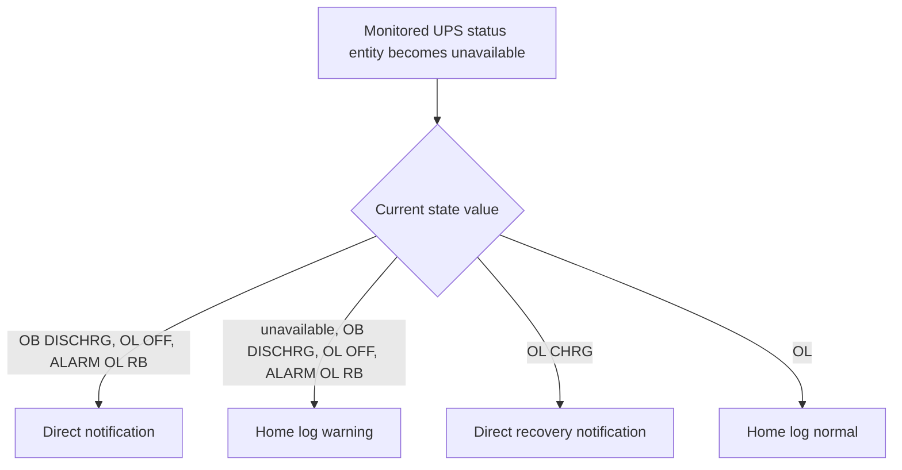

[<- Back to Integrations README](README.md) · [Packages README](../README.md) · [Main README](../../README.md)

# UPS Monitoring

This package monitors UPS status sensors, sends alerts when important UPS states are seen, warns when key UPS batteries are below 5 minutes of runtime while discharging, and creates calculated wattage sensors for UPS loads.

Home Assistant reference: <https://www.home-assistant.io/integrations/nut/>

## Quick Summary

| Area | What Happens |
|------|--------------|
| Status monitoring | One automation watches five UPS status entities for `unavailable` state changes and then branches based on the current status value. |
| Low runtime alerts | Three automations notify Danny and Terina when selected UPS runtime sensors fall below 301 seconds while on battery. |
| Power sensors | Six template sensors estimate UPS output power in watts. |
| Notifications | Critical and low-runtime paths use direct notifications; warning and normal paths log to the home log. |

## Package Contents

| File | Purpose | Contents |
|------|---------|----------|
| `ups.yaml` | UPS alerting and calculated power sensors | 4 automations, 6 template sensors |

## Status Flow

## Automations

| Automation | ID | Trigger | Condition | Result |
|------------|----|---------|-----------|--------|
| `UPS: Status Change` | `1591963855737` | Any monitored status entity changes to `unavailable` | None | Branches by current UPS status value and sends a direct notification or home-log entry. |
| `Living Room: UPS Below 5 Minutes Run time` | `1590564595890` | `sensor.lounge_ups_battery_runtime` below `301` | `sensor.lounge_ups_status_data` is `OB DISCHRG` | Direct notification to Danny and Terina. |
| `Office: Server UPS On Battery With Less Than 5 Minutes` | `1591705795121` | `sensor.server_ups_battery_runtime` below `301` | `sensor.server_ups_status_data` is `OB DISCHRG` | Direct notification to Danny and Terina. |
| `Office: Computer UPS On Battery With Less Than 5 Minutes` | `1613246359438` | `sensor.computer_ups_battery_runtime` below `301` | `sensor.computer_ups_status_data` is `OB DISCHRG` | Direct notification to Danny and Terina. |

## Monitored Status Entities

| UPS | Status Entity |
|-----|---------------|
| Living Room | `sensor.lounge_ups_status_data` |
| Computer | `sensor.computer_ups_status` |
| Server | `sensor.server_ups_status_data` |
| 3D Printer | `sensor.threedprinterups_status_data` |
| Family Computer | `sensor.familycomputerups_status_data` |

## Template Sensors

All six sensors use `device_class: power`, `unit_of_measurement: W`, and `state_class: measurement`. They return `0` unless the configured status check is `OL` or `OL CHRG`.

| Sensor | Status Check | Load Entity | Nominal Power Source |
|--------|--------------|-------------|----------------------|
| `sensor.3d_printer_ups_power` | `sensor.threedprinterups_status` | `sensor.threedprinterups_load` | Hard-coded `405` W. |
| `sensor.family_computer_ups_power` | `sensor.familycomputerups_status_data` | `sensor.familycomputerups_load` | `sensor.familycomputerups_nominal_real_power`. |
| `sensor.kitchen_ups_power` | `sensor.kitchen_ups_status_data` | `sensor.kitchen_ups_load` | `sensor.kitchen_ups_nominal_real_power`. |
| `sensor.living_room_ups_power` | `sensor.lounge_ups_status_data` | `sensor.lounge_ups_load` | `sensor.lounge_ups_nominal_real_power`. |
| `sensor.office_ups_power` | `sensor.computer_ups_status_data` | `sensor.computer_ups_load` | `sensor.computer_ups_nominal_real_power`. |
| `sensor.server_ups_power` | `sensor.server_ups_status_data` | `sensor.server_ups_load` | `sensor.server_ups_nominal_real_power`. |

## Power-User Notes

The status-change automation only triggers when a monitored entity changes to `unavailable`, but its `choose` block checks several possible status values. There are also entity-name inconsistencies in the YAML: the monitored computer status entity is `sensor.computer_ups_status`, while message templates and the Office power sensor refer to `sensor.computer_ups_status_data`.

## Troubleshooting

| Symptom | Check |
|---------|-------|
| Expected UPS status alert did not fire | Confirm the watched entity changed to `unavailable`; other status changes do not trigger this automation. |
| Computer UPS status title looks wrong | Check the `sensor.computer_ups_status` vs `sensor.computer_ups_status_data` naming mismatch. |
| Message shows literal/unknown status | The YAML uses `states('trigger.entity_id')` in message text instead of `states(trigger.entity_id)`. |
| Power sensor is `0 W` while UPS has load | Confirm the status entity used by that specific template is `OL` or `OL CHRG`. |
