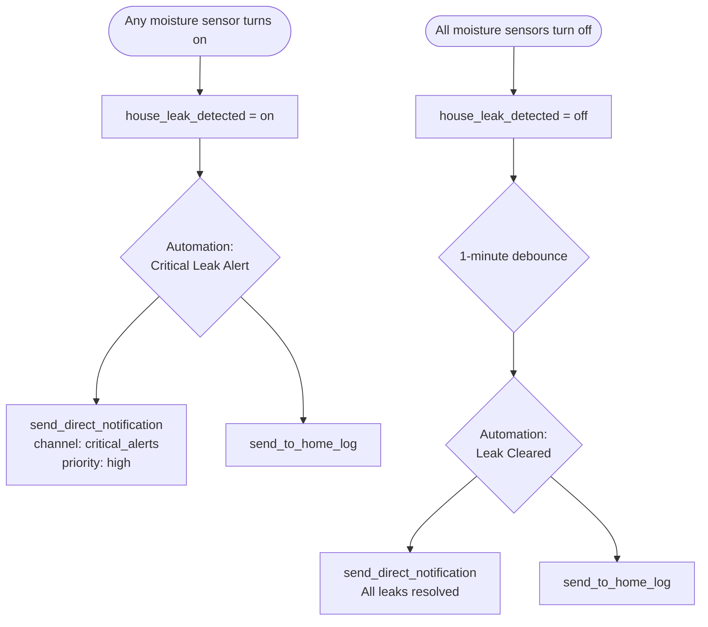

[<- Back to Integrations README](README.md) · [Packages README](../README.md) · [Main README](../../README.md)

# Water Leak Detection

*Last updated: 2026-04-05*

Monitors all moisture sensors across the house and issues critical alerts when a leak is detected. A template binary sensor aggregates every moisture-class entity so automations only need a single trigger point.

## Entities

| Entity | Type | Description |
|--------|------|-------------|
| `binary_sensor.house_leak_detected` | Template binary sensor | `on` when any moisture sensor is active; `locations` attribute lists the friendly names of all currently triggered sensors |

## Automations

| Automation | Trigger | Description |
|------------|---------|-------------|
| Water: Critical Leak Alert | `binary_sensor.house_leak_detected` → `on` | Sends a high-priority critical notification (bypasses Do Not Disturb) listing all leak locations, and logs to the home log |
| Water: Leak Cleared | `binary_sensor.house_leak_detected` → `off` for 1 minute | Sends a notification and home-log entry confirming all leaks are resolved |

## Alert / Clear Flow

## Notes

- The `binary_sensor.house_leak_detected` template iterates over **all** entities whose `device_class` is `moisture`, so adding a new moisture sensor is automatically picked up without changing the automation.
- The `locations` attribute on the binary sensor lists the `friendly_name` of every sensor that is currently `on`, which is included verbatim in the alert notification.
- The 1-minute `for:` delay on the Leak Cleared automation prevents a false "all clear" from a briefly bouncing sensor.
