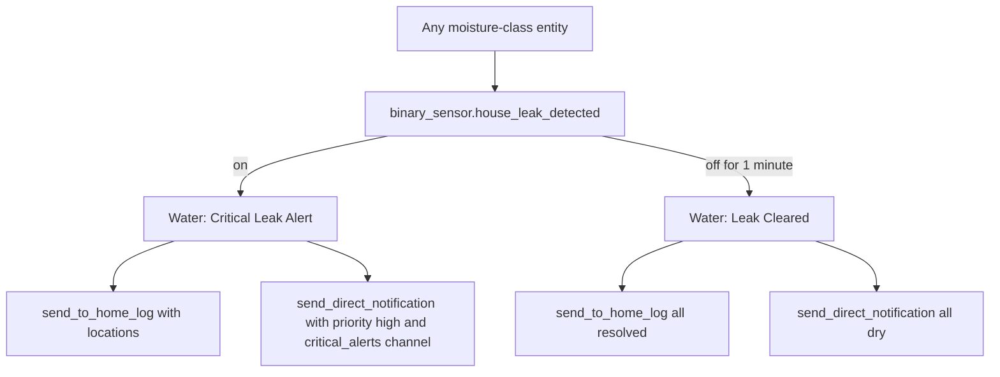

[<- Back to Integrations README](README.md) · [Packages README](../README.md) · [Main README](../../README.md)

# Water Leak Detection Package Documentation

The water package turns every Home Assistant moisture-class entity into one whole-house leak signal. If any moisture sensor reports wet, the package logs the affected locations and sends a high-priority direct notification. When all moisture sensors have been dry for a minute, it sends an all-clear notification and log entry.

| File | Purpose | Contents |
|------|---------|----------|
| `water.yaml` | Whole-house leak aggregation and alerts | 1 template binary sensor, 2 automations |

## Quick Summary

| Area | What Happens |
|------|--------------|
| Leak aggregation | `binary_sensor.house_leak_detected` turns `on` when any entity with `device_class: moisture` is `on`. |
| Location list | The sensor's `locations` attribute lists the friendly names of all active moisture sensors. |
| Leak alert | A leak logs to the home log and sends a high-priority notification using `critical_alerts`. |
| Leak cleared | Once the aggregate sensor stays `off` for 1 minute, the package logs and sends a resolved notification. |

## Leak Flow



## Entities

| Entity | Type | Purpose |
|--------|------|---------|
| `binary_sensor.house_leak_detected` | Template binary sensor | Whole-house leak sensor. It is `on` when any moisture-class entity is `on`. |

### `locations` Attribute

The template builds `locations` by iterating over all states with `attributes.device_class == 'moisture'` and collecting the friendly names for those currently `on`.

Example output shape:

```text
['Kitchen Leak Sensor', 'Utility Room Leak Sensor']
```

## Automations

| Automation | Trigger | Result |
|------------|---------|--------|
| `Water: Critical Leak Alert` | `binary_sensor.house_leak_detected` changes to `on` | Logs `Water leak detected at: ...` and sends `🚨 WATER LEAK DETECTED!` with `ttl: 0`, `priority: high`, `channel: critical_alerts`, and `importance: max`. |
| `Water: Leak Cleared` | `binary_sensor.house_leak_detected` changes to `off` for 1 minute | Logs that all leaks are resolved and sends `✅ Water Leak Resolved`. |

## Power-User Notes

| Detail | Current YAML Behavior |
|--------|-----------------------|
| Sensor discovery | New moisture-class sensors are picked up automatically without editing this package. |
| Alert recipients | The package calls `script.send_direct_notification` without specifying a `people` block; recipient behavior depends on that shared script's defaults. |
| Actions | Logging and notification actions run in parallel for both alert and clear paths. |
| Clear debounce | The all-clear waits 1 minute to avoid a false resolution from a briefly bouncing sensor. |
| Mode | Both automations use `mode: single`. |

## Troubleshooting

| Symptom | Check |
|---------|-------|
| Leak sensor is wet but aggregate sensor is off | Confirm the source entity has `device_class: moisture` and state `on`. |
| Alert does not list a location | Check the source sensor's `friendly_name`; the template uses friendly names for `locations`. |
| No critical notification arrives | Check `script.send_direct_notification` and the receiving app's handling of `critical_alerts`, `priority: high`, and `importance: max`. |
| All-clear did not send | Confirm `binary_sensor.house_leak_detected` stayed `off` continuously for 1 minute. |
