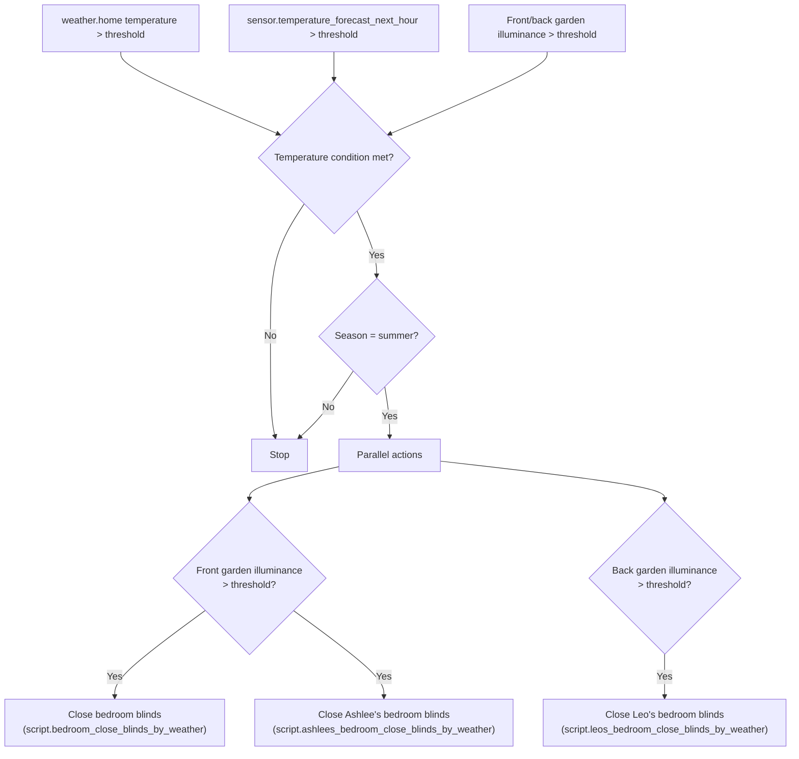
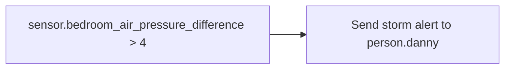
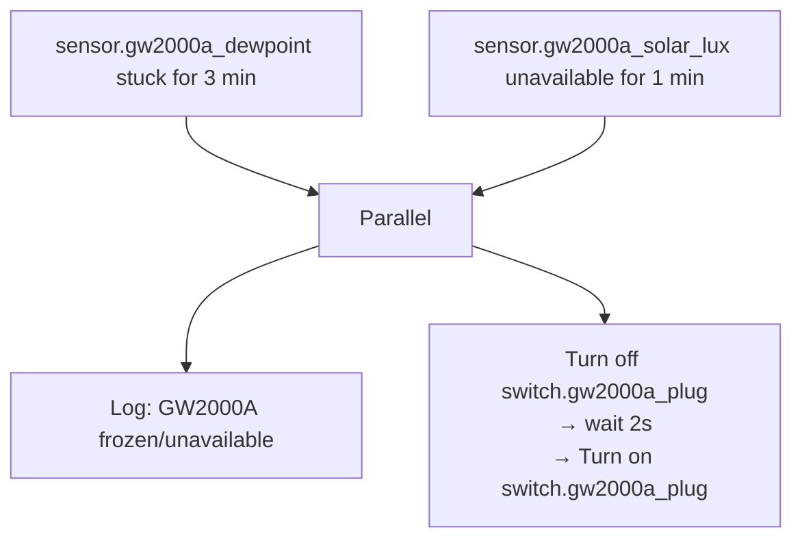

[<- Back to Integrations README](../README.md) · [Packages README](../../README.md) · [Main README](../../../README.md)

# Weather

Weather integrations covering forecast-based automations, UK carbon intensity monitoring, and the Ecowitt GW2000A local weather station.

## Files

| File | Purpose |
|------|---------|
| `weather.yaml` | Forecast automations and weather warning REST sensor |
| `carbon_intensity_uk.yaml` | UK carbon intensity and generation mix sensors |
| `ecowitt.yaml` | GW2000A weather station availability watchdog |

---

## weather.yaml

Sources: [OpenWeatherMap](https://www.home-assistant.io/integrations/openweathermap/) and [Met Office](https://www.home-assistant.io/integrations/metoffice/)

### REST Sensor

| Entity | Attribute | Description |
|--------|-----------|-------------|
| `sensor.weather_warning` | — | `true` when a warning is active |
| | `title` | Warning headline |
| | `content` | Warning body text |
| | `url` | Warning detail URL |
| | `image_url` | Associated image |

Polled every 60 seconds via a basic-auth GET request to an N8N webhook (`weather_warning_n8n_url`).

### Automations

#### Weather: Forecast To Be Hot
**ID:** `1622374233311`

Closes bedroom blinds when both temperature and garden illuminance exceed their respective thresholds during summer.

**Triggers:**
- `weather.home` temperature attribute rises above `input_number.forecast_high_temperature`
- `sensor.temperature_forecast_next_hour` rises above `input_number.forecast_high_temperature`
- `sensor.front_garden_motion_illuminance` or `sensor.back_garden_motion_illuminance` rises above `input_number.close_blinds_brightness_threshold`

**Conditions:**
- Temperature threshold exceeded (either `weather.home` or next-hour forecast)
- `sensor.season` is `summer`

**Actions (parallel):**
- If front garden illuminance is above threshold → close main bedroom and Ashlee's bedroom blinds via weather scripts
- If back garden illuminance is above threshold → close Leo's bedroom blinds via weather script

**Mode:** single

---

#### Weather: Warning Notification
**ID:** `1645568214221`

Sends a push notification to Danny and Terina when `sensor.weather_warning` becomes `true`.

**Trigger:** `sensor.weather_warning` changes to `"true"`

**Action:** Calls `script.send_direct_notification_with_url` with the warning title, content link, and URL drawn from sensor attributes.

**Mode:** single

---

#### Weather: Storm Warning
**ID:** `1734968573793`

Alerts Danny when an incoming storm is detected via air pressure change.

**Trigger:** `sensor.bedroom_air_pressure_difference` rises above `4`

**Action:** Calls `script.send_direct_notification` with a storm alert message.

**Mode:** single

---

## carbon_intensity_uk.yaml

REST sensor polling `api.carbonintensity.org.uk` every 10 minutes using a postcode stored in `input_text.carbon_intensity_postcode`.

### Sensors

| Entity | Unit | Icon | Description |
|--------|------|------|-------------|
| `sensor.carbon_intensity_uk` | g/kWh | mdi:molecule-co2 | Overall forecast CO2 intensity |
| `sensor.carbon_intensity_genmix_coal` | % | mdi:molecule-co2 | Coal share of generation mix |
| `sensor.carbon_intensity_genmix_imports` | % | mdi:transmission-tower-import | Imports share |
| `sensor.carbon_intensity_genmix_gas` | % | mdi:fire-circle | Gas share |
| `sensor.carbon_intensity_genmix_nuclear` | % | mdi:atom | Nuclear share |
| `sensor.carbon_intensity_genmix_other` | % | mdi:molecule-co2 | Other sources share |
| `sensor.carbon_intensity_genmix_hydro` | % | mdi:hydro-power | Hydro share |
| `sensor.carbon_intensity_genmix_solar` | % | mdi:solar-panel-large | Solar share |
| `sensor.carbon_intensity_genmix_wind` | % | mdi:wind-turbine | Wind share |

All sensors report as unavailable when the API response is undefined.

Reference: [PhillyGilly/Carbon-Intensity-UK-HA](https://github.com/PhillyGilly/Carbon-Intensity-UK-HA)

---

## ecowitt.yaml

Integration: [Ecowitt](https://www.home-assistant.io/integrations/ecowitt/)

### Automation

#### Ecowitt: Offline
**ID:** `1713094180264`

Reboots the GW2000A weather station's smart plug when sensors stop reporting.

**Triggers:**
- `sensor.gw2000a_dewpoint` enters any state for 3+ minutes (frozen/stuck state)
- `sensor.gw2000a_solar_lux` becomes `unavailable` for 1+ minute

**Conditions:** None

**Actions (parallel):**
- Logs a debug message via `script.send_to_home_log`
- Turns off `switch.gw2000a_plug`, waits 2 seconds, then turns it back on

**Mode:** single

---

*Last updated: 2026-04-05*
