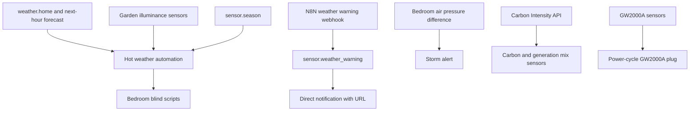
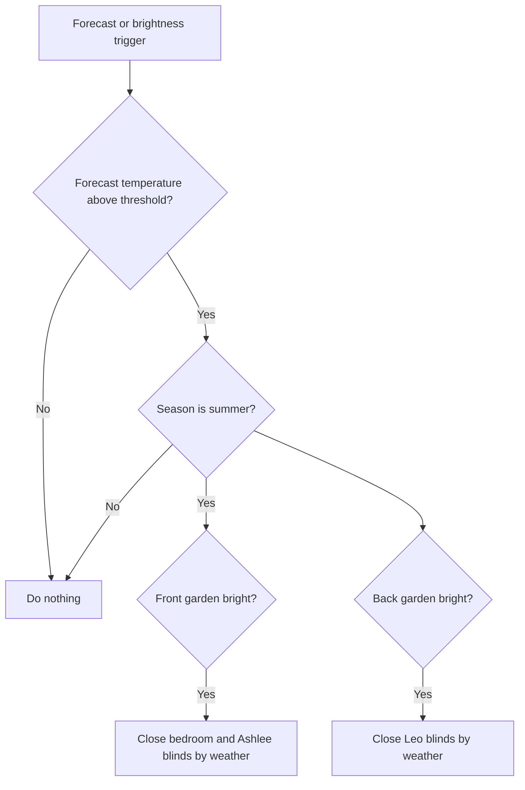

[<- Back to Integrations README](../README.md) · [Packages README](../../README.md) · [Main README](../../../README.md)

# Weather Package Documentation

The weather packages help the house react to hot days, weather warnings, storm pressure changes, carbon intensity data, and the local Ecowitt weather station. The main everyday effects are closing bedroom blinds during hot bright summer weather, notifying about weather warnings, checking hot-water state on weekday hot days, and rebooting the Ecowitt gateway if it stops reporting.

This documentation covers all YAML files in this folder:

| File | Purpose | Contents |
|------|---------|----------|
| `weather.yaml` | Forecast and warning behavior | 5 automations, 1 REST sensor |
| `carbon_intensity_uk.yaml` | UK carbon intensity data | 9 REST sensors |
| `ecowitt.yaml` | Local weather station watchdog | 1 automation |

## Quick Summary

| Area | What Happens |
|------|--------------|
| Hot weather | In summer, high forecast temperature plus bright garden light closes bedroom blinds. |
| Weather warnings | N8N weather-warning data is polled every minute and sends a linked notification when active. |
| Storm warning | A sharp bedroom air-pressure rise sends Danny a storm alert. |
| Weekday hot-day checks | At 09:00 hot water is turned off; at 14:00 hot-water schedule logic is rechecked if enabled. |
| Carbon intensity | National Grid regional carbon intensity and generation mix are exposed as sensors. |
| Ecowitt reliability | The GW2000A plug is power-cycled if key sensors freeze or become unavailable. |

## How It Fits Together

## `weather.yaml`

Sources: OpenWeatherMap, Met Office, and an N8N webhook for weather warnings.

### Automations

| Automation | Trigger | Result |
|------------|---------|--------|
| `Weather: Forecast To Be Hot` | `weather.home` temperature, `sensor.temperature_forecast_next_hour`, or garden illuminance crosses thresholds | If it is summer and the temperature threshold is met, closes front-facing bedroom blinds when the front garden is bright and Leo's blinds when the back garden is bright. |
| `Weather: Warning Notification` | `sensor.weather_warning` becomes `true` | Sends Danny and Terina a notification using warning title and link attributes. |
| `Weather: Storm Warning` | `sensor.bedroom_air_pressure_difference` rises above `4` | Sends Danny a storm alert. |
| `Weather: Morning Check For Hot Day Forecast` | 09:00 on weekdays, unless home mode is `Holiday` | Logs the check and calls `script.set_hot_water_to_off`. |
| `Weather: Afternoon Check For Hot Day Forecast` | 14:00 on weekdays, unless home mode is `Holiday` and hot-water automations are enabled | Logs the check and calls `script.check_and_run_hot_water`. |

### Hot Weather Blind Logic

### Weather Warning REST Sensor

| Entity | Source | Notes |
|--------|--------|-------|
| `sensor.weather_warning` | `!secret weather_warning_n8n_url` | Basic-auth GET every 60 seconds. State is `value_json.isWarning`. |

Attributes copied from the webhook response: `title`, `content`, `url`, `image_url`.

Power-user note: the notification action currently reads the `link` attribute for message and URL, while the REST sensor stores `url`. If warning notifications do not include a working link, check the webhook payload and this attribute mismatch first.

## `carbon_intensity_uk.yaml`

This package calls `https://api.carbonintensity.org.uk/regional/postcode/...` every 10 minutes using `input_text.carbon_intensity_postcode`.

| Entity | Unit | Meaning |
|--------|------|---------|
| `sensor.carbon_intensity_uk` | g/kWh | Regional forecast carbon intensity. |
| `sensor.carbon_intensity_genmix_coal` | % | Coal share. |
| `sensor.carbon_intensity_genmix_imports` | % | Imported electricity share. |
| `sensor.carbon_intensity_genmix_gas` | % | Gas share. |
| `sensor.carbon_intensity_genmix_nuclear` | % | Nuclear share. |
| `sensor.carbon_intensity_genmix_other` | % | Other generation share. |
| `sensor.carbon_intensity_genmix_hydro` | % | Hydro share. |
| `sensor.carbon_intensity_genmix_solar` | % | Solar share. |
| `sensor.carbon_intensity_genmix_wind` | % | Wind share. |

## `ecowitt.yaml`

The Ecowitt watchdog reboots the GW2000A smart plug when data looks stale.

| Trigger | Result |
|---------|--------|
| `sensor.gw2000a_dewpoint` remains unchanged for 3 minutes | Log debug message and reboot `switch.gw2000a_plug`. |
| `sensor.gw2000a_solar_lux` is `unavailable` for 1 minute | Log debug message and reboot `switch.gw2000a_plug`. |

The reboot sequence turns the plug off, waits 30 seconds, then turns it back on.

## Troubleshooting

| Issue | Check |
|-------|-------|
| Blinds do not close on a hot day | `sensor.season`, forecast threshold, garden illuminance threshold, and the room blind scripts. |
| Weather-warning notification has no link | `sensor.weather_warning` attributes, especially `url` versus `link`. |
| Storm alerts are noisy | `sensor.bedroom_air_pressure_difference` history and threshold of `4`. |
| Ecowitt keeps rebooting | Whether `sensor.gw2000a_dewpoint` is genuinely frozen or just updates less often than 3 minutes. |
| Carbon sensors unavailable | `input_text.carbon_intensity_postcode` and API response shape. |

## Related Documentation

| Document | Purpose |
|----------|---------|
| [Rooms README](../../rooms/README.md) | Room blind scripts used by hot-weather automation. |
| [HVAC README](../hvac/README.md) | Hot-water scripts called by weekday weather checks. |

*Last updated: 2026-06-27*
