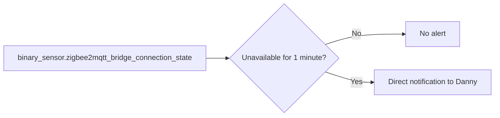

[<- Back to Integrations README](README.md) · [Packages README](../README.md) · [Main README](../../README.md)

# Zigbee Coordinator Monitoring

This package sends Danny a direct notification if the Zigbee2MQTT bridge connection sensor is unavailable for 1 minute. It is a small early-warning check for coordinator or Zigbee2MQTT bridge problems.

## Quick Summary

| Area | What Happens |
|------|--------------|
| Monitored entity | `binary_sensor.zigbee2mqtt_bridge_connection_state`. |
| Delay | Requires `unavailable` for 1 minute to avoid very brief restart noise. |
| Notification | Sends a direct notification to `person.danny`. |

## Package Contents

| File | Purpose | Contents |
|------|---------|----------|
| `zigbee.yaml` | Zigbee2MQTT bridge availability alert | 1 automation |

## Flow

## Automation

| Automation | ID | Trigger | Mode | Result |
|------------|----|---------|------|--------|
| `Zigbee Coordinator Unavailable` | `1741294780206` | `binary_sensor.zigbee2mqtt_bridge_connection_state` to `unavailable` for 1 minute | `single` | Sends `Zigbee coordinator became unavailable.` to Danny. |

## Dependencies

| Dependency | Purpose |
|------------|---------|
| Zigbee2MQTT bridge connection sensor | Provides the monitored availability state. |
| `script.send_direct_notification` | Sends the alert. |
| `person.danny` | Notification recipient. |

## Troubleshooting

| Symptom | Check |
|---------|-------|
| No alert during a restart | The bridge must remain `unavailable` for 1 full minute. |
| Alert fires repeatedly | Check Zigbee2MQTT, MQTT broker connectivity, and the coordinator host. |
| Notification does not arrive | Check `script.send_direct_notification` and Danny's notification target. |
