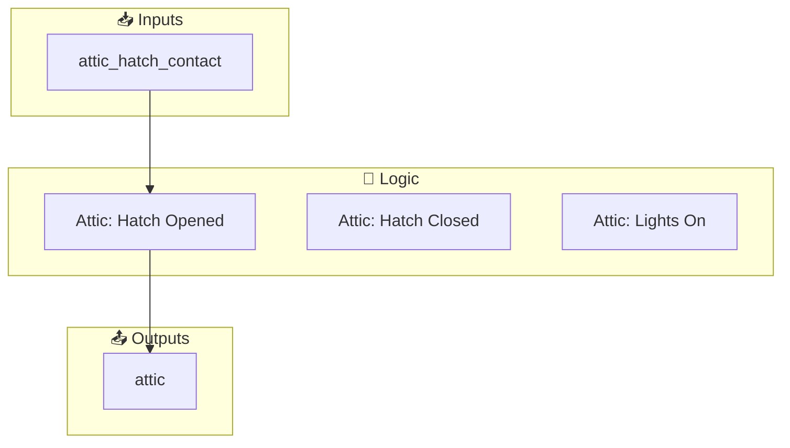
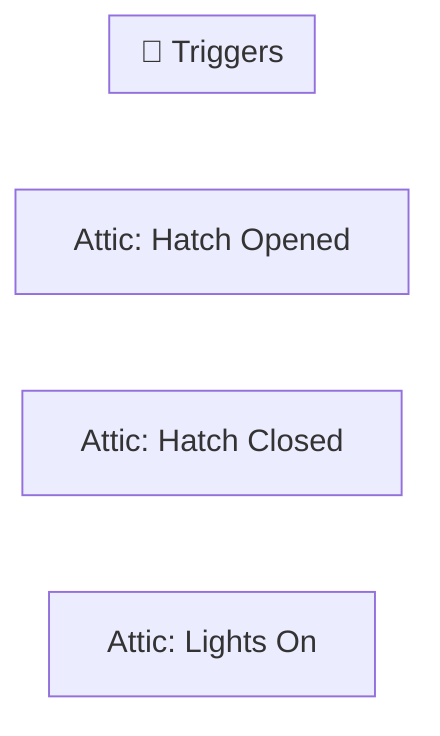

[<- Back to Rooms README](../README.md) · [Packages README](../../README.md) · [Main README](../../../README.md)

# Attic

This package manages 3 automations and 0 scripts for attic.

---

## Table of Contents

- [Overview](#overview)
- [Purpose](#purpose)
- [How It Works](#how-it-works)
- [Automations](#automations)
- [Entities](#entities)
- [Troubleshooting](#troubleshooting)
- [Related Files](#related-files)
- [Notes](#notes)

---

## Overview

This package provides automation for **attic**. It includes 3 automations and 0 scripts.

### File Structure

```
packages/rooms/
├── attic.yaml  # Main package configuration
└── README.md                           # This documentation
```

---

## Purpose

- **Attic: Hatch Opened**: 
- **Attic: Hatch Closed**: 
- **Attic: Lights On**: 

### Package Architecture

The following diagram shows the high-level flow of this package:



---

## How It Works

This section explains the overall behavior and logic of the package.

### Automation Logic

**Attic: Hatch Opened**
Triggered when: When `Attic Hatch Contact` changes from 'off' to 'on'

**Attic: Hatch Closed**
Triggered when: When `Attic Hatch Contact` changes from 'on' to 'off'

**Attic: Lights On**
Triggered when: When `Attic` changes to 'on'

### Workflow Diagram

The following diagram illustrates the automation flow:



---

## Automations

Detailed documentation for each automation in this package.

### Attic: Hatch Opened

**Automation ID:** `1676493888411`

#### Trigger

- When `Attic Hatch Contact` changes from 'off' to 'on'

#### Actions

1. Execute actions in parallel

### Attic: Hatch Closed

**Automation ID:** `1676493961946`

#### Trigger

- When `Attic Hatch Contact` changes from 'on' to 'off'

#### Actions

1. Execute actions in parallel

### Attic: Lights On

**Automation ID:** `1664827040573`

#### Trigger

- When `Attic` changes to 'on'

#### Actions

- *See YAML for action details*

---

## Entities

Key entities used or created by this package.

### Referenced Entities

- `binary_sensor.attic_hatch_contact`
- `light.attic`
- `person.danny`
- `person.terina`

---

## Troubleshooting

Common issues and how to resolve them.

### Automation Issues

| Issue | Possible Cause | Resolution |
|-------|---------------|------------|
| Automation not triggering | Entity unavailable or condition not met | Check entity states in Developer Tools |
| Automation fires unexpectedly | Trigger too broad or condition missing | Review trigger entity and add conditions |
| Actions not executing | Service call invalid or entity offline | Verify service and entity in YAML |

### General Debugging

1. Check Home Assistant logs for errors
2. Verify all referenced entities exist in Developer Tools
3. Test automations manually using the 'Run' button
4. Review traces for executed automations to see execution path

---

## Related Files

| File | Description |
|------|-------------|
| [`packages/rooms/attic.yaml`](./attic.yaml) | Main package YAML configuration |
| [Rooms Overview](../README.md) | Overview of all room packages |
| [Main Packages README](../../README.md) | Architecture and organization guidelines |

---

## Notes

### Design Decisions

- **Attic: Hatch Opened** triggers on state transitions (edge detection) rather than continuous state
- **Attic: Hatch Closed** triggers on state transitions (edge detection) rather than continuous state

---

*Last updated: 2026-04-10*
