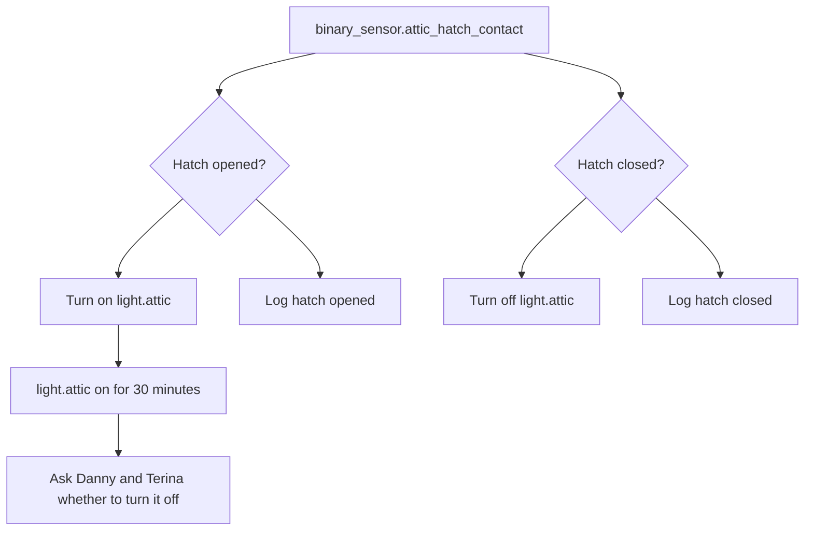

[<- Back to Rooms README](README.md) · [Packages README](../README.md) · [Main README](../../README.md)

# Attic Package Documentation

The attic package keeps the attic light tied to the hatch. Opening the hatch turns the light on, closing it turns the light off, and a reminder is sent if the light stays on for 30 minutes.

## Quick Summary

For non-technical users, the important behavior is:

| Area | What Happens |
|------|--------------|
| Hatch lighting | Opening `binary_sensor.attic_hatch_contact` turns on `light.attic`; closing it turns the light off. |
| Safety reminder | If `light.attic` remains on for 30 minutes, Danny and Terina get an actionable notification asking whether to turn it off. |
| Logging | Hatch open and close events are logged to the home log at Debug level. |

## Package Contents

| File | Purpose | Contents |
|------|---------|----------|
| `attic.yaml` | Hatch-based attic lighting | 3 automations |

## How The Attic Decides What To Do

## User Controls

There are no package-specific helper toggles, timers, or thresholds. The package reacts directly to the hatch contact sensor and the attic light state.

## Everyday Behavior

### Hatch Lighting

| Automation | Trigger | Result |
|------------|---------|--------|
| `Attic: Hatch Opened` | `binary_sensor.attic_hatch_contact` changes from `off` to `on` | Logs the event and turns on `light.attic`. |
| `Attic: Hatch Closed` | `binary_sensor.attic_hatch_contact` changes from `on` to `off` | Logs the event and turns off `light.attic`. |

### Long-On Reminder

If `light.attic` has been on for 30 minutes, `Attic: Lights On` sends `script.send_actionable_notification_with_2_buttons` to Danny and Terina.

| Button | Action Name | Meaning |
|--------|-------------|---------|
| Yes | `switch_off_attic_lights` | Turn the attic lights off via the shared notification action handler. |
| No | `ignore` | Leave the lights on. |

## Power-User Details

| Automation | ID | Mode | Notes |
|------------|----|------|-------|
| `Attic: Hatch Opened` | `1676493888411` | `single` | Runs logging and light-on action in parallel. |
| `Attic: Hatch Closed` | `1676493961946` | `single` | Runs logging and light-off action in parallel. |
| `Attic: Lights On` | `1664827040573` | `single` | Notification only; the actual button handling is outside this package. |

## Entity Reference

| Entity | Purpose |
|--------|---------|
| `binary_sensor.attic_hatch_contact` | Attic hatch open/closed state. |
| `light.attic` | Attic light controlled by hatch automations. |
| `person.danny` | Notification recipient for the 30-minute reminder. |
| `person.terina` | Notification recipient for the 30-minute reminder. |
| `script.send_to_home_log` | Shared logging script. |
| `script.send_actionable_notification_with_2_buttons` | Shared actionable notification script. |

## Troubleshooting

| Issue | Check |
|-------|-------|
| Light does not turn on when the hatch opens | Check `binary_sensor.attic_hatch_contact` changes to `on` when opened. |
| Light does not turn off when the hatch closes | Check the hatch sensor changes back to `off` and `light.attic` is available. |
| 30-minute reminder does not arrive | Check `light.attic` stayed continuously `on` for 30 minutes and the shared notification script is available. |
