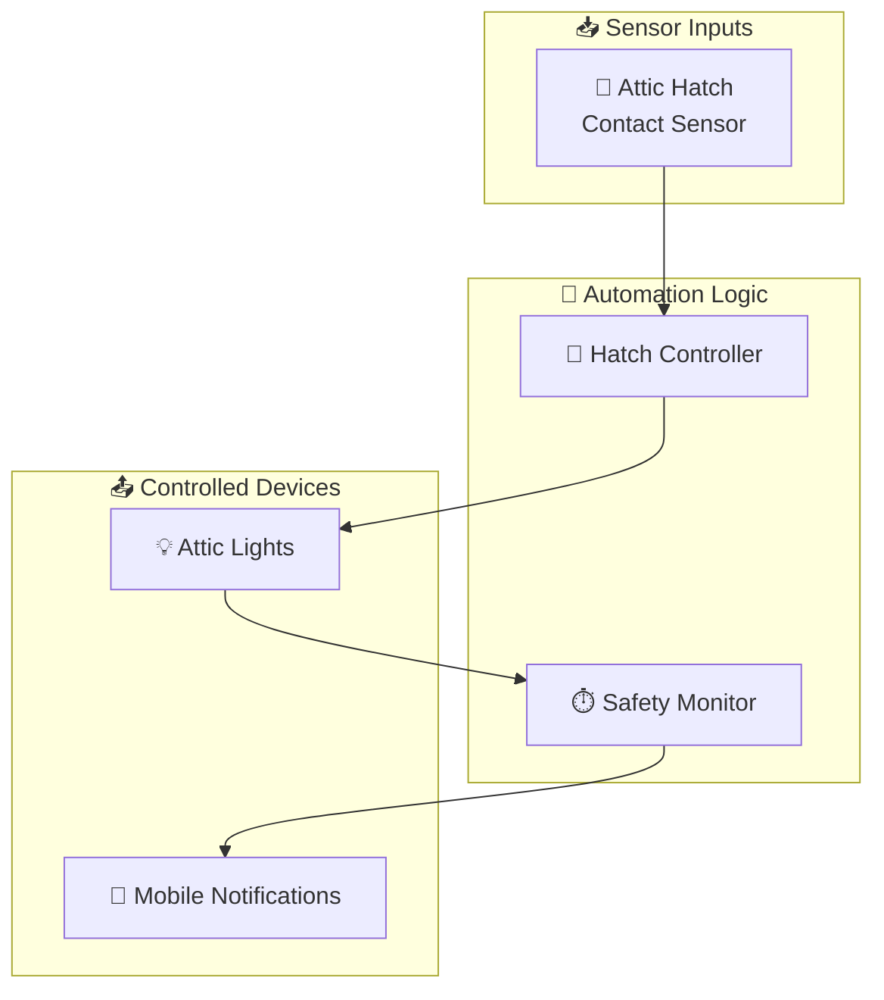
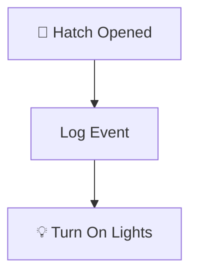
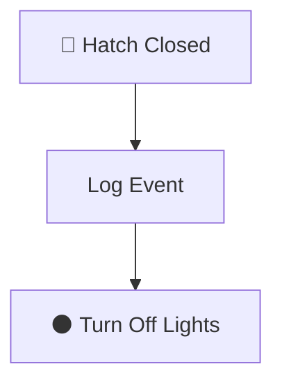
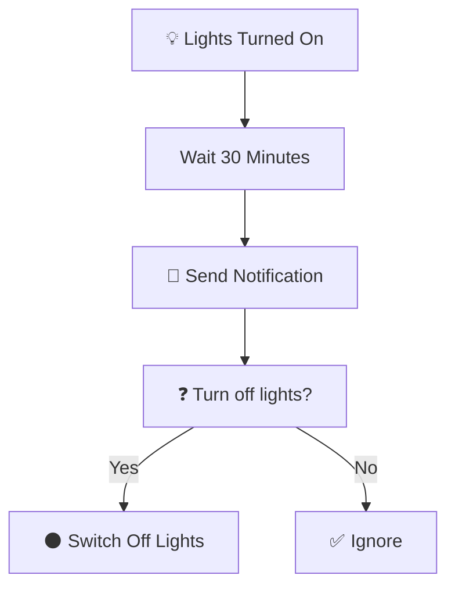
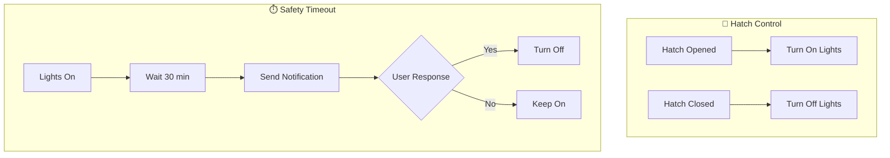

# Attic Package Documentation

This package manages the attic automation including hatch contact sensor-based lighting control and safety timeout notifications.

---

## Table of Contents

- [Overview](#overview)
- [Design Decisions](#design-decisions)
- [Architecture](#architecture)
## Overview

The attic automation system provides simple but effective lighting control based on the attic hatch contact sensor. When the hatch is opened, lights automatically turn on. When closed, they turn off. A safety feature notifies occupants if lights have been left on for an extended period.



---

## Design Decisions

Key architectural decisions captured from the YAML configuration:

- **Attic: Hatch Opened** triggers on state transitions (edge detection) rather than continuous state
- **Attic: Hatch Closed** triggers on state transitions (edge detection) rather than continuous state

---

## Architecture

### File Structure

```
packages/rooms/attic/
├── attic.yaml      # Main package file
└── README.md       # This documentation
```

### Key Components

| Component | Purpose |
|-----------|---------|
| `binary_sensor.attic_hatch_contact` | Contact sensor on attic hatch |
| `light.attic` | Attic lighting entity |

---

## Automations

### Hatch Control

#### Attic: Hatch Opened
**ID:** `1676493888411`

Automatically turns on attic lights when the hatch is opened.



**Triggers:**
- `binary_sensor.attic_hatch_contact` changes from `off` to `on`

**Actions:**
- Logs debug message: "Attic hatch opened. Turning lights on."
- Turns on `light.attic`

---

#### Attic: Hatch Closed
**ID:** `1676493961946`

Automatically turns off attic lights when the hatch is closed.



**Triggers:**
- `binary_sensor.attic_hatch_contact` changes from `on` to `off`

**Actions:**
- Logs debug message: "Attic hatch closed. Turning lights off."
- Turns off `light.attic`

---

### Safety Timeout

#### Attic: Lights On
**ID:** `1664827040573`

Sends a notification if attic lights have been on for 30 minutes, allowing occupants to turn them off remotely.



**Triggers:**
- `light.attic` turns `on` and stays on for 30 minutes

**Actions:**
- Sends actionable notification to `person.danny` and `person.terina`
- Message: "Lights have been on for 30 minutes. Turn off?"
- Action buttons: "Yes" (triggers `switch_off_attic_lights`) / "No" (ignore)

---

## Configuration

### No Package-Specific Configuration

This package uses no `input_boolean`, `input_number`, or `timer` entities. It relies on:

- The contact sensor entity (`binary_sensor.attic_hatch_contact`)
- The light entity (`light.attic`)
- Shared notification scripts from `packages/shared_helpers.yaml`

---

## Entity Reference

### Binary Sensors

| Entity | Purpose |
|--------|---------|
| `binary_sensor.attic_hatch_contact` | Attic hatch open/closed state |

### Lights

| Entity | Type | Purpose |
|--------|------|---------|
| `light.attic` | Light | Attic lighting |

### Scripts Used

| Script | Purpose |
|--------|---------|
| `script.send_to_home_log` | Logging with level support |
| `script.send_actionable_notification_with_2_buttons` | Mobile notifications with action buttons |

---

## Automation Flow Summary



---

## Related Documentation

| Document | Purpose |
|----------|---------|
| [Rooms Overview](README.md) | Overview of all room packages |
| [Main Packages README](../README.md) | Architecture and organization guidelines |

---

## Maintenance Notes

### Troubleshooting

| Issue | Check |
|-------|-------|
| Lights not turning on when hatch opens | `binary_sensor.attic_hatch_contact` state and connectivity |
| Lights not turning off when hatch closes | Contact sensor alignment and battery |
| No timeout notification | Check `script.send_actionable_notification_with_2_buttons` availability |

---

*Last updated: 2026-04-05*
