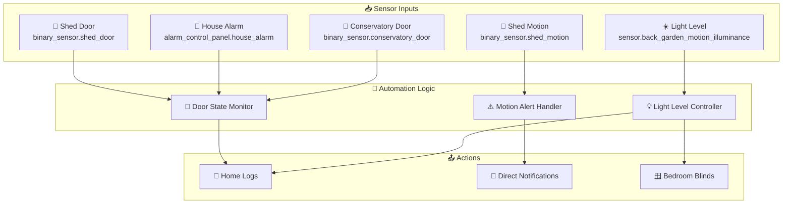
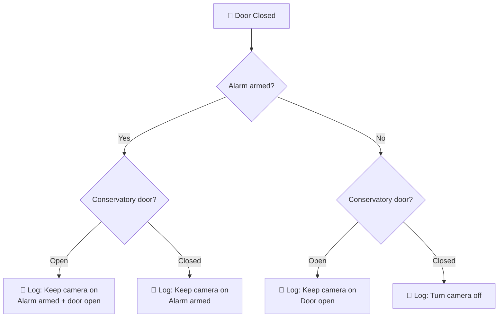
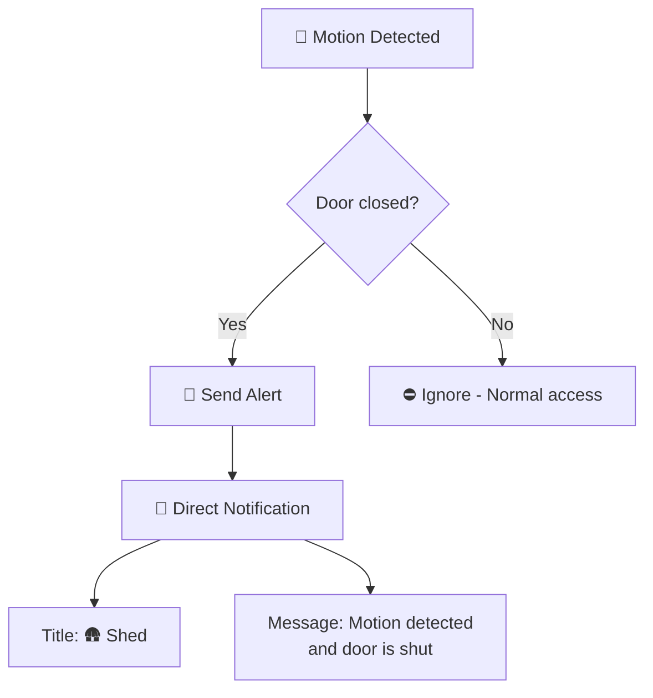
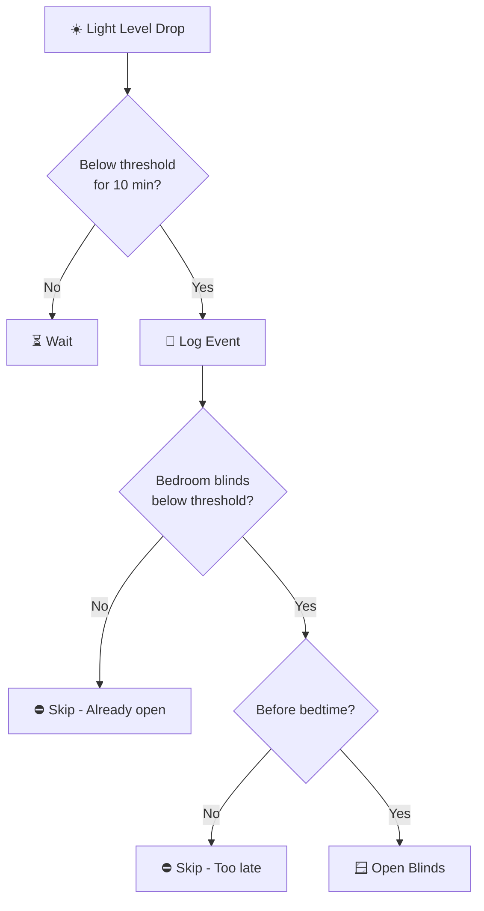
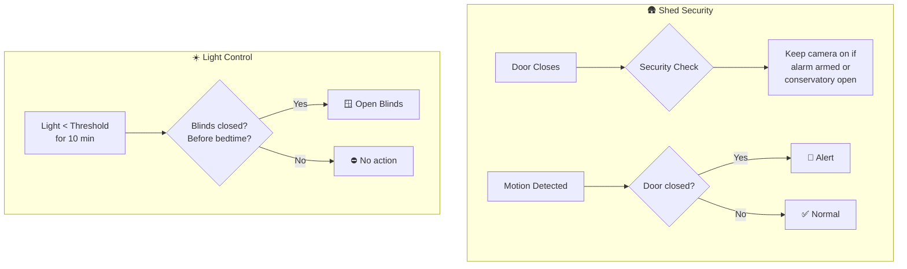

# Back Garden Package Documentation

This package manages back garden automation including shed security monitoring and light level-based blind control.

---

## Table of Contents

- [Overview](#overview)
- [Architecture](#architecture)
- [Automations](#automations)
  - [Shed Security](#shed-security)
  - [Light Level Control](#light-level-control)
- [Configuration](#configuration)
- [Entity Reference](#entity-reference)

---

## Overview

The back garden automation system provides security monitoring for the shed and intelligent light-based control of bedroom blinds.



---

## Architecture

### File Structure

```
packages/rooms/back_garden/
├── back_garden.yaml      # Main package file
└── README.md             # This documentation
```

### Key Components

| Component | Purpose |
|-----------|---------|
| `binary_sensor.shed_door` | Shed door open/closed state |
| `binary_sensor.shed_motion` | Motion detection inside shed |
| `sensor.back_garden_motion_illuminance` | Outdoor light level measurement |
| `alarm_control_panel.house_alarm` | House alarm state integration |
| `binary_sensor.conservatory_door` | Conservatory door state |
| `cover.leos_bedroom_blinds` | Child's bedroom blinds control |

---

## Automations

### Shed Security

#### Shed: Door Closed
**ID:** `1618158789152`

Monitors shed door closure and manages conservatory camera state based on security context.



**Triggers:**
- Shed door changes from `on` (open) to `off` (closed)

**Logic:**
The automation evaluates multiple conditions to determine whether to keep the conservatory camera active:

| Condition | Camera Action | Reason |
|-----------|---------------|--------|
| Alarm armed + Conservatory open | Keep on | Security risk |
| Alarm armed + Conservatory closed | Keep on | Security armed |
| Alarm disarmed + Conservatory open | Keep on | Door open |
| Alarm disarmed + Conservatory closed | Turn off | Safe to disable |

**Purpose:** Ensures the conservatory camera remains active whenever there's a security concern, even when the shed door is closed.

---

#### Shed: Motion Detected When Door Is Closed
**ID:** `1618158998129`

Critical security alert for unexpected motion in a secured shed.



**Triggers:**
- Shed motion sensor changes from `off` to `on`

**Conditions:**
- Shed door must be `off` (closed)

**Actions:**
- Sends direct notification with title "🛖 Shed"
- Message: "🐾 Motion detected in the shed and the door is shut."

**Purpose:** Detects potential intrusions - motion inside a closed shed is unexpected and warrants immediate alert.

---

### Light Level Control

#### Back Garden: Below Direct Sun Light
**ID:** `1660894232445`

Automatically opens bedroom blinds when outdoor light levels drop, optimizing natural light.



**Triggers:**
- Back garden illuminance falls below `input_number.close_blinds_brightness_threshold`
- Must remain below threshold for 10 minutes

**Conditions for Blind Opening:**
1. Bedroom blinds position is below `input_number.blind_closed_position_threshold`
2. Current time is before `input_datetime.childrens_bed_time`

**Actions:**
1. Logs the light level event to home log (Debug level)
2. Opens `cover.leos_bedroom_blinds` if conditions met

**Purpose:** Maximizes natural light in the child's bedroom during the day while respecting bedtime boundaries.

---

## Configuration

### Input Numbers

| Entity | Purpose | Used In |
|--------|---------|---------|
| `input_number.close_blinds_brightness_threshold` | Light level threshold for blind control | Below Direct Sun Light automation |
| `input_number.blind_closed_position_threshold` | Blind position threshold to determine if blinds are "closed" | Below Direct Sun Light automation |

### Input Datetime

| Entity | Purpose | Used In |
|--------|---------|---------|
| `input_datetime.childrens_bed_time` | Bedtime cutoff for blind automation | Below Direct Sun Light automation |

### Related Entities

| Entity | Type | Purpose |
|--------|------|---------|
| `alarm_control_panel.house_alarm` | Alarm | Security state for shed monitoring |
| `binary_sensor.conservatory_door` | Binary Sensor | Door state for camera decisions |
| `cover.leos_bedroom_blinds` | Cover | Child's bedroom blinds |
| `cover.bedroom_blinds` | Cover | Master bedroom blinds (reference) |

---

## Entity Reference

### Binary Sensors

| Entity | Purpose |
|--------|---------|
| `binary_sensor.shed_door` | Shed door contact sensor |
| `binary_sensor.shed_motion` | Shed interior motion detection |
| `binary_sensor.conservatory_door` | Conservatory door state |

### Sensors

| Entity | Purpose |
|--------|---------|
| `sensor.back_garden_motion_illuminance` | Outdoor light level (lux) |

### Alarm Control Panels

| Entity | Purpose |
|--------|---------|
| `alarm_control_panel.house_alarm` | House alarm state (armed/disarmed) |

### Covers

| Entity | Purpose |
|--------|---------|
| `cover.leos_bedroom_blinds` | Child's bedroom blinds |
| `cover.bedroom_blinds` | Master bedroom blinds |

---

## Automation Flow Summary



---

## Related Documentation

| Document | Purpose |
|----------|---------|
| [Rooms Overview](../README.md) | Overview of all room packages |
| [Main Packages README](../../README.md) | Architecture and organization guidelines |

### Related Rooms

| Room | Connection |
|------|------------|
| [Conservatory](../conservatory/README.md) | Camera control integration |
| [Bedroom](../bedroom/README.md) | Blind control integration |

### Related Integrations

| Integration | Connection |
|-------------|------------|
| [Security](../../integrations/security/README.md) | Alarm system integration |

---

## Maintenance Notes

### Troubleshooting

| Issue | Check |
|-------|-------|
| Motion alerts not firing | `binary_sensor.shed_motion` state and availability |
| Blinds not opening on light drop | `input_number.close_blinds_brightness_threshold` value |
| Camera staying on unexpectedly | `alarm_control_panel.house_alarm` state |
| Shed door state incorrect | Door sensor battery and alignment |

### Seasonal Adjustments

- **Summer:** May need to increase `close_blinds_brightness_threshold` for brighter ambient light
- **Winter:** May need to decrease threshold or adjust timing for shorter days
- **Bedtime changes:** Update `input_datetime.childrens_bed_time` when child's schedule changes

---

*Last updated: April 2026*
