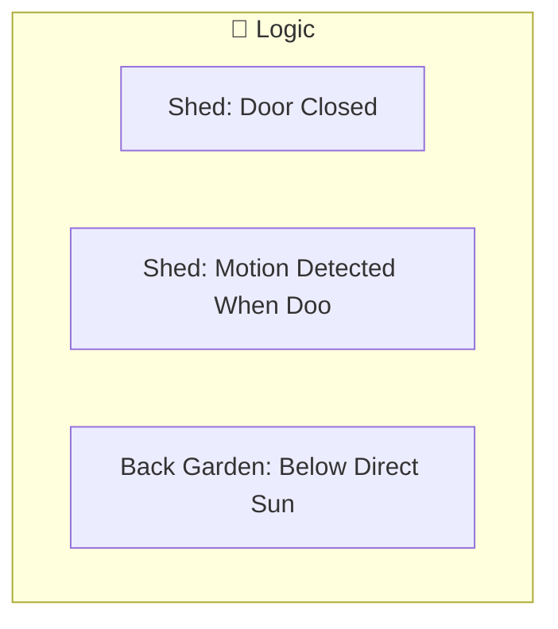
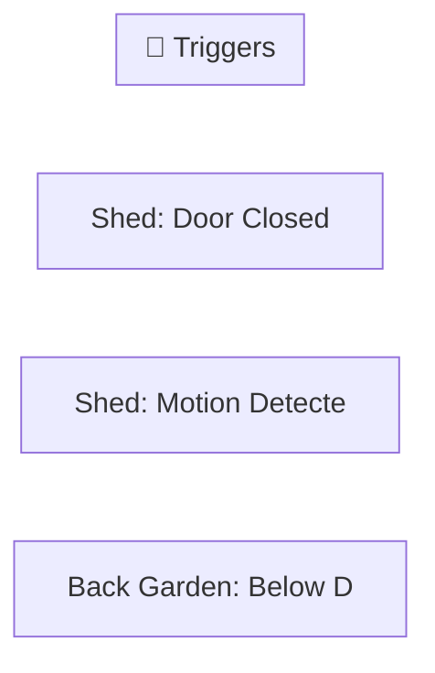
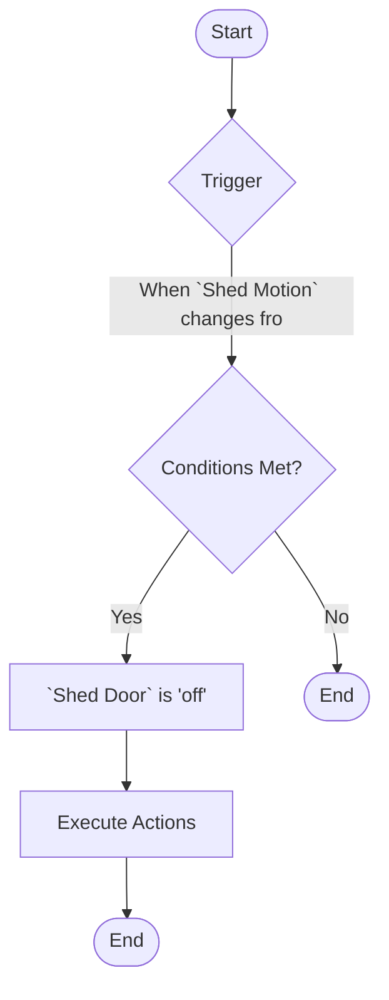

[<- Back to Rooms README](../README.md) · [Packages README](../../README.md) · [Main README](../../../README.md)

# Back Garden

This package manages 3 automations and 0 scripts for back garden.

---

## Table of Contents

- [Overview](#overview)
- [Purpose](#purpose)
- [How It Works](#how-it-works)
- [Automations](#automations)
- [Troubleshooting](#troubleshooting)
- [Related Files](#related-files)
- [Notes](#notes)

---

## Overview

This package provides automation for **back garden**. It includes 3 automations and 0 scripts.

### File Structure

```
packages/rooms/
├── back_garden.yaml  # Main package configuration
└── README.md                           # This documentation
```

---

## Purpose

- **Shed: Door Closed**: 
- **Shed: Motion Detected When Door Is Closed**: 
- **Back Garden: Below Direct Sun Light**: 

### Package Architecture

The following diagram shows the high-level flow of this package:



---

## How It Works

This section explains the overall behavior and logic of the package.

### Automation Logic

**Shed: Door Closed**
Triggered when: When `Shed Door` changes from 'on' to 'off'

**Shed: Motion Detected When Door Is Closed**
Triggered when: When `Shed Motion` changes from 'off' to 'on'

**Back Garden: Below Direct Sun Light**
Triggered when: When `Back Garden Motion Illuminance` drops below input_number.close_blinds_brightness_threshold

### Workflow Diagram

The following diagram illustrates the automation flow:



---

## Automations

Detailed documentation for each automation in this package.

### Shed: Door Closed

**Automation ID:** `1618158789152`

#### Trigger

- When `Shed Door` changes from 'on' to 'off'

#### Actions

1. Execute actions in parallel
2. Conditional action selection

### Shed: Motion Detected When Door Is Closed

**Automation ID:** `1618158998129`

#### Trigger

- When `Shed Motion` changes from 'off' to 'on'

#### Conditions

All conditions must be met for the automation to execute:

- `Shed Door` is 'off'

#### Actions

- *See YAML for action details*

#### Flow Diagram



### Back Garden: Below Direct Sun Light

**Automation ID:** `1660894232445`

#### Trigger

- When `Back Garden Motion Illuminance` drops below input_number.close_blinds_brightness_threshold

#### Actions

- *See YAML for action details*

---

## Troubleshooting

Common issues and how to resolve them.

### Automation Issues

| Issue | Possible Cause | Resolution |
|-------|---------------|------------|
| Automation not triggering | Entity unavailable or condition not met | Check entity states in Developer Tools |
| Automation fires unexpectedly | Trigger too broad or condition missing | Review trigger entity and add conditions |
| Actions not executing | Service call invalid or entity offline | Verify service and entity in YAML |

### General Debugging

1. Check Home Assistant logs for errors
2. Verify all referenced entities exist in Developer Tools
3. Test automations manually using the 'Run' button
4. Review traces for executed automations to see execution path

---

## Related Files

| File | Description |
|------|-------------|
| [`packages/rooms/back_garden.yaml`](./back_garden.yaml) | Main package YAML configuration |
| [Rooms Overview](../README.md) | Overview of all room packages |
| [Main Packages README](../../README.md) | Architecture and organization guidelines |

---

## Notes

### Design Decisions

- **Shed: Door Closed** triggers on state transitions (edge detection) rather than continuous state
- **Shed: Motion Detected When Door Is Closed** triggers on state transitions (edge detection) rather than continuous state
- Uses ambient light sensors for adaptive lighting that responds to natural light conditions

---

*Last updated: 2026-04-10*
