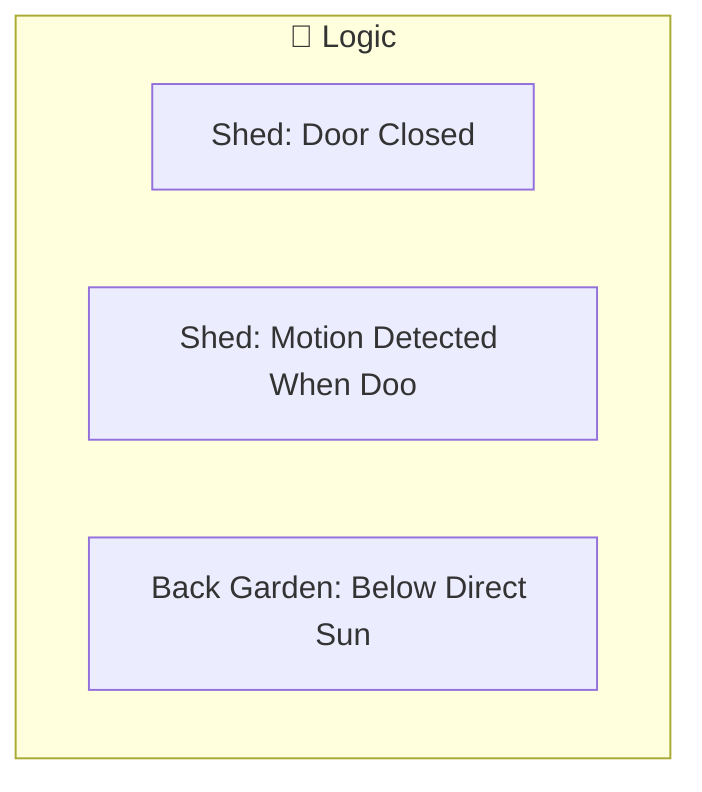

[<- Back to Rooms README](../README.md) · [Packages README](../../README.md) · [Main README](../../../README.md)

# Back Garden Package Documentation

This package manages back garden automation including 3 automations and 0 scripts.

---

## Table of Contents

- [Overview](#overview)
- [Design Decisions](#design-decisions)
- [Automations](#automations)

---

## Overview

The back garden automation system provides intelligent control and monitoring.



### File Structure

```
packages/rooms/
├── back_garden.yaml      # Main package file
└── README.md             # This documentation
```

---

## Design Decisions

Key architectural decisions captured from the YAML configuration:

- **Shed: Door Closed** triggers on state transitions (edge detection) rather than continuous state
- **Shed: Motion Detected When Door Is Closed** triggers on state transitions (edge detection) rather than continuous state
- Uses ambient light sensors for adaptive lighting that responds to natural light conditions

---

## Automations

### Shed: Door Closed
**ID:** `1618158789152`

**Triggers:**
- When `Shed Door` changes from 'on' to 'off'

**Actions:**
- Execute actions in parallel
- Conditional action selection

### Shed: Motion Detected When Door Is Closed
**ID:** `1618158998129`

**Triggers:**
- When `Shed Motion` changes from 'off' to 'on'

**Conditions:**
- `Shed Door` is 'off'

**Actions:**
- *See YAML for action details*

### Back Garden: Below Direct Sun Light
**ID:** `1660894232445`

**Triggers:**
- When `Back Garden Motion Illuminance` drops below input_number.close_blinds_brightness_threshold

**Actions:**
- *See YAML for action details*

---

## Related Documentation

| Document | Purpose |
|----------|---------|
| [Rooms Overview](../README.md) | Overview of all room packages |
| [Main Packages README](../../README.md) | Architecture and organization guidelines |

---

## Maintenance Notes

### Troubleshooting

| Issue | Check |
|-------|-------|
| Automation not triggering | Entity states and conditions |
| Script failing | Service calls and entity availability |

*Last updated: 2026-04-08*
