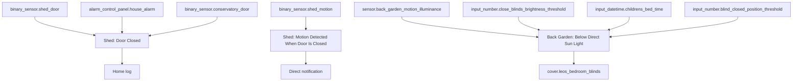
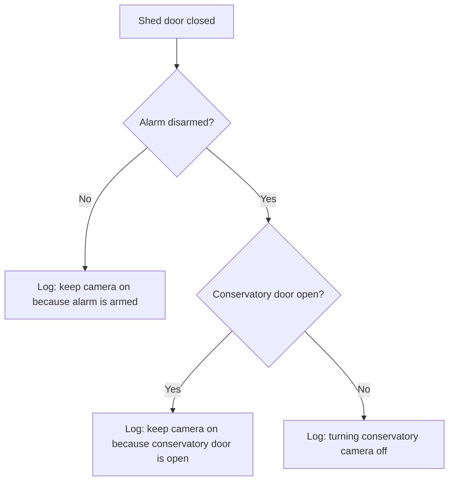

[<- Back to Rooms README](README.md) · [Packages README](../README.md) · [Main README](../../README.md)

# Back Garden Package Documentation

The back garden package covers two things: shed security and one light-level blind helper. It logs shed door decisions, alerts on unexpected motion in a closed shed, and opens Leo's bedroom blinds when back-garden brightness has dropped below the configured direct-sun threshold.

## Quick Summary

For non-technical users, the important behavior is:

| Area | What Happens |
|------|--------------|
| Shed door | When the shed door closes, the system logs whether the conservatory camera should stay on because of alarm or conservatory-door context. |
| Shed motion | Motion inside the shed while the shed door is closed sends a direct notification. |
| Light-level blinds | If back-garden illuminance stays below the configured threshold for 10 minutes, Leo's bedroom blinds may open before children's bedtime. |

## Package Contents

| File | Purpose | Contents |
|------|---------|----------|
| `back_garden.yaml` | Shed security and back-garden light-level response | 3 automations |

## How The Back Garden Decides What To Do

## User Controls

| Entity | Plain-English Purpose |
|--------|-----------------------|
| `input_number.close_blinds_brightness_threshold` | Outdoor brightness threshold used to detect when direct sunlight has dropped. |
| `input_number.blind_closed_position_threshold` | Position threshold used to decide whether blinds count as closed enough to open. |
| `input_datetime.childrens_bed_time` | Latest time the Leo blind-opening helper can run. |

## Everyday Behavior

### Shed Security

| Automation | Trigger | Result |
|------------|---------|--------|
| `Shed: Door Closed` | `binary_sensor.shed_door` changes from `on` to `off` | Logs why the conservatory camera should stay on or can be turned off. |
| `Shed: Motion Detected When Door Is Closed` | `binary_sensor.shed_motion` changes from `off` to `on` while the shed door is `off` | Sends a direct notification that motion was detected in the shed while shut. |

Power-user note: `Shed: Door Closed` currently logs the camera decision only. It does not call a camera service.

### Light-Level Blind Helper

`Back Garden: Below Direct Sun Light` triggers when `sensor.back_garden_motion_illuminance` stays below `input_number.close_blinds_brightness_threshold` for 10 minutes.

| Condition | Result |
|-----------|--------|
| `cover.bedroom_blinds` current position is below `input_number.blind_closed_position_threshold` and it is before `input_datetime.childrens_bed_time` | Opens `cover.leos_bedroom_blinds`. |
| Either condition is false | Only logs the brightness event. |

Power-user note: the condition checks the `current_position` attribute on `cover.bedroom_blinds`, but the action opens `cover.leos_bedroom_blinds`.

## Power-User Details

| Automation | ID | Mode | Notes |
|------------|----|------|-------|
| `Shed: Door Closed` | `1618158789152` | `single` | Uses ordered `choose` branches for alarm and conservatory-door context. |
| `Shed: Motion Detected When Door Is Closed` | `1618158998129` | `single` | Requires shed door state `off`. |
| `Back Garden: Below Direct Sun Light` | `1660894232445` | `single` | No season condition; runs whenever the brightness trigger fires. |

## Entity Reference

| Entity | Purpose |
|--------|---------|
| `binary_sensor.shed_door` | Shed door contact. |
| `binary_sensor.shed_motion` | Shed motion sensor. |
| `alarm_control_panel.house_alarm` | Alarm state used in shed-door logging. |
| `binary_sensor.conservatory_door` | Conservatory door state used in shed-door logging. |
| `sensor.back_garden_motion_illuminance` | Back-garden brightness sensor. |
| `cover.bedroom_blinds` | Position reference used before opening Leo's blinds. |
| `cover.leos_bedroom_blinds` | Blind opened by the back-garden light-level helper. |
| `script.send_to_home_log` | Shared logging script. |
| `script.send_direct_notification` | Shared direct notification script. |

## Troubleshooting

| Issue | Check |
|-------|-------|
| Shed motion alert did not fire | Confirm `binary_sensor.shed_motion` changed from `off` to `on` while `binary_sensor.shed_door` was `off`. |
| Shed camera decision looks wrong | Check `alarm_control_panel.house_alarm` and `binary_sensor.conservatory_door` states at the time the shed door closed. |
| Leo's blinds did not open | Check brightness was below threshold for 10 minutes, time was before `input_datetime.childrens_bed_time`, and `cover.bedroom_blinds` position was below the closed threshold. |
