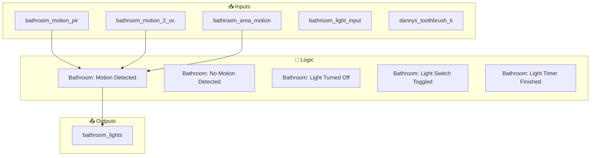
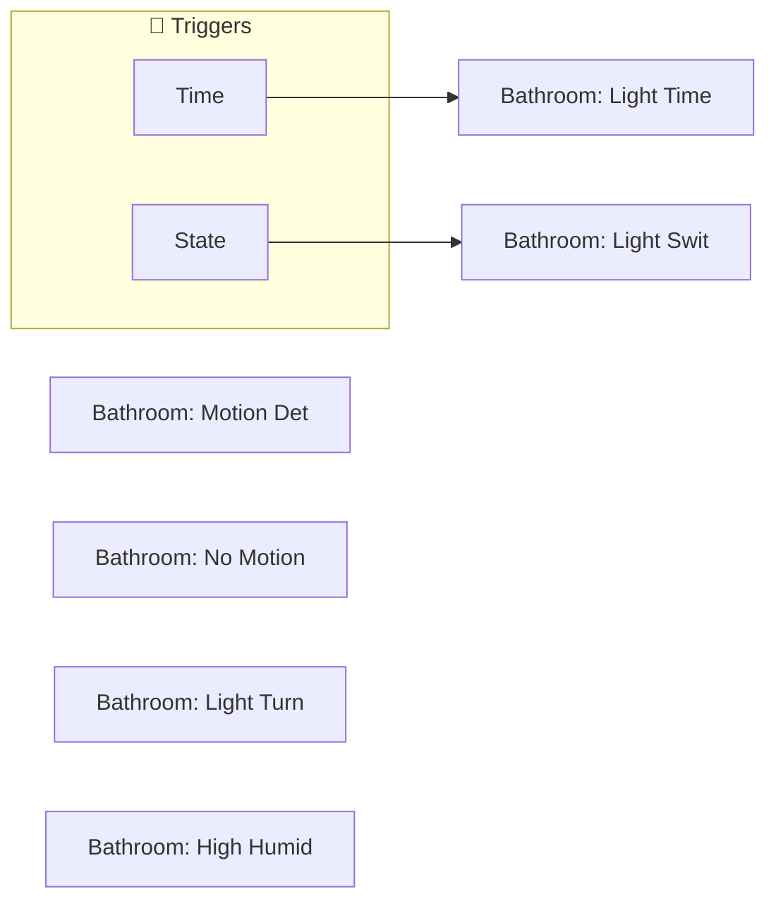
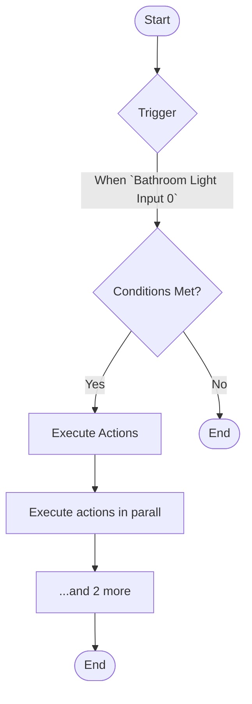
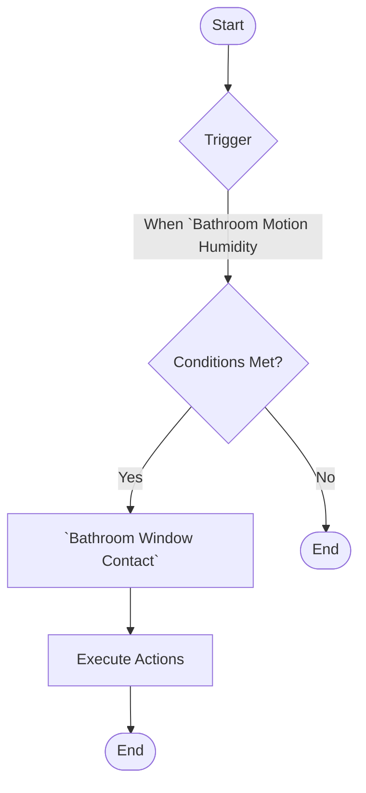
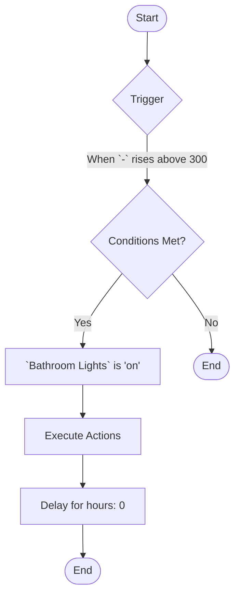

[<- Back to Rooms README](../README.md) · [Packages README](../../README.md) · [Main README](../../../README.md)

# Bathroom

This package manages 7 automations and 0 scripts for bathroom.

---

## Table of Contents

- [Overview](#overview)
- [Purpose](#purpose)
- [How It Works](#how-it-works)
- [Automations](#automations)
- [Entities](#entities)
- [Troubleshooting](#troubleshooting)
- [Related Files](#related-files)
- [Notes](#notes)

---

## Overview

This package provides automation for **bathroom**. It includes 7 automations and 0 scripts.

### File Structure

```
packages/rooms/
├── bathroom.yaml  # Main package configuration
└── README.md                           # This documentation
```

---

## Purpose

- **Bathroom: Motion Detected**: 
- **Bathroom: No Motion Detected**: 
- **Bathroom: Light Turned Off**: 
- **Bathroom: Light Switch Toggled**: 
- **Bathroom: Light Timer Finished**: 

### Package Architecture

The following diagram shows the high-level flow of this package:



---

## How It Works

This section explains the overall behavior and logic of the package.

### Automation Logic

**Bathroom: Motion Detected**
Triggered when: When `Bathroom Motion Pir` changes to 'on'

**Bathroom: No Motion Detected**
Triggered when: When `Bathroom Area Motion` changes to 'off'

**Bathroom: Light Turned Off**
Triggered when: When `Bathroom Lights` changes to 'off'

*... plus 4 additional automations. See [Automations](#automations) section for details.*

### Workflow Diagram

The following diagram illustrates the automation flow:



---

## Automations

Detailed documentation for each automation in this package.

### Bathroom: Motion Detected

**Automation ID:** `1754227355547`

#### Trigger

- When `Bathroom Motion Pir` changes to 'on'

#### Actions

1. Execute actions in parallel
2. Conditional action selection

### Bathroom: No Motion Detected

**Automation ID:** `1754227694151`

#### Trigger

- When `Bathroom Area Motion` changes to 'off'

#### Actions

1. Execute actions in parallel
2. Conditional action selection

### Bathroom: Light Turned Off

**Automation ID:** `1754254675071`

#### Trigger

- When `Bathroom Lights` changes to 'off'

#### Actions

1. Execute actions in parallel

### Bathroom: Light Switch Toggled

**Automation ID:** `1754254675073`

#### Trigger

- When `Bathroom Light Input 0` state changes

#### Actions

1. Execute actions in parallel
2. Conditional action selection
3. Delay for seconds: 1

#### Flow Diagram



### Bathroom: Light Timer Finished

**Automation ID:** `1754254675072`

#### Trigger

- Event: `timer.finished`

#### Actions

1. Execute actions in parallel

### Bathroom: High Humidity

**Automation ID:** `1680461746985`

#### Trigger

- When `Bathroom Motion Humidity` rises above 59.9

#### Conditions

All conditions must be met for the automation to execute:

- `Bathroom Window Contact` is 'off'

#### Actions

- *See YAML for action details*

#### Flow Diagram



### Bathroom: Danny

**Automation ID:** `1760479357022`

#### Trigger

- When `-` rises above 300

#### Conditions

All conditions must be met for the automation to execute:

- `Bathroom Lights` is 'on'

#### Actions

1. Delay for hours: 0

#### Flow Diagram



---

## Entities

Key entities used or created by this package.

### Referenced Entities

- `binary_sensor.bathroom_motion_pir`
- `binary_sensor.bathroom_motion_2_occupancy`
- `binary_sensor.bathroom_area_motion`
- `light.bathroom_lights`
- `binary_sensor.bathroom_light_input_0`
- `person.danny`
- `person.terina`
- `sensor.dannys_toothbrush_time`

---

## Troubleshooting

Common issues and how to resolve them.

### Automation Issues

| Issue | Possible Cause | Resolution |
|-------|---------------|------------|
| Automation not triggering | Entity unavailable or condition not met | Check entity states in Developer Tools |
| Automation fires unexpectedly | Trigger too broad or condition missing | Review trigger entity and add conditions |
| Actions not executing | Service call invalid or entity offline | Verify service and entity in YAML |

### General Debugging

1. Check Home Assistant logs for errors
2. Verify all referenced entities exist in Developer Tools
3. Test automations manually using the 'Run' button
4. Review traces for executed automations to see execution path

---

## Related Files

| File | Description |
|------|-------------|
| [`packages/rooms/bathroom.yaml`](./bathroom.yaml) | Main package YAML configuration |
| [Rooms Overview](../README.md) | Overview of all room packages |
| [Main Packages README](../../README.md) | Architecture and organization guidelines |

---

## Notes

### Design Decisions

- Uses ambient light sensors for adaptive lighting that responds to natural light conditions

---

*Last updated: 2026-04-10*
