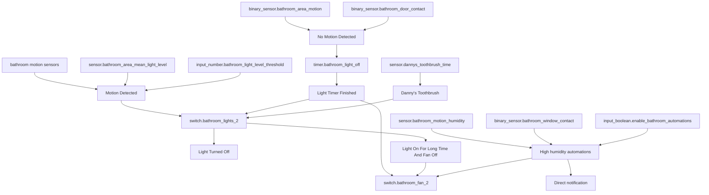
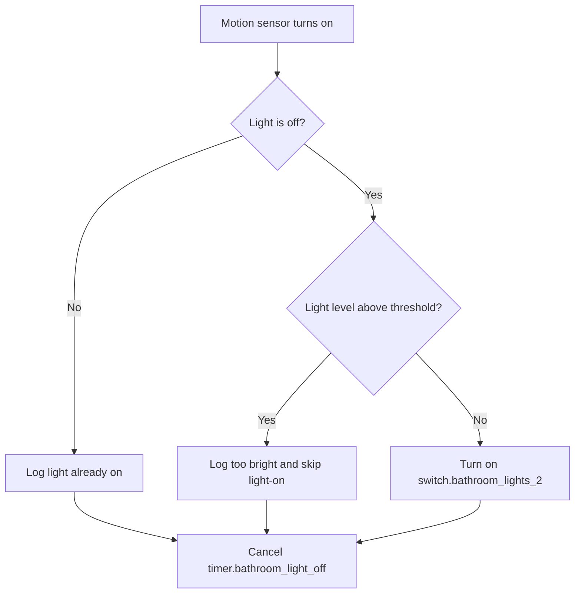

[<- Back to Rooms README](README.md) · [Packages README](../README.md) · [Main README](../../README.md)

# Bathroom Package Documentation

The bathroom package handles hands-off lighting and ventilation. It turns the light on when motion is detected and the room is not considered too bright, delays light-off after motion stops, runs the fan for long visits or high humidity, and flashes the light when Danny's toothbrush session passes five minutes.

## Quick Summary

For non-technical users, the important behavior is:

| Area | What Happens |
|------|--------------|
| Motion lighting | Motion can turn on `switch.bathroom_lights_2`; no motion starts a light-off timer unless the bathroom door is closed. |
| Brightness check | If the lights are off but the room is above `input_number.bathroom_light_level_threshold`, motion is logged and the lights stay off. |
| Fan control | The fan turns on after the light has been on for 5 minutes, or when humidity is high enough. |
| Humidity safety | High humidity can turn the fan on or notify Danny and Terina depending on the automation master switch and sensor states. |
| Toothbrush cue | Danny's toothbrush passing 300 seconds briefly turns the bathroom light off and back on. |

## Package Contents

| File | Purpose | Contents |
|------|---------|----------|
| `bathroom.yaml` | Bathroom lighting, fan, humidity, toothbrush, and mould-risk sensor | 9 automations, 1 script, 1 sensor |

## How The Bathroom Decides What To Do

## User Controls

| Entity | Plain-English Purpose |
|--------|-----------------------|
| `input_boolean.enable_bathroom_automations` | Master switch used by fan and humidity automations. Motion lighting does not check this helper. |
| `input_number.bathroom_light_level_threshold` | Brightness threshold used to decide whether motion should turn the light on. |
| `timer.bathroom_light_off` | Auto-off countdown started after no motion. |

## Everyday Behavior

### Motion Lighting

| Situation | Result |
|-----------|--------|
| Motion from `binary_sensor.bathroom_motion_pir` or `binary_sensor.bathroom_motion_2_occupancy` | Runs `Bathroom: Motion Detected`. |
| Light is off and room brightness is above threshold | Logs that it is too bright and leaves the light off. |
| Light is off and brightness is not above threshold | Turns on `switch.bathroom_lights_2`. |
| Any motion branch completes | Cancels `timer.bathroom_light_off`. |

### No Motion And Timer

| Trigger | Condition | Result |
|---------|-----------|--------|
| `binary_sensor.bathroom_area_motion` turns `off` | Bathroom door is closed (`off`) | Logs and does not start the timer. |
| No motion between 00:00 and 06:00 | Door is not closed | Starts `timer.bathroom_light_off` for 3 minutes. |
| No motion outside 00:00-06:00 | Door is not closed | Starts `timer.bathroom_light_off` for 6 minutes. |
| `timer.bathroom_light_off` finishes | Fan is on | Logs, turns off `switch.bathroom_fan_2`, then turns off the light. |
| `timer.bathroom_light_off` finishes | Fan is not on | Logs and turns off the light. |

### Fan And Humidity

| Automation | Trigger | Result |
|------------|---------|--------|
| `Bathroom: Light On For Long Time And Fan Off` | Light on for 5 minutes, fan off, bathroom automations enabled | Turns on `switch.bathroom_fan_2`. |
| `Bathroom: High Humidity` | Humidity above 59.9% for 1 minute | If automations are on, window and door are both `on`, and fan is off, turns on the fan. If automations are off, sends Danny and Terina a direct notification. |
| `Bathroom: High Humidity` | Humidity above 69.9% for 1 minute | If automations are on and fan is off, turns on the fan. |
| Second `Bathroom: High Humidity` automation | Humidity below 60% for 5 minutes, bathroom automations off, fan on | Turns off `switch.bathroom_fan_2`. |
| `Bathroom: Light Turned Off` | Light switch turns off and humidity is below 60% | Cancels the timer and can turn off fan-related switch entities. |

Power-user note: there are two automations with alias `Bathroom: High Humidity`; their IDs are different and their behavior is different.

### Toothbrush Cue

`Bathroom: Danny's Toothbrush` triggers when `sensor.dannys_toothbrush_time` rises above 300 seconds and the bathroom light is on. It turns `switch.bathroom_lights_2` off, waits 1 second, then turns it back on.

The package also defines `script.bathroom_flash_light`, which repeats two quick on/off actions on `switch.bathroom_lights_2`. It is available but is not called by the toothbrush automation in this YAML.

## Mould Indicator Sensor

| Sensor | Platform | Inputs |
|--------|----------|--------|
| `sensor.bathroom_mould_indicator` | `mold_indicator` | `sensor.bathroom_door_temperature`, `sensor.bathroom_motion_humidity`, `sensor.gw2000a_outdoor_temperature`, calibration factor `1.32` |

## Power-User Details

| Automation | ID | Mode | Notes |
|------------|----|------|-------|
| `Bathroom: Motion Detected` | `1754227355547` | `single` | Does not check `input_boolean.enable_bathroom_automations`. |
| `Bathroom: No Motion Detected` | `1754227694151` | `single` | Door-closed branch prevents timer start. |
| `Bathroom: Light Turned Off` | `1754254675071` | `single` | Cancels timer, then checks fan and humidity. |
| `Bathroom: Light Switch Toggled` | `1754254675073` | `single` | Waits 1 second before checking whether the light is on. |
| `Bathroom: Light Timer Finished` | `1754254675072` | `single` | Turns off lights after optional fan-off action. |
| `Bathroom: Light On For Long Time And Fan Off` | `1777131323273` | `single` | Requires bathroom automations enabled. |
| `Bathroom: High Humidity` | `1680461746985` | `single` | Handles high and critical humidity triggers. |
| `Bathroom: High Humidity` | `1680461746986` | `single` | Handles humidity dropping below 60%. |
| `Bathroom: Danny's Toothbrush` | `1760479357022` | `single` | Visual cue after 300 seconds. |

## Entity Reference

| Entity | Purpose |
|--------|---------|
| `binary_sensor.bathroom_motion_pir` | Motion trigger for light-on. |
| `binary_sensor.bathroom_motion_2_occupancy` | Occupancy trigger for light-on. |
| `binary_sensor.bathroom_area_motion` | Area motion sensor used for no-motion timer start. |
| `binary_sensor.bathroom_door_contact` | Door state used to suppress no-motion timer and in humidity logic. |
| `binary_sensor.bathroom_window_contact` | Window state used in humidity logic. |
| `binary_sensor.bathroom_switch_input_0` | Wall switch input used to cancel timer after manual light-on. |
| `switch.bathroom_lights_2` | Bathroom light switch. |
| `switch.bathroom_fan_2` | Main fan switch used by most fan automations. |
| `switch.bathroom_fan` | Additional fan switch referenced by the light-off low-humidity branch. |
| `sensor.bathroom_area_mean_light_level` | Brightness sensor for motion light-on decisions. |
| `sensor.bathroom_motion_humidity` | Humidity sensor for fan decisions. |
| `sensor.dannys_toothbrush_time` | Toothbrush timer sensor. |

## Troubleshooting

| Issue | Check |
|-------|-------|
| Motion does not turn the light on | Check the two motion sensors, `switch.bathroom_lights_2`, and whether `sensor.bathroom_area_mean_light_level` is above the threshold. |
| Light does not turn off after no motion | Check whether `binary_sensor.bathroom_door_contact` is `off`; door closed suppresses the timer. |
| Fan did not start after a shower | Check `input_boolean.enable_bathroom_automations`, humidity value, door/window contact states, and whether `switch.bathroom_fan_2` was already on. |
| Fan did not turn off | Check which fan entity is on: the YAML references both `switch.bathroom_fan_2` and `switch.bathroom_fan`. |
