# 🛁 Bathroom

Smart bathroom automation with motion-based lighting, humidity monitoring, and toothbrush integration.

## Overview

The bathroom automation provides intelligent lighting control based on motion detection, ambient light levels, and door status. It includes humidity monitoring with mold prevention alerts and integrates with smart toothbrushes for automated light control during brushing sessions.

```mermaid
flowchart TB
    subgraph Sensors["🎛️ Sensors"]
        MOTION[Motion Sensors\nbinary_sensor.bathroom_motion_pir\nbinary_sensor.bathroom_motion_2_occupancy]
        DOOR[Door Contact\nbinary_sensor.bathroom_door_contact]
        WINDOW[Window Contact\nbinary_sensor.bathroom_window_contact]
        LIGHT_LEVEL[Light Level\nsensor.bathroom_area_mean_light_level]
        HUMIDITY[Humidity\nsensor.bathroom_motion_humidity]
        TEMP[Door Temperature\nsensor.bathroom_door_temperature]
        SWITCH[Light Switch\nbinary_sensor.bathroom_light_input_0]
    end

    subgraph Logic["⚙️ Logic"]
        THRESHOLD[Light Threshold\ninput_number.bathroom_light_level_threshold]
        TIMER[Light Off Timer\ntimer.bathroom_light_off]
    end

    subgraph Outputs["💡 Outputs"]
        LIGHTS[Bathroom Lights\nlight.bathroom_lights]
    end

    subgraph External["🔗 External"]
        OUTDOOR_TEMP[Outdoor Temp\nsensor.gw2000a_outdoor_temperature]
        TOOTHBRUSH[Danny's Toothbrush\nsensor.dannys_toothbrush_time]
        NOTIFICATIONS[Notifications\nscript.send_direct_notification]
        LOG[Home Log\nscript.send_to_home_log]
    end

    MOTION -->|Triggers| AUTOMATIONS
    DOOR -->|Status Check| AUTOMATIONS
    WINDOW -->|Humidity Check| AUTOMATIONS
    LIGHT_LEVEL -->|Brightness Check| AUTOMATIONS
    HUMIDITY -->|Mold/Humidity Alerts| AUTOMATIONS
    SWITCH -->|Manual Override| AUTOMATIONS
    TOOTHBRUSH -->|Light Flash| AUTOMATIONS

    AUTOMATIONS --> LIGHTS
    AUTOMATIONS --> TIMER
    AUTOMATIONS --> NOTIFICATIONS
    AUTOMATIONS --> LOG

    HUMIDITY --> MOLD[Mold Indicator\nsensor.bathroom_mould_indicator]
    TEMP --> MOLD
    OUTDOOR_TEMP --> MOLD
```



## Design Decisions

Key architectural decisions captured from the YAML configuration:

- Uses ambient light sensors for adaptive lighting that responds to natural light conditions

---

## Architecture

### Motion-Based Lighting

The lighting system uses a sophisticated decision tree:

1. **Motion Detection**: Triggers on either PIR sensor or mmWave occupancy sensor
2. **Ambient Light Check**: Only turns on lights if below threshold (`input_number.bathroom_light_level_threshold`)
3. **Timer Management**: Cancels any pending "light off" timer when motion is detected
4. **No Motion Handling**: Starts a timer (2.5 min at night, 3 min during day) unless door is closed

### Humidity & Mold Prevention

- **High Humidity Alert**: Triggers when humidity > 59.9% for 30+ minutes with door/window closed
- **Mold Indicator**: Calculates mold risk based on indoor humidity, indoor temperature, and outdoor temperature

### Toothbrush Integration

Smart toothbrush triggers a light flash sequence (off/on) when brushing time exceeds 5 minutes, serving as a visual timer.

## Automations

### Bathroom: Motion Detected

| Attribute | Value |
|-----------|-------|
| **ID** | `1754227355547` |
| **Trigger** | Motion sensor state changes to `on` |
| **Entities** | `binary_sensor.bathroom_motion_pir`, `binary_sensor.bathroom_motion_2_occupancy` |

**Logic Flow:**

```
Motion Detected
    ├── If lights OFF AND ambient light > threshold
    │   └── Log: "Too bright, skipping"
    ├── If lights OFF
    │   ├── Turn on lights
    │   └── Log: "Turning light on"
    └── If lights already ON
        └── Log: "Light already on"
    └── Cancel light off timer
```

### Bathroom: No Motion Detected

| Attribute | Value |
|-----------|-------|
| **ID** | `1754227694151` |
| **Trigger** | Area motion changes to `off` |
| **Entity** | `binary_sensor.bathroom_area_motion` |

**Logic Flow:**

```
No Motion Detected
    ├── If door closed
    │   └── Log: "Skipping - door closed"
    ├── If after midnight (00:00-06:00)
    │   └── Start 2.5 minute timer
    └── Otherwise
        └── Start 3 minute timer
```

### Bathroom: Light Turned Off

| Attribute | Value |
|-----------|-------|
| **ID** | `1754254675071` |
| **Trigger** | Light state changes to `off` |
| **Action** | Cancel light off timer + log event |

### Bathroom: Light Switch Toggled

| Attribute | Value |
|-----------|-------|
| **ID** | `1754254675073` |
| **Trigger** | Wall switch input changes |
| **Entity** | `binary_sensor.bathroom_light_input_0` |
| **Action** | If lights turned on manually, cancel auto-off timer |

### Bathroom: Light Timer Finished

| Attribute | Value |
|-----------|-------|
| **ID** | `1754254675072` |
| **Trigger** | `timer.bathroom_light_off` finishes |
| **Action** | Turn off lights + log event |

### Bathroom: High Humidity

| Attribute | Value |
|-----------|-------|
| **ID** | `1680461746985` |
| **Trigger** | Humidity > 59.9% for 30 minutes |
| **Conditions** | Window closed AND door closed |
| **Action** | Send notification to Danny & Terina |

### Bathroom: Danny's Toothbrush

| Attribute | Value |
|-----------|-------|
| **ID** | `1760479357022` |
| **Trigger** | Toothbrush time > 300 seconds |
| **Condition** | Lights are on |
| **Action** | Flash lights (off → 1s delay → on) |

## Scripts

### bathroom_flash_light

Flashes the bathroom light twice at 100% brightness.

| Property | Value |
|----------|-------|
| **Mode** | single |
| **Sequence** | Repeat 2×: turn on (100%) → turn off |

## Sensors

### Bathroom Mould Indicator

Platform: `mold_indicator`

Calculates mold risk based on:
- Indoor temperature: `sensor.bathroom_door_temperature`
- Indoor humidity: `sensor.bathroom_motion_humidity`
- Outdoor temperature: `sensor.gw2000a_outdoor_temperature`
- Calibration factor: `1.32`

## Configuration

### Input Number

| Entity | Purpose | Default |
|--------|---------|---------|
| `input_number.bathroom_light_level_threshold` | Ambient light threshold for auto-on | (configured in HA) |

### Timer

| Entity | Duration | Purpose |
|--------|----------|---------|
| `timer.bathroom_light_off` | Dynamic (2.5-3 min) | Auto-off delay after no motion |

## Entity Reference

### Binary Sensors

| Entity | Description |
|--------|-------------|
| `binary_sensor.bathroom_motion_pir` | PIR motion sensor |
| `binary_sensor.bathroom_motion_2_occupancy` | mmWave occupancy sensor |
| `binary_sensor.bathroom_area_motion` | Aggregated area motion |
| `binary_sensor.bathroom_door_contact` | Door contact sensor |
| `binary_sensor.bathroom_window_contact` | Window contact sensor |
| `binary_sensor.bathroom_light_input_0` | Wall switch input |

### Sensors

| Entity | Description |
|--------|-------------|
| `sensor.bathroom_area_mean_light_level` | Average ambient light level |
| `sensor.bathroom_motion_humidity` | Humidity from motion sensor |
| `sensor.bathroom_door_temperature` | Temperature from door sensor |
| `sensor.bathroom_mould_indicator` | Mold risk indicator |
| `sensor.dannys_toothbrush_time` | Smart toothbrush session time |
| `sensor.gw2000a_outdoor_temperature` | Outdoor temperature (external) |

### Lights

| Entity | Description |
|--------|-------------|
| `light.bathroom_lights` | Main bathroom light group |
| `light.bathroom` | Individual bathroom light (for flashing) |

### Input Helpers

| Entity | Type | Description |
|--------|------|-------------|
| `input_number.bathroom_light_level_threshold` | number | Light threshold for auto-on |

### Timer

| Entity | Description |
|--------|-------------|
| `timer.bathroom_light_off` | Auto-off countdown timer |

## Dependencies

- `script.send_to_home_log` - Logging utility
- `script.send_direct_notification` - Notification service
- `sensor.gw2000a_outdoor_temperature` - Weather station data
- `person.danny`, `person.terina` - Notification recipients

## Author

Created by Danny Tsang <danny@tsang.uk>

*Last updated: 2026-04-05*
