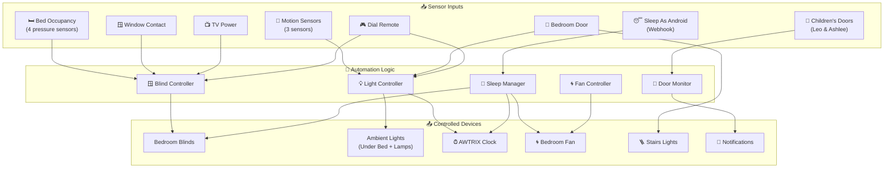
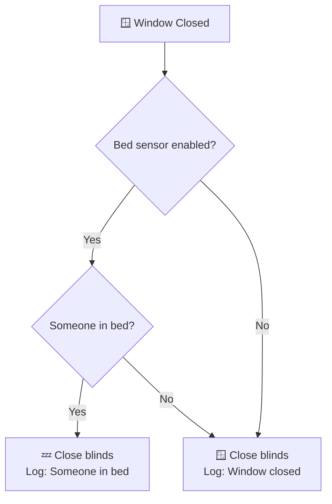
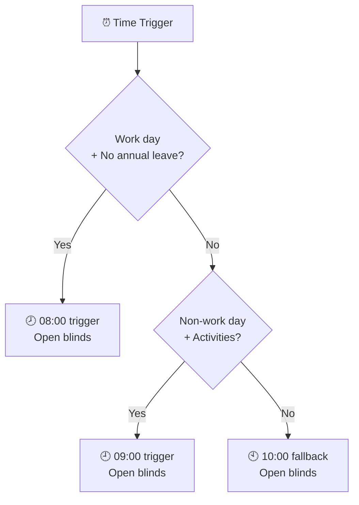
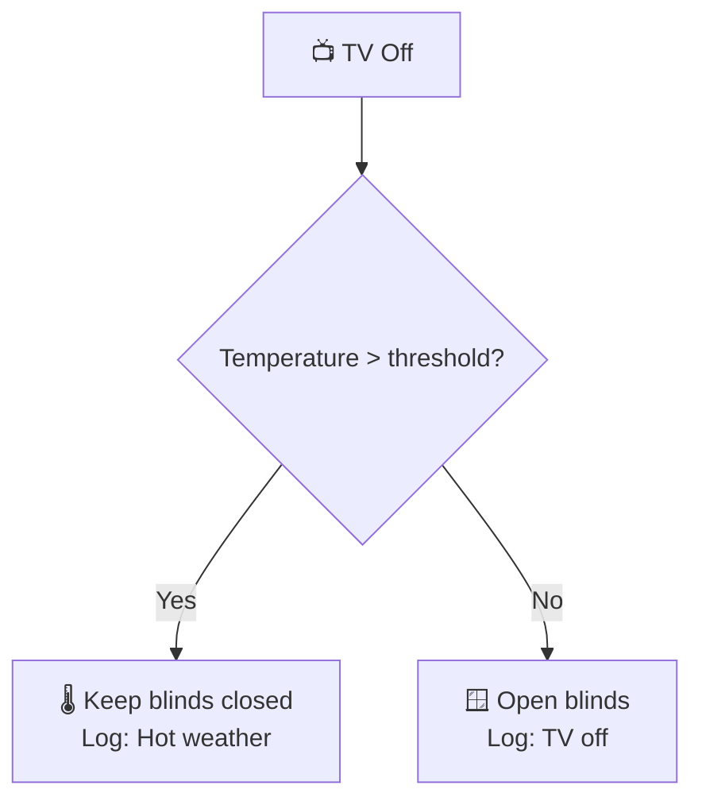
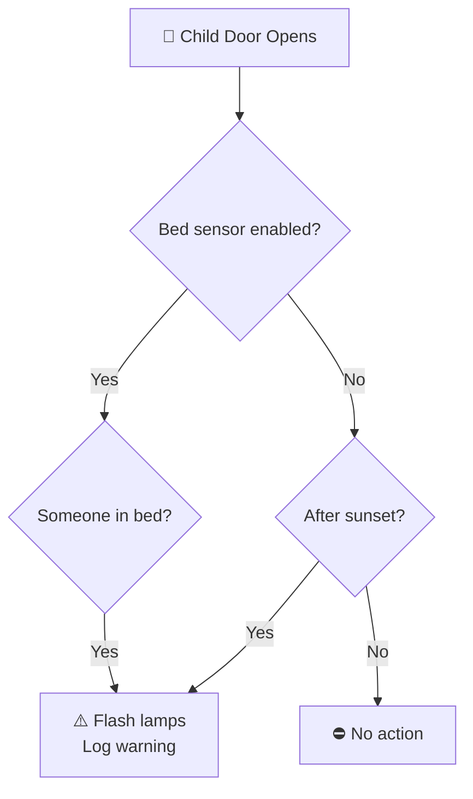
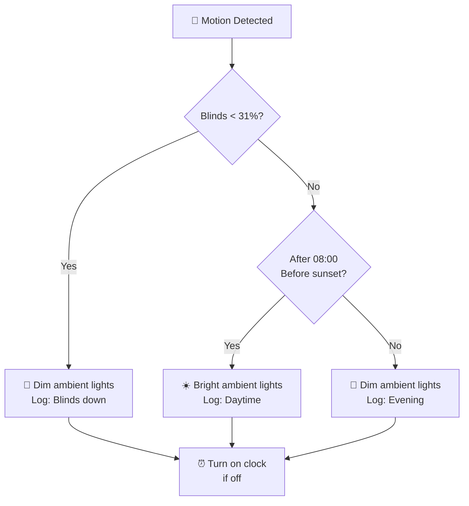
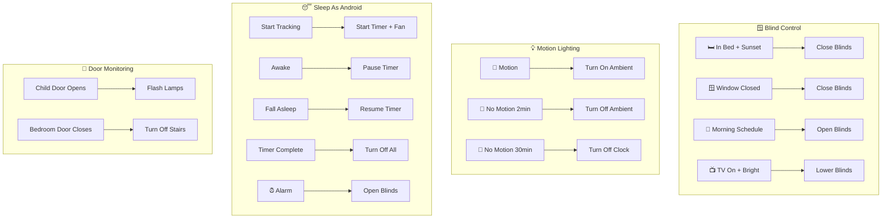

# Bedroom Package Documentation

This package manages the master bedroom automation including Sleep As Android integration, AWTRIX light notifications, motion-based ambient lighting, blind control, and children's bedroom door monitoring.

---

## Table of Contents

- [Overview](#overview)
- [Architecture](#architecture)
- [Automations](#automations)
  - [Blind Control](#blind-control)
  - [Door Monitoring](#door-monitoring)
  - [Motion Lighting](#motion-lighting)
  - [Fan Control](#fan-control)
  - [TV Integration](#tv-integration)
  - [Remote Control](#remote-control)
  - [Sleep As Android](#sleep-as-android)
- [Scenes](#scenes)
- [Scripts](#scripts)
- [Sensors](#sensors)
- [Configuration](#configuration)
- [Entity Reference](#entity-reference)

---

## Overview

The bedroom automation system provides intelligent control of blinds based on occupancy and time, motion-activated ambient lighting, Sleep As Android integration for sleep tracking and smart wake-up, and monitoring of children's bedroom doors during evening hours.



---

## Architecture

### File Structure

```
packages/rooms/bedroom/
├── bedroom.yaml          # Main package file (blinds, lights, door, TV, remote)
├── sleep_as_android.yaml # Sleep tracking integration
└── awtrix_light.yaml     # AWTRIX clock notification scripts
```

### Key Components

| Component | Purpose |
|-----------|---------|
| `binary_sensor.bed_occupied` | Bed occupancy detection (4 pressure sensors) |
| `binary_sensor.bedroom_motion_occupancy` | Primary motion detection |
| `binary_sensor.bedroom_motion_3_presence` | Secondary presence sensor |
| `binary_sensor.bedroom_area_motion` | Area motion detection |
| `cover.bedroom_blinds` | Motorized blinds control |
| `light.under_bed_left/right` | Under-bed ambient LED strips |
| `light.bedroom_lamps` | Desk lamps group |
| `light.bedroom_clock_matrix` | AWTRIX LED matrix clock |
| `switch.bedroom_fan` | Smart fan control |
| `binary_sensor.bedroom_tv_powered_on` | TV power monitoring |

---

## Automations

### Blind Control

#### Bedroom: Close Blinds When Someone Is In Bed After Sunset
**ID:** `1601641236163`

Automatically closes blinds when someone gets into bed after sunset.

**Triggers:**
- Bed occupied changes from `off` to `on` for 30 seconds

**Conditions:**
- Blinds are above open threshold
- Bedroom blind automations enabled
- After sunset
- Window is closed
- Bed sensor enabled

**Actions:**
- Log message
- Close blinds

---

#### Bedroom: Window Closed At Night
**ID:** `1622667464880`

Closes blinds when window is closed after sunset.

**Triggers:**
- Window contact changes from `on` (open) to `off` (closed)

**Conditions:**
- Bedroom blind automations enabled
- After sunset and before sunrise
- Blinds are not already closed

**Actions:**
- Log message
- Close blinds

---

#### Bedroom: Window Closed And Someone Is In Bed At Night
**ID:** `1615689096351`

Closes blinds when window closes at night, with bed occupancy consideration.

**Triggers:**
- Window contact changes to `off` for 30 seconds

**Conditions:**
- Blinds above open threshold
- Bedroom blind automations enabled
- After sunset

**Logic:**


---

#### Bedroom: Open Blind When No One Is In Bed
**ID:** `1601641292576`

Opens blinds when bed becomes unoccupied during daytime.

**Triggers:**
- Bed occupied changes from `on` to `off` for 30 seconds

**Conditions:**
- Blinds below closed threshold
- Between sunrise-1hr and sunset
- Bedroom blind automations enabled
- Bed sensor enabled

**Actions:**
- 1 minute delay
- Log message
- Open blinds

---

#### Bedroom: Morning Timed Open Blinds
**ID:** `1621875409014`

Scheduled blind opening based on work calendar and day type.

**Triggers:**
- 08:00 (work days)
- 09:00 (non-work days with activities)
- 10:00 (fallback)

**Conditions:**
- Blinds below closed threshold
- Bedroom blind automations enabled
- TV is off

**Logic:**


---

#### Bedroom: Evening Timed Close Blinds
**ID:** `1621875567853`

Scheduled blind closure at 22:00.

**Triggers:**
- 22:00 daily

**Conditions:**
- Bedroom blind automations enabled
- Blinds above closed threshold

**Actions:**
- If window open: Log warning, wait for close
- If window closed: Close blinds

---

#### Bedroom: TV Turned On During Bright Day
**ID:** `1624194131454`

Lowers blinds when TV turns on during bright daylight.

**Triggers:**
- TV powered on changes to `on`

**Conditions:**
- Bedroom blind automations enabled
- Between sunrise and sunset
- Blinds above open threshold

**Actions:**
- If window open: Send actionable notification
- If window closed: Lower blinds to 20%

---

#### Bedroom: TV Turned Off
**ID:** `1624194439043`

Opens blinds when TV turns off, with weather consideration.

**Triggers:**
- TV powered on changes to `off` for 1 minute

**Conditions:**
- Blinds below closed threshold
- Bedroom blind automations enabled
- Before sunset and after sunrise
- After 08:30

**Logic:**


---

### Door Monitoring

#### Bedroom: Door Closed
**ID:** `1715955339483`

Turns off stairs lights when bedroom door closes.

**Triggers:**
- Bedroom door contact changes to `off` for 10 seconds

**Conditions:**
- Both children's doors closed
- No upstairs motion

**Actions:**
- Log message
- Turn off stairs lights (main, ambient, stairs_2)

---

#### Bedroom: Other Bedroom Door Opens Warning
**ID:** `1615209552353`

Warns when children's doors open after bedtime.

**Triggers:**
- Leo's door opens
- Ashlee's door opens

**Conditions:**
- Bedroom lamps or main light is on
- After children's bedtime
- Not in Guest or No Children mode

**Logic:**


---

#### Bedroom: Other Bedroom Door Closes Warning
**ID:** `1615209552354`

Warns when children's doors close after bedtime.

**Triggers:**
- Leo's door closes
- Ashlee's door closes

**Conditions:**
- Bedroom lamps are on
- After children's bedtime
- Not in Guest or No Children mode

**Actions:**
- Flash lamps with appropriate color (blue for Leo, pink for Ashlee)
- Log warning

---

#### Bedroom: Pause TV When Door Opens At Night
**ID:** `1724001157269`

Pauses TV when bedroom door opens late at night.

**Triggers:**
- Bedroom door contact changes to `on`

**Conditions:**
- Time between 22:00 and 02:00
- TV is playing
- Not using BBC iPlayer

**Actions:**
- Log message
- Pause TV

---

### Motion Lighting

#### Bedroom: Motion Detected
**ID:** `1621713217274`

Activates ambient lighting based on motion and time of day.

**Triggers:**
- Bedroom motion changes to `on`

**Conditions:**
- Motion triggers enabled
- Under-bed lights are off, dim, or below brightness 100

**Logic:**


---

#### Bedroom: No Motion
**ID:** `1621713867762`

Turns off ambient lights after 2 minutes of no motion.

**Triggers:**
- Bedroom motion changes to `off` for 2 minutes

**Conditions:**
- Under-bed lights are on
- Motion triggers enabled

**Actions:**
- Log message
- Turn off ambient lights

---

#### Bedroom: No Motion For Long Time
**ID:** `1621713867763`

Turns off clock after 30 minutes of no motion.

**Triggers:**
- Bedroom area motion changes to `off` for 30 minutes

**Conditions:**
- Bedroom lamps are off
- Motion triggers enabled

**Actions:**
- Log message
- Turn off clock matrix

---

#### Bedroom: No Motion And Fan Is On
**ID:** `1725207477313`

Turns off fan after 5 minutes of no presence.

**Triggers:**
- Bedroom motion 3 presence changes to `off` for 5 minutes

**Conditions:**
- Fan is on

**Actions:**
- Turn off fan

---

### Fan Control

#### Bedroom: Turn Off Fan
**ID:** `1690844451011`

Auto-turns off fan after 2 hours.

**Triggers:**
- Fan has been on for 2 hours

**Actions:**
- Log message
- Turn off fan

---

### TV Integration

See Blind Control section for TV-related blind automations.

---

### Remote Control

The bedroom has a 4-button dial remote for manual control.

#### Bedroom: Remote Button 1
**ID:** `1699308571385`

Toggles main bedroom lights.

---

#### Bedroom: Remote Button 2
**ID:** `1699308571386`

Toggles desk lamps and under-bed lights.

---

#### Bedroom: Remote Button 3
**ID:** `1699308571387`

Opens blinds.

---

#### Bedroom: Remote Button 4
**ID:** `1699308571388`

Closes blinds.

---

#### Bedroom: Remote Dial Action Right
**ID:** `1710079376648`

Increases lamp brightness based on dial rotation speed.

---

#### Bedroom: Remote Dial Action Left
**ID:** `1710079376649`

Decreases lamp brightness based on dial rotation speed.

---

### Sleep As Android

Located in `sleep_as_android.yaml`.

#### Sleep As Android: Event
**ID:** `1614285576722`

Main webhook handler for Sleep As Android events.

**Triggers:**
- Webhook `sleep_as_android`

**Events Handled:**
- `sleep_tracking_started`
- `sleep_tracking_stopped`
- `alarm_alert_start`
- `awake`
- Various alarm events

**Notification Levels:**
| Level | Events Logged |
|-------|---------------|
| Start/Stop | sleep_tracking_started, sleep_tracking_stopped |
| Start/Stop/Alarms | Above + alarm events |
| All | All events |

---

#### Sleep As Android: Started Tracking
**ID:** `1658438667856`

Starts sleep timer and optionally turns on fan.

**Triggers:**
- Sleep tracking started

**Actions:**
- Start sleep timer (duration from `input_number.sleep_timer_duration`)
- If temperature > 22.5°C: Turn on fan

---

#### Sleep As Android: Awake
**ID:** `1658843567854`

Pauses sleep timer when awake event received.

**Triggers:**
- `awake` event

**Conditions:**
- Sleep timer is active

**Actions:**
- Pause timer
- Log remaining time

---

#### Sleep As Android: Fall Asleep
**ID:** `1658843828191`

Resumes timer when falling back asleep.

**Triggers:**
- State changes from `awake`

**Conditions:**
- Timer is paused

**Actions:**
- Resume timer with added time
- Log new remaining time

---

#### Sleep As Android: Danny Asleep For A Period Of Time
**ID:** `1659861914053`

Reduces timer after 15 minutes of sleep.

**Triggers:**
- `binary_sensor.danny_asleep` on for 15 minutes

**Conditions:**
- Sleep timer is active

**Actions:**
- Subtract configured minutes from timer
- Log adjustment

---

#### Timer: Sleep Timer Complete
**ID:** `1658842750488`

Handles sleep timer completion.

**Triggers:**
- `timer.sleep` finished event

**Actions:**
- Log completion
- Run `script.bedroom_sleep`
- Turn off fan if on

---

#### Bedroom: Danny's Alarm
**ID:** `1644769166837`

Handles alarm wake-up sequence.

**Triggers:**
- `alarm_alert_start` event

**Actions:**
- If home and blinds closed: Schedule blind opening in 5 minutes
- Turn on clock matrix

---

#### Sleep As Android: Stop Sleep Timer
**ID:** `1667424349110`

Cancels sleep timer at 05:00.

**Triggers:**
- 05:00 daily

**Conditions:**
- Timer is active or paused

**Actions:**
- Cancel timer
- Log cancellation

---

## Scenes

### Ambient Lighting Scenes

| Scene | ID | Brightness | Color Temp | Purpose |
|-------|-----|------------|------------|---------|
| `bedroom_turn_on_ambient_light` | `1621715555428` | 128 | 366 mireds | Normal ambient |
| `bedroom_dim_ambient_light` | `1621715588909` | 10-15 | 366 mireds | Night ambient |
| `bedroom_turn_off_ambient_light` | `1621715612398` | Off | - | Lights off |

### Desk Lamp Scenes

| Scene | ID | Brightness | Purpose |
|-------|-----|------------|---------|
| `bedroom_desk_lamps_on` | `1615211281868` | 200 | Full brightness |
| `bedroom_desk_lamps_off` | `1615211309175` | Off | Lights off |

---

## Scripts

### Bedroom Sleep
**Alias:** `bedroom_sleep`

Prepares bedroom for sleep by turning off the clock matrix.

**Called by:**
- Sleep timer completion

---

### Bedroom Close Blinds Based Weather
**Alias:** `bedroom_close_blinds_by_weather`

Closes blinds based on weather conditions.

**Fields:**
- `temperature` (required): Temperature in Celsius
- `weather_condition` (required): Weather condition text

**Logic:**
- Only runs during daytime
- Closes blinds if sunny/partly cloudy and hot
- Logs warning if window is open

---

### Other Bedroom Door Opening Warning
**Alias:** `other_bedroom_door_opening_warning`

Handles children's door opening warnings.

**Fields:**
- `bedroom` (required): `"leo"` or `"ashlee"`

**Actions:**
- Flash lamps with appropriate color
- Pause TV if playing Web Video Caster
- Log warning

---

### Other Bedroom Door Closes Warning
**Alias:** `other_bedroom_door_closes_warning`

Handles children's door closing warnings.

**Fields:**
- `bedroom` (required): `"leo"` or `"ashlee"`

**Actions:**
- Flash lamps with appropriate color + green
- Resume TV if paused
- Log warning

---

### Leo's Door Notifications

| Script | Purpose |
|--------|---------|
| `bedroom_leos_door_opened_notification` | Flash blue twice |
| `bedroom_leos_door_closed_notification` | Flash blue + green twice |

### Ashlee's Door Notifications

| Script | Purpose |
|--------|---------|
| `bedroom_ashlees_door_opened_notification` | Flash pink twice |
| `bedroom_ashlees_door_closed_notification` | Flash pink + green twice |

---

### AWTRIX Clock Scripts

Located in `awtrix_light.yaml`.

#### Send Bedroom Clock Notification
**Alias:** `send_bedroom_clock_notification`

Sends notifications to the AWTRIX LED matrix clock.

**Fields:**
- `message` (required): Text to display
- `icon` (optional): Icon number (1-100)
- `duration` (optional): Display duration in seconds (default: 10)

---

## Sensors

### History Stats Sensors

#### TV Uptime Tracking

| Sensor | Period |
|--------|--------|
| `sensor.bedroom_tv_uptime_today` | Midnight to now |
| `sensor.bedroom_tv_uptime_yesterday` | Previous day |
| `sensor.bedroom_tv_uptime_this_week` | Since Monday |
| `sensor.bedroom_tv_uptime_last_30_days` | Rolling 30 days |

### Template Binary Sensors

| Sensor | Detection Logic |
|--------|-----------------|
| `binary_sensor.bedroom_tv_powered_on` | Power >= 40W |
| `binary_sensor.bed_occupied` | Any bed sensor above threshold |
| `binary_sensor.danny_asleep` | Sleep state not in awake/stopped |

### Bed Occupancy Details

The bed occupancy sensor combines 4 pressure sensors:
- `sensor.bed_top_left` (threshold: 0.15)
- `sensor.bed_top_right` (threshold: 0.15)
- `sensor.bed_bottom_left` (threshold: 0.15)
- `sensor.bed_bottom_right` (threshold: 0.1)

Attributes expose individual sensor values for debugging.

### Mold Indicator

**Sensor:** `sensor.bedroom_mould_indicator`

Calculates mold risk based on indoor vs outdoor conditions.

**Inputs:**
- Indoor: `sensor.bedroom_door_temperature` / `sensor.bedroom_humidity_2`
- Outdoor: `sensor.gw2000a_outdoor_temperature`
- Calibration factor: 1.38

---

## Configuration

### Input Booleans

| Entity | Purpose |
|--------|---------|
| `input_boolean.enable_bedroom_blind_automations` | Master switch for blind control |
| `input_boolean.enable_bedroom_motion_trigger` | Master switch for motion lighting |
| `input_boolean.enable_bed_sensor` | Enable bed occupancy sensor |
| `input_boolean.enable_direct_notifications` | Allow actionable notifications |

### Input Numbers

| Entity | Purpose |
|--------|---------|
| `input_number.blind_open_position_threshold` | Threshold for "blinds open" |
| `input_number.blind_closed_position_threshold` | Threshold for "blinds closed" |
| `input_number.bedroom_blind_closed_threshold` | Bedroom-specific closed threshold |
| `input_number.forecast_high_temperature` | Temperature threshold for blind decisions |
| `input_number.sleep_timer_duration` | Default sleep timer length (minutes) |
| `input_number.sleep_as_android_time_to_add` | Minutes to add on fall asleep |
| `input_number.sleep_as_android_time_to_subtract` | Minutes to subtract after 15 min asleep |

### Input Datetime

| Entity | Purpose |
|--------|---------|
| `input_datetime.childrens_bed_time` | Children's bedtime threshold |

### Input Select

| Entity | Options | Purpose |
|--------|---------|---------|
| `input_select.sleep_as_android_notification_level` | Start/Stop, Start/Stop/Alarms, All | Event logging level |
| `input_select.home_mode` | Various | Home mode for door warnings |

### Timers

| Timer | Purpose |
|-------|---------|
| `timer.sleep` | Sleep timer for auto-shutdown |

### Input Text

| Entity | Purpose |
|--------|---------|
| `input_text.sleep_as_android` | Stores last Sleep As Android event |

---

## Entity Reference

### Lights

| Entity | Type | Purpose |
|--------|------|---------|
| `light.under_bed_left` | Ambient | Left under-bed LED strip |
| `light.under_bed_right` | Ambient | Right under-bed LED strip |
| `light.bedroom_lamps` | Group | Desk lamps (left + right) |
| `light.bedroom_lamp_left` | Task | Left desk lamp |
| `light.bedroom_lamp_right` | Task | Right desk lamp |
| `light.bedroom_main_light` | Main | Ceiling light |
| `light.bedroom_main_light_2` | Main | Secondary ceiling light |
| `light.bedroom_clock_matrix` | Display | AWTRIX LED matrix |

### Covers

| Entity | Purpose |
|--------|---------|
| `cover.bedroom_blinds` | Motorized blinds |

### Switches

| Entity | Purpose |
|--------|---------|
| `switch.bedroom_fan` | Smart fan |

### Binary Sensors

| Entity | Purpose |
|--------|---------|
| `binary_sensor.bed_occupied` | Bed occupancy |
| `binary_sensor.bedroom_motion_occupancy` | Motion detection |
| `binary_sensor.bedroom_motion_3_presence` | Presence detection |
| `binary_sensor.bedroom_area_motion` | Area motion |
| `binary_sensor.bedroom_window_contact` | Window state |
| `binary_sensor.bedroom_door_contact` | Door state |
| `binary_sensor.leos_bedroom_door_contact` | Leo's door |
| `binary_sensor.ashlees_bedroom_door_contact` | Ashlee's door |
| `binary_sensor.bedroom_tv_powered_on` | TV power state |
| `binary_sensor.danny_asleep` | Sleep state |

### Sensors

| Entity | Purpose |
|--------|---------|
| `sensor.bed_top_left` | Bed pressure (top left) |
| `sensor.bed_top_right` | Bed pressure (top right) |
| `sensor.bed_bottom_left` | Bed pressure (bottom left) |
| `sensor.bed_bottom_right` | Bed pressure (bottom right) |
| `sensor.bedroom_tv_plug_power` | TV power consumption |
| `sensor.bedroom_area_mean_temperature` | Room temperature |
| `sensor.bedroom_door_temperature` | Door sensor temperature |
| `sensor.bedroom_humidity_2` | Room humidity |
| `sensor.bedroom_mould_indicator` | Mold risk indicator |
| `sensor.bedroom_tv_uptime_*` | Various TV uptime periods |
| `sensor.bedroom_dial_remote_action_time` | Remote dial timing |
| `sensor.bedroom_clock_device_topic` | AWTRIX MQTT topic |

### Media Players

| Entity | Purpose |
|--------|---------|
| `media_player.bedroom_tv` | Chromecast/TV control |

---

## Automation Flow Summary



---

## Maintenance Notes

### Troubleshooting

| Issue | Check |
|-------|-------|
| Blinds not responding | `input_boolean.enable_bedroom_blind_automations` state |
| Motion lights not working | `input_boolean.enable_bedroom_motion_trigger` state |
| Bed occupancy not detected | `input_boolean.enable_bed_sensor` state |
| Sleep timer not starting | Sleep As Android webhook configuration |
| Door warnings not triggering | `input_datetime.childrens_bed_time` value |

### Seasonal Adjustments

- **Summer:** Consider adjusting `input_number.forecast_high_temperature` for blind behavior
- **Winter:** May want earlier evening blind closure

### Sleep As Android Setup

The integration requires:
1. Webhook URL configured in Sleep As Android app
2. Webhook ID: `sleep_as_android`
3. Events documented at: https://docs.sleep.urbandroid.org/services/automation.html

---

*Last updated: March 2026*
