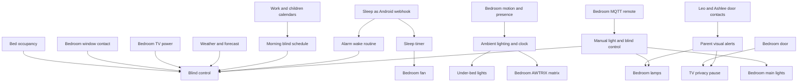
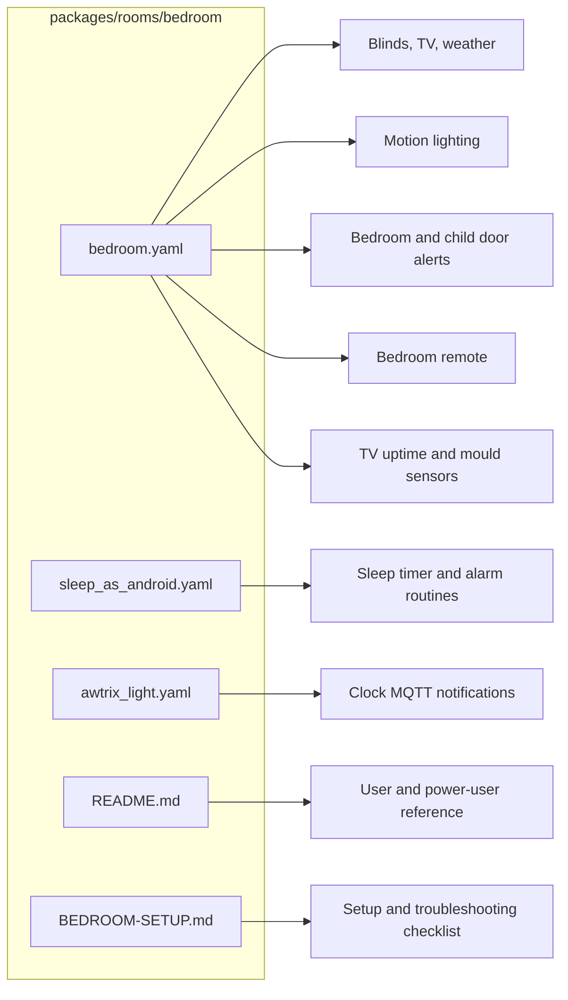
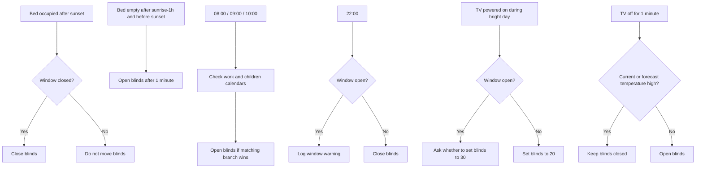
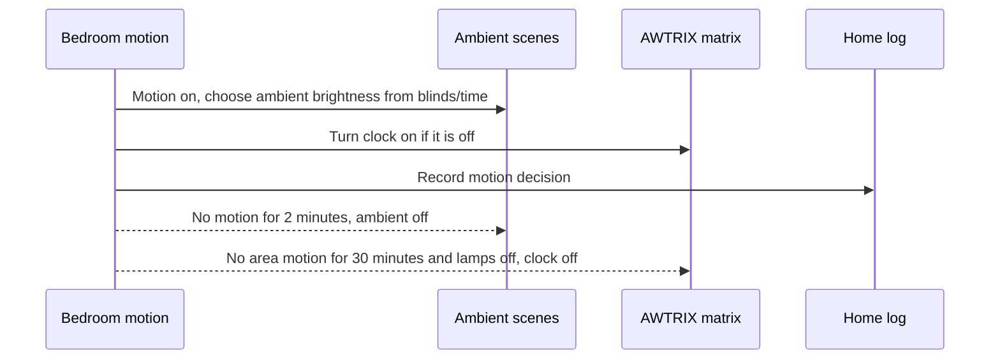
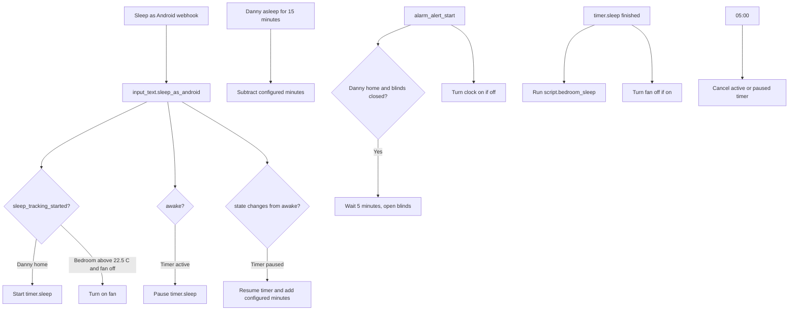

[<- Back to Rooms README](../README.md) · [Packages README](../../README.md) · [Main README](../../../README.md)

# Bedroom Package Documentation

The main bedroom package makes the room behave like a sleep, TV, and night-time parent-alert space without much manual control. It closes and opens the blinds around sleep, sunrise, TV use, weather, and the window contact; gives soft under-bed lighting from motion; manages the bedroom fan; receives Sleep as Android events; and flashes the bedroom lamps when Leo's or Ashlee's bedroom doors move after bedtime.

This documentation covers the YAML files in this folder:

| File | Purpose | Contents |
|------|---------|----------|
| `bedroom.yaml` | Main bedroom behavior | 24 automations, 5 scenes, 8 scripts, 5 sensors, 2 template binary sensors |
| `sleep_as_android.yaml` | Sleep tracking integration | 8 automations, 1 template binary sensor |
| `awtrix_light.yaml` | Bedroom clock MQTT notification helper | 1 script |

## Quick Summary

For non-technical users, the important behavior is:

| Area | What Happens |
|------|--------------|
| Blinds | Blinds close after sunset when someone is in bed, at 22:00, when the TV starts in bright daylight, or during hot sunny weather. They open in the morning, when the bed becomes empty during the day, after the TV turns off if it is not too hot, and five minutes after a Sleep as Android alarm if conditions match. |
| Window safety | Blind-closing automations check the bedroom window contact and either skip, wait, or ask before moving the blind when the window is open. |
| Motion lighting | Bedroom motion turns on soft under-bed lighting and the AWTRIX clock. No motion turns ambient lighting off after 2 minutes and turns the clock off after 30 minutes if the lamps are off. |
| Fan | The fan turns on when Sleep as Android starts and the room is above 22.5 C. It turns off after 2 hours, after 5 minutes with no mmWave presence, or when the sleep timer finishes. |
| Sleep tracking | Sleep as Android webhook events update `input_text.sleep_as_android`, control `timer.sleep`, open blinds on alarms, and log selected events based on notification level. |
| Parent alerts | If Leo's or Ashlee's door opens or closes after children's bedtime while bedroom lights are on, bedroom lamps flash blue or pink/green and the bedroom TV may pause or resume. |
| Remote control | The bedroom MQTT remote toggles main lights, toggles lamps and under-bed lights, opens/closes blinds, and adjusts bedroom lamp brightness with the dial. |
| TV tracking | A template binary sensor detects TV power from plug wattage, and history sensors track TV uptime today, yesterday, this week, and over the last 30 days. |

## How The Bedroom Decides What To Do

## Main Files

### `bedroom.yaml`

| Section | YAML Objects | Summary |
|---------|--------------|---------|
| Bed and blinds | 4 automations | Closes blinds when bed becomes occupied after sunset or a closed window makes it safe; opens blinds when the bed becomes empty during daylight. |
| Doors | 4 automations | Turns off stairs lights when the bedroom door closes, handles children door warnings, and pauses TV when the bedroom door opens late at night. |
| Motion and fan | 5 automations | Controls under-bed ambient lights, AWTRIX clock, and fan timeouts. |
| Timed blind control | 2 automations | Opens blinds at 08:00, 09:00, or 10:00 based on workday/calendar logic; closes blinds at 22:00. |
| TV and weather | 2 automations, 1 script | Lowers blinds for daytime TV glare, reopens them after TV use unless it is hot, and closes them during sunny hot weather. |
| Remote control | 6 automations | Handles four remote buttons plus dial brightness up/down for bedroom lamps. |
| Scenes | 5 scenes | Ambient on, dim ambient, ambient off, desk lamps on, desk lamps off. |
| Door alert scripts | 6 scripts | Flash bedroom lamps for Leo/Ashlee door open/close events and coordinate TV pause/resume. |
| Support scripts | 2 scripts | Weather-based blind closure and sleep-mode clock shutdown. |
| Sensors | 5 sensors, 2 template binary sensors | TV uptime, mould risk, TV powered-on state, and bed occupancy. |

### `sleep_as_android.yaml`

The Sleep as Android package receives webhook events, stores the latest event in `input_text.sleep_as_android`, manages `timer.sleep`, turns on the bedroom fan when sleep tracking starts in a warm room, opens blinds after alarm start when appropriate, and cancels any active or paused sleep timer at 05:00.

### `awtrix_light.yaml`

`script.send_bedroom_clock_notification` publishes a short MQTT notification to the AWTRIX topic from `sensor.bedroom_clock_device_topic`. It supports a required `message`, optional `icon`, and optional `duration` in seconds.

## User Controls

| Entity | Plain-English Purpose |
|--------|-----------------------|
| `input_boolean.enable_bedroom_blind_automations` | Master switch for automatic bedroom blind movement. |
| `input_boolean.enable_bedroom_motion_trigger` | Master switch for bedroom motion lighting. |
| `input_boolean.enable_bed_sensor` | Enables bedroom bed-occupancy behavior. |
| `input_boolean.enable_direct_notifications` | Allows the TV glare automation to send a direct actionable notification when the window is open. |
| `input_select.sleep_as_android_notification_level` | Controls how many Sleep as Android events are logged: `Start/Stop`, `Start/Stop/Alarms`, or `All`. |
| `input_number.sleep_timer_duration` | Sleep timer starting duration in minutes. |
| `input_number.sleep_as_android_time_to_add` | Minutes added when falling back asleep after being awake. |
| `input_number.sleep_as_android_time_to_subtract` | Minutes subtracted after 15 minutes of detected sleep. |
| `input_number.blind_open_position_threshold` | Shared threshold for treating blinds as open. |
| `input_number.blind_closed_position_threshold` | Shared threshold for treating blinds as closed. |
| `input_number.bedroom_blind_closed_threshold` | Bedroom-specific closed threshold used by some TV and timed-open logic. |

## Everyday Behavior

### Blind Control

| Situation | Result |
|-----------|--------|
| Someone gets into bed after sunset, the bed sensor is enabled, and the window is closed | Close `cover.bedroom_blinds`. |
| Bedroom window closes at night and blinds are not closed | Close blinds. |
| Bed becomes empty for 30 seconds between one hour before sunrise and sunset | Wait 1 minute, then open blinds. |
| Morning schedule fires | Open blinds at 08:00 for work/activity logic, 09:00 for non-workday activity logic, or 10:00 fallback. |
| 22:00 close schedule fires | Close blinds if the window is closed; log a warning if the window is open. |
| TV turns on in bright daytime | Lower blinds to 20 if the window is closed; send Danny an actionable prompt if the window is open and direct notifications are enabled. |
| TV turns off during daytime | Open blinds unless the current or next-hour forecast temperature is above `input_number.forecast_high_temperature`. |
| Weather script is called for `sunny` or `partlycloudy` before sunset | Close blinds if automations are enabled, blinds are open, and the window is closed. |

### Motion Lighting And Clock

Motion uses `binary_sensor.bedroom_motion_occupancy`. The clock-off long timeout uses `binary_sensor.bedroom_area_motion`, and the fan vacancy timeout uses `binary_sensor.bedroom_motion_3_presence`.

### Sleep As Android

Power-user note: `binary_sensor.danny_asleep` is `on` for any Sleep as Android state except `awake` and `sleep_tracking_stopped`.

### Children Door Warnings

The bedroom package watches Leo's and Ashlee's door contacts after `input_datetime.childrens_bed_time` when bedroom lights are on and home mode is not `Guest` or `No Children`.

| Door Event | Lamp Pattern | TV Behavior |
|------------|--------------|-------------|
| Leo door opens | Blue flash twice, then restore bedroom lamp state | Pause bedroom TV if it is playing `Web Video Caster`. |
| Leo door closes | Blue, green, off repeated twice, then restore bedroom lamp state | Resume bedroom TV if it is paused. |
| Ashlee door opens | Pink flash twice, then restore bedroom lamp state | Pause bedroom TV if it is playing `Web Video Caster`. |
| Ashlee door closes | Pink, green, off repeated twice, then restore bedroom lamp state | Resume bedroom TV if it is paused. |

### Bedroom Remote

| Control | Action |
|---------|--------|
| Button 1 | Toggle `light.bedroom_main_light` and `light.bedroom_main_light_2`. |
| Button 2 | Turn on `scene.bedroom_desk_lamps_on`, or turn off bedroom lamps and under-bed lights if lamps are already on. |
| Button 3 | Open bedroom blinds. |
| Button 4 | Close bedroom blinds. |
| Dial right / brightness up | Increase `light.bedroom_lamps` brightness using `sensor.bedroom_dial_remote_action_time`. |
| Dial left / brightness down | Decrease `light.bedroom_lamps` brightness using `sensor.bedroom_dial_remote_action_time`. |

## Entity Reference

| Entity | Purpose |
|--------|---------|
| `cover.bedroom_blinds` | Main bedroom blind. |
| `binary_sensor.bed_occupied` | Template bed occupancy from four bed pressure sensors. |
| `binary_sensor.bedroom_window_contact` | Window safety input for blinds. |
| `binary_sensor.bedroom_tv_powered_on` | Template TV power state from `sensor.bedroom_tv_plug_power > 40`. |
| `binary_sensor.danny_asleep` | Sleep as Android derived sleep state. |
| `light.under_bed_left`, `light.under_bed_right` | Ambient motion lighting. |
| `light.bedroom_lamps` | Lamp group used for lighting and child-door alerts. |
| `light.bedroom_clock_matrix` | AWTRIX clock matrix. |
| `switch.bedroom_fan` | Bedroom fan switch. |
| `media_player.bedroom_tv` | TV pause/resume target. |
| `timer.sleep` | Sleep timer managed from Sleep as Android states. |
| `sensor.bedroom_mould_indicator` | Mould risk sensor using bedroom and outdoor conditions. |

## Troubleshooting

| Issue | Check |
|-------|-------|
| Blinds did not move automatically | Check `input_boolean.enable_bedroom_blind_automations`, window contact state, blind position thresholds, and whether TV/weather logic intentionally kept them closed. |
| Blinds did not close at 22:00 | Check `binary_sensor.bedroom_window_contact`; the automation logs instead of closing while the window is open. |
| Motion did not turn on under-bed lights | Check `input_boolean.enable_bedroom_motion_trigger`, `binary_sensor.bedroom_motion_occupancy`, and whether the lights were already above brightness 100. |
| Clock stayed on | Check `binary_sensor.bedroom_area_motion`; the 30-minute clock-off rule only runs when bedroom lamps are off. |
| Fan did not turn on from sleep tracking | Check `person.danny`, `sensor.bedroom_area_mean_temperature`, `switch.bedroom_fan`, and the latest `input_text.sleep_as_android` event. |
| Sleep timer logs are too noisy or too quiet | Adjust `input_select.sleep_as_android_notification_level`. |
| Child-door lamp alerts did not run | Check bedroom lights are on, current time is after `input_datetime.childrens_bed_time`, and `input_select.home_mode` is not `Guest` or `No Children`. |
| AWTRIX notification did not appear | Check `sensor.bedroom_clock_device_topic` and MQTT connectivity. |
