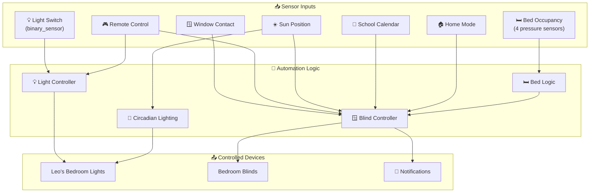
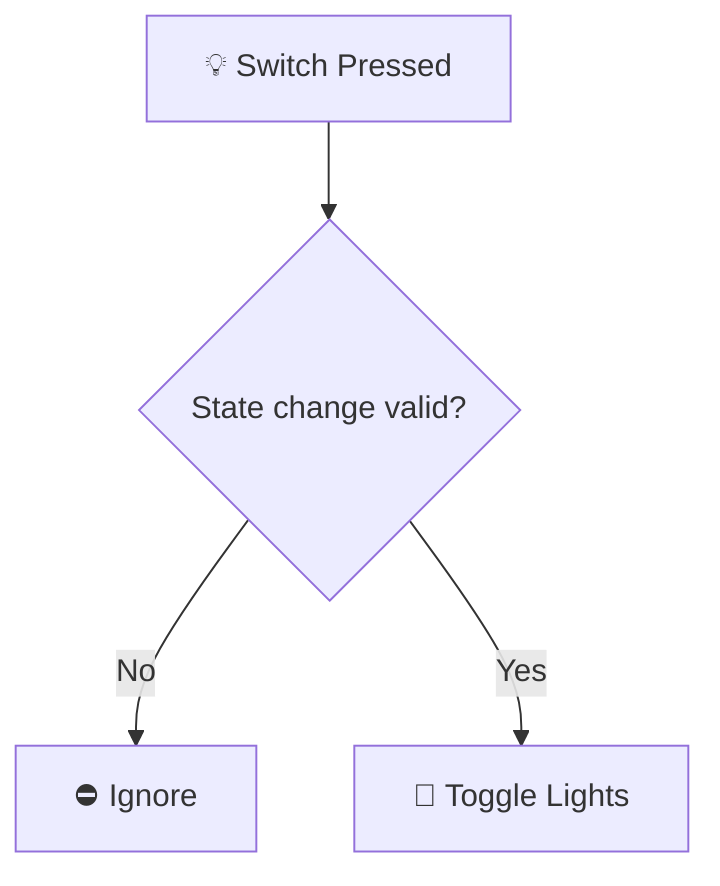
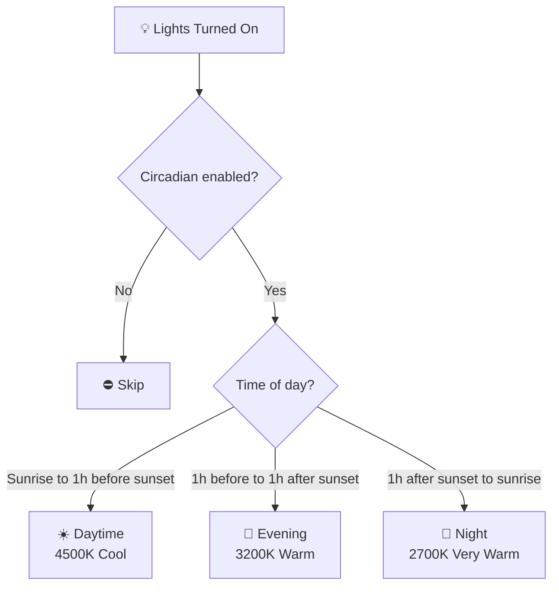
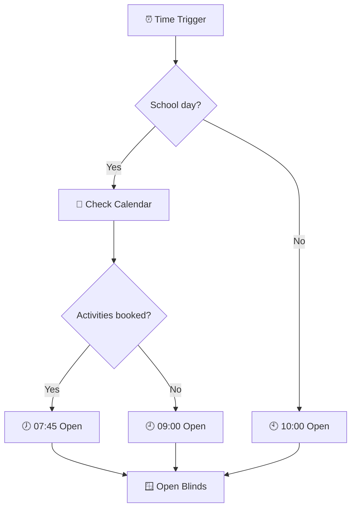
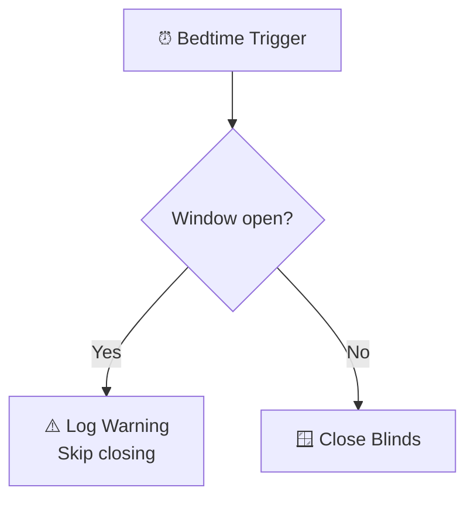
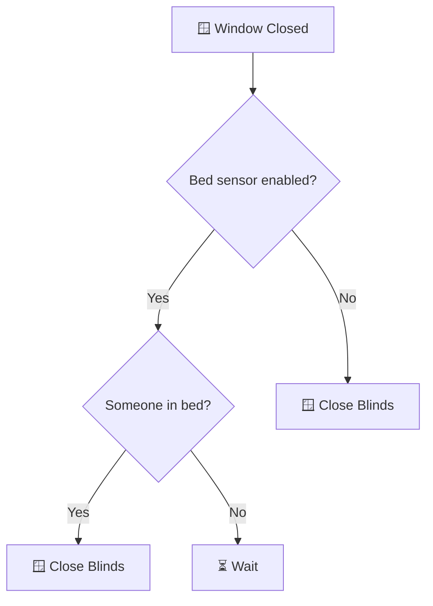
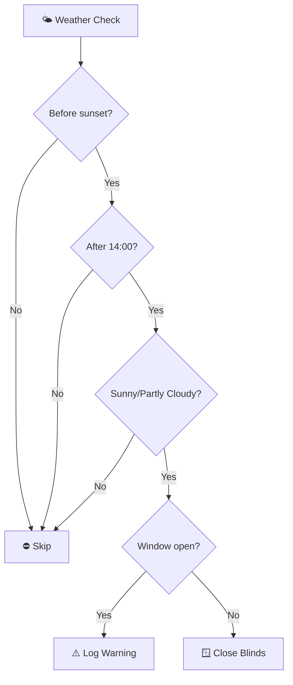
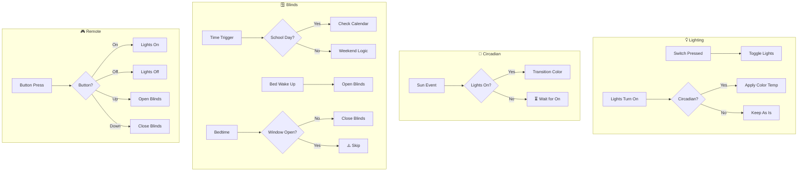

# Leo's Bedroom Package Documentation

This package manages Leo's bedroom automation including lighting control, circadian lighting, blind automation, bed occupancy sensing, and remote controls.

---

## Table of Contents

- [Overview](#overview)
- [Architecture](#architecture)
- [Automations](#automations)
  - [Lighting Control](#lighting-control)
  - [Circadian Lighting](#circadian-lighting)
  - [Blind Automation](#blind-automation)
  - [Remote Controls](#remote-controls)
- [Scenes](#scenes)
- [Scripts](#scripts)
- [Sensors](#sensors)
- [Configuration](#configuration)
- [Entity Reference](#entity-reference)

---

## Overview

Leo's bedroom automation provides intelligent lighting with circadian color temperature adjustment, automated blinds based on schedule and occupancy, and convenient remote control for lights and blinds.



---

## Architecture

### File Structure

```
packages/rooms/bedroom2/
├── bedroom2.yaml          # Main package file
└── README.md              # This documentation
```

### Key Components

| Component | Purpose |
|-----------|---------|
| `binary_sensor.leo_s_bedroom_main_light_input_0_input` | Physical light switch |
| `light.leo_s_bedroom_lights` | Main bedroom light group |
| `cover.leos_bedroom_blinds` | Motorized blinds |
| `binary_sensor.leos_bed_occupied` | Bed occupancy detection |
| `binary_sensor.leos_bedroom_window_contact` | Window open/closed state |
| `input_boolean.enable_leo_s_circadian_lighting` | Circadian lighting toggle |
| `input_boolean.enable_leos_blind_automations` | Blind automation master switch |
| `input_boolean.enable_leos_bed_sensor` | Bed sensor automation toggle |

---

## Automations

### Lighting Control

#### Leo's Bedroom: Light Switch Toggle
**ID:** `1766766745898`

Basic light toggle from physical wall switch.



**Triggers:**
- State change on `binary_sensor.leo_s_bedroom_main_light_input_0_input`

**Conditions:**
- Not transitioning from/to `unavailable` or `unknown`

**Actions:**
- Toggle `light.leo_s_bedroom_lights`

---

### Circadian Lighting

#### Leo's Bedroom: Apply Circadian Color Temperature
**ID:** `1736794523847`

Automatically sets color temperature based on sun position when lights turn on.



**Color Temperature Schedule:**
| Time Period | Color Temp | Description |
|-------------|------------|-------------|
| Sunrise to 1h before sunset | 4500K | Daytime/Cool |
| 1h before to 1h after sunset | 3200K | Evening/Warm |
| 1h after sunset to sunrise | 2700K | Night/Very Warm |

**Conditions:**
- `input_boolean.enable_leo_s_circadian_lighting` is `on`

---

#### Leo's Bedroom: Scheduled Circadian Transitions
**ID:** `1736794524951`

Gradually transitions color temperature at key sun events if lights are on.

**Triggers:**
| Trigger ID | Event | Transition |
|------------|-------|------------|
| `morning` | Sunrise | → 4500K (5 min transition) |
| `evening` | 1h before sunset | → 3200K (5 min transition) |
| `night` | 1h after sunset | → 2700K (10 min transition) |

**Actions:**
- Logs transition message
- Applies color temperature with smooth transition

---

### Blind Automation

#### Leo's Bedroom: Timed Open Blinds Weekday
**ID:** `1627285063813`

Smart weekday blind opening based on school schedule.



**Trigger Times:**
- 07:45 - School day early open
- 08:00 - Alternative school day
- 09:00 - Activity day check
- 10:00 - Fallback open

**Conditions:**
- Blind automations enabled
- Blinds are closed (below threshold)
- Not in Guest or No Children mode
- Workday sensor is `on`

**Logic:**
1. Checks school calendar for booked activities
2. Excludes half term and holidays
3. Opens at 07:45 if school activities detected
4. Opens at 09:00 if activities detected but no early school
5. Opens at 10:00 as final fallback

---

#### Leo's Bedroom: Timed Open Blinds Weekend No Children Mode
**ID:** `1627285063814`

Weekend blind opening when in "No Children" mode.

**Triggers:**
- 09:00 daily

**Conditions:**
- Blind automations enabled
- Blinds are closed
- Home mode is "No Children"
- Not a workday

---

#### Leo's Bedroom: Timed Close Blinds
**ID:** `1629844319596`

Evening blind closure at bedtime.

**Triggers:**
- `input_datetime.childrens_bed_time` (dynamic bedtime)
- 22:00 (no children mode fallback)

**Safety Check:**


**Conditions:**
- Blinds are open (above threshold)
- Blind automations enabled

---

#### Leo's Room: Close Blinds Before Sun Rise
**ID:** `1617376203344`

Early morning blind closure to prevent sunrise wake-up.

**Triggers:**
- 2 hours before sunrise

**Conditions:**
- Blinds are open
- Window is closed

---

#### Leo's Room: Open Blinds In The Morning
**ID:** `1617376413056`

Manual morning blind opening at 09:30.

**Triggers:**
- 09:30 daily

**Conditions:**
- Blinds are closed
- Blind automations enabled

---

#### Leo's Room: Open Blinds When Leo Wakes Up
**ID:** `1617458869658`

Automatic blind opening when Leo gets out of bed.

**Triggers:**
- Bed occupancy changes from `on` to `off`

**Conditions:**
- Time between 07:00 and 12:00
- Blinds are closed
- Blind automations enabled
- Bed sensor automations enabled
- Not in Guest mode

---

#### Leo's Room: Window Closed At Night
**ID:** `1619254173098`

Closes blinds when window is closed in the evening.

**Triggers:**
- Window contact changes from `on` (open) to `off` (closed)

**Conditions:**
- Blinds are open
- Time after 18:30
- Blind automations enabled

**Logic:**


---

### Remote Controls

MQTT-based remote control automations for lights and blinds.

| Automation | ID | Trigger | Action |
|------------|-----|---------|--------|
| Remote Turn On | `1699308571381` | On button press | Turn on main light |
| Remote Turn Off | `1699308571382` | Off button press | Turn off main light |
| Remote Up | `1699308571383` | Up button press | Open blinds |
| Remote Down | `1699308571384` | Down button press | Close blinds |

**Device:** MQTT device ID `7da5565cc39ea45df83d982a085622b6`

---

## Scenes

### Leo's Bedroom Normal
**ID:** `1766767025483`

Full brightness white lighting for both bedroom lights.

| Entity | State | Brightness | Color |
|--------|-------|------------|-------|
| `light.leos_bedroom_1` | on | 255 (100%) | White (255, 254, 254) |
| `light.leos_bedroom_2` | on | 255 (100%) | White (255, 254, 254) |

---

### Leo's Bedroom Dim
**ID:** `1766767025484`

Dimmed green lighting for relaxed atmosphere.

| Entity | State | Brightness | Color |
|--------|-------|------------|-------|
| `light.leos_bedroom_1` | on | 92 (36%) | Green (11, 255, 0) |
| `light.leos_bedroom_2` | on | 92 (36%) | Green (11, 255, 0) |

---

## Scripts

### Leo's Bedroom Close Blinds Based Weather
**Alias:** `leos_bedroom_close_blinds_by_weather`

Closes blinds based on weather conditions to prevent overheating.



**Fields:**
| Field | Type | Description |
|-------|------|-------------|
| `temperature` | number | Temperature in Celsius (-20 to 50) |
| `weather_condition` | text | Weather condition string (e.g., `sunny`, `partlycloudy`) |

**Conditions:**
- Before sunset
- After 14:00 (when sun reaches back of house)
- Blind automations enabled
- Blinds are open

**Logic:**
- Only closes for `sunny` or `partlycloudy` conditions
- Checks if window is open (logs warning if so)
- Closes blinds to prevent room heating

---

## Sensors

### Mold Indicator

**Sensor:** `sensor.leos_bedroom_mould_indicator`

Calculates mold risk based on indoor vs outdoor conditions.

**Inputs:**
| Sensor | Purpose |
|--------|---------|
| `sensor.leos_bed_temperature` | Indoor temperature |
| `sensor.leos_bed_humidity` | Indoor humidity |
| `sensor.gw2000a_outdoor_temperature` | Outdoor temperature |

**Calibration Factor:** 1.44

---

### Template Binary Sensor: Leos Bed Occupied

**Entity:** `binary_sensor.leos_bed_occupied`

Detects bed occupancy using 4 pressure sensors.

**Sensor Positions:**
| Position | Entity | Threshold |
|----------|--------|-----------|
| Top Left | `sensor.leos_bed_top_left` | ≥ 0.06 |
| Top Right | `sensor.leos_bed_top_right` | ≥ 0.06 |
| Bottom Left | `sensor.leos_bed_bottom_left` | ≥ 0.07 |
| Bottom Right | `sensor.leos_bed_bottom_right` | ≥ 0.06 |

**Icon Logic:**
- `mdi:bed-double` when occupied
- `mdi:bed-double-outline` when empty

**Attributes:**
- `top_left`: Raw sensor value
- `top_right`: Raw sensor value
- `bottom_left`: Raw sensor value
- `bottom_right`: Raw sensor value

---

## Configuration

### Input Booleans

| Entity | Purpose |
|--------|---------|
| `input_boolean.enable_leo_s_circadian_lighting` | Enable circadian color temperature |
| `input_boolean.enable_leos_blind_automations` | Master switch for blind automations |
| `input_boolean.enable_leos_bed_sensor` | Enable bed sensor automations |

### Input Numbers

| Entity | Purpose |
|--------|---------|
| `input_number.blind_closed_position_threshold` | Position below which blinds are considered closed |
| `input_number.blind_open_position_threshold` | Position above which blinds are considered open |

### Input Datetime

| Entity | Purpose |
|--------|---------|
| `input_datetime.childrens_bed_time` | Dynamic bedtime for children |

### Input Select

| Entity | Purpose |
|--------|---------|
| `input_select.home_mode` | Home mode (Guest, No Children, etc.) |

---

## Entity Reference

### Lights

| Entity | Type | Purpose |
|--------|------|---------|
| `light.leo_s_bedroom_lights` | Group | All bedroom lights |
| `light.leos_bedroom_main_light` | Main | Primary ceiling light |
| `light.leos_bedroom_1` | Individual | Bedroom light 1 |
| `light.leos_bedroom_2` | Individual | Bedroom light 2 |

### Covers

| Entity | Purpose |
|--------|---------|
| `cover.leos_bedroom_blinds` | Motorized window blinds |

### Binary Sensors

| Entity | Purpose |
|--------|---------|
| `binary_sensor.leo_s_bedroom_main_light_input_0_input` | Light switch state |
| `binary_sensor.leos_bed_occupied` | Bed occupancy |
| `binary_sensor.leos_bedroom_window_contact` | Window open/closed |
| `binary_sensor.workday_sensor` | Workday detection |

### Sensors

| Entity | Purpose |
|--------|---------|
| `sensor.leos_bed_top_left` | Bed pressure (top left) |
| `sensor.leos_bed_top_right` | Bed pressure (top right) |
| `sensor.leos_bed_bottom_left` | Bed pressure (bottom left) |
| `sensor.leos_bed_bottom_right` | Bed pressure (bottom right) |
| `sensor.leos_bed_temperature` | Bedroom temperature |
| `sensor.leos_bed_humidity` | Bedroom humidity |
| `sensor.leos_bedroom_mould_indicator` | Mold risk indicator |

### Calendars

| Entity | Purpose |
|--------|---------|
| `calendar.work` | Work calendar for scheduling |
| `calendar.tsang_children` | Children's activities calendar |

---

## Automation Flow Summary



---

## Related Documentation

| Document | Purpose |
|----------|---------|
| [Rooms Overview](../README.md) | Overview of all room packages |
| [Main Packages README](../../README.md) | Architecture and organization guidelines |

### Related Rooms

| Room | Connection |
|------|------------|
| [Bedroom](../bedroom/README.md) | Shared children's door monitoring patterns |

### Related Integrations

| Integration | Connection |
|-------------|------------|
| [Energy](../../integrations/energy/README.md) | Sun position for circadian lighting |
| [HVAC](../../integrations/hvac/README.md) | Temperature/humidity sensing |

---

## Maintenance Notes

### Troubleshooting

| Issue | Check |
|-------|-------|
| Circadian not working | `input_boolean.enable_leo_s_circadian_lighting` state |
| Blinds not opening | `input_boolean.enable_leos_blind_automations` state |
| Bed sensor not triggering | `input_boolean.enable_leos_bed_sensor` state |
| Blinds won't close at bedtime | Window contact state (must be closed) |
| Remote not responding | MQTT device connectivity |

### Known Issues

**Circadian Lighting Target Entity Bug (IDs: 1736794523847, 1736794524951)**

The evening and night color temperature actions in both circadian lighting automations incorrectly target `input_boolean.enable_leo_s_circadian_lighting` instead of `light.leo_s_bedroom_lights`. As a result, only the daytime (4500K) temperature is applied to the actual lights; the evening (3200K) and night (2700K) transitions do not take effect.

---

### Seasonal Adjustments

- **Summer:** Consider adjusting weather-based blind closing thresholds
- **Winter:** May want to delay morning blind opening times
- **School holidays:** Calendar integration automatically excludes half terms

### Device-Specific Notes

**Bed Pressure Sensors:**
- 4 sensors provide full bed coverage
- Different thresholds for bottom left sensor (0.07 vs 0.06)
- Useful for detecting when Leo gets up in the morning

**Circadian Lighting:**
- Transitions are smooth (1-10 minutes)
- Only applies when lights are turned on or at sun events
- Can be disabled per-room for flexibility

---

*Last updated: 2026-04-01*
