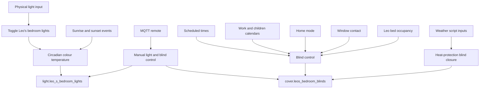
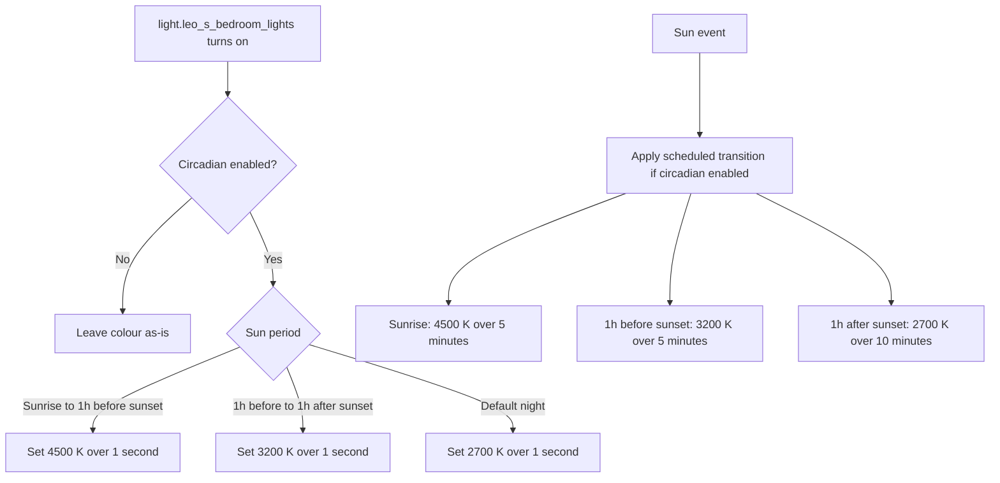
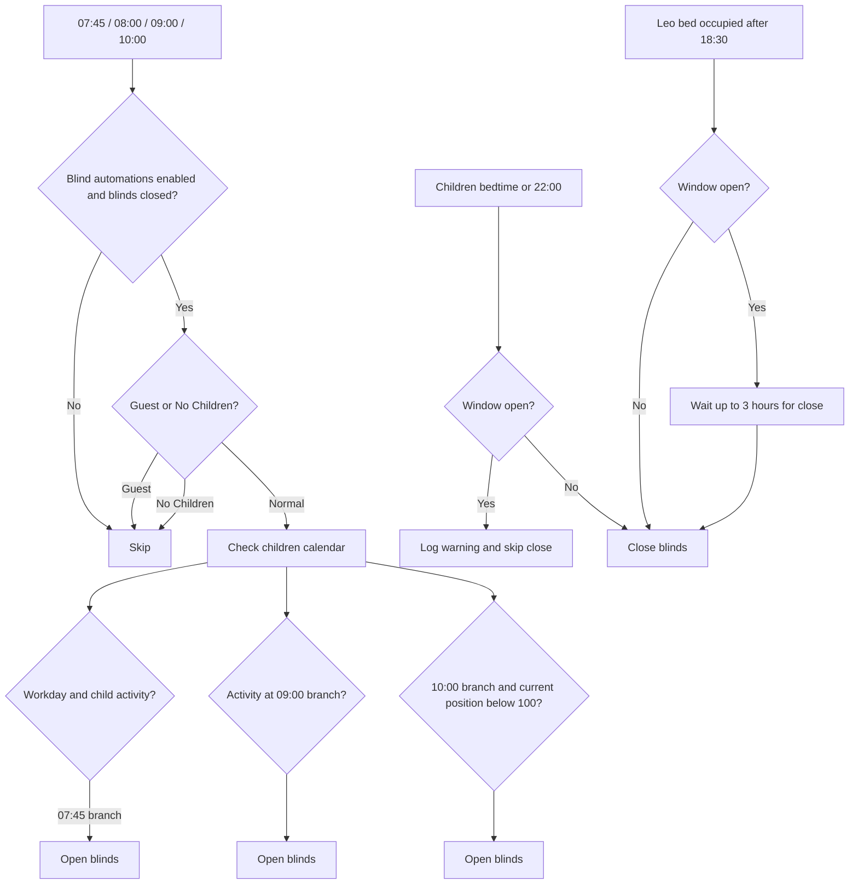

[<- Back to Rooms README](README.md) · [Packages README](../README.md) · [Main README](../../README.md)

# Leo's Bedroom Package Documentation

Leo's bedroom package manages simple physical controls, circadian colour temperature, calendar-aware blind schedules, bed-occupancy blind closing, weather-based heat protection, and mould-risk monitoring.

This documentation covers `packages/rooms/bedroom2.yaml`.

| File | Purpose | Contents |
|------|---------|----------|
| `bedroom2.yaml` | Leo's bedroom behavior | 15 automations, 1 script, 2 scenes, 1 sensor, 1 template binary sensor |

## Quick Summary

For non-technical users, the important behavior is:

| Area | What Happens |
|------|--------------|
| Light switch | The physical main-light input toggles `light.leo_s_bedroom_lights`. |
| Circadian lighting | When the light group turns on, it is set to 4500 K daytime, 3200 K around sunset, or 2700 K at night. Sun-event transitions also apply those colours with longer transitions. |
| Morning blinds | Blinds open from scheduled time branches using workday state, children's calendar events, `Guest` mode, and `No Children` mode. |
| Bedtime blinds | Blinds close at children's bedtime or at 22:00, unless the window is open. |
| Sunrise protection | If blinds were left open, they close two hours before sunrise when the window is closed. |
| Bed occupancy | If Leo gets into bed after 18:30 and automations are enabled, the blinds close or wait up to 3 hours for the window to close. |
| Remote control | The MQTT remote turns the main light on/off and opens/closes the blinds. |
| Weather protection | A script can close blinds after 14:00 on sunny or partly cloudy days if the window is closed. |

## How Leo's Bedroom Decides What To Do

## Main File

### `bedroom2.yaml`

| Section | YAML Objects | Summary |
|---------|--------------|---------|
| Lights | 1 automation | Toggles the light group from the physical input. |
| Circadian lighting | 2 automations | Applies colour temperature when lights turn on and at sun events. |
| Blinds | 7 automations | Handles morning schedules, bedtime closing, sunrise closing, wake-up opening, window-closed evening catch-up, and bed-occupied closing. |
| Remote | 4 automations | Maps on/off/up/down remote actions to main light and blind controls. |
| Weather script | 1 script | Closes blinds on sunny or partly cloudy afternoons when safe. |
| Scenes | 2 scenes | `Leo's Bedroom Normal` and `Leo's Bedroom Dim`. |
| Sensors | 1 sensor, 1 template binary sensor | Mould indicator and Leo bed occupancy. |

## User Controls

| Entity | Plain-English Purpose |
|--------|-----------------------|
| `input_boolean.enable_leo_s_circadian_lighting` | Enables automatic colour temperature changes. |
| `input_boolean.enable_leos_blind_automations` | Master switch for Leo's automatic blind movement. |
| `input_boolean.enable_leos_bed_sensor` | Enables bed-occupancy blind behavior. |
| `input_select.home_mode` | `Guest` and `No Children` modes suppress some child-room schedules. |
| `input_datetime.childrens_bed_time` | Bedtime close trigger. |
| `input_number.blind_open_position_threshold` | Shared threshold for treating blinds as open. |
| `input_number.blind_closed_position_threshold` | Shared threshold for treating blinds as closed. |

## Everyday Behavior

### Lighting And Circadian Colour

Power-user note: the scheduled sun-event automation does not check whether the lights are already on; it calls `light.turn_on`, so it can turn the light group on at those transition times.

### Blind Control

| Situation | Result |
|-----------|--------|
| Weekday scheduled open runs with eligible children's calendar activity | Opens blinds on the matching 07:45 or 09:00 branch. |
| 10:00 fallback branch runs | Opens blinds if current blind state is below 100. |
| `No Children` mode on a non-workday at 09:00 | Opens blinds through the dedicated weekend/no-children automation. |
| Children's bedtime or 22:00 fires | Closes blinds if the window is closed; logs and skips if the window is open. |
| Two hours before sunrise and blinds are open | Closes blinds if the window is closed. |
| Leo gets out of bed between 07:00 and 12:00 | Opens blinds if closed, automations are enabled, and not in `Guest` mode. |
| Leo's window closes after 18:30 | Closes blinds only if bed sensor is enabled and bed occupied, or if the bed sensor toggle is off. |
| Leo gets into bed after 18:30 | Closes blinds, or waits for the window to close before closing. |

### Remote Control

| Control | Action |
|---------|--------|
| On button | Turn on `light.leos_bedroom_main_light`. |
| Off button | Turn off `light.leos_bedroom_main_light`. |
| Up button | Open `cover.leos_bedroom_blinds`. |
| Down button | Close `cover.leos_bedroom_blinds`. |

### Weather Script

`script.leos_bedroom_close_blinds_by_weather` expects `temperature` and `weather_condition`. It only acts before sunset, after 14:00, when blind automations are enabled, and when blinds are above the open threshold. For `sunny` or `partlycloudy`, it logs a warning if the window is open or closes the blinds if the window is closed.

## Entity Reference

| Entity | Purpose |
|--------|---------|
| `light.leo_s_bedroom_lights` | Light group used by switch and circadian automations. |
| `light.leos_bedroom_main_light` | Main light controlled by the MQTT remote. |
| `cover.leos_bedroom_blinds` | Leo's bedroom blind. |
| `binary_sensor.leos_bed_occupied` | Template occupancy sensor from four bed pressure sensors. |
| `binary_sensor.leos_bedroom_window_contact` | Window safety input for blind movement. |
| `sensor.leos_bedroom_mould_indicator` | Mould risk sensor using bedroom and outdoor conditions. |
| `sensor.leos_bed_top_left`, `sensor.leos_bed_top_right`, `sensor.leos_bed_bottom_left`, `sensor.leos_bed_bottom_right` | Bed pressure inputs. |
| `calendar.work`, `calendar.tsang_children` | Calendar inputs for morning blind schedules. |

## Troubleshooting

| Issue | Check |
|-------|-------|
| Lights change colour unexpectedly at sunrise/sunset | Check `input_boolean.enable_leo_s_circadian_lighting`; scheduled transitions call `light.turn_on`. |
| Blinds do not open in the morning | Check `input_boolean.enable_leos_blind_automations`, `input_select.home_mode`, `binary_sensor.workday_sensor`, `calendar.tsang_children`, and current blind position. |
| Blinds do not close at bedtime | Check `binary_sensor.leos_bedroom_window_contact`; an open window logs and skips closing. |
| Bed occupancy did not trigger | Check `input_boolean.enable_leos_bed_sensor` and the four bed pressure sensors. Thresholds are top left `0.06`, top right `0.06`, bottom left `0.07`, bottom right `0.06`. |
| Weather script did nothing | Check it is before sunset, after 14:00, weather condition is `sunny` or `partlycloudy`, blinds are above the open threshold, and the window is closed. |
| Remote does not respond | Check the MQTT device `7da5565cc39ea45df83d982a085622b6` is online and publishing button actions. |
