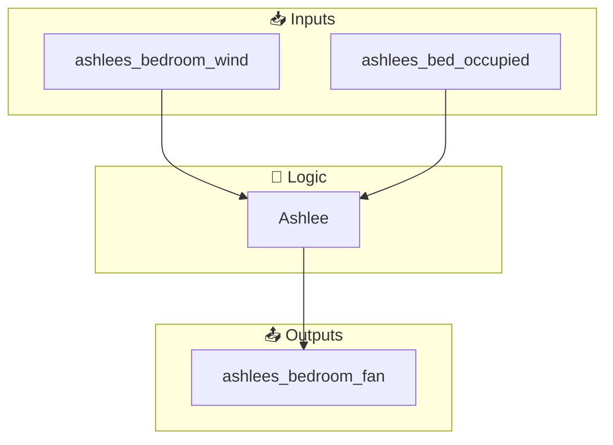
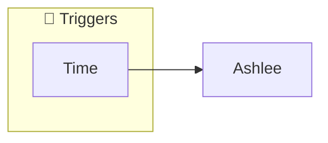
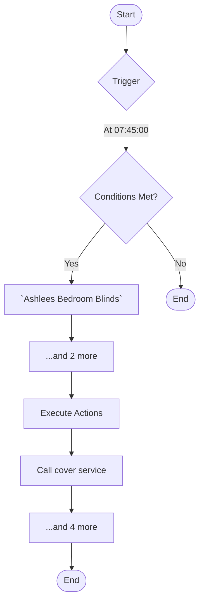
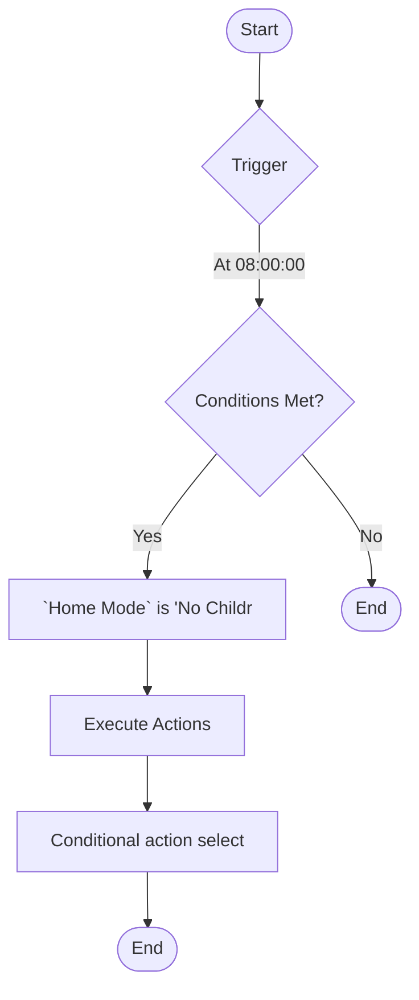
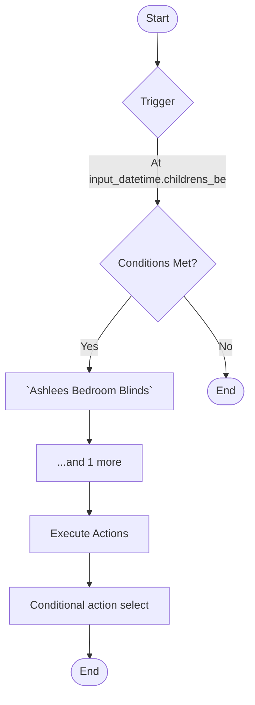
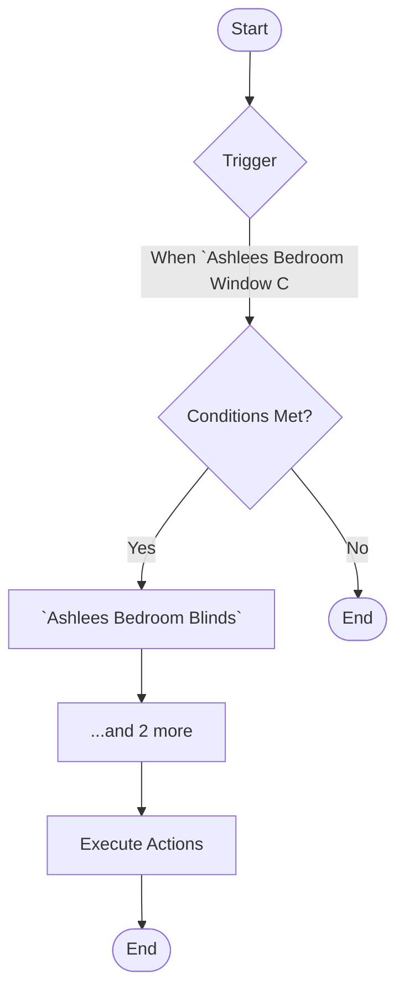

[<- Back to Rooms README](../README.md) · [Packages README](../../README.md) · [Main README](../../../README.md)

# Bedroom3

This package manages 10 automations and 0 scripts for bedroom3.

---

## Table of Contents

- [Overview](#overview)
- [Purpose](#purpose)
- [How It Works](#how-it-works)
- [Automations](#automations)
- [Entities](#entities)
- [Troubleshooting](#troubleshooting)
- [Related Files](#related-files)
- [Notes](#notes)

---

## Overview

This package provides automation for **bedroom3**. It includes 10 automations and 0 scripts.

### File Structure

```
packages/rooms/
├── bedroom3.yaml  # Main package configuration
└── README.md                           # This documentation
```

---

## Purpose

- **Ashlee**: 
- **Ashlee**: 
- **Ashlee**: 
- **Ashlee**: 
- **Ashlee**: 

### Package Architecture

The following diagram shows the high-level flow of this package:



---

## How It Works

This section explains the overall behavior and logic of the package.

### Automation Logic

**Ashlee**
Triggered when: At 07:45:00

**Ashlee**
Triggered when: At 08:00:00

**Ashlee**
Triggered when: At input_datetime.childrens_bed_time

*... plus 7 additional automations. See [Automations](#automations) section for details.*

### Workflow Diagram

The following diagram illustrates the automation flow:



---

## Automations

Detailed documentation for each automation in this package.

### Ashlee

**Automation ID:** `1599994669457`

#### Trigger

- At 07:45:00

#### Conditions

All conditions must be met for the automation to execute:

- `Ashlees Bedroom Blinds` state check
- `Home Mode` is 'Guest'
- `Ashlees Bedroom Blinds` is below input_number.blind_closed_position_threshold

#### Actions

1. Call cover service
2. Call cover service
3. Call cover service
4. Execute actions in parallel
5. Conditional action selection

#### Flow Diagram



### Ashlee

**Automation ID:** `1599994669458`

#### Trigger

- At 08:00:00

#### Conditions

All conditions must be met for the automation to execute:

- `Home Mode` is 'No Children'

#### Actions

1. Conditional action selection

#### Flow Diagram



### Ashlee

**Automation ID:** `1605925028960`

#### Trigger

- At input_datetime.childrens_bed_time

#### Conditions

All conditions must be met for the automation to execute:

- `Ashlees Bedroom Blinds` state check
- `Ashlees Bedroom Blinds` is above input_number.blind_closed_position_threshold

#### Actions

1. Conditional action selection

#### Flow Diagram



### Ashlee

**Automation ID:** `1622891806607`

#### Trigger

- When `Ashlees Bedroom Window Contact` changes from 'on' to 'off'

#### Conditions

All conditions must be met for the automation to execute:

- `Ashlees Bedroom Blinds` state check
- Time is after input_datetime.childrens_bed_time
- `Ashlees Bedroom Blinds` is above input_number.blind_closed_position_threshold

#### Actions

- *See YAML for action details*

#### Flow Diagram



### Ashlee

**Automation ID:** `1655237597647`

#### Trigger

- When `Ashlees Bed Occupied` changes from 'off' to 'on'

#### Actions

1. Execute actions in parallel
2. Conditional action selection

### Ashlee

**Automation ID:** `1655235874989`

#### Trigger

- When `Ashlees Bedroom Fan` changes to 'on'

#### Actions

1. Execute actions in parallel

### Ashlee

**Automation ID:** `1656355431188`

#### Trigger

- *See YAML for trigger details*

#### Actions

- *See YAML for action details*

### Ashlee

**Automation ID:** `1656355431189`

#### Trigger

- *See YAML for trigger details*

#### Actions

1. Execute actions in parallel

### Ashlee

**Automation ID:** `1656355431190`

#### Trigger

- *See YAML for trigger details*

#### Actions

1. Execute actions in parallel

### Ashlee

**Automation ID:** `1656355431191`

#### Trigger

- *See YAML for trigger details*

#### Actions

1. Execute actions in parallel

---

## Entities

Key entities used or created by this package.

### Template Sensors

- `Ashlees Bed Occupied`

### Referenced Entities

- `calendar.work`
- `calendar.tsang_children`
- `binary_sensor.ashlees_bedroom_window_contact`
- `binary_sensor.ashlees_bed_occupied`
- `switch.ashlees_bedroom_fan`

---

## Troubleshooting

Common issues and how to resolve them.

### Automation Issues

| Issue | Possible Cause | Resolution |
|-------|---------------|------------|
| Automation not triggering | Entity unavailable or condition not met | Check entity states in Developer Tools |
| Automation fires unexpectedly | Trigger too broad or condition missing | Review trigger entity and add conditions |
| Actions not executing | Service call invalid or entity offline | Verify service and entity in YAML |

### General Debugging

1. Check Home Assistant logs for errors
2. Verify all referenced entities exist in Developer Tools
3. Test automations manually using the 'Run' button
4. Review traces for executed automations to see execution path

---

## Related Files

| File | Description |
|------|-------------|
| [`packages/rooms/bedroom3.yaml`](./bedroom3.yaml) | Main package YAML configuration |
| [Rooms Overview](../README.md) | Overview of all room packages |
| [Main Packages README](../../README.md) | Architecture and organization guidelines |

---

## Notes

### Design Decisions

- **Ashlee** triggers on state transitions (edge detection) rather than continuous state

---

*Last updated: 2026-04-09*
