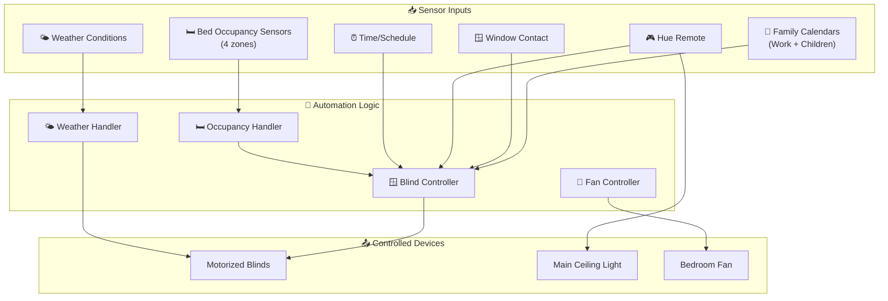
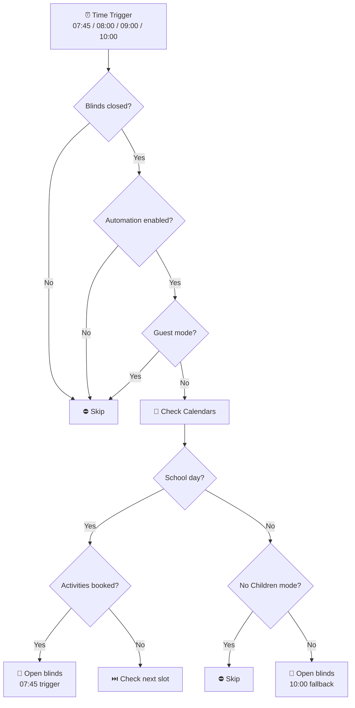
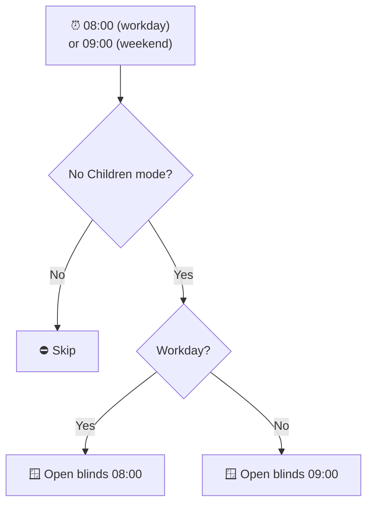
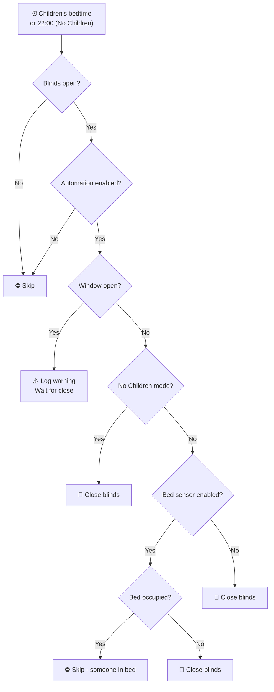
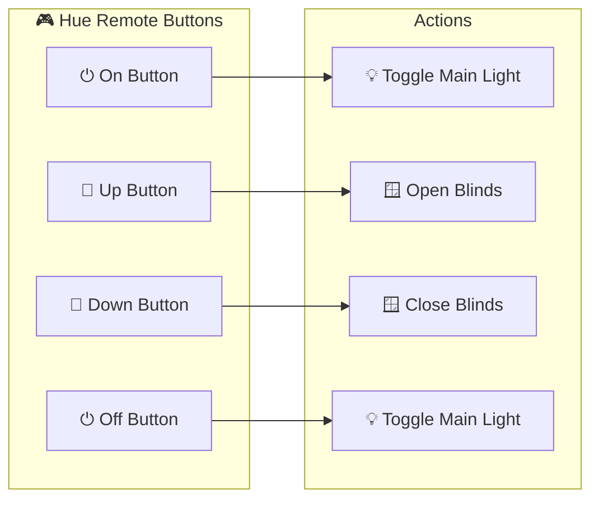
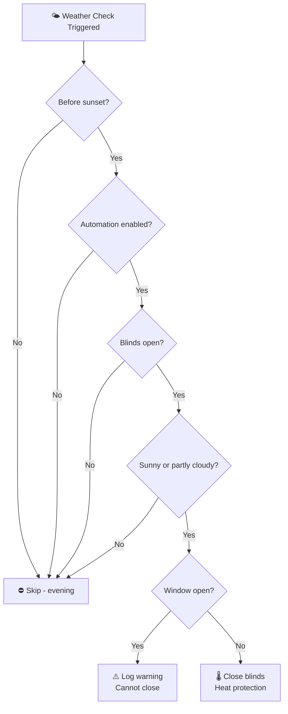

# Ashlee's Bedroom (Bedroom3) Package Documentation

This package manages Ashlee's bedroom automation including smart blind control with calendar integration, bed occupancy detection, fan control, Hue remote integration, and mold monitoring.

---

## Table of Contents

- [Overview](#overview)
- [Architecture](#architecture)
- [Automations](#automations)
  - [Blind Control](#blind-control)
  - [Switches](#switches)
  - [Hue Remote](#hue-remote)
- [Scripts](#scripts)
- [Sensors](#sensors)
- [Configuration](#configuration)
- [Entity Reference](#entity-reference)

---

## Overview

Ashlee's bedroom features intelligent blind automation that adapts to school schedules, calendar events, and bed occupancy. The system integrates with family calendars to determine when to open blinds for school days vs. holidays, monitors bed occupancy for privacy-aware blind control, and includes a weather-responsive script for temperature management.



---

## Architecture

### File Structure

```
packages/rooms/bedroom3/
├── bedroom3.yaml      # Main package file
└── README.md          # This documentation
```

### Key Components

| Component | Purpose |
|-----------|---------|
| `cover.ashlees_bedroom_blinds` | Motorized blinds |
| `binary_sensor.ashlees_bed_occupied` | Bed occupancy detection |
| `binary_sensor.ashlees_bedroom_window_contact` | Window open/closed state |
| `switch.ashlees_bedroom_fan` | Bedroom fan control |
| `light.ashlees_bedroom_main_light` | Main ceiling light |
| `sensor.ashlees_bed_*` | Bed pressure sensors (4 zones) |
| `calendar.work` / `calendar.tsang_children` | Family calendars for scheduling |

---

## Automations

### Blind Control

#### Ashlee's Bedroom: Open Blinds In The Morning
**ID:** `1599994669457`

Sophisticated morning blind opening with calendar-aware scheduling for school days and holidays.



**Triggers:**
- 07:45:00 (school day early)
- 08:00:00
- 09:00:00
- 10:00:00 (fallback)

**Conditions:**
- Blinds are below closed threshold
- `input_boolean.enable_ashlees_blind_automations` is `on`
- Not in "Guest" home mode

**Logic:**
1. Queries `calendar.work` and `calendar.tsang_children` for next 2 hours
2. On school days (workday + children's activities, excluding half term/holidays): opens at 07:45
3. On activity days: opens when activities are scheduled
4. Fallback at 10:00 if not in "No Children" mode

**Actions:**
- Logs with clock emoji
- Opens blinds with retry logic (3 attempts, exponential backoff)

---

#### Ashlee's Bedroom: Open Blinds In The Morning No Children Mode
**ID:** `1599994669458`

Handles blind opening when house is in "No Children" mode with different timing for workdays vs weekends.



**Triggers:**
- 08:00:00 (workday trigger)
- 09:00:00 (non-workday trigger)

**Conditions:**
- `input_select.home_mode` is "No Children"

---

#### Ashlee's Bedroom: Timed Close Blinds
**ID:** `1605925028960`

Evening blind closing with bed occupancy awareness and window safety check.



**Triggers:**
- `input_datetime.childrens_bed_time`
- 22:00:00 (No Children mode)

**Safety Feature:**
- If window is open, logs warning and waits for window to close

**Bed Occupancy Logic:**
- If bed sensor enabled and bed occupied: skips closing
- If bed sensor disabled: closes regardless

---

#### Ashlee's Bedroom: Window Closed After Dark
**ID:** `1622891806607`

Closes blinds when window is closed after bedtime if they were left open.

**Triggers:**
- Window contact changes from `on` to `off` (closed)
- Must be closed for 1 minute

**Conditions:**
- Blinds are above open threshold
- Blind automations enabled
- After children's bedtime

**Actions:**
- Logs "Window closed and it's dark. Closing blinds."
- Closes blinds

---

#### Ashlee's Bedroom: Someone Is In Bed
**ID:** `1655237597647`

Closes blinds when someone gets into bed after bedtime.

**Triggers:**
- `binary_sensor.ashlees_bed_occupied` changes to `on` for 30 seconds

**Conditions:**
- Bed sensor enabled
- Blind automations enabled
- Blinds are below closed threshold (already closed)
- After bedtime OR before 05:00
- Window is closed

**Actions:**
- Logs "Someone is in Ashlee's bed after 🕢. Closing blinds."
- Closes blinds

---

### Switches

#### Ashlee's Bedroom: Turn Off Fan After 1 Hour
**ID:** `1655235874989`

Automatically turns off the bedroom fan after it has been running for 1 hour.

**Triggers:**
- `switch.ashlees_bedroom_fan` is `on` for 1 hour

**Actions:**
- Logs "Fan has been on for an hour. Turning fan off."
- Turns off fan switch

---

### Hue Remote

The Hue remote provides physical control for lights and blinds.



#### Ashlee's Bedroom: Hue Remote On Button
**ID:** `1656355431188`

**Trigger:** On button press/release
**Action:** Toggle main ceiling light

#### Ashlee's Bedroom: Hue Remote Up Button
**ID:** `1656355431189`

**Trigger:** Up (bright) button press/release
**Action:** Open blinds

#### Ashlee's Bedroom: Hue Remote Down Button
**ID:** `1656355431190`

**Trigger:** Down (dim) button press/release
**Action:** Close blinds

#### Ashlee's Bedroom: Hue Remote Off Button
**ID:** `1656355431191`

**Trigger:** Off button press/release
**Action:** Toggle main ceiling light

---

## Scripts

### Ashlee's Bedroom Close Blinds Based Weather
**Alias:** `ashlees_bedroom_close_blinds_by_weather`

Weather-responsive blind control that closes blinds during hot, sunny conditions.



**Fields:**
| Field | Type | Description |
|-------|------|-------------|
| `temperature` | number | Temperature in Celsius (-20 to 50) |
| `weather_condition` | text | Weather condition (e.g., sunny, partlycloudy) |

**Logic:**
- Only runs during daytime (before sunset)
- Checks if blind automations are enabled
- Only closes if blinds are currently open
- For sunny/partlycloudy conditions:
  - If window open: logs warning
  - If window closed: closes blinds for heat protection

**Use Case:** Called by weather automation to prevent room overheating on hot days.

---

## Sensors

### Bed Occupancy Binary Sensor
**Entity:** `binary_sensor.ashlees_bed_occupied`
**Unique ID:** `f884af3a-2eb7-42ee-9d23-4e3dc41e575d`

Detects if someone is in bed using 4 pressure sensor zones.

**State Logic:**
```yaml
on: Any of the 4 bed sensors >= 0.1
off: All bed sensors < 0.1
```

**Sensors Monitored:**
- `sensor.ashlees_bed_top`
- `sensor.ashlees_bed_middle_top`
- `sensor.ashlees_bed_middle_bottom`
- `sensor.ashlees_bed_bottom`

**Attributes:**
| Attribute | Source Sensor |
|-----------|---------------|
| `top` | `sensor.ashlees_bed_top` |
| `top_middle` | `sensor.ashlees_bed_middle_top` |
| `bottom_middle` | `sensor.ashlees_bed_middle_bottom` |
| `bottom` | `sensor.ashlees_bed_bottom` |

**Icon:** Dynamic based on occupancy
- Occupied: `mdi:bed-single`
- Empty: `mdi:bed-single-outline`

---

### Mold Indicator
**Entity:** `sensor.ashlees_bedroom_mould_indicator`

Calculates mold risk based on indoor vs outdoor temperature and humidity conditions.

**Inputs:**
| Sensor | Purpose |
|--------|---------|
| `sensor.ashlees_bedroom_door_temperature` | Indoor temperature |
| `sensor.ashlees_bed_humidity` | Indoor humidity |
| `sensor.gw2000a_outdoor_temperature` | Outdoor temperature |

**Calibration Factor:** 1.55

**Use Case:** Monitor for conditions that could lead to mold growth, especially important in bedrooms with varying occupancy.

---

## Configuration

### Input Booleans (Shared)

| Entity | Purpose | Location |
|--------|---------|----------|
| `input_boolean.enable_ashlees_blind_automations` | Master switch for blind control | Shared configuration |
| `input_boolean.enable_ashlees_bed_sensor` | Enable bed occupancy detection | Shared configuration |

### Input Numbers (Shared)

| Entity | Purpose | Location |
|--------|---------|----------|
| `input_number.blind_closed_position_threshold` | Position threshold for "closed" state | Shared configuration |
| `input_number.blind_open_position_threshold` | Position threshold for "open" state | Shared configuration |

### Input Datetimes (Shared)

| Entity | Purpose | Location |
|--------|---------|----------|
| `input_datetime.childrens_bed_time` | Bedtime for blind closing logic | Shared configuration |

### Input Selects (Shared)

| Entity | Purpose | Location |
|--------|---------|----------|
| `input_select.home_mode` | Home mode (Guest, No Children, etc.) | Shared configuration |

---

## Entity Reference

### Covers

| Entity | Purpose |
|--------|---------|
| `cover.ashlees_bedroom_blinds` | Motorized blinds |

### Lights

| Entity | Purpose |
|--------|---------|
| `light.ashlees_bedroom_main_light` | Main ceiling light |

### Switches

| Entity | Purpose |
|--------|---------|
| `switch.ashlees_bedroom_fan` | Bedroom fan |

### Binary Sensors

| Entity | Purpose |
|--------|---------|
| `binary_sensor.ashlees_bed_occupied` | Bed occupancy detection |
| `binary_sensor.ashlees_bedroom_window_contact` | Window open/closed |
| `binary_sensor.workday_sensor` | Workday detection (shared) |

### Sensors

| Entity | Purpose |
|--------|---------|
| `sensor.ashlees_bed_top` | Bed pressure (top) |
| `sensor.ashlees_bed_middle_top` | Bed pressure (middle top) |
| `sensor.ashlees_bed_middle_bottom` | Bed pressure (middle bottom) |
| `sensor.ashlees_bed_bottom` | Bed pressure (bottom) |
| `sensor.ashlees_bedroom_door_temperature` | Room temperature |
| `sensor.ashlees_bed_humidity` | Room humidity |
| `sensor.ashlees_bedroom_mould_indicator` | Mold risk calculation |
| `sensor.gw2000a_outdoor_temperature` | Outdoor temperature (shared) |

### Calendars

| Entity | Purpose |
|--------|---------|
| `calendar.work` | Work calendar for scheduling |
| `calendar.tsang_children` | Children's calendar for activities |

---

## Automation Flow Summary

```mermaid
flowchart TB
    subgraph MorningFlow["🌅 Morning Blind Opening"]
        M1["07:45 - School day check"] --> M2{"Activities?"}
        M2 -->|Yes| M3["Open blinds"]
        M2 -->|No| M4["08:00/09:00/10:00 fallback"]
        M4 --> M5{"No Children?"}
        M5 -->|Yes| M6["Skip or 08:00/09:00"]
        M5 -->|No| M7["10:00 open"]
    end

    subgraph EveningFlow["🌇 Evening Blind Closing"]
        E1["Bedtime / 22:00"] --> E2{"Window open?"}
        E2 -->|Yes| E3["⚠️ Wait for close"]
        E2 -->|No| E4{"Bed occupied?"}
        E4 -->|Yes| E5["⛔ Skip - privacy"]
        E4 -->|No| E6["Close blinds"]
        E3 --> E7["Window closed"] --> E6
    end

    subgraph BedFlow["🛏️ Bed Occupancy"]
        B1["Someone gets in bed"] --> B2{"After bedtime?"}
        B2 -->|Yes| B3["Close blinds"]
        B2 -->|No| B4["⛔ Skip"]
    end

    subgraph WeatherFlow["🌤️ Weather Response"]
        W1["Hot + Sunny detected"] --> W2{"Window open?"}
        W2 -->|Yes| W3["⚠️ Log warning"]
        W2 -->|No| W4["Close blinds - heat protection"]
    end

    subgraph RemoteFlow["🎮 Remote Control"]
        R1["On/Off button"] --> R2["Toggle light"]
        R3["Up button"] --> R4["Open blinds"]
        R5["Down button"] --> R6["Close blinds"]
    end
```



---

## Related Documentation

| Document | Purpose |
|----------|---------|
| [Rooms Overview](../README.md) | Overview of all room packages |
| [Main Packages README](../../README.md) | Architecture and organization guidelines |

### Shared Configuration

- Blind thresholds are shared across all rooms via `input_number.blind_*` entities
- Home modes affect behavior across multiple rooms
- Calendar integration is shared with other children's room automations

### Related Rooms

| Room | Connection |
|------|------------|
| [Bedroom1](../bedroom1/README.md) | Shares children's calendar logic |
| [Bedroom2](../bedroom2/README.md) | Shares children's calendar logic |
| [Office](../office/README.md) | Shares workday sensor |

---

## Maintenance Notes

### Troubleshooting

| Issue | Check |
|-------|-------|
| Blinds not opening in morning | `input_boolean.enable_ashlees_blind_automations` state |
| Blinds not closing at bedtime | Check window contact state; blinds wait for window to close |
| Bed occupancy not detected | `input_boolean.enable_ashlees_bed_sensor` state |
| Fan not turning off | Check automation is enabled; verify switch entity |
| Weather script not working | Verify temperature and weather_condition parameters passed |

### Seasonal Adjustments

- **School holidays:** Add "half term" or "holidays" to calendar events to exclude from school day logic
- **Summer:** Weather script will automatically close blinds on hot sunny days
- **Winter:** Consider if morning opening times need adjustment for shorter days

### Calendar Integration

The automation checks for keywords in calendar event summaries:
- Events containing "half term" or "holidays" (case insensitive) are excluded from school day detection
- Ensure children's activities are on `calendar.tsang_children` for proper scheduling

---

*Last updated: 2026-04-05*
