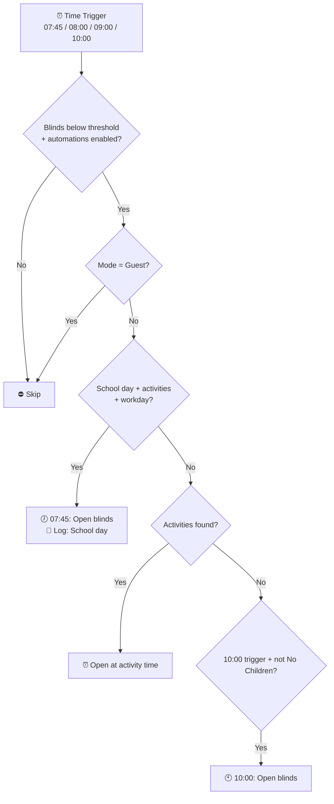
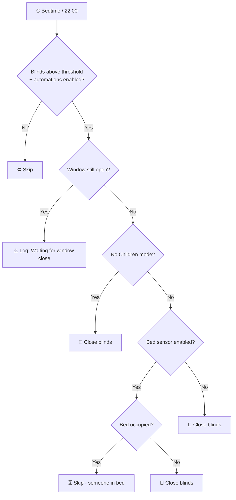

# Bedroom3 (Ashlee's Room)

[<- Back to Rooms README](../README.md) · [Packages README](../../README.md) · [Main README](../../../README.md)

# Ashlee's Bedroom Package Documentation

This package manages Ashlee's bedroom automation including intelligent blind control based on schedules/calendar/bed occupancy, fan control, and notifications.

---

## Table of Contents

- [Overview](#overview)
- [Architecture](#architecture)
- [Automations](#automations)
  - [Blind Control](#blind-control)
  - [Bed Occupancy](#bed-occupancy)
  - [Fan Control](#fan-control)
  - [Notifications](#notifications)
- [Entity Reference](#entity-reference)
- [Cross-References](#cross-references)

---

## Overview

Ashlee's bedroom features:
- **Smart blind scheduling** based on school days, activities, and bed occupancy
- **Fan control** triggered by bed presence
- **Calendar integration** for activity-aware opening times
- **Mode-aware behavior** (No Children, Guest modes)

---

## Architecture

### File Structure

```
packages/rooms/
├── bedroom3.yaml          # Main package (10 automations)
└── README.md              # This documentation
```

### Key Components

| Component | Purpose |
|-----------|---------|
| `cover.ashlees_bedroom_blinds` | Motorized blind control |
| `binary_sensor.ashlees_bed_occupied` | Bed occupancy detection |
| `binary_sensor.ashlees_bedroom_window_contact` | Window state monitoring |
| `switch.ashlees_bedroom_fan` | Ceiling fan control |
| `calendar.work` | Danny's work calendar |
| `calendar.tsang_children` | Children's activities calendar |

---

## Automations

### Blind Control

#### Ashlee's Bedroom: Open Blinds In The Morning
**ID:** `1599994669457`

Opens blinds at staggered times based on school schedule and activities.



**Triggers:**
- 07:45, 08:00, 09:00, 10:00 daily

**Conditions:**
- Blinds below `input_number.blind_closed_position_threshold`
- `input_boolean.enable_ashlees_blind_automations` is `on`
- Home mode is NOT "Guest"

**Logic:**
1. Check calendars for children's activities (exclude half term/holidays)
2. If school day with activities → open at 07:45
3. If activities found (but not half term/holidays) → open at activity time
4. Otherwise → open at 10:00 fallback

---

#### Ashlee's Bedroom: Open Blinds In The Morning No Children Mode
**ID:** `1599994669458`

Simplified opening for "No Children" mode.

**Triggers:**
- 08:00 (workday) / 09:00 (non-workday)

**Conditions:**
- Home mode is "No Children"

**Actions:**
- Log mode and day type
- Open blinds

---

#### Ashlee's Bedroom: Timed Close Blinds
**ID:** `1605925028960`

Closes blinds at bedtime with smart window checking.



**Triggers:**
- At `input_datetime.childrens_bed_time`
- At 22:00 (for No Children mode)

**Conditions:**
- Blinds above `input_number.blind_closed_position_threshold`
- `input_boolean.enable_ashlees_blind_automations` is `on`

**Logic:**
- Window open → skip with warning
- No Children mode → close at 22:00
- Bed sensor enabled + someone in bed → skip
- Otherwise → close blinds

---

#### Ashlee's Bedroom: Window Closed After Dark
**ID:** `1622891806607`

Catches up on closing if window was open at bedtime.

**Triggers:**
- Window contact changes from `on` to `off` for 1+ minute

**Conditions:**
- Blinds above threshold
- Automations enabled
- After children's bedtime

**Actions:**
- Log message
- Close blinds

---

### Bed Occupancy

#### Ashlee's Bedroom: Someone Is In Bed
**ID:** `1655237597647`

Actions when bed occupancy detected.

**Triggers:**
- Bed sensor changes to `on` for 30+ seconds

**Actions (parallel):**
- If bed sensor enabled + automations enabled + blinds open → close blinds
- If automations enabled → turn off fan after 5 minutes

---

#### Ashlee's Bedroom: Fan Turned On
**ID:** `1655235874989`

Starts fan cooldown timer when fan turns on.

**Triggers:**
- Fan changes to `on`

**Actions:**
- Send notification to Danny
- Start 5-minute timer before fan auto-off check

---

### Fan Control

#### Ashlee's Bedroom: Fan Timeout
**ID:** `1656355431188`

Turns off fan after timeout when no one is in bed.

**Triggers:**
- Timer finishes

**Conditions:**
- Fan is on
- Bed not occupied

**Actions:**
- Turn off fan

---

#### Ashlee's Bedroom: No One In Bed And Fan Is On
**ID:** `1656355431189`

Turns off fan when bed becomes empty.

**Triggers:**
- Bed sensor changes to `off`

**Conditions:**
- Fan is on

**Actions:**
- Log message
- Turn off fan

---

#### Ashlee's Bedroom: Someone In Bed After Dark
**ID:** `1656355431190`

Turns on fan when someone gets into bed after dark.

**Triggers:**
- Bed sensor changes to `on`

**Conditions:**
- After sunset
- Fan not already on

**Actions:**
- Log message
- Turn on fan

---

#### Ashlee's Bedroom: Morning Fan
**ID:** `1656355431191`

Turns on fan in the morning if bed is occupied.

**Triggers:**
- Time: 07:30

**Conditions:**
- Bed is occupied

**Actions:**
- Turn on fan

---

## Entity Reference

### Covers

| Entity | Purpose |
|--------|---------|
| `cover.ashlees_bedroom_blinds` | Motorized blind |

### Binary Sensors

| Entity | Purpose |
|--------|---------|
| `binary_sensor.ashlees_bed_occupied` | Bed occupancy |
| `binary_sensor.ashlees_bedroom_window_contact` | Window state |

### Switches

| Entity | Purpose |
|--------|---------|
| `switch.ashlees_bedroom_fan` | Ceiling fan |

### Calendars

| Entity | Purpose |
|--------|---------|
| `calendar.work` | Danny's work schedule |
| `calendar.tsang_children` | Children's activities |

### Input Booleans

| Entity | Purpose |
|--------|---------|
| `input_boolean.enable_ashlees_blind_automations` | Blind control master switch |
| `input_boolean.enable_ashlees_bed_sensor` | Bed sensor enable |

---

## Cross-References

| Document | Purpose |
|----------|---------|
| [Bedroom README](../bedroom/README.md) | Parent bedroom with children's door monitoring |
| [Stairs README](../stairs/README.md) | Children's door states affect stairs lighting |
| [HVAC README](../../integrations/hvac/README.md) | Central heating integration |

---

*Last updated: 2026-04-26*