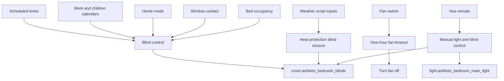
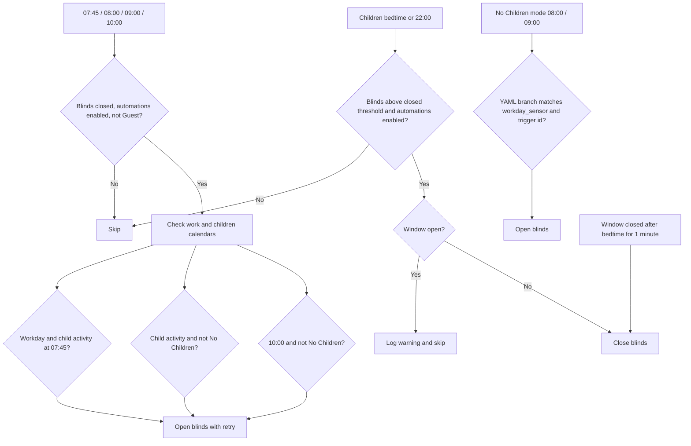

[<- Back to Rooms README](README.md) · [Packages README](../README.md) · [Main README](../../README.md)

# Ashlee's Bedroom Package Documentation

Ashlee's bedroom package manages blind schedules, window-safe evening closing, bed-occupancy privacy logic, a one-hour fan timeout, Hue remote controls, weather-based heat protection, bed occupancy, and mould-risk monitoring.

This documentation covers `packages/rooms/bedroom3.yaml`.

| File | Purpose | Contents |
|------|---------|----------|
| `bedroom3.yaml` | Ashlee's bedroom behavior | 10 automations, 1 script, 1 sensor, 1 template binary sensor |

## Quick Summary

For non-technical users, the important behavior is:

| Area | What Happens |
|------|--------------|
| Morning blinds | Blinds open from scheduled branches using children's calendar events, workday state, `Guest` mode, and `No Children` mode. The main morning routine uses retry logic for the blind open command. |
| Evening blinds | Blinds close at children's bedtime or at 22:00 when the window is closed. If the window is open, the automation logs a warning and does not move the blind. |
| Window catch-up | If the window closes after bedtime and the blinds are open, the blinds close after the contact has been closed for one minute. |
| Bed occupancy | If Ashlee's bed becomes occupied after bedtime or before 05:00, a branch can close blinds when the bed sensor and blind automations are enabled, the window is closed, and the current blind position condition matches the YAML. |
| Fan | `switch.ashlees_bedroom_fan` turns off automatically after it has been on for one hour. |
| Hue remote | The Hue remote toggles the main light and opens/closes the blinds. |
| Weather protection | A script can close blinds during sunny or partly cloudy daytime weather if the window is closed. |

## How Ashlee's Bedroom Decides What To Do

## Main File

### `bedroom3.yaml`

| Section | YAML Objects | Summary |
|---------|--------------|---------|
| Blinds | 5 automations | Morning open schedules, `No Children` mode opening, bedtime closing, window-closed catch-up, and bed-occupied handling. |
| Fan | 1 automation | Turns the fan off after one hour on. |
| Hue remote | 4 automations | Toggles the main light and opens/closes blinds. |
| Weather script | 1 script | Closes blinds on sunny or partly cloudy daytime weather when safe. |
| Sensors | 1 sensor, 1 template binary sensor | Mould indicator and Ashlee bed occupancy. |

## User Controls

| Entity | Plain-English Purpose |
|--------|-----------------------|
| `input_boolean.enable_ashlees_blind_automations` | Master switch for Ashlee's automatic blind movement. |
| `input_boolean.enable_ashlees_bed_sensor` | Enables bed-occupancy blind behavior. |
| `input_select.home_mode` | `Guest` and `No Children` modes alter blind schedules. |
| `input_datetime.childrens_bed_time` | Bedtime close and after-dark window-close reference. |
| `input_number.blind_open_position_threshold` | Shared threshold for treating blinds as open. |
| `input_number.blind_closed_position_threshold` | Shared threshold for treating blinds as closed. |

## Everyday Behavior

### Blind Control

| Situation | Result |
|-----------|--------|
| Main morning schedule matches school/activity/fallback logic | Opens blinds through `retry.action` with 3 retries and exponential backoff. |
| `No Children` mode schedule fires | Opens blinds only on the implemented branch where the trigger ID and `binary_sensor.workday_sensor` condition match. |
| Children's bedtime fires | Closes blinds if the window is closed and a matching branch is selected; logs a warning and skips if the window is open. |
| 22:00 no-children close branch fires | Closes blinds only when `input_select.home_mode` is `No Children` and the window is closed. |
| Window closes after bedtime for 1 minute | Closes blinds if automations are enabled and blinds are above the closed threshold. |
| Bed becomes occupied for 30 seconds | The YAML branch closes blinds only if bed sensor and blind automations are enabled, the blind position is below `input_number.blind_closed_position_threshold`, it is after bedtime or before 05:00, and the window is closed. |

Power-user note: the `Someone Is In Bed` automation currently checks for blinds below the closed threshold before closing them. This documentation reflects the YAML as written.

### Fan And Remote

| Control | Action |
|---------|--------|
| Fan on for 1 hour | Turn off `switch.ashlees_bedroom_fan`. |
| Hue remote on button | Toggle `light.ashlees_bedroom_main_light`. |
| Hue remote up button | Open `cover.ashlees_bedroom_blinds`. |
| Hue remote down button | Close `cover.ashlees_bedroom_blinds`. |
| Hue remote off button | Toggle `light.ashlees_bedroom_main_light`. |

### Weather Script

`script.ashlees_bedroom_close_blinds_by_weather` expects `temperature` and `weather_condition`. It only acts before sunset, when blind automations are enabled, and when blinds are above the open threshold. For `sunny` or `partlycloudy`, it logs a warning if the window is open or closes the blinds if the window is closed.

## Entity Reference

| Entity | Purpose |
|--------|---------|
| `cover.ashlees_bedroom_blinds` | Ashlee's bedroom blind. |
| `binary_sensor.ashlees_bed_occupied` | Template occupancy sensor from four bed pressure sensors. |
| `binary_sensor.ashlees_bedroom_window_contact` | Window safety input for blind movement. |
| `light.ashlees_bedroom_main_light` | Main light toggled by Hue remote. |
| `switch.ashlees_bedroom_fan` | Fan controlled by one-hour timeout. |
| `sensor.ashlees_bedroom_mould_indicator` | Mould risk sensor using bedroom and outdoor conditions. |
| `sensor.ashlees_bed_top`, `sensor.ashlees_bed_middle_top`, `sensor.ashlees_bed_middle_bottom`, `sensor.ashlees_bed_bottom` | Bed pressure inputs. |
| `calendar.work`, `calendar.tsang_children` | Calendar inputs for morning blind schedules. |

## Troubleshooting

| Issue | Check |
|-------|-------|
| Blinds do not open in the morning | Check `input_boolean.enable_ashlees_blind_automations`, `input_select.home_mode`, `binary_sensor.workday_sensor`, `calendar.tsang_children`, and current blind position. |
| Blinds do not close at bedtime | Check `binary_sensor.ashlees_bedroom_window_contact`; an open window logs and skips closing. |
| Window catch-up did not close blinds | Check the window contact stayed `off` for 1 minute after `input_datetime.childrens_bed_time`. |
| Bed occupancy did not trigger | Check `input_boolean.enable_ashlees_bed_sensor` and the four bed pressure sensors. Threshold is `0.1` for each zone. |
| Fan did not turn off | Check `switch.ashlees_bedroom_fan` has been continuously `on` for one hour. |
| Weather script did nothing | Check it is before sunset, weather condition is `sunny` or `partlycloudy`, blinds are above the open threshold, and the window is closed. |
| Hue remote does not respond | Check the MQTT device `43598aa0e01c65b2bfc26491940f3353` is online and publishing button actions. |
