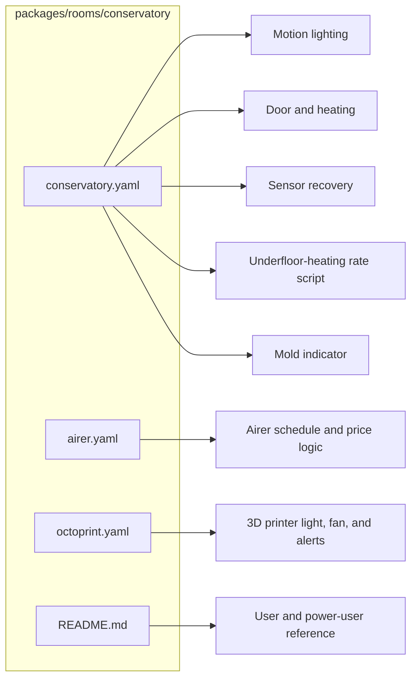
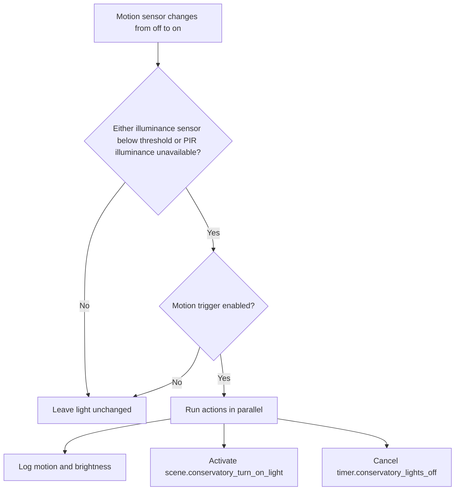
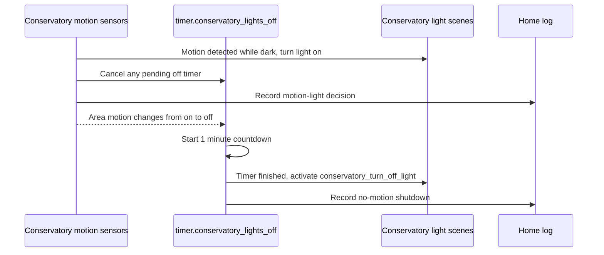
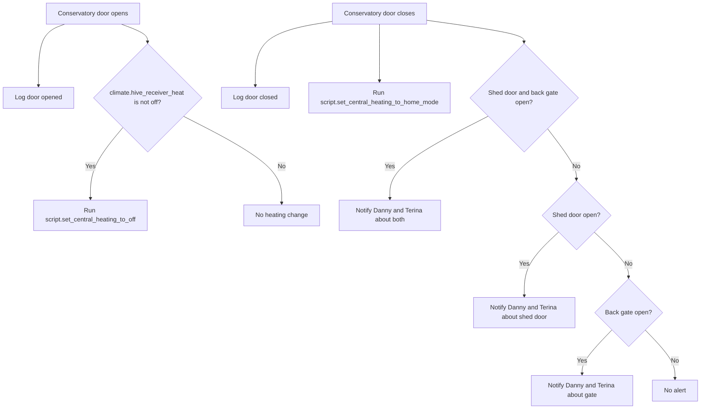
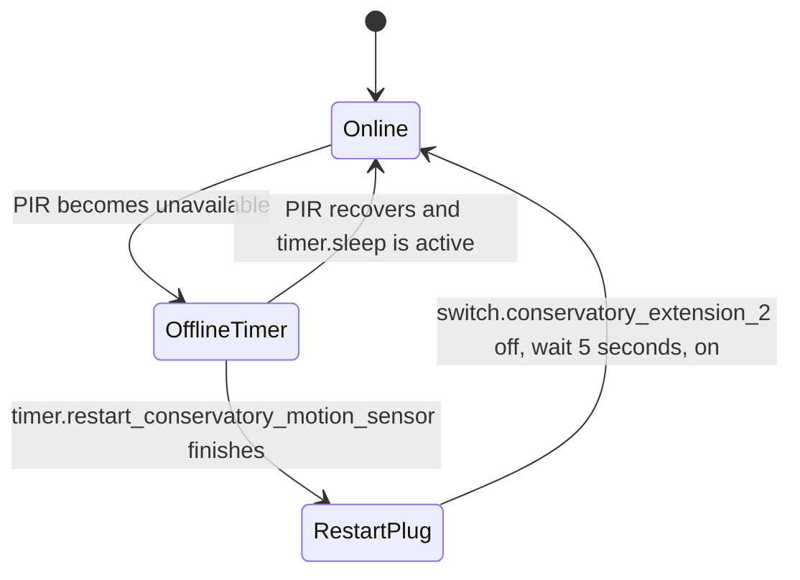
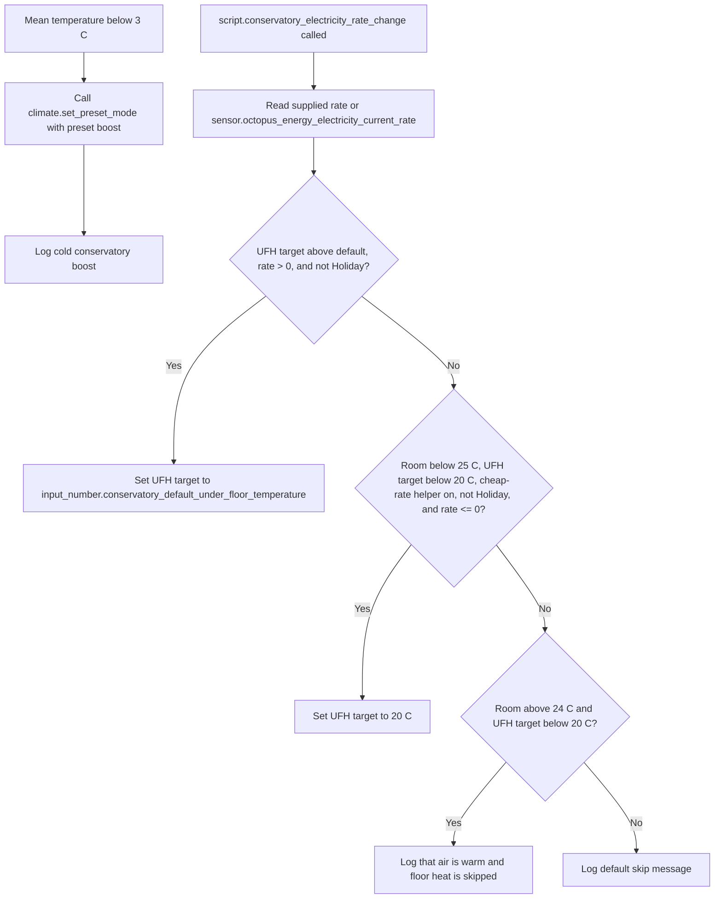
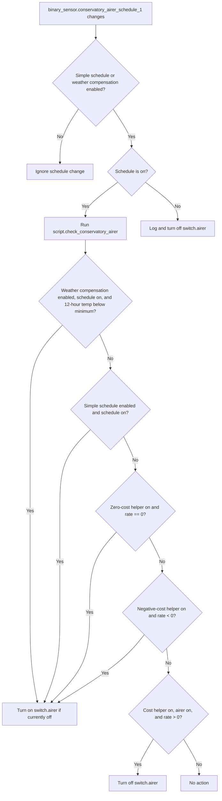
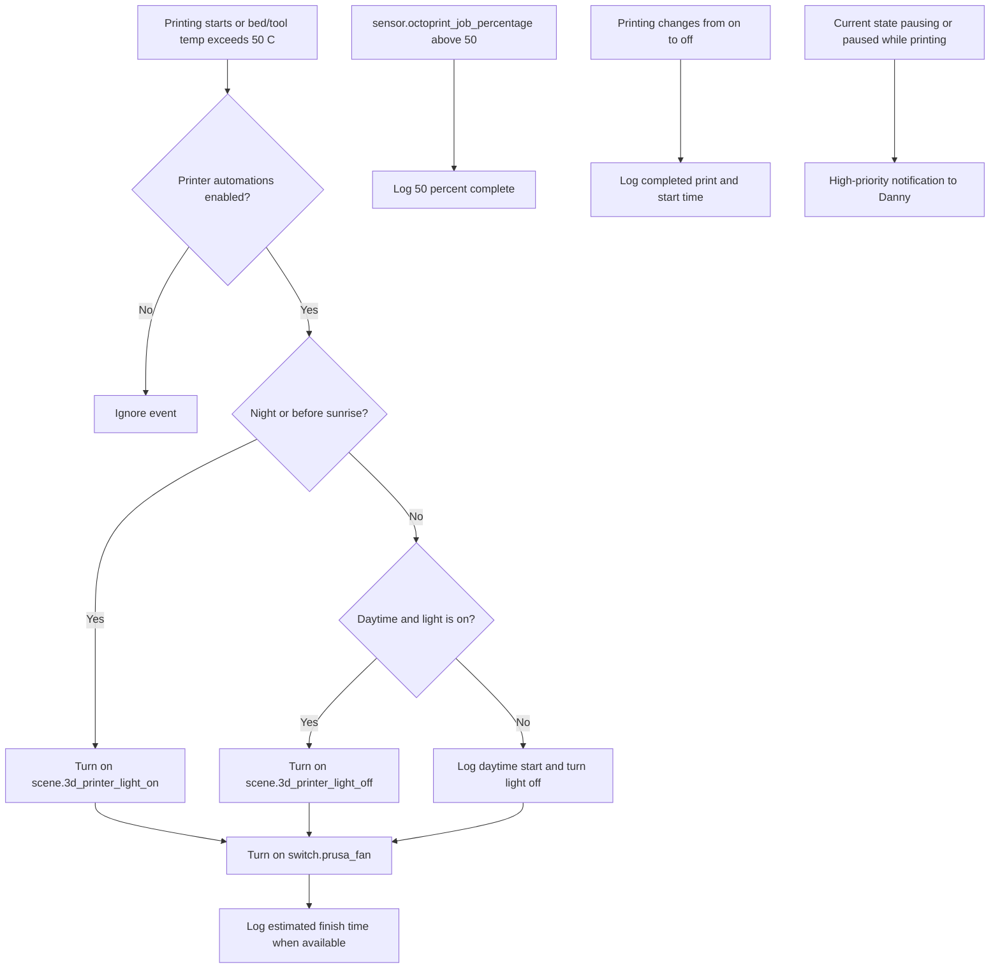
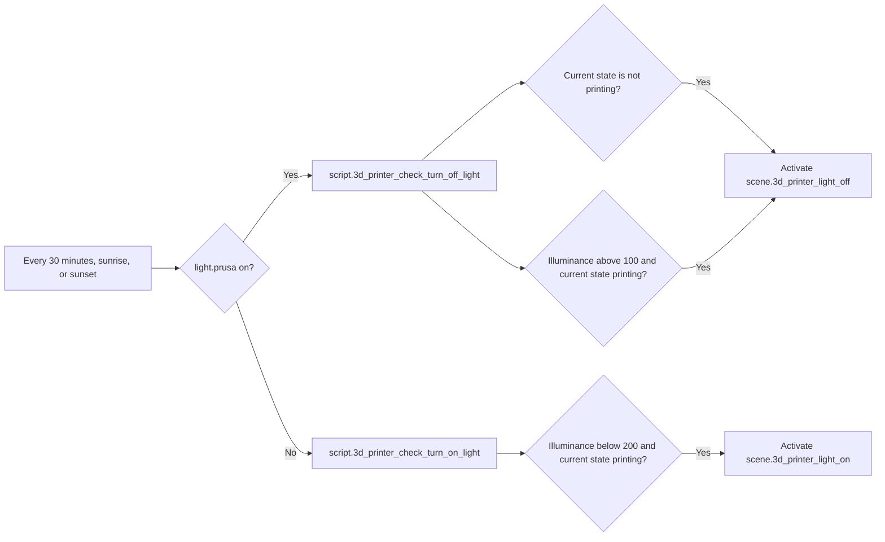

[<- Back to Rooms README](../README.md) · [Packages README](../../README.md) · [Main README](../../../README.md)

# Conservatory Package Documentation

The conservatory package keeps the room practical without much manual control. It turns the main light on only when motion is detected and the room is dark, protects central heating when the conservatory door is open, restarts a flaky motion sensor by power-cycling its plug, manages clothes-airer power from schedule and electricity-price rules, and supports the Prusa 3D printer with lighting, fan, progress logging, and urgent pause alerts.

This documentation covers all YAML files in this folder:

| File | Purpose | Contents |
|------|---------|----------|
| `conservatory.yaml` | Main room behavior | 9 automations, 2 scenes, 1 script, 1 sensor |
| `airer.yaml` | Clothes airer behavior | 2 automations, 1 script |
| `octoprint.yaml` | 3D printer behavior | 6 automations, 3 scenes, 3 scripts |

## Quick Summary

For non-technical users, the important behavior is:

| Area | What Happens |
|------|--------------|
| Motion lighting | Movement turns the conservatory light on when either light sensor says it is dark enough. No movement starts a short timer before the light turns off. |
| Door and heating | Opening the conservatory door logs the event and turns central heating off if it is active. Closing the door restores home-mode heating and warns if the shed door or back gate is still open. |
| Motion sensor recovery | If the conservatory motion sensor goes unavailable, a 30-minute timer starts. When the timer finishes, `switch.conservatory_extension_2` is power-cycled. |
| Cold temperature | If the conservatory mean temperature drops below 3 C, the package requests a heating boost and logs it. |
| Underfloor heating rates | A reusable script can lower the underfloor-heating target when import electricity costs money, or raise it to 20 C when rates are zero or negative and the room is cool. |
| Clothes airer | The airer follows a schedule, optional cold-weather compensation, and optional zero/negative electricity-price rules. |
| 3D printer | Print starts control the Prusa light and fan, progress is logged, paused prints alert Danny urgently, and helper scripts keep the printer light appropriate for brightness and print state. |

## How The Conservatory Decides What To Do

```mermaid
flowchart TB
    Motion[Motion and presence sensors] --> Lighting[Motion lighting]
    LightLevel[Conservatory illuminance sensors] --> Lighting
    NoMotion[No area motion] --> LightTimer[Light-off timer]
    Door[Conservatory door] --> HeatingDoor[Central heating door handling]
    Shed[Shed door] --> DoorAlerts[Door-close alerts]
    Gate[Back garden gate] --> DoorAlerts
    MotionOffline[Motion sensor unavailable] --> Recovery[Power-cycle recovery]
    Temp[Area mean temperature] --> Cold[Cold-temperature boost]
    Rate[Octopus current import rate] --> UFH[Underfloor heating script]
    Rate --> AirerLogic[Airer script]
    Schedule[Airer schedule] --> AirerLogic
    AvgTemp[12-hour conservatory temperature] --> AirerLogic
    OctoPrint[OctoPrint sensors] --> Printer[Printer routines]
    PrinterLight[Conservatory brightness] --> Printer

    Lighting --> MainLight[light.conservatory]
    LightTimer --> MainLight
    HeatingDoor --> CentralHeating[Heating helper scripts]
    DoorAlerts --> Notifications[Direct notifications]
    Recovery --> SensorPlug[switch.conservatory_extension_2]
    Cold --> HeatingBoost[climate.set_preset_mode boost]
    UFH --> Underfloor[climate.conservatory_under_floor_heating]
    AirerLogic --> Airer[switch.airer]
    Printer --> PrusaLight[light.prusa]
    Printer --> PrusaFan[switch.prusa_fan]
    Printer --> Notifications
```

## Main Files

### `conservatory.yaml`

The main package is organized by behavior:

| Section | YAML Objects | Summary |
|---------|--------------|---------|
| Motion lighting | 3 automations, 2 scenes | Turns the main light on when motion is detected and it is dark, then turns it off after a one-minute no-motion timer. |
| Door and heating | 2 automations | Turns central heating off when the conservatory door opens, restores home mode when it closes, and warns about the shed door or back gate. |
| Motion sensor recovery | 3 automations | Starts a 30-minute recovery timer when the PIR goes unavailable, can cancel it when the sensor returns, and power-cycles the sensor plug when the timer finishes. |
| Cold temperature | 1 automation | Requests heating boost when `sensor.conservatory_area_mean_temperature` drops below 3 C. |
| Underfloor heating | 1 script | Adjusts `climate.conservatory_under_floor_heating` from electricity import rate, holiday mode, room temperature, and target temperature. |
| Mold indicator | 1 sensor | Calculates mold risk from conservatory temperature/humidity and outdoor temperature. |

Power-user note: `script.conservatory_electricity_rate_change` is defined here, but no automation in these three conservatory files calls it directly. It is intended for an external electricity-rate flow to call with optional rate fields.

### `airer.yaml`

The airer package has two schedule automations and one reusable decision script. The schedule-on automation delegates to `script.check_conservatory_airer`; the schedule-off automation turns `switch.airer` off and logs the reason.

### `octoprint.yaml`

The OctoPrint package reacts to printer state, print progress, printer temperatures, sunrise/sunset, and conservatory brightness. It defines the Prusa light scenes and helper scripts used by the printer automations.

## User Controls

| Entity | Plain-English Purpose |
|--------|-----------------------|
| `input_boolean.enable_conservatory_motion_trigger` | Master switch for motion lighting. Turn this off if the conservatory light should stop reacting to movement. |
| `input_boolean.enable_conservatory_airer_schedule` | Enables the simple airer schedule behavior. |
| `input_boolean.enable_conservatory_airer_schedule_weather_compensation` | Enables the airer schedule only when the 12-hour conservatory temperature is below the configured minimum. |
| `input_boolean.enable_conservatory_airer_when_cost_nothing` | Allows the airer to turn on when the current import rate is exactly zero. |
| `input_boolean.enable_conservatory_airer_when_cost_below_nothing` | Allows the airer to turn on when the current import rate is negative. |
| `input_boolean.conservatory_under_floor_heating_cost_below_nothing` | Allows the underfloor-heating rate script to raise the target to 20 C when rates are zero or negative. |
| `input_boolean.enable_3d_printer_automations` | Master switch for printer automations that respond to print state, temperatures, progress, and pauses. |

## Everyday Behavior

### Motion Lighting

When conservatory motion is detected, `Conservatory: Motion Detected And It's Dark` checks the motion-light master switch and the light-level threshold before turning the light on.

| Situation | Result |
|-----------|--------|
| Motion starts and the room is dark enough | Turns on `scene.conservatory_turn_on_light` with a 2-second transition and cancels the off timer. |
| Motion starts but both light sensors are above the threshold | Leaves the light unchanged. |
| `binary_sensor.conservatory_area_motion` changes from `on` to `off` while the light is on | Starts `timer.conservatory_lights_off` for 1 minute. |
| `timer.conservatory_lights_off` finishes while the light is still on | Activates `scene.conservatory_turn_off_light`. |

The motion-on trigger listens to `binary_sensor.conservatory_area_motion`, `binary_sensor.conservatory_motion_occupancy`, `binary_sensor.everything_presence_one_26eb54_occupancy`, and `binary_sensor.everything_presence_one_26eb54_mmwave`. The no-motion path only listens to `binary_sensor.conservatory_area_motion` changing off.

### Door And Heating

| Event | Result |
|-------|--------|
| `binary_sensor.conservatory_door` changes to `on` | Logs the open event and turns central heating off if `climate.hive_receiver_heat` is not already off. |
| `binary_sensor.conservatory_door` changes from `on` to `off` | Logs the close event, restores central heating home mode, and checks outdoor access sensors. |
| Shed door and back gate are still open | Sends a direct notification to Danny and Terina. |
| Only the shed door is still open | Sends a direct notification to Danny and Terina. |
| Only the back gate is still open | Sends a direct notification to Danny and Terina. |

### Motion Sensor Recovery

The recovery automations are for `binary_sensor.conservatory_motion_occupancy` becoming unavailable.

| Automation | Trigger | Result |
|------------|---------|--------|
| `Conservatory: Motion Sensor Goes Offline` | PIR changes to `unavailable` | Starts `timer.restart_conservatory_motion_sensor` for 30 minutes. |
| `Conservatory: Motion Sensor Comes Online` | PIR recovers from `unavailable` | Cancels `timer.restart_conservatory_motion_sensor` when `timer.sleep` is active. |
| `Conservatory: Restart Motion Sensor Finished` | Recovery timer finishes | Turns `switch.conservatory_extension_2` off, waits 5 seconds, then turns it on. |

Power-user note: the online-cancellation automation checks `timer.sleep`, not `timer.restart_conservatory_motion_sensor`. This README documents the current YAML exactly.

### Temperature And Underfloor Heating

| Situation | Result |
|-----------|--------|
| Conservatory mean temperature drops below 3 C | `Conservatory: Cold Temperature` requests `preset_mode: boost` and logs it. |
| Underfloor target is above the default, import rate is above zero, and home mode is not `Holiday` | Sets `climate.conservatory_under_floor_heating` back to `input_number.conservatory_default_under_floor_temperature`. |
| Import rate is zero or negative, room temperature is below 25 C, target is below 20 C, cheap-rate helper is on, and home mode is not `Holiday` | Sets underfloor-heating target to 20 C. |
| Air temperature is above 24 C while the floor target is below 20 C | Logs that underfloor heating is skipped because the room air is already warm. |

### Clothes Airer

The airer has a schedule trigger and a separate decision script so the same logic can also be called with an explicit electricity rate.

| Mode | Condition | Result |
|------|-----------|--------|
| Weather-compensated schedule | Weather helper on, schedule on, and `sensor.conservatory_temperature_over_12_hours` below `input_number.airer_minimum_temperature` | Turns the airer on if it is off. |
| Simple schedule | Simple schedule helper on and schedule on | Turns the airer on if it is off. |
| Zero-cost electricity | Zero-cost helper on and current import rate equals `0` | Turns the airer on if it is off. |
| Negative-cost electricity | Negative-cost helper on and current import rate is below `0` | Turns the airer on if it is off. |
| Cost starts again | Zero-cost or negative-cost helper is on, airer is on, and current import rate is above `0` | Turns the airer off. |
| Schedule turns off | Schedule helper or weather-compensation helper is enabled, and schedule changes to `off` | Logs and turns `switch.airer` off. |

Power-user note: `script.check_conservatory_airer` uses a `choose` block, so the first matching branch wins. Weather compensation is evaluated before simple schedule, and both are evaluated before electricity-price-only branches.

### 3D Printer

The printer automations are gated by `input_boolean.enable_3d_printer_automations` except for the periodic light check automation, which always runs and delegates to helper scripts.

| Automation | Trigger | Result |
|------------|---------|--------|
| `3D Printer: Print Started` | `binary_sensor.octoprint_printing` turns on, or bed/nozzle actual/target temperature rises above 50 C | Sets printer light based on sun/daylight state, waits briefly for estimated finish time, turns on `switch.prusa_fan`, and logs the estimate. |
| `3D Printer: 50% Complete` | `sensor.octoprint_job_percentage` rises above 50 | Logs progress and estimated finish time. |
| `3D Printer: Check If Printing Light` | Every 30 minutes, sunrise, and sunset | Runs the appropriate printer-light helper script depending on whether `light.prusa` is currently on. |
| `3D Printer: Finished Printing` | Printing changes from `on` to `off` | Logs completion and `sensor.octoprint_start_time`. |
| `3D Printer: Light Turned on` | `light.prusa` has been on for 5 minutes | Runs `script.3d_printer_check_turn_off_light`. |
| `3D Printer: Paused Mid Print` | OctoPrint state becomes `pausing` or `paused` while printing | Sends Danny a high-priority direct notification without quiet-hour suppression. |

`script.3d_printer_left_unattended` is available for other automations to call. It sends Danny and Terina a high-priority notification if OctoPrint has a known estimated finish time and `binary_sensor.octoprint_printing` is on.

## Technical Reference

### Automations

| ID | Alias | File |
|----|-------|------|
| `1610234394136` | Conservatory: Motion Detected And It's Dark | `conservatory.yaml` |
| `1610234794461` | Conservatory: No Motion Detected | `conservatory.yaml` |
| `1610238960657` | Conservatory: No Motion Turn Lights Off | `conservatory.yaml` |
| `1628985027639` | Conservatory: Door Open | `conservatory.yaml` |
| `1628985156167` | Conservatory: Door Closed | `conservatory.yaml` |
| `1769277054491` | Conservatory: Motion Sensor Goes Offline | `conservatory.yaml` |
| `1769277054492` | Conservatory: Motion Sensor Comes Online | `conservatory.yaml` |
| `1769277280840` | Conservatory: Restart Motion Sensor Finished | `conservatory.yaml` |
| `1674478124534` | Conservatory: Cold Temperature | `conservatory.yaml` |
| `1733767153966` | Conservatory: Turn On Airer | `airer.yaml` |
| `1733767153967` | Conservatory: Turn Off Airer | `airer.yaml` |
| `1608655560832` | 3D Printer: Print Started | `octoprint.yaml` |
| `1619873649348` | 3D Printer: 50% Complete | `octoprint.yaml` |
| `1623087278802` | 3D Printer: Check If Printing Light | `octoprint.yaml` |
| `1613321560216` | 3D Printer: Finished Printing | `octoprint.yaml` |
| `1656239435552` | 3D Printer: Light Turned on | `octoprint.yaml` |
| `1656239435553` | 3D Printer: Paused Mid Print | `octoprint.yaml` |

### Scenes Defined Here

| Scene ID | Name | Purpose |
|----------|------|---------|
| `1610234583738` | Conservatory: Turn On Light | Turns on `light.conservatory`. |
| `1610238855789` | Conservatory: Turn Off Light | Turns off `light.conservatory`. |
| `1623014393915` | 3D Printer Light Off | Turns off `light.prusa`. |
| `1623014429001` | 3D Printer Light On | Turns on `light.prusa` at bright cool-white settings. |
| `1627724282263` | 3D Printer Temperature Reached | Turns `light.prusa` green. |

### Scripts Defined Here

| Script | File | Purpose |
|--------|------|---------|
| `script.conservatory_electricity_rate_change` | `conservatory.yaml` | Adjusts underfloor-heating target temperature from electricity import rate and room state. |
| `script.check_conservatory_airer` | `airer.yaml` | Decides whether `switch.airer` should turn on or off from schedule, temperature, and electricity price. |
| `script.3d_printer_left_unattended` | `octoprint.yaml` | Notifies Danny and Terina if the printer is active while nobody is home. |
| `script.3d_printer_check_turn_on_light` | `octoprint.yaml` | Turns the Prusa light on when it is dark and OctoPrint is printing. |
| `script.3d_printer_check_turn_off_light` | `octoprint.yaml` | Turns the Prusa light off when not printing, or when it is bright enough during printing. |

### Sensors Defined Here

| Sensor | Source Inputs | Purpose |
|--------|---------------|---------|
| `sensor.conservatory_mould_indicator` | `sensor.conservatory_motion_temperature`, `sensor.conservatory_motion_humidity`, `sensor.gw2000a_outdoor_temperature` | Mold-risk indicator with calibration factor `1.97`. |

## Important Entities

| Type | Entities |
|------|----------|
| Motion and presence | `binary_sensor.conservatory_area_motion`, `binary_sensor.conservatory_motion_occupancy`, `binary_sensor.everything_presence_one_26eb54_occupancy`, `binary_sensor.everything_presence_one_26eb54_mmwave` |
| Brightness | `sensor.conservatory_motion_illuminance`, `sensor.everything_presence_one_26eb54_illuminance` |
| Temperature and humidity | `sensor.conservatory_area_mean_temperature`, `sensor.conservatory_motion_temperature`, `sensor.conservatory_motion_humidity`, `sensor.conservatory_temperature_over_12_hours` |
| Door and outdoor access | `binary_sensor.conservatory_door`, `binary_sensor.shed_door`, `binary_sensor.back_garden_gate_contact` |
| Lights | `light.conservatory`, `light.prusa` |
| Heating | `climate.hive_receiver_heat`, `climate.conservatory_under_floor_heating` |
| Airer | `binary_sensor.conservatory_airer_schedule_1`, `switch.airer` |
| Printer | `binary_sensor.octoprint_printing`, `sensor.octoprint_current_state`, `sensor.octoprint_job_percentage`, `sensor.octoprint_estimated_finish_time`, `sensor.octoprint_start_time`, `sensor.octoprint_actual_bed_temp`, `sensor.octoprint_actual_tool0_temp`, `sensor.octoprint_target_bed_temp`, `sensor.octoprint_target_tool0_temp`, `switch.prusa_fan` |
| Recovery | `timer.restart_conservatory_motion_sensor`, `switch.conservatory_extension_2` |
| Energy and mode | `sensor.octopus_energy_electricity_current_rate`, `input_select.home_mode` |

## Configuration Inputs

| Entity | Used For |
|--------|----------|
| `input_number.conservatory_light_level_threshold` | Decides whether motion should turn conservatory lighting on. |
| `timer.conservatory_lights_off` | One-minute off delay after no-motion detection. |
| `timer.restart_conservatory_motion_sensor` | Thirty-minute delay before power-cycling the motion sensor plug. |
| `input_number.conservatory_default_under_floor_temperature` | Target temperature used to effectively turn underfloor heating down when import electricity costs money. |
| `input_number.airer_minimum_temperature` | Minimum 12-hour temperature threshold used by airer weather compensation. |

## Maintenance Notes

| Symptom | First Things To Check |
|---------|-----------------------|
| Conservatory light does not turn on with motion | `input_boolean.enable_conservatory_motion_trigger`, both illuminance sensors, `input_number.conservatory_light_level_threshold`, and whether the triggering sensor changed from `off` to `on`. |
| Conservatory light stays on | `binary_sensor.conservatory_area_motion`, `timer.conservatory_lights_off`, and whether `light.conservatory` is actually reported as `on`. |
| Heating turns off unexpectedly | `binary_sensor.conservatory_door` and `climate.hive_receiver_heat`. Door-open events intentionally run `script.set_central_heating_to_off` when heating is active. |
| Door-close notifications mention shed or gate | Check `binary_sensor.shed_door` and `binary_sensor.back_garden_gate_contact`; these are intentionally checked after the conservatory door closes. |
| Motion sensor recovery does not cancel | The current YAML cancellation condition checks `timer.sleep`, so inspect that timer as well as `timer.restart_conservatory_motion_sensor`. |
| Airer does not turn on from schedule | `binary_sensor.conservatory_airer_schedule_1`, `input_boolean.enable_conservatory_airer_schedule`, `input_boolean.enable_conservatory_airer_schedule_weather_compensation`, `sensor.conservatory_temperature_over_12_hours`, and `input_number.airer_minimum_temperature`. |
| Airer does not react to electricity price | `sensor.octopus_energy_electricity_current_rate`, `input_boolean.enable_conservatory_airer_when_cost_nothing`, and `input_boolean.enable_conservatory_airer_when_cost_below_nothing`. |
| Underfloor heating does not respond to cheap rates | Confirm the external rate automation is calling `script.conservatory_electricity_rate_change`, then check `input_boolean.conservatory_under_floor_heating_cost_below_nothing`, `input_select.home_mode`, room temperature, and current target temperature. |
| Printer light behaves unexpectedly | `input_boolean.enable_3d_printer_automations`, `light.prusa`, `sensor.conservatory_motion_illuminance`, and `sensor.octoprint_current_state`. |
| Printer pause alert is missing | `input_boolean.enable_3d_printer_automations`, `binary_sensor.octoprint_printing`, and `sensor.octoprint_current_state`. |

## Related Documentation

| Document | Purpose |
|----------|---------|
| [Rooms Overview](../README.md) | Overview of room packages. |
| [Energy](../../integrations/energy/README.md) | Octopus Energy and electricity-rate automation context. |
| [HVAC](../../integrations/hvac/README.md) | Central heating and Hive integration context. |
| [Messaging](../../integrations/messaging/README.md) | Notification and home-log scripts used by this package. |

*Last updated: 2026-06-27*
