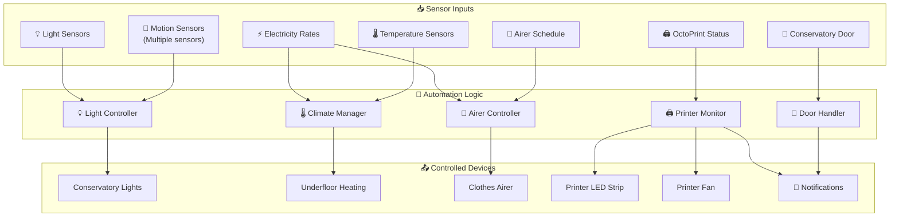
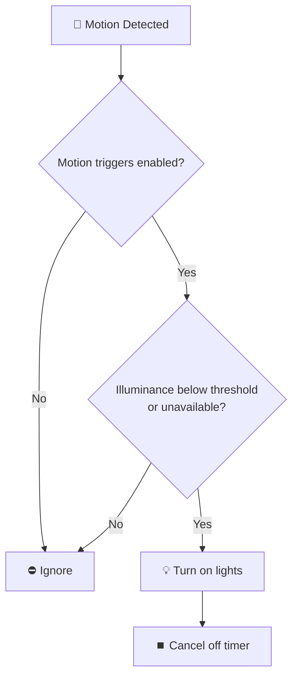
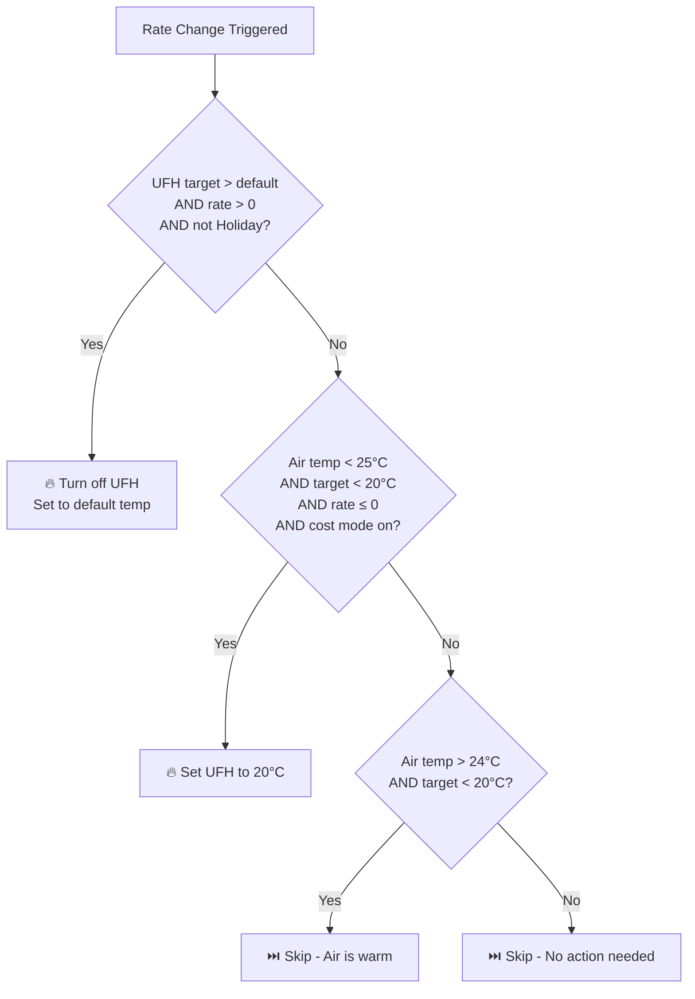

[<- Back to Rooms README](../README.md) · [Packages README](../../README.md) · [Main README](../../../README.md)

# Conservatory Package Documentation

This package manages conservatory automation including motion-activated lighting, door monitoring, climate control with underfloor heating, clothes airer scheduling, and 3D printer integration via OctoPrint.

---

## Table of Contents

- [Overview](#overview)
- [Design Decisions](#design-decisions)
- [Dependencies](#dependencies)
- [Architecture](#architecture)
## Overview

The conservatory automation system provides intelligent lighting control, climate management with energy-aware underfloor heating, automated clothes drying scheduling, and comprehensive 3D printer monitoring and control.



---

## Design Decisions

Key architectural decisions captured from the YAML configuration:

- **Conservatory: Motion Detected And It** triggers on state transitions (edge detection) rather than continuous state
- **Conservatory: No Motion Detected** triggers on state transitions (edge detection) rather than continuous state
- **Conservatory: Door Closed** triggers on state transitions (edge detection) rather than continuous state
- Uses ambient light sensors for adaptive lighting that responds to natural light conditions

---

## Dependencies

This package relies on the following components:

### Integrations
- `Octopus Energy`

---

## Architecture

### File Structure

```
packages/rooms/conservatory/
├── conservatory.yaml     # Main package (motion, lighting, door, climate)
├── airer.yaml            # Clothes airer automation
└── octoprint.yaml        # 3D printer integration
```

### Key Components

| Component | Purpose |
|-----------|---------|
| `binary_sensor.conservatory_area_motion` | Primary motion detection |
| `binary_sensor.conservatory_motion_occupancy` | PIR motion sensor |
| `binary_sensor.everything_presence_one_26eb54_*` | Everything Presence One sensor |
| `binary_sensor.conservatory_door` | Door contact sensor |
| `climate.conservatory_under_floor_heating` | Underfloor heating control |
| `switch.airer` | Clothes airer power control |
| `binary_sensor.octoprint_printing` | 3D printer status |
| `sensor.octoprint_*` | Various OctoPrint sensors |

---

## Automations

### Motion & Lighting

#### Conservatory: Motion Detected And It's Dark
**ID:** `1610234394136`

Turns on conservatory lights when motion is detected and light levels are low.



**Triggers:**
- `binary_sensor.conservatory_area_motion` → `on`
- `binary_sensor.conservatory_motion_occupancy` → `on`
- `binary_sensor.everything_presence_one_26eb54_occupancy` → `on`
- `binary_sensor.everything_presence_one_26eb54_mmwave` → `on`

**Conditions:**
- `input_boolean.enable_conservatory_motion_trigger` is `on`
- Either illuminance sensor below `input_number.conservatory_light_level_threshold` or unavailable

**Actions:**
- Log debug message
- Turn on `scene.conservatory_turn_on_light` (2s transition)
- Cancel `timer.conservatory_lights_off`

---

#### Conservatory: No Motion Detected
**ID:** `1610234794461`

Starts countdown timer when motion stops.

**Triggers:**
- `binary_sensor.conservatory_area_motion` changes from `on` to `off`

**Conditions:**
- `light.conservatory` is `on`
- `input_boolean.enable_conservatory_motion_trigger` is `on`

**Actions:**
- Log debug message
- Start `timer.conservatory_lights_off` for 1 minute

---

#### Conservatory: No Motion Turn Lights Off
**ID:** `1610238960657`

Turns off lights when timer completes.

**Triggers:**
- `timer.conservatory_lights_off` finishes

**Conditions:**
- `light.conservatory` is `on`
- `input_boolean.enable_conservatory_motion_trigger` is `on`

**Actions:**
- Log debug message
- Turn on `scene.conservatory_turn_off_light`

---

### Door Monitoring

#### Conservatory: Door Open
**ID:** `1628985027639`

Handles door opening events and turns off heating if active.

**Triggers:**
- `binary_sensor.conservatory_door` → `on`

**Actions:**
- Log debug message
- If heating is on: turn off central heating via `script.set_central_heating_to_off`

---

#### Conservatory: Door Closed
**ID:** `1628985156167`

Handles door closing and checks for other open entry points.

**Triggers:**
- `binary_sensor.conservatory_door` changes from `on` to `off`

**Actions:**
- Log debug message
- Restore central heating via `script.set_central_heating_to_home_mode`
- Check for other open doors/gates and notify:
  - If shed door AND back gate open
  - If only shed door open
  - If only back gate open

---

### System Recovery

#### Conservatory: Motion Sensor Goes Offline
**ID:** `1769277054491`

Detects when the motion sensor becomes unavailable and starts recovery timer.

**Triggers:**
- `binary_sensor.conservatory_motion_occupancy` → `unavailable`

**Actions:**
- Log debug message
- Start `timer.restart_conservatory_motion_sensor` for 30 minutes

---

#### Conservatory: Motion Sensor Comes Online
**ID:** `1769277054492`

Cancels recovery timer when sensor comes back online.

**Triggers:**
- `binary_sensor.conservatory_motion_occupancy` recovers from `unavailable`

**Conditions:**
- `timer.sleep` is `active`

**Actions:**
- Log debug message
- Cancel `timer.restart_conservatory_motion_sensor`

---

#### Conservatory: Restart Motion Sensor Finished
**ID:** `1769277280840`

Power cycles the motion sensor via smart plug when timer completes.

**Triggers:**
- `timer.restart_conservatory_motion_sensor` finishes

**Actions:**
- Log debug message
- Turn off `switch.conservatory_extension_2` (5 second delay)
- Turn on `switch.conservatory_extension_2`

---

### Airer Control

#### Conservatory: Turn On Airer
**ID:** `1733767153966`

Activates the clothes airer based on schedule and conditions.

**Triggers:**
- `binary_sensor.conservatory_airer_schedule_1` → `on`

**Conditions:**
- Either `input_boolean.enable_conservatory_airer_schedule` OR `input_boolean.enable_conservatory_airer_schedule_weather_compensation` is `on`

**Actions:**
- Execute `script.check_conservatory_airer`

---

#### Conservatory: Turn Off Airer
**ID:** `1733767153967`

Turns off the airer when schedule ends.

**Triggers:**
- `binary_sensor.conservatory_airer_schedule_1` → `off`

**Conditions:**
- Either schedule enable boolean is `on`

**Actions:**
- Log message
- Turn off `switch.airer`

---

### 3D Printer

#### 3D Printer: Print Started
**ID:** `1608655560832`

Manages lighting and fan when printing begins.

**Triggers:**
- `binary_sensor.octoprint_printing` → `on`
- Any temperature sensor (bed/tool0) above 50°C

**Conditions:**
- `input_boolean.enable_3d_printer_automations` is `on`

**Actions:**
1. Choose lighting based on time of day:
   - After sunset: Turn on printer light
   - Before sunrise: Turn on printer light
   - Daytime with light on: Turn off printer light
   - Default: Turn off printer light
2. Wait for estimated finish time to be available
3. Turn on extruder fan (`switch.prusa_fan`)
4. Log print start with estimated completion time

---

#### 3D Printer: 50% Complete
**ID:** `1619873649348`

Logs progress at 50% completion.

**Triggers:**
- `sensor.octoprint_job_percentage` above 50

**Actions:**
- Log completion percentage and estimated finish time

---

#### 3D Printer: Check If Printing Light
**ID:** `1623087278802`

Periodic check (every 30 minutes + sunrise/sunset) to adjust printer lighting.

**Triggers:**
- Time pattern: every 30 minutes
- Sunset event
- Sunrise event

**Actions:**
- If printer light is on: execute `script.3d_printer_check_turn_off_light`
- If printer light is off: execute `script.3d_printer_check_turn_on_light`

---

#### 3D Printer: Finished Printing
**ID:** `1613321560216`

Logs completion when print finishes.

**Triggers:**
- `binary_sensor.octoprint_printing` → `off`

**Actions:**
- Log completion with start time

---

#### 3D Printer: Light Turned On
**ID:** `1656239435552`

Automatically turns off printer light after 5 minutes if left on.

**Triggers:**
- `light.prusa` → `on` for 5 minutes

**Actions:**
- Execute `script.3d_printer_check_turn_off_light`

---

#### 3D Printer: Paused Mid Print
**ID:** `1656239435553`

Sends high-priority notification if printer pauses during active print.

**Triggers:**
- `sensor.octoprint_current_state` → `pausing` or `paused`

**Conditions:**
- `binary_sensor.octoprint_printing` is `on`

**Actions:**
- Send direct notification to Danny (high priority, no quiet hour suppression)

---

## Scenes

### Conservatory Lighting

| Scene | ID | Purpose |
|-------|-----|---------|
| `conservatory_turn_on_light` | `1610234583738` | Turn on conservatory main light |
| `conservatory_turn_off_light` | `1610238855789` | Turn off conservatory main light |

### 3D Printer Lighting

| Scene | ID | Purpose |
|-------|-----|---------|
| `3d_printer_light_off` | `1623014393915` | Turn off printer LED strip |
| `3d_printer_light_on` | `1623014429001` | Turn on printer LED (cool white, brightness 251) |
| `3d_printer_temperature_reached` | `1627724282263` | Green indicator (temperature ready) |

---

## Scripts

### Conservatory Electricity Rate Change
**Alias:** `conservatory_electricity_rate_change`

Manages underfloor heating based on electricity rates.

**Fields:**
- `current_electricity_import_rate` (optional): Override rate value
- `current_electricity_import_rate_unit` (optional): Override rate unit

**Logic:**



**Behavior:**
- **Expensive rates (>0):** Turn off underfloor heating (set to default temperature)
- **Free/negative rates (≤0):** Set target to 20°C if air temperature is cool
- **Warm air (>24°C):** Skip heating even if floor is cool

---

### Check Conservatory Airer
**Alias:** `check_conservatory_airer`

Intelligent airer control with multiple activation modes.

**Fields:**
- `current_electricity_import_rate` (optional): Override rate value
- `current_electricity_import_rate_unit` (optional): Override rate unit

**Activation Modes (in priority order):**

| Mode | Condition | Action |
|------|-----------|--------|
| **Weather Compensation** | Schedule on AND 12h temp below minimum | Turn on airer |
| **Simple Schedule** | Schedule on | Turn on airer |
| **Zero Cost** | Rate = 0 AND enabled | Turn on airer |
| **Negative Cost** | Rate < 0 AND enabled | Turn on airer |
| **Rate Increases** | Rate > 0 AND was on via cost mode | Turn off airer |

**Reference:** [Can you dry laundry outside in winter?](https://www.homesandgardens.com/solved/can-you-dry-laundry-outside-in-winter)

---

### 3D Printer Left Unattended
**Alias:** `3d_printer_left_unattended`

Sends notification if printing while nobody is home.

**Behavior:**
- Checks if printer is actively printing with valid finish time
- Sends high-priority notification to Danny and Terina
- No quiet hour suppression

---

### 3D Printer Check To Turn On Light
**Alias:** `3d_printer_check_turn_on_light`

Conditionally turns on printer light based on ambient conditions.

**Conditions for turning on:**
- Illuminance below 200
- Printer state is "printing"

---

### 3D Printer Check To Turn Off Light
**Alias:** `3d_printer_check_turn_off_light`

Conditionally turns off printer light.

**Conditions for turning off:**
- Printer is NOT printing, OR
- Illuminance above 100 AND printer is printing (it's bright enough)

---

## Sensors

### Mold Indicator

**Sensor:** `sensor.conservatory_mould_indicator`

Calculates mold risk based on indoor vs outdoor conditions.

**Configuration:**
- Indoor temp: `sensor.conservatory_motion_temperature`
- Indoor humidity: `sensor.conservatory_motion_humidity`
- Outdoor temp: `sensor.gw2000a_outdoor_temperature`
- Calibration factor: 1.97

---

## Configuration

### Input Booleans

| Entity | Purpose |
|--------|---------|
| `input_boolean.enable_conservatory_motion_trigger` | Master switch for motion lighting |
| `input_boolean.enable_conservatory_airer_schedule` | Enable simple airer schedule |
| `input_boolean.enable_conservatory_airer_schedule_weather_compensation` | Enable weather-compensated schedule |
| `input_boolean.enable_conservatory_airer_when_cost_nothing` | Enable airer at zero cost |
| `input_boolean.enable_conservatory_airer_when_cost_below_nothing` | Enable airer at negative cost |
| `input_boolean.conservatory_under_floor_heating_cost_below_nothing` | Enable UFH at negative cost |
| `input_boolean.enable_3d_printer_automations` | Master switch for printer automations |

### Input Numbers

| Entity | Purpose |
|--------|---------|
| `input_number.conservatory_light_level_threshold` | Motion light threshold |
| `input_number.conservatory_default_under_floor_temperature` | UFH default/off temperature |
| `input_number.airer_minimum_temperature` | Minimum 12h temp for weather compensation |

### Timers

| Timer | Duration | Purpose |
|-------|----------|---------|
| `timer.conservatory_lights_off` | 1 min | Delay before turning off lights |
| `timer.restart_conservatory_motion_sensor` | 30 min | Motion sensor recovery timeout |

### External Dependencies

The conservatory package relies on these external scripts:
- `script.send_to_home_log` - Logging
- `script.send_direct_notification` - Notifications
- `script.set_central_heating_to_off` - Heating control
- `script.set_central_heating_to_home_mode` - Heating restore

---

## Entity Reference

### Lights

| Entity | Type | Purpose |
|--------|------|---------|
| `light.conservatory` | Main | Conservatory ceiling light |
| `light.prusa` | LED Strip | 3D printer lighting |

### Binary Sensors

| Entity | Purpose |
|--------|---------|
| `binary_sensor.conservatory_area_motion` | Area motion detection |
| `binary_sensor.conservatory_motion_occupancy` | PIR motion sensor |
| `binary_sensor.everything_presence_one_26eb54_occupancy` | EP1 occupancy |
| `binary_sensor.everything_presence_one_26eb54_mmwave` | EP1 mmWave |
| `binary_sensor.conservatory_door` | Door contact |
| `binary_sensor.conservatory_airer_schedule_1` | Airer schedule helper |
| `binary_sensor.octoprint_printing` | Printer active status |

### Sensors

| Entity | Purpose |
|--------|---------|
| `sensor.conservatory_motion_illuminance` | Light level (motion sensor) |
| `sensor.everything_presence_one_26eb54_illuminance` | Light level (EP1) |
| `sensor.conservatory_motion_temperature` | Temperature |
| `sensor.conservatory_motion_humidity` | Humidity |
| `sensor.conservatory_area_mean_temperature` | Mean area temperature |
| `sensor.conservatory_temperature_over_12_hours` | 12-hour temperature average |
| `sensor.conservatory_mould_indicator` | Mold risk indicator |
| `sensor.octoprint_current_state` | Printer state |
| `sensor.octoprint_job_percentage` | Print progress |
| `sensor.octoprint_estimated_finish_time` | Print completion estimate |
| `sensor.octoprint_actual_bed_temp` | Bed temperature |
| `sensor.octoprint_actual_tool0_temp` | Nozzle temperature |
| `sensor.octoprint_target_bed_temp` | Target bed temp |
| `sensor.octoprint_target_tool0_temp` | Target nozzle temp |
| `sensor.octoprint_start_time` | Print start timestamp |

### Climate

| Entity | Purpose |
|--------|---------|
| `climate.conservatory_under_floor_heating` | Underfloor heating control |
| `climate.hive_receiver_heat` | Central heating status |

### Switches

| Entity | Purpose |
|--------|---------|
| `switch.airer` | Clothes airer power |
| `switch.prusa_fan` | Printer extruder fan |
| `switch.conservatory_extension_2` | Motion sensor power (recovery) |

### Input Select

| Entity | Purpose |
|--------|---------|
| `input_select.home_mode` | Home mode (Holiday detection) |

---

## Automation Flow Summary

```mermaid
flowchart TB
    subgraph MotionFlow["🚶 Motion Lighting"]
        M1["Motion Detected"] --> M2{"Dark?"}
        M2 -->|Yes| M3["💡 Lights On"]
        M3 --> M4["No Motion 1min"]
        M4 --> M5["💡 Lights Off"]
    end

    subgraph DoorFlow["🚪 Door Monitoring"]
        D1["Door Open"] --> D2["🔥 Heating Off"]
        D3["Door Closed"] --> D4["🔥 Heating On"]
        D4 --> D5{"Other doors open?"}
        D5 -->|Yes| D6["📱 Notify"]
    end

    subgraph ClimateFlow["🌡️ Climate Control"]
        C1["Rate Change"] --> C2{"Rate ≤ 0?"}
        C2 -->|Yes| C3["🔥 UFH to 20°C"]
        C2 -->|No| C4["🔥 UFH to Default"]
    end

    subgraph AirerFlow["👕 Airer Control"]
        A1["Schedule On"] --> A2{"Weather mode?"}
        A2 -->|Yes| A3{"Temp < min?"}
        A3 -->|Yes| A4["🔌 Airer On"]
        A2 -->|No| A4
        A5["Rate = 0"] --> A6["🔌 Airer On"]
        A7["Rate < 0"] --> A8["🔌 Airer On"]
    end

    subgraph PrinterFlow["🖨️ 3D Printer"]
        P1["Print Started"] --> P2{"Night?"}
        P2 -->|Yes| P3["💡 Light On"]
        P2 -->|No| P4["💡 Light Off"]
        P1 --> P5["💨 Fan On"]
        P6["Print Paused"] --> P7["📱 Urgent Notify"]
    end
```



---

## Related Documentation

| Document | Purpose |
|----------|---------|
| [Rooms Overview](../README.md) | Overview of all room packages |
| [Main Packages README](../../README.md) | Architecture and organization guidelines |

### Related Integrations

| Integration | Connection |
|-------------|------------|
| [Energy](../../integrations/energy/README.md) | Octopus Agile rate-based UFH and airer control |
| [HVAC](../../integrations/hvac/README.md) | Central heating and Hive integration |
| OctoPrint | 3D printer monitoring and control |

### External References

- [Can you dry laundry outside in winter?](https://www.homesandgardens.com/solved/can-you-dry-laundry-outside-in-winter) - Airer weather compensation logic

---

## Maintenance Notes

### Troubleshooting

| Issue | Check |
|-------|-------|
| Lights not responding to motion | `input_boolean.enable_conservatory_motion_trigger` state |
| Airer not turning on | Check schedule helper and enable booleans |
| UFH not responding to rates | Verify `sensor.octopus_energy_electricity_current_rate` |
| Printer notifications not working | `input_boolean.enable_3d_printer_automations` state |
| Motion sensor offline | Check `timer.restart_conservatory_motion_sensor` and smart plug |

### Seasonal Adjustments

- **Winter:** Airer weather compensation more relevant
- **Summer:** May want to adjust underfloor heating thresholds
- **Octopus Agile:** Rate-based automations most valuable during peak/off-peak periods

### Integration Dependencies

- **OctoPrint:** Requires OctoPrint integration configured
- **Octopus Energy:** Rate-based features need Octopus Energy integration
- **Hive:** Central heating control requires Hive integration

---

*Last updated: 2026-04-08*
