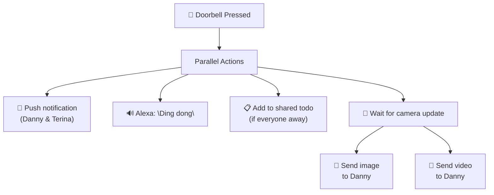

# Front Garden

[<- Back to Rooms README](../README.md) · [Packages README](../../README.md) · [Main README](../../../README.md)

# Front Garden Package Documentation

This package manages front garden automation including doorbell handling, vehicle detection, lock box monitoring, and outdoor lighting control.

---

## Table of Contents

- [Overview](#overview)
- [Architecture](#architecture)
- [Automations](#automations)
  - [Doorbell](#doorbell)
  - [Camera Monitoring](#camera-monitoring)
  - [Vehicle Detection](#vehicle-detection)
  - [Lock Box](#lock-box)
  - [Outdoor Lighting](#outdoor-lighting)
- [Entity Reference](#entity-reference)
- [Cross-References](#cross-references)

---

## Overview

The front garden package handles:
- **Doorbell events** with notification delivery and camera capture
- **Vehicle detection** on the driveway
- **Lock box monitoring** for security
- **Electricity meter access** monitoring
- **Outdoor lighting** control based on ambient light

---

## Architecture

### File Structure

```
packages/rooms/
├── front_garden.yaml     # Main package (7 automations)
└── README.md              # This documentation
```

### Key Components

| Component | Purpose |
|-----------|---------|
| `event.front_door_ding` | Doorbell ring event |
| `camera.front_door` | Front door camera |
| `binary_sensor.driveway_vehicle_detected` | Vehicle detection sensor |
| `binary_sensor.outdoor_lock_box_contact` | Lock box state |
| `binary_sensor.electricity_meter_door_contact` | Meter cabinet door |
| `sensor.front_garden_motion_illuminance` | Outdoor light level |
| `sensor.season` | Current season state |

---

## Automations

### Doorbell

#### Front Garden: Doorbell Pressed
**ID:** `1694521590171`

Handles doorbell press with multi-channel notifications and camera capture.



**Triggers:**
- `event.front_door_ding` state changes

**Actions (parallel):**
1. Send direct notification to Danny and Terina
2. Alexa announcement "Ding dong" (no quiet hour suppression)
3. Set `input_boolean.wait_for_doorbell_camera_update` to on
4. Add to shared notifications todo if no one home
5. Delayed: wait for camera update, then send image and video to Danny

---

#### Front Garden: Doorbell Camera Updated
**ID:** `1621070004545`

Captures and downloads doorbell video when camera becomes available.

**Triggers:**
- Camera front_door changes to any state (recovers from unavailable)

**Conditions:**
- Video ID has changed from last stored

**Actions:**
- Download the video clip
- Store video file for notification use

---

### Vehicle Detection

#### Front Garden: Vehicle Detected On Driveway
**ID:** `1720276673719`

Logs when a vehicle is detected on the driveway.

**Triggers:**
- `binary_sensor.driveway_vehicle_detected` changes from `off` to `on`

---

### Lock Box

#### Front Garden: Lock Box State Changed
**ID:** `1714914120928`

Monitors the outdoor lock box state changes.

**Triggers:**
- `binary_sensor.outdoor_lock_box_contact` changes

---

#### Front Garden: Lockbox Sensor Disconnected
**ID:** `1718364408150`

Alerts when lock box sensor becomes unavailable.

**Triggers:**
- Lock box contact changes to `unavailable`

**Actions:**
- Log debug message

---

### Outdoor Lighting

#### Front Garden: Below Direct Sun Light
**ID:** `1660894232444`

Controls outdoor lights based on ambient light and season.

**Triggers:**
- Front garden illuminance drops below `input_number.close_blinds_brightness_threshold`

**Conditions:**
- Season is 'summer'

**Logic:** When ambient light drops during summer, outdoor lights can be activated based on other conditions (see YAML for specific light control actions).

---

### Electricity Meter

#### Front Garden: Electricity Meter Door Opened
**ID:** `1761115884229`

Monitors access to the electricity meter cabinet.

**Triggers:**
- `binary_sensor.electricity_meter_door_contact` changes to `on`

---

## Entity Reference

### Events

| Entity | Purpose |
|--------|---------|
| `event.front_door_ding` | Doorbell ring event |

### Binary Sensors

| Entity | Purpose |
|--------|---------|
| `binary_sensor.driveway_vehicle_detected` | Vehicle on driveway |
| `binary_sensor.outdoor_lock_box_contact` | Lock box state |
| `binary_sensor.electricity_meter_door_contact` | Meter cabinet door |

### Cameras

| Entity | Purpose |
|--------|---------|
| `camera.front_door` | Front door camera |

### Sensors

| Entity | Purpose |
|--------|---------|
| `sensor.front_garden_motion_illuminance` | Outdoor light level |
| `sensor.season` | Current season |

### People

| Entity | Purpose |
|--------|---------|
| `person.danny` | Notification recipient |
| `person.terina` | Notification recipient |

---

## Cross-References

| Document | Purpose |
|----------|---------|
| [Living Room README](../living_room/README.md) | Shares outdoor brightness sensor for blind control |
| [Office README](../office/README.md) | Shares outdoor brightness sensor |
| [Alarm README](../../integrations/alarm.yaml) | Front door lock integration |

---

*Last updated: 2026-04-26*